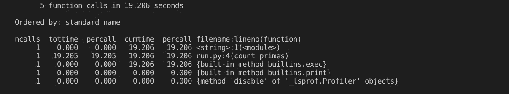
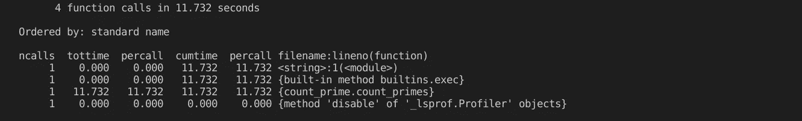
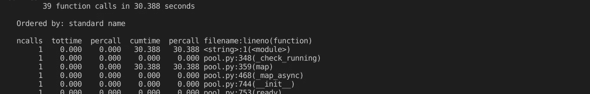
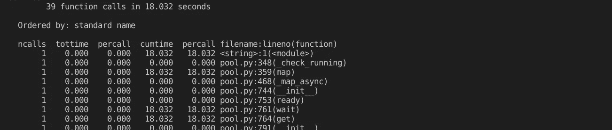

# 挑战 cy thon——高性能计算的 Python 模块。

> 原文：<https://towardsdatascience.com/challenging-cython-the-python-module-for-high-performance-computing-2e0f874311c0?source=collection_archive---------11----------------------->

## 现代的替代方案看起来很有希望，Python 可以以闪电般的速度运行。


来自 [Pexels](https://www.pexels.com/photo/strong-sportsmen-ready-for-running-on-stadium-3764011/?utm_content=attributionCopyText&utm_medium=referral&utm_source=pexels) 的 Andrea Piacquadio 的照片

在[最近的一篇文章](/how-to-speed-up-python-data-pipelines-up-to-91x-80d7accfe7ec)中，我们讨论了如何运行 Python，比通常速度快 91 倍。在这篇文章中，我的目的是讨论上一篇文章中没有回答的问题。

> 与 Python 的传统性能修复技术——cy thon 相比，所提供的解决方案性能如何？

虽然 Python 是一种很棒的编程语言，但是它的性能是它的主要缺点。这种语法简单的优雅语言并不是为更快的计算而设计的。

多年来，Cython 一直在通过将 Python 代码转换为编译后的 C 程序来弥合这一差距。一系列科学计算包依靠 Cython 来加速计算。

让我们将它的性能与它的现代替代品进行比较。

我们将从使用**普通 Python** 计算质数开始。然后，我们再和它的 **Cython** 版本进行对比。我们将使用 Python 的**多处理**模块重复它们，以找出它的好处。

最后，我们将比较**现代方法**加速 Python 程序的性能。

# Cython。vs Python 进行简单计算。

理解 Cython 优势的最直接方式是在基本计算中使用它。在这里，我们使用我在之前的基准测试中使用的相同的方法——计算一个数以下的质数的数量。

我们使用 cProfile 模块来测量每个计算的性能。cProfile 是众多测量代码运行时间的标准 Python 模块之一。

## 使用 Python 进行计算。

下面的代码将计算 35，000 以下的质数，并打印一份详细的性能报告。

代码片段由[作者](https://thuwarakesh.medium.com/)提供。

运行上面的 Python 代码片段时，输出可能如下所示。根据您的电脑规格，这些数字可能会有所不同。



[作者](https://thuwarakesh.medium.com/)截图。

因为可能有许多因素影响性能，所以明智的做法是多次进行实验，并使用平均值进行比较。在我的个人电脑上执行上述操作的平均时间是 **18.721 秒**。

## 使用 Cython 进行计算。

使用 Cython 不同于使用 Python。首先，我们需要将 Python 脚本转换成 c。

1.  如果尚未安装 Cython，请安装它。

```
pip3 install --upgrade cython
```

2.用以下内容创建一个文件`count_prime.pyx` 。和以前一样。

代码片段由[作者](https://thuwarakesh.medium.com/)提供。

3.在同一个目录下创建另一个文件`setup.py`，内容如下。它会把你的代码编译成 C 程序。

代码片段由[作者](https://thuwarakesh.medium.com/)提供。

4.现在，在终端窗口中运行下面的命令将创建我们的质数计数器函数的 C 版本。

```
python setup.py build_ext --inplace
```

5.另外，重命名(或移动)pyx 文件，否则可能会导致导入冲突。

```
mv count_prime.pyx count_prime_dep.pyx
```

6.最后，将函数导入到我们的主应用程序中，并像调用任何其他 python 函数一样运行它。

代码片段由[作者](https://thuwarakesh.medium.com/)提供。

运行这个程序的平均时间是 11.210 秒。这是我做的十个试验中的一个的样本报告。



[作者](https://thuwarakesh.medium.com/)截图。

从 18 秒减少到 11 秒是一个显著的进步。Cython 按照预期完成了工作。让我们重复多重处理场景的步骤。

# Cython。多处理 vs Python。

Python 中的多处理模块是启动许多子流程的一种极好的方式。每个进程将运行您的代码的一个实例。如果处理器有空闲内核，它们也可以并行运行。

## Python 多重处理。

下面的代码将在多个进程中计算 20K、25K、30K、35K 和 40K 以下的质数(如果可能的话，并行计算。)

代码片段由[作者](https://thuwarakesh.medium.com/)提供。

运行上述代码的平均时间为 29.7 秒。输出可能如下所示。



[作者](https://thuwarakesh.medium.com/)截图。

## Cython 多重处理。

下面的代码将对我们之前编译的 C 版本重复同样的过程。

代码片段由[作者](https://thuwarakesh.medium.com/)提供。

这一过程的平均时间约为 18 秒，输出可能如下所示。



[作者](https://thuwarakesh.medium.com/)截图。

事实再次证明，Cython 在显著加快 python 处理时间方面是有效的。它将运行整个循环所需的时间减少了 37.9%。

# 使用 Tuplex 的高性能计算。

我们已经看到使用 Cython 取得了惊人的成功。在简单的质数计数和多重处理应用中，它大大减少了执行时间。

这能更快吗？我们在上一篇文章中讨论的 Tuplex 库比 Cython 版本的性能更好吗？

如果你在 Tuplex 上寻找一个详细的帖子，这里有一个。

[](/how-to-speed-up-python-data-pipelines-up-to-91x-80d7accfe7ec) [## 如何将 Python 数据管道加速到 91X？

### 一个 5 分钟的教程可以为您的大数据项目节省数月时间。

towardsdatascience.com](/how-to-speed-up-python-data-pipelines-up-to-91x-80d7accfe7ec) 

## 单一进程的多路复用器。

Tuplex 将 Python 脚本转换成 LLVM bitecodes，并并行运行它们。结果是性能显著提高。这个新的库专注于数据管道，但它的应用不仅限于数据科学。

下面的代码将使用 Tuplex 运行一次计算。因为我们在并行化方法的 list 参数中只传递一个数字，所以 Tuplex 将在单线程中运行它。

由[作者](https://thuwarakesh.medium.com/)编写的代码片段。

tuplex 方法的平均结果为 9 秒。请注意，我们没有考虑 Tuplex 设置上下文所需的时间。


[作者](https://thuwarakesh.medium.com/)截图。

与 Cython 的 11 秒相比，这令人印象深刻。根据计算机的架构，结果也可能有所不同。但这个数字足够体面，足以表明 Cython 有一个值得尊敬的对手。

## 并行计算中的多路复用器。

最后一个比较还没有完成，这可能是 Tuplex 的核心目的——并行化。让我们用 Tuplex 计算同样的多重处理练习。调整 Tuplex 单进程示例的最后一行就可以达到这个目的。它应该是这样的。

代码片段由[作者](https://thuwarakesh.medium.com/)提供。

并行运行 Tuplex 代码的结果是惊人的平均 10 秒。完成同样的任务，Cython 用了 18 秒，plain Python 用了 29 秒。


[作者](https://thuwarakesh.medium.com/)截图。

# 结论

Cython 一直是 Python 程序员可用的主要(也是唯一的)性能补丁。图书馆经常做得很好；因此，许多其他科学计算软件包在内部使用 Cython。

然而，一个相对较新的图书馆 Tuplex 表现良好。在本文中，我们做了一个素数计数实验来比较 Tuplex 和 Cython 版本。执行时间似乎也大大减少了。

但是结果可能会因您的硬件、操作系统和系统状态而异。此外，由于 Tuplex 还不能用于生产，所以必须小心使用。另一方面，Cython 是稳定的，许多生产中的应用程序已经在使用它。

这种比较的全部意义不在于得出一个比另一个更好的结论。图普莱克斯要走到这一步还有很长的路要走。然而，如果 Cython 不适合你的项目，它不是一个死胡同。不再是了。

> 感谢阅读，朋友！看来你和我有许多共同的兴趣。我很乐意通过 LinkedIn、T2、Twitter 和 Medium 与你联系。

还不是中等会员？请使用此链接 [**成为**](https://thuwarakesh.medium.com/membership) 会员。你可以享受成千上万的有见地的文章，并支持我，因为我赚了一点佣金介绍你。