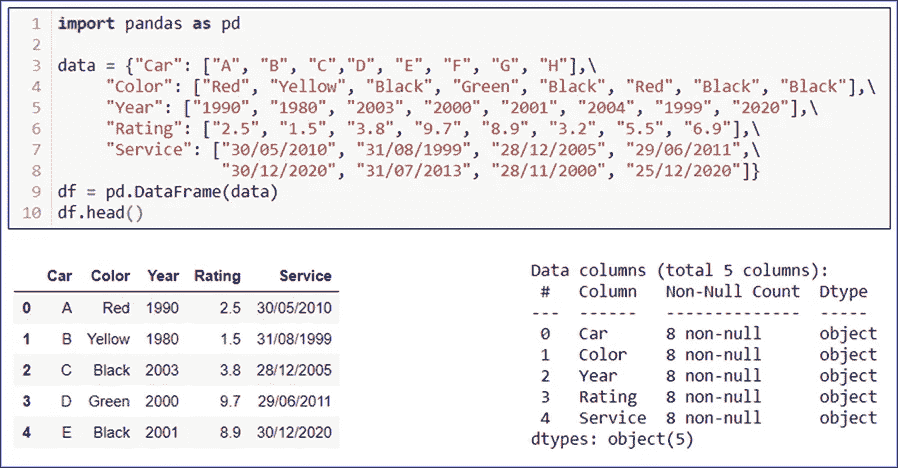
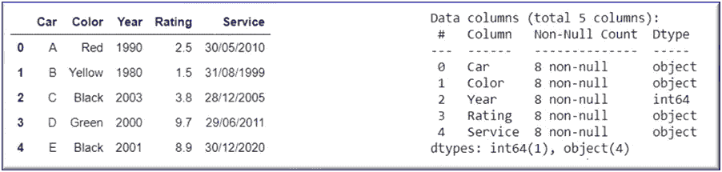
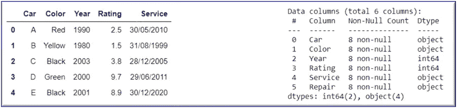
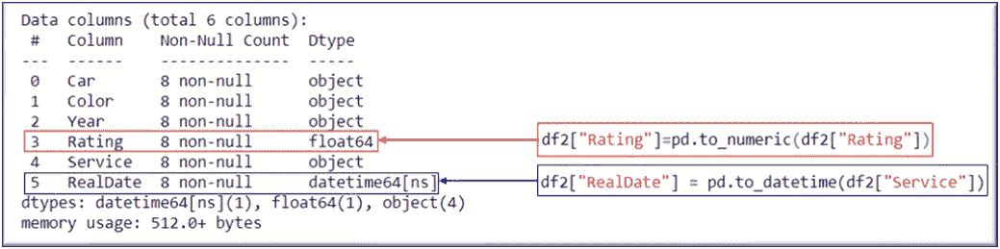
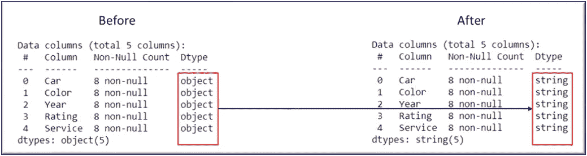

# 在 Pandas 中更改列数据类型

> 原文：<https://towardsdatascience.com/change-column-data-type-in-pandas-954d7acdef1d?source=collection_archive---------11----------------------->

## 使用 PYTHON 进行动手数据分析

## 举例说明-。astype()，。convert_dtypes()和. to_numeric()


克里斯·劳顿在 [Unsplash](https://unsplash.com?utm_source=medium&utm_medium=referral) 上的照片

处理数据很少是直截了当的。大多数情况下，需要对导入的数据集执行各种转换，以便于分析。

在我的所有项目中，pandas 从来没有为导入的数据集的所有列检测到正确的数据类型。但同时，Pandas 提供了一系列方法来轻松转换列数据类型。

在这里，您将获得在 Pandas 中改变一个或多个列的数据类型的所有方法，当然还有它们之间的比较。

在整个阅读过程中，资源用📚，快捷方式用⚡️表示， ***外卖*** 用表示📌。不要忘记查看一个有趣的💡在这篇文章的结尾。

您可以快速跟随本 [***笔记本***](https://github.com/17rsuraj/data-curious/blob/master/TowardsDataScience/ChangeColDataType_tds.ipynb) 📌。

为了让您更容易理解，让我们创建一个简单的数据框架。



熊猫数据框|作者图片

使用这个例子，将更容易理解——如何在 Pandas 中更改列的数据类型。

# 熊猫。DataFrame.astype()

此方法用于将特定的数据类型分配给 DataFrame 列。
让我们将`**int64**`指定为列`Year`的数据类型。使用命令`**.head()**`和`**.info()**`，可以快速查看生成的数据帧。

```
df1 = df.copy()
df1["Year"] = df1["Year"].astype("int64")
df1.head()
df1.info()
```



按作者更改单列|图像的数据类型

类似地，可以将该列更改为 Python 中任何可用的数据类型。但是，如果数据类型不适合该列的值，默认情况下该方法会抛出一个`**ValueError**`。

> 憎恨价值观错误？？？

熊猫有解决办法。此方法中的第二个可选参数μ. e .`**errors**`让您可以自由处理错误。此选项默认为 raise，这意味着引发错误并且不返回任何输出。简单地说，将`**‘ignore’**` 赋给这个参数，忽略错误并返回原始值。

```
df1["Car"] = df1["Car"].astype("int64", errors='ignore')
```

❓ *想一次改变所有列的数据类型* ❓

⚡️只是将列名和数据类型对的字典传递给这个方法，问题就解决了。

```
df1 = df1.astype({"Year": "complex", "Rating": "float64",\
                  "Car": 'int32'}, errors='ignore')
```

更简单的是，通过在`**astype()**`中直接传递数据类型，为所有列分配一个数据类型，就像下面的例子。

```
df1 = df1.astype("int64", errors='ignore')
df1.head()
df1.info()
```



一次更改所有列的数据类型|按作者排序的图像

如上图所示，`Year`和`Rating`列的`**Dtype**`被修改为`**int64**`，而其他非数字列的原始数据类型被返回而不抛出错误。

📚 [***熊猫。data frame . as type***](https://pandas.pydata.org/pandas-docs/stable/reference/api/pandas.DataFrame.astype.html)***()***

# pandas.to_DataType()

好吧好吧，没有这样的方法叫做 pandas.to_DataType()，但是，如果把 DataType 这个词换成想要的数据类型，就可以得到下面 2 个方法。

## pandas.to_numeric()

此方法用于将列的数据类型转换为数值类型。因此，根据列中的值，`**float64**`或`**int64**`将作为列的新数据类型返回。

```
df2 = df.copy()
df2["Rating"]=pd.to_numeric(df2["Rating"])
df2.info()
```

## pandas.to_datetime()

在这里，列被转换为 DateTime 数据类型。该方法接受 10 个可选参数来帮助您决定如何解析日期。

```
df2 = df.copy()
df2["RealDate"] = pd.to_datetime(df2["Service"])
df2.info()
```



pandas.to_numeric()和 pandas.to_datetime() |作者图片

❓ *需要一次改变多列的数据类型* ❓

⚡ ️Use 的方法`**.apply()**`

```
df2[["Rating", "Year"]] = df2[["Rating",\
                               "Year"]].apply(pd.to_numeric)
```

类似于`**pandas.DataFrame.astype()**`，方法`**pandas.to_numeric()**`也给你处理错误的灵活性。

📚[***pandas . to _ numeric()***](https://pandas.pydata.org/pandas-docs/stable/reference/api/pandas.to_numeric.html)
📚[***pandas . to _ datetime()***](https://pandas.pydata.org/pandas-docs/stable/reference/api/pandas.to_datetime.html)

# 熊猫。DataFrame.convert_dtypes()

该方法将自动检测最适合给定列的数据类型。默认情况下，`**Dtypes**`为`**object**`的所有列都将被转换为字符串。

```
df3 = df.copy()
dfn = df3.convert_dtypes()
dfn.info()
```



熊猫。DataFrame.convert_dtypes() |作者图片

根据我的观察，这种方法对数据类型转换的控制很差

📚 [***熊猫。data frame . convert _ dtypes()*T22**](https://pandas.pydata.org/docs/reference/api/pandas.DataFrame.convert_dtypes.html)

*总结一下，*

在这篇快速阅读中，我演示了如何快速更改单个或多个列的数据类型。我经常使用`**pandas.DataFrame.astype()**` 方法，因为它对不同的数据类型提供了更好的控制，并且具有最少的可选参数。当然，基于分析需求，可以使用不同的方法，比如将数据类型转换为`**datetime64(ns)**`方法`**pandas.to_datetime()**`要简单得多。

# 如何看完所有的中篇文章？

今天就成为媒体会员&获得⚡ ***无限制*** ⚡访问所有媒体故事的权利。

> [*在这里报名*](https://medium.com/@17.rsuraj/membership) *和* [*加入我的电子邮件订阅*](https://medium.com/subscribe/@17.rsuraj)

当你在这里注册并选择成为付费媒介会员，我会从你的会员费中获得一部分作为奖励。

# 💡项目创意！！

从一个新的 [***数据集***](https://data.world/) 开始，通过实践 [***数据争论***](/data-wrangling-raw-to-clean-transformation-b30a27bf4b3b) 技术来评估和清理它，并将其存储在 SQL [***数据库***](https://medium.com/analytics-vidhya/sql-database-with-python-5dda6c9a0c8d) 中，以最终在[***Power BI***](/visualize-sqlite-data-with-power-bi-734856383643)中可视化它，这可能是一个好主意。

此外，这个项目想法可以用其中给出的资源来实现。正如我常说的，我乐于接受建设性的反馈和通过 LinkedIn 分享知识。

## 感谢您的阅读和宝贵时间！