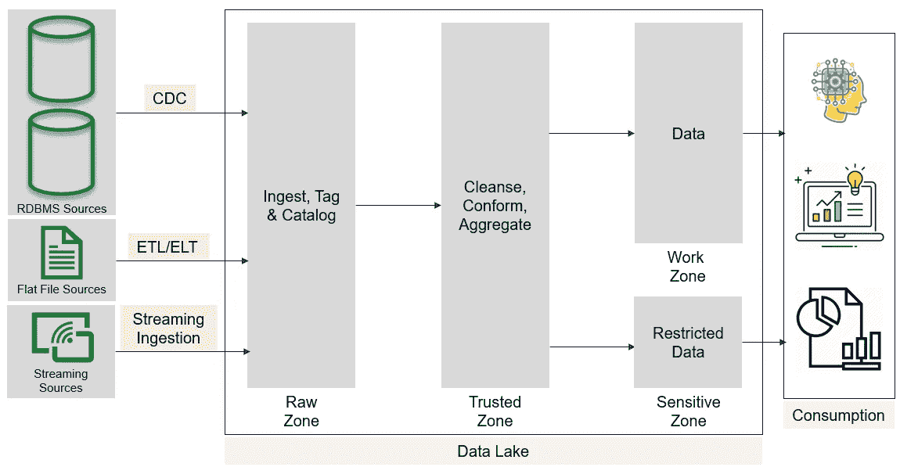
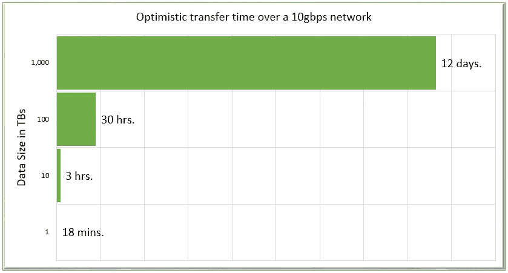
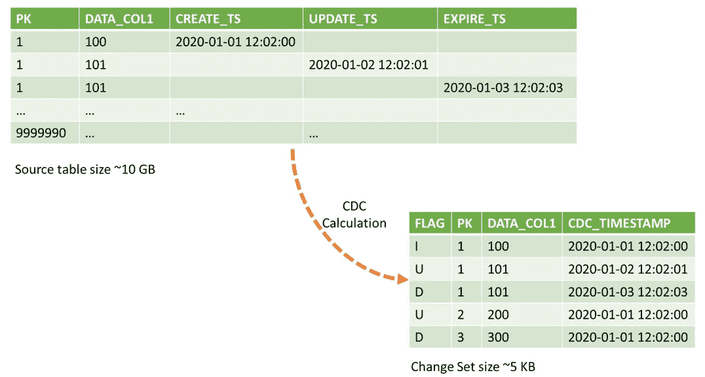
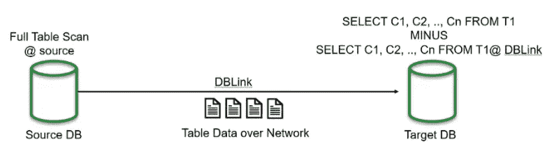
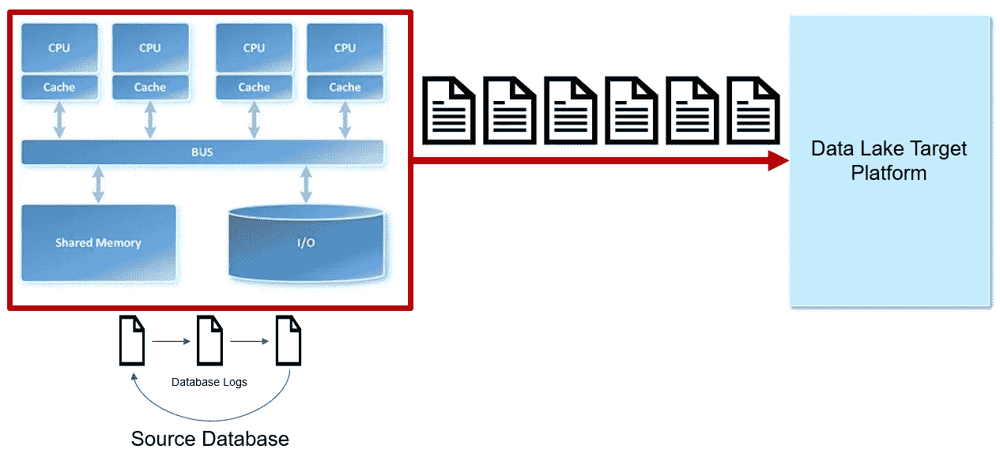
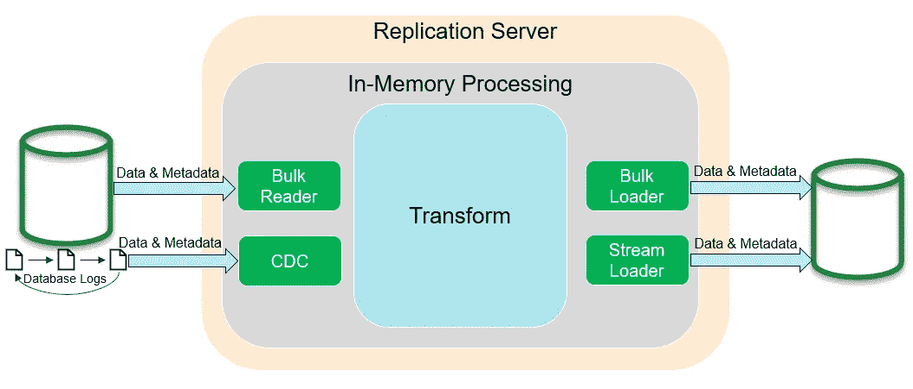
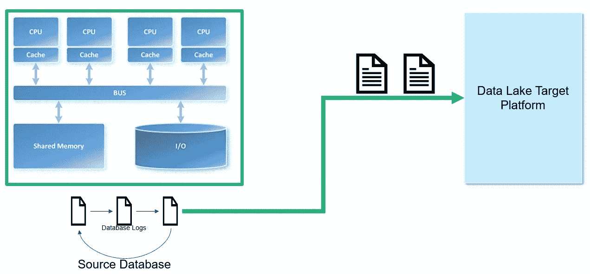

# 用于数据湖数据接收的变更数据捕获(CDC)

> 原文：<https://towardsdatascience.com/change-data-capture-cdc-for-data-ingestion-ca81ff5934d2?source=collection_archive---------8----------------------->

## [意见](https://towardsdatascience.com/tagged/opinion)

随着数据量持续爆炸式增长，业务用户越来越要求持续访问洞察，实时提取所有底层数据不再可行。相反，必须部署解决方案来识别和复制更改日志，以支持接近实时的分析应用程序。

适当的数据接收策略对于任何数据湖的成功都至关重要。这篇博文将提出一个案例，像 [Oracle Golden Gate](https://www.oracle.com/middleware/technologies/goldengate.html) 、 [Qlik Replicate](https://www.qlik.com/us/products/qlik-replicate) 和 [HVR](https://www.hvr-software.com/) 这样的变更数据捕获(CDC)工具最适合从频繁刷新的 RDBMS 数据源中提取数据。

图 1:数据湖的典型数据接收情况。作者图片

# 大量的数据传输时间限制了数据湖的采用

网络上的大量数据传输时间是限制数据湖采用的一个关键因素。如今，在典型的大型企业中，许多事务性数据源继续驻留在内部数据中心。同时，大多数分析平台已经迁移到云，以利用效用计算能力和云提供商的按需规模。对于大多数大型企业来说，连接到云提供商的冗余、专用 10 Gbps 网络链路非常常见，每月花费数万美元。虽然听起来不错，但在处理超过几 TB 的大型数据集时，10 Gbps 连接有很大的局限性。

图 2:大型数据集传输时间。图片由作者使用谷歌数据(参考下文)

上图描述的数据传输时间是乐观的估计。网络延迟、拥塞、跳数和服务器响应时间等其他因素可能会使真实世界的数据传输速度降低许多数量级。底线是满负荷复制对于大型数据集是不实际的。

# 自主开发的变更数据捕获(CDC)解决方案的局限性

许多数据工程团队开发自主开发的 CDC 解决方案。自主开发的 CDC 解决方案有两种主要模式:

*   ***使用时间戳的 CDC 计算*** *:* 这种模式需要在源表上创建、更新和终止时间戳。任何插入、更新或删除行的进程也必须更新相应的时间戳列。不允许硬删除。一旦满足这些条件，计算变更日志就变得很简单了。然而，实施前面讨论的约束并不是一件小事。因此，实际上来说，典型数据库中很少一部分表具有这些时间戳或遵循这种模式。它还创建了源表和提取、转换&加载(ETL)代码之间的紧密耦合。

图 3:使用时间戳列的 CDC 计算。作者图片

*   ***使用减查询的 CDC 计算*** *:* 这与其说是模式，不如说是反模式。然而，这似乎并没有阻止这种模式在许多生产系统的 CDC 计算中的扩散。在源数据库和目标数据库之间创建一个 DB 链接，并执行一个负 SQL 查询来计算 changelog。这种模式导致大量数据在源数据库和目标数据库之间流动。此外，这种模式只有在源数据库和目标数据库是同一类型的情况下才能工作，例如 Oracle 到 Oracle。

图 4:使用 minis 查询的 CDC 计算。作者图片

上面讨论的两种 CDC 方法都会给源数据库带来很大的负载。此外，减号查询模式也会导致显著的网络负载。

图 5:本土 CDC 计算对网络、CPU 和磁盘的不利影响。作者图片

# CDC 工具如何计算 changelog？

CDC 工具通过为 changelog 计算挖掘数据库日志来最小化网络负载和源数据库。

每个支持事务的数据库在将任何更改(插入、更新和删除)写入数据库之前，都会先将其写入数据库日志。这样做是为了确保交易的完整性，避免意外事件，如电源故障等。，而交易仍在进行中。

数据库日志根据文件大小或时间间隔事件在活动日志(重做日志)和归档日志之间循环。根据目标数据库的数据延迟要求，CDC 工具可以访问源数据库的活动日志或归档日志。

图 6:典型 CDC 工具的基本架构。图片由作者提供，灵感来自 Qlik 博客。(参考下文)

由于 CDC 工具只从源数据库日志中读取数据，因此不会增加源数据库的负载。此外，变更日志通常比源表小很多数量级。这种更改日志在网络上的这种流动不会导致任何网络负载问题。

图 7: CDC 工具最小化源数据库和网络上的负载。作者图片

由于数据库日志只包含关于最近的插入、更新和删除的信息，所以 changelog 计算变得很简单。然而，由于有许多数据库供应商，每个供应商都有自己的(有时是专有的)日志格式，所以这种任务最好留给商业 CDC 工具供应商。

> CDC 工具 ike [Oracle Golden Gate](https://www.oracle.com/middleware/technologies/goldengate.html) 、 [Qlik Replicate](https://www.qlik.com/us/products/qlik-replicate) 和 [HVR](https://www.hvr-software.com/) 允许以网络高效的方式将事务性数据源与分析数据库近乎实时地同步，同时最大限度地减少对源系统的影响，因此最适合从频繁刷新的 RDBMS 数据源获取数据。

# 商业 CDC 工具的其他优势

除了最大限度地减少对源系统和网络的影响，大多数商业 CDC 工具还提供其他优势，如:

*   企业级弹性
*   减少 ETL 计算占用空间
*   简化的 ETL 代码库
*   动态轻量级转换
*   失去源数据库和数据接收代码之间的耦合

# 那么为什么 CDC 工具没有更受欢迎呢？

CDC 工具未被更广泛采用的首要原因是成本。CDC 工具供应商在理解许多数据库的日志格式方面投入了大量资金，这些数据库本身可能会继续发展。这种对持续投资的要求将真正的 CDC 工具前景限制在少数几个关键参与者手中，允许他们为自己的产品收取溢价。

CDC 工具没有被广泛采用的第二个原因是，出于安全原因，源系统 DBA 不愿意向第三方 CDC 工具授予数据库日志级别的访问权限(特权访问)。

以上两种担忧都是有根据的，但是可以通过耐心和努力克服。您需要让 CDC 供应商参与价格谈判，以获得有利的定价条款。如果您还与您的 DBA 进行了详细的讨论，告知他们价值并解决他们的安全问题，那将会很有帮助。

通过实施 CDC 工具将数据吸收到数据湖中，可以释放出巨大的企业价值。我会鼓励你踏上那段旅程。CDC 工具是最好的解决方案之一，可以帮助管理爆炸式增长的数据量和业务用户对接近实时访问洞察的需求，至少在 RDBMS 源频繁刷新数据的情况下是如此。

*图片鸣谢:图 2:* [*谷歌*](https://cloud.google.com/transfer-appliance/docs/2.2/overview) *，图 6:* [*Qlik 博客*](https://www.qlik.com/blog/the-architectural-principles-of-attunity-replicate-support-for-full-load-and-cdc-replication)

*免责声明:这是个人博文。此处表达的观点仅代表我个人的观点，并不代表我现任或前任雇主的观点。所有内容仅用于教育目的，不保证适用性。*