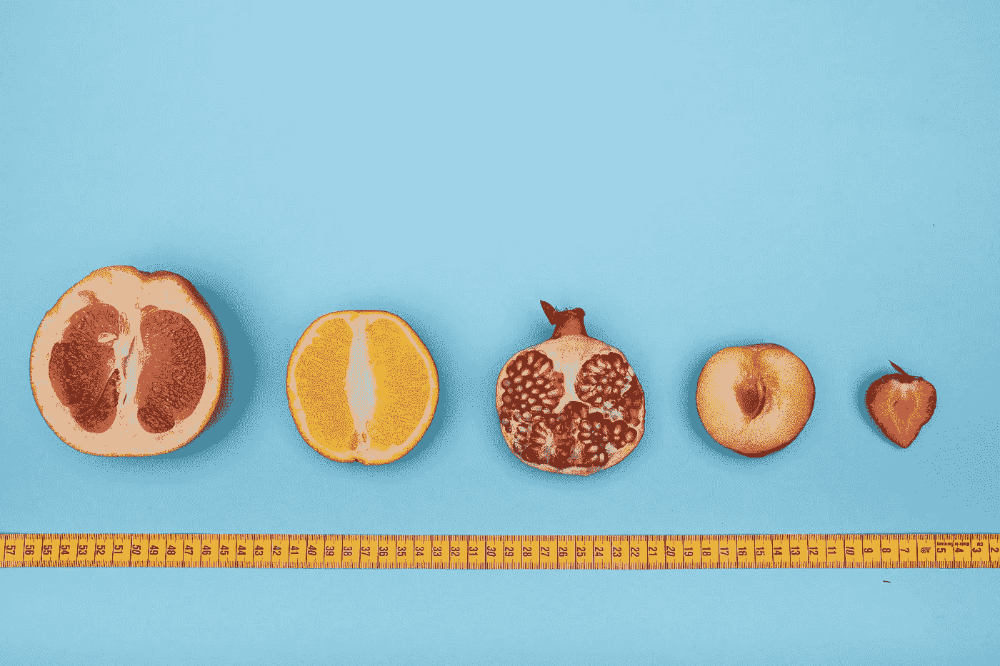
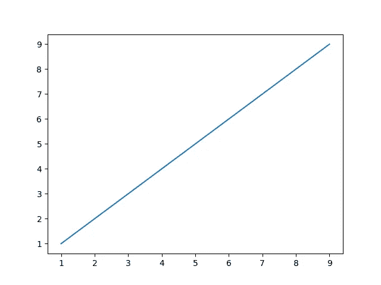
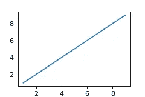

# 如何在 Matplotlib 中改变图形的大小

> 原文：<https://towardsdatascience.com/change-figure-size-matplotlib-11a409f39584?source=collection_archive---------3----------------------->

## 讨论如何在 Python 中调整用 matplotlib 创建的图形的大小



由 [Deon Black](https://unsplash.com/@deonblack?utm_source=unsplash&utm_medium=referral&utm_content=creditCopyText) 在 [Unsplash](https://unsplash.com/s/photos/size?utm_source=unsplash&utm_medium=referral&utm_content=creditCopyText) 上拍照

## 介绍

在可视化数据时，调整通过 Python 中的`matplotlib`生成的图形的大小是一项常见的任务。在今天的简短指南中，我们将讨论几种调整生成图大小的可能方法。

具体来说，我们将讨论如何做到这一点:

*   使用`matplotlib.pyplot.figure()`
*   使用`set_size_inches()`
*   通过修改`rcParams['figure.figsize']`

此外，我们将讨论如何使用现有(默认)大小的因子/比率来调整图形的大小。

首先，让我们使用一些虚拟数据创建一个图表，我们将在本文中使用这些数据来演示几个概念。

```
import matplotlib.pyplot as pltx = y = range(1, 10)plt.plot(x, y)
plt.show()
```

下图是使用默认尺寸生成的，如`rcParams['figure.figsize']`中所定义。



## 使用图形

您的第一个选择是调用`[matplotlib.pyplot.figure](https://matplotlib.org/stable/api/_as_gen/matplotlib.pyplot.figure.html)`，它用于创建一个新图形或激活一个现有图形。该方法接受一个名为`figsize`的参数，用于指定图形的宽度和高度(以英寸为单位)。此外，您甚至可以指定`dpi`，它对应于以每英寸点数为单位的图形分辨率。

```
import matplotlib.pyplot as plt
**from matplotlib.pyplot import figure****figure(figsize=(3, 2), dpi=80)**x = y = range(1, 10)plt.plot(x, y)
plt.show()
```



## 使用`set_size_inches`

第二个选项是`[matplotlib.figure.set_size_inches()](https://matplotlib.org/stable/api/figure_api.html?highlight=figure#matplotlib.figure.Figure.set_size_inches)`，用于设置**图形**的尺寸，单位为英寸。

```
import matplotlib.pyplot as pltx = y = range(1, 10)plt.plot(x, y)
**plt.gcf().set_size_inches(3, 2)** plt.show()
```


## 修改`rcParams`

如果您想在不使用图形环境的情况下修改图形的大小，那么您也可以更新`matplotlib.rcParams`，它是用于处理默认 Matplotlib 值的`[RcParams](https://matplotlib.org/stable/api/matplotlib_configuration_api.html#matplotlib.RcParams)`的一个实例。

```
import matplotlib.pyplot as plt**plt.rcParams['figure.figsize'] = (3, 2)**x = y = range(1, 10)plt.plot(x, y)
plt.show()
```


请注意，上述内容将对生成的每个图形产生影响，除非您为特定图形指定不同的大小。如果出于任何原因，您想要恢复该参数的默认值，您可以简单地使用如下所示的`rcParamsDefault`

```
plt.rcParams['figure.figsize']=plt.rcParamsDefault['figure.figsize']
```

## 使用系数调整图形大小

现在，如果您希望使用与另一个图形相关的硬编码因子或比率来调整图形的大小，那么您可以使用以下命令:

```
figure_size = plt.gcf().**get_size_inches**()
factor = 0.8plt.gcf().**set_size_inches**(factor * figure_size)
```

## 最后的想法

在今天的简短指南中，我们讨论了如何调整使用`matplotlib`库生成的图形的大小。我们探讨了一些可能的选项，但您应该确保使用符合您需求的选项(例如，取决于您是想要指定所有图形和绘图的大小，还是仅指定一个特定的)。

[**成为会员**](https://gmyrianthous.medium.com/membership) **阅读介质上的每一个故事。你的会员费直接支持我和你看的其他作家。**

**你可能也会喜欢**

[](/how-to-upload-your-python-package-to-pypi-de1b363a1b3) [## 如何将 Python 包上传到 PyPI

towardsdatascience.com](/how-to-upload-your-python-package-to-pypi-de1b363a1b3) [](/what-are-named-tuples-in-python-59dc7bd15680) [## Python 中的命名元组是什么

### Python 中一个被忽略的扩展数据类型

towardsdatascience.com](/what-are-named-tuples-in-python-59dc7bd15680) [](/easter-eggs-in-python-f32b284ef0c5) [## 蟒蛇皮复活节彩蛋

### 探索八个用 Python 包装的复活节彩蛋

towardsdatascience.com](/easter-eggs-in-python-f32b284ef0c5)