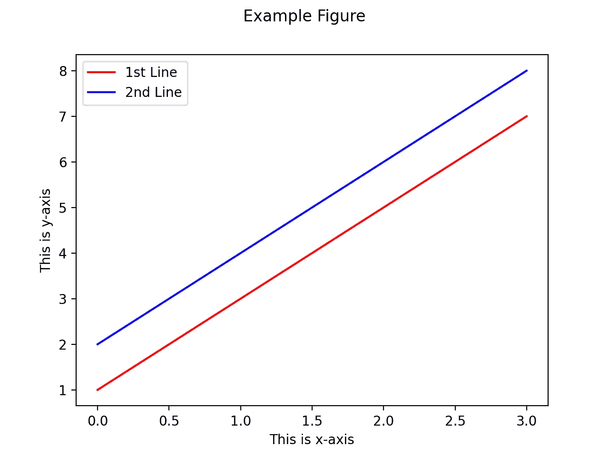
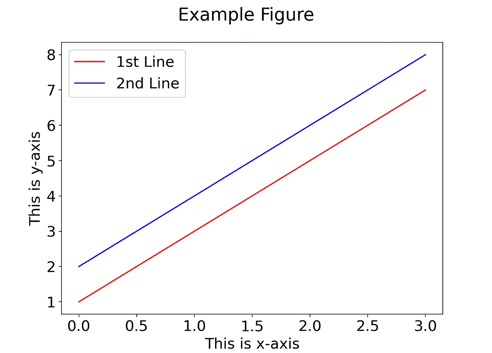

# 如何更改 Matplotlib 图中的字体大小

> 原文：<https://towardsdatascience.com/change-font-size-matplolib-480630e300b4?source=collection_archive---------7----------------------->

## 数据可视化

## 了解如何在 matplotlib 图形标题、轴标签和图例中更改字体大小


照片由[马库斯·斯皮斯克](https://unsplash.com/@markusspiske?utm_source=unsplash&utm_medium=referral&utm_content=creditCopyText)在 [Unsplash](https://unsplash.com/s/photos/size?utm_source=unsplash&utm_medium=referral&utm_content=creditCopyText) 拍摄

## 介绍

通常，你可能需要调整用`matplotlib`创建的图形的默认字体大小，以确保所有的元素都被恰当地可视化并易于阅读。在今天的简短指南中，我们将讨论如何更改使用`matplotlib`库生成的图中的字体大小。具体来说，我们将探索如何

*   全局更改字体大小(这意味着它将适用于所有生成的图)
*   更改单个组件的尺寸，如**轴、图形标题、刻度标签**等。
*   以及如何改变已经生成的特定绘图的字体大小

首先，让我们使用一些虚拟数据创建一个示例图，我们将在本文中使用它作为参考，以演示一些概念。

```
import matplotlib.pyplot as pltplt.plot([1, 3, 5, 7], color='red', label='1st Line')
plt.plot([2, 4, 6, 8], color='blue', label='2nd Line')plt.suptitle('Example Figure')
plt.xlabel('This is x-axis')
plt.ylabel('This is y-axis')plt.legend()
plt.show()
```

输出图如下所示:



这是我们的示例图—来源:[作者](https://medium.com/@gmyrianthous)

## 更改所有图和组件的字体大小

如果您想改变所有创建的图形的字体大小以及每个单独图形中显示的所有组件，包括标题、图例、轴标签等，那么您需要更新`[rcParams](https://matplotlib.org/stable/api/matplotlib_configuration_api.html#matplotlib.RcParams)`中的相应参数，它是一个包含许多可定制属性的字典。

```
import matplotlib.pyplot as plt# Option 1
**plt.rcParams['font.size'] = 18**# Option 2
**plt.rcParams.update({'font.size': 18})**
```

更新`font.size`参数后的输出图如下所示:



来源:[作者](https://medium.com/@gmyrianthous)

如前所述，**这将产生全局影响**，并且会影响图中所示的几乎所有组件，在大多数情况下，这可能不是您真正想要的。

## 更改单个组件的字体大小

有时候，你可能希望一些组件的字体大小不同于其他组件。例如，您可能需要不同地调整图形标题和图例的字体大小。在这种情况下，您必须通过修改相应的参数来指定每个组件的字体大小，如下所示。

```
import matplotlib.pyplot as plt# Set the default text font size
**plt.rc('font', size=16)**# Set the axes title font size
**plt.rc('axes', titlesize=16)**# Set the axes labels font size
**plt.rc('axes', labelsize=16)**# Set the font size for x tick labels
**plt.rc('xtick', labelsize=16)**# Set the font size for y tick labels
**plt.rc('ytick', labelsize=16)**# Set the legend font size
**plt.rc('legend', fontsize=18)**# Set the font size of the figure title
**plt.rc('figure', titlesize=20)**
```

## 更改特定绘图的字体大小

前面介绍的解决方案将适用于生成的每个图形。如果要调整已创建的单个图的字体大小，则可能需要为每个单独的组件指定字体大小。假设你已经创建了一个支线剧情，那么下面的代码应该可以完成这个任务:

```
import matplotlib.pyplot as pltax1 = plt.subplot(
    111, 
    xlabel='This is x-axis', 
    ylabel='This is y-axis', 
    title='Example subplot'
)**ax1.title.set_fontsize(18)
ax1.xaxis.label.set_fontsize(18)
ax1.yaxis.label.set_fontsize(18)
map(lambda p: p.set_fontsize(18), ax1.get_xticklabels())
map(lambda p: p.set_fontsize(18), ax1.get_yticklabels())**plt.show()
```

## 最后的想法

在今天的简短指南中，我们讨论了几种改变用`matplotlib`库生成的 Python 图中字体大小的方法。我们探讨了如何为创建的每个组件和绘图更改字体大小，以及如何仅为特定图形更改字体大小。

最后，我们还讨论了如何调整特定组件的字体大小。这通常在您希望图形标题和图例具有不同字体大小时很有用。

[**成为会员**](https://gmyrianthous.medium.com/membership) **阅读媒体上的每一个故事。你的会员费直接支持我和你看的其他作家。你也可以在媒体上看到所有的故事。**

<https://gmyrianthous.medium.com/membership>  

**你可能也会喜欢**

</change-figure-size-matplotlib-11a409f39584>  <https://codecrunch.org/what-does-if-name-main-do-e357dd61be1a>  </dynamic-typing-in-python-307f7c22b24e> 