# 改变您在 Power BI 中处理大型数据集的方法

> 原文：<https://towardsdatascience.com/change-your-approach-with-large-datasets-in-power-bi-ca488a5b1066?source=collection_archive---------3----------------------->

## 由于内存的限制，当您试图在 Power BI Desktop 中加载具有数亿行的大型数据集时，您可能会遇到问题。让我们探索数据流来实现这一点。

[布拉德·斯达克](https://unsplash.com/@visualsbybrad?utm_source=medium&utm_medium=referral)在 [Unsplash](https://unsplash.com?utm_source=medium&utm_medium=referral) 上的照片

# 出发点

我的一个客户的表有 1.26 亿行，并且还在增长。
他的问题是如何在只有 8gb RAM 的 Power BI 桌面中加载这些数据。

而且，他对数据源没有控制权。这种缺乏控制的情况意味着他不能创建带有过滤器的数据库视图，以减少 Power BI Desktop 初始加载的数据集。

至少可以说，这个挑战是有问题的。也许你在过去已经经历过这些。

我有了用 Power BI 数据流来解决这个问题的想法。

为此，我使用了放大的 Contoso 数据集:

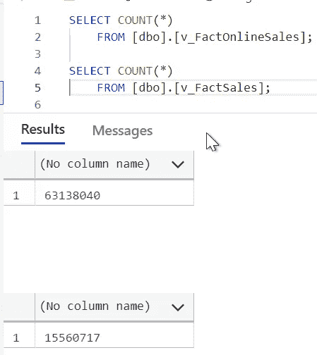

图 1 —原始数据集(图片由作者提供)

首先，我将解释解决方案的外观。

然后，我向您展示设置解决方案的步骤。

# 解决办法

下图显示了该解决方案的体系结构:

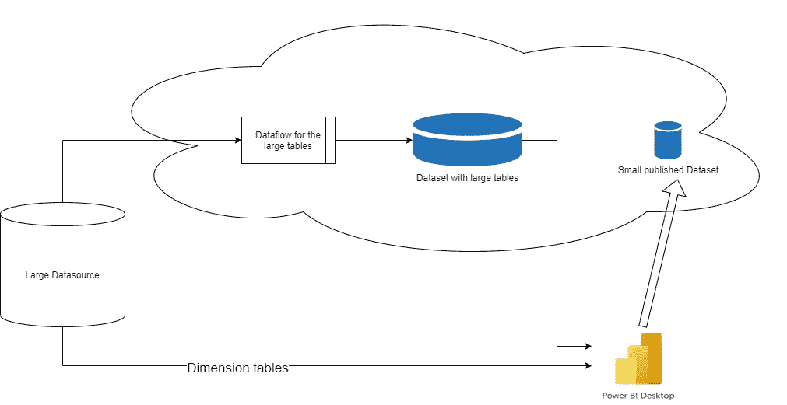

图 2 —解决方案的架构(作者提供的图表)

如您所见，我设置了两个数据加载:

1.  用数据流直接加载 Power BI 服务中的事实表
2.  将所有维度表加载到 Power BI 桌面

这样做的目的是避免 Power BI Desktop 加载数百万行。

我在 Power BI Desktop 中使用了一个预览功能(在撰写本文时预览)，它允许我将 Power BI 数据集的实时连接与来自另一个数据源的其他(导入的)表结合起来。

# 构建解决方案

第一步是分析源数据，并找出如何过滤数据。

目标是将数据量减少到最小，因为我必须将数据加载到 Power BI Desktop 一次。

在我的例子中，我可以简化两个事实表中的数据，以一种简单的方式只加载一年的数据:

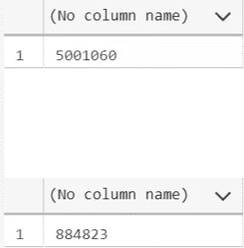

图 3 —每个表格一年数据的行数(图片由作者提供)

接下来，我在 Power BI 服务上创建一个数据流。
在我的例子中，我使用了高级的每用户工作空间，以便能够使用[大型数据集存储格式](https://docs.microsoft.com/en-us/power-bi/admin/service-premium-large-models):

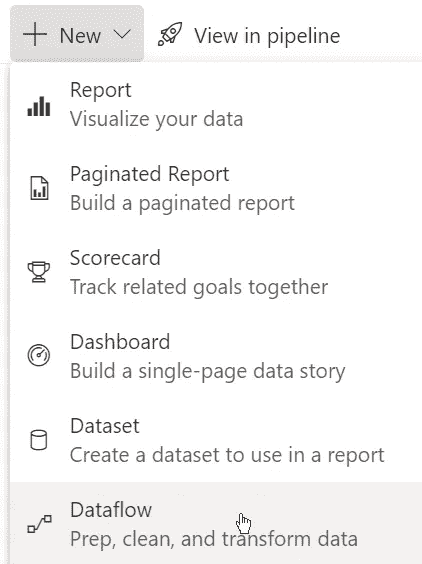

图 4 —在 Power BI 服务中创建一个新的数据流(图片由作者提供)

下一步是为数据流选择操作:

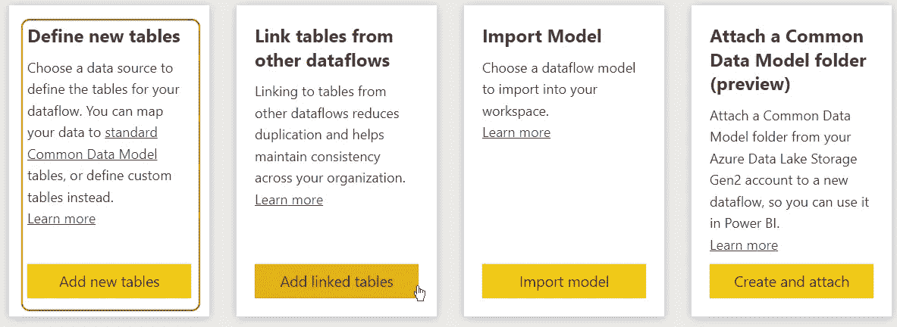

图 5 —为新数据流选择动作(图片由作者提供)

在我的例子中，我想添加新的表。

为了添加新表，我需要配置源服务器和数据库:

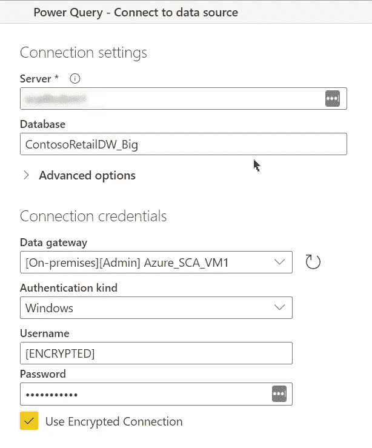

图 6 —新表的数据源(图片由作者提供)

我在我的 Azure 虚拟机上安装了本地数据网关。为了存储我的示例数据库，我在同一个虚拟机上安装了 SQL Server。首先，我必须在网关中配置服务器和数据库。其次，我必须在数据源连接中选择网关。

当您希望使用存储在网关连接中的凭据时，可以保留用户名和密码，也可以为数据源输入其他凭据。

现在，您可以使用一个看起来非常类似于 Power BI 中的 Power Query 编辑器的界面来选择所需的表，并根据需要向数据添加转换:

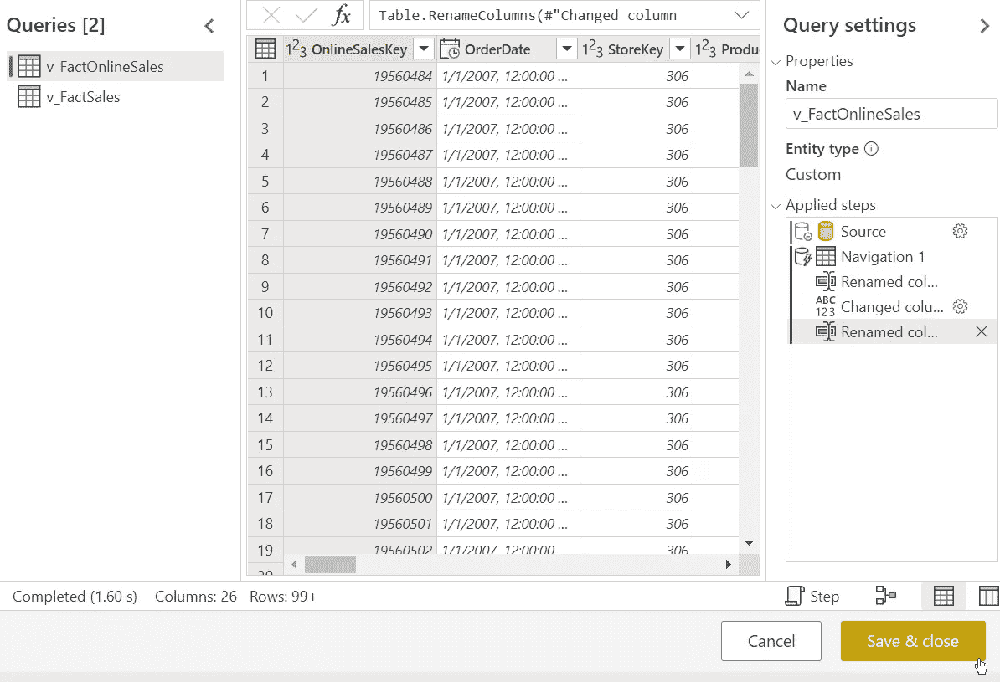

图 7 —数据流中的查询编辑器(图片由作者提供)

我可以添加一个过滤步骤来过滤数据，如上所述:

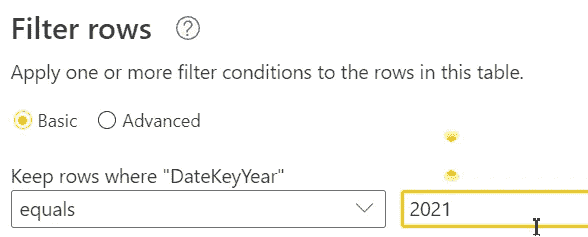

图 8 —在 Power Query 中过滤数据(图片由作者提供)

这种可能性是数据流的美妙之处:我可以像在 Power Query 中一样添加过滤器，而无需将数据下载到 Power BI Desktop。数据留在云中。

只要您按下保存并关闭，您就可以开始数据加载。这个过程花费的时间很少，因为我只加载了一小部分数据。

现在，数据集在我的工作区中可见:

图 9 —我的工作空间中的数据流(图片由作者提供)

前缀 DF_ stand 代表数据流，我需要一个惟一的名称，因为我将创建一个同名的数据集。但是我不能有两个同名的对象。

不幸的是，不可能在线创建数据集。

你可以在 idea.powerbi.com 上找到一个关于这个问题的条目:基于数据流的数据集服务

为此，我必须在 Power BI Desktop 中创建一个数据集。

我可以选择 Power BI 数据流作为源:

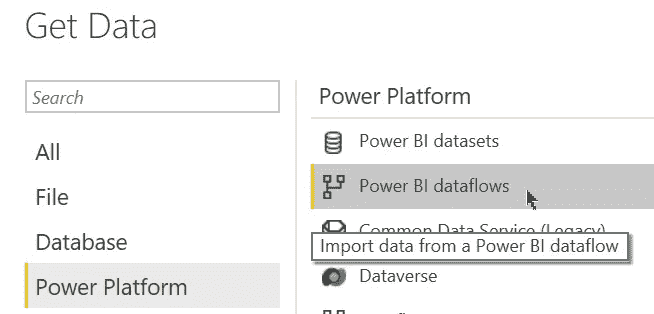

图 10—Power BI 桌面中作为源的数据流(图片由作者提供)

我将两个表都添加到数据集中，并将报表作为 ContosoRetailDW_Big_BigFacts 发布到服务。

但是这种方法有一个缺陷，正如我在构建结束时发现的那样。请读完，因为我留下它是为了说明这种特定方法的一个缺点。

下一步是编辑数据流，删除两个表上的过滤器并刷新数据。我需要刷新数据流和 Power BI 数据集中的数据。这意味着您必须将相同的数据存储两次。

目前，我不知道这个问题的解决方案。

但是您可以配置数据流和数据集的增量刷新，以减少刷新次数:[Power BI 中数据集的增量刷新— Power BI | Microsoft Docs](https://docs.microsoft.com/en-us/power-bi/connect-data/incremental-refresh-overview)

为了创建最终的 Power BI 报告，我必须将带有两个事实表的数据集添加到新的 Power BI 报告中:

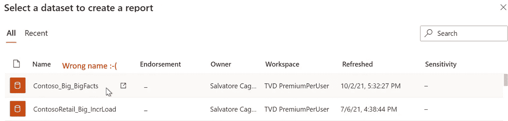

图 11 —从云中获取 Power BI 数据集(图片由作者提供)—名称错误

在右下角的状态栏中，我可以看到我正在使用实时连接:

图 12 —带有实时连接的状态栏(作者提供的图片)

我需要为下一步启用预览功能:

图 13-支持 PBI 数据集的直接查询(图片由作者提供)

单击“了解更多”链接，转到文档页面。在那里你可以找到关于这个特性的有价值的信息。

启用此功能并重启 Power BI Desktop 后，状态栏看起来如上图所示。

我一单击“转换数据”按钮，就会收到一条消息，提示实时连接将被更改为直接查询连接。这一更改允许我向数据模型添加额外的表。

现在，状态栏看起来像这样:

图 14 —直接查询模式下的数据模型(图片由作者提供)

下一步是将所有需要的维度表和表之间的所有关系添加到数据模型中。

当我试图将第二个事实表连接到日期表时，我得到了下面的错误消息:

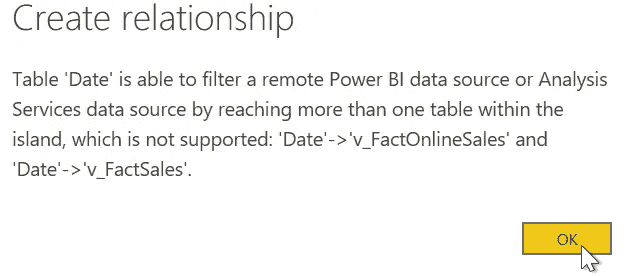

图 15 —多重关系的错误消息(作者提供的图片)

似乎我必须创建两个数据集:每个事实表
一个，然后在直接查询模式下将两个数据集都添加到报告中。无论如何，我仍然能够使用一个数据流来准备我的数据。

这样，我的模型并不完美，但我可以用它作为原型展示给我的客户。

这个问题就是我在将两个事实表加载到一个数据集中时提到的小故障。

# 结论

当您开始比较两个 Power BI 文件时，这种方法最显著的效果是显而易见的。一个包含整个数据集，另一个包含复合模型，如本文所述:

图 16 —完整数据集和复合模型之间的大小比较(图片由作者提供)

复合模型的尺寸略大于原尺寸的 1/1000。

而且打开这个模型只需要几秒钟。维度表的数据刷新也需要很短的时间。

缺点是对数据流和带有事实表的数据集执行完全加载需要一个多小时。

但是在使用复合数据模型时，您需要理解所有可能的含义。

SQLBI 在 YouTube 上发布了一个关于这个主题的视频:

数据流和复合模型的结合为管理大型数据集打开了一个全新的世界。您可以在不同的报告中多次重用数据流或数据集的数据，而无需多次重新加载数据。

由 [S Migaj](https://unsplash.com/@simonmigaj?utm_source=medium&utm_medium=referral) 在 [Unsplash](https://unsplash.com?utm_source=medium&utm_medium=referral) 拍摄的照片

我希望你能从我的方法中得到新的想法。