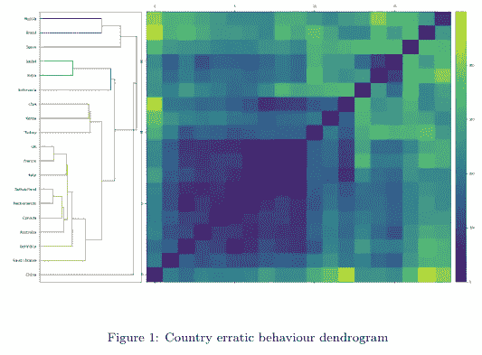
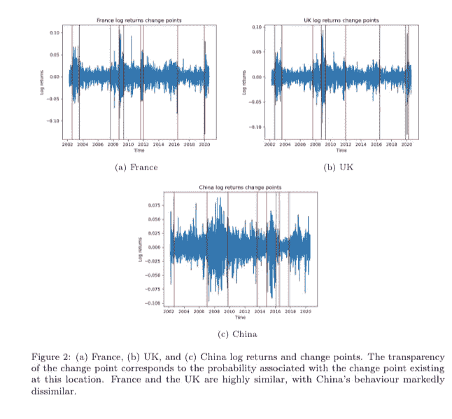
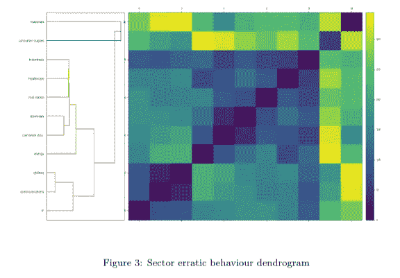
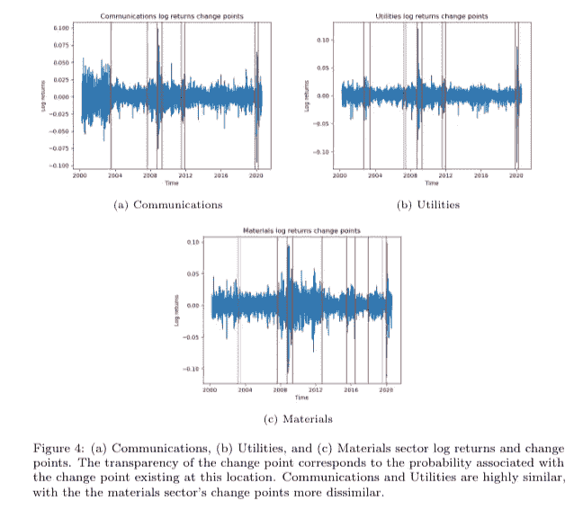
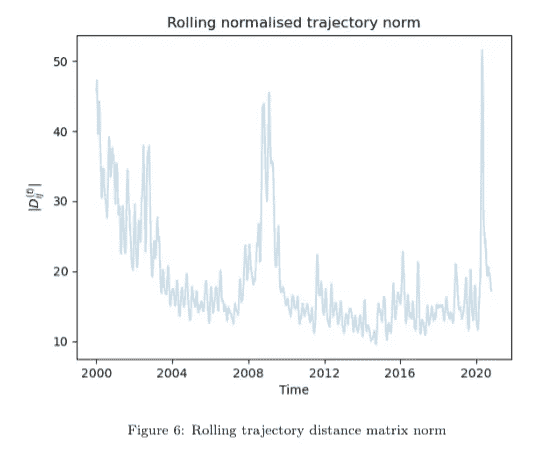
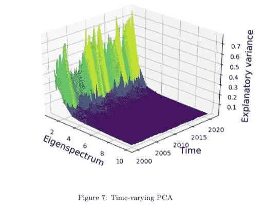

# 市场危机的动态变化:对过去二十年国家、部门和股票行为的回顾

> 原文：<https://towardsdatascience.com/changing-dynamics-of-market-crises-a-review-of-country-sector-and-equity-behaviours-over-the-1933e107fdc6?source=collection_archive---------34----------------------->

## 演化金融市场行为的数学研究

在本文中，我们研究了过去 20 年中国家金融指数、行业金融指数和股票的行为和相似性。首先，我们引入了一种新的方法来确定 20 个国家和 11 个部门在时间序列结构突变方面的相似性。我们引入了一个新的度量，可以量化任何两个候选集之间的距离，其中概率分布决定了各种元素位置周围的不确定性。接下来，我们转向美国股市，在这里我们进行了三个独立的实验。首先，我们分析了股票危机相关性随时间的演变，强调了近年来在市场恐慌时期股票相似性的增加。接下来，我们研究股票轨迹随时间变化的集体相似性，并证明在危机时期轨迹之间的距离更大。最后，我们通过时变主成分分析来探索我们的股票市场集合的动态。我们强调了在表现出同质行为的资产之间分散投资的当前困难领域，并提出了可能改善投资者多样化的方法。

**本次研究的动机:**

2020 年 3 月至 6 月，由于新冠肺炎危机，全球市场表现出极端行为。投资者在资产价格下跌和波动中挣扎，因为许多“传统的”多样化战略似乎并不有效。事实上，资产内部的相关性似乎特别高——即使相对于以前的市场危机。这引发了我们的好奇心，我们认为有必要进行彻底的调查。

尽管金融市场参与者可以获得大量数据，但许多投资者倾向于关注最近的过去。这是明智的。市场动态在不断变化，尽管历史可能会押韵，但它肯定不会重演，2020 年的金融市场行为不太可能与 2000 年的完全相同；因为在过去的二十年里，金融市场的许多方面都发生了巨大的变化。这篇论文是带着不同的目的写的。我们希望研究国家、行业和股票行为在过去 20 年中是如何演变的——尤其是在危机时期。我们引入新的方法来检查异常行为、轨迹和时变动态的变化。

我们将分析分为两部分。首先，我们研究国家和部门之间结构突变的相似性。这种分析对于任何希望根据国家或行业风险分散投资的资产配置者或投资者都是有用的。其次，我们研究标准普尔 500 股票，探索相关性、轨迹和时变动态的演变。这项工作的见解可以被任何对股票在过去 20 年中表现出的动态现象感兴趣的全球股票投资者所利用。

**数据:**

我们的国家和行业数据分别涵盖 2002 年 4 月 1 日至 2020 年 8 月 10 日和 2000 年 4 月 1 日至 2020 年 8 月 10 日，并且每天都进行测量。我们分析的国家包括:澳大利亚、巴西、加拿大、中国、法国、德国、印度、印度尼西亚、意大利、日本、韩国、荷兰、俄罗斯、沙特阿拉伯、西班牙、瑞士、土耳其、英国和美国。我们分析的行业包括:通信、非必需消费品、消费品、能源、金融、医疗保健、工业、信息技术、材料、房地产和公用事业。我们的股票数据涵盖 2000 年 3 月 1 日至 2020 年 8 月 10 日。我们研究了从开始到分析窗口结束的所有标准普尔 500 股票。我们还剩 347 只股票。我们所有的数据都来自彭博。

**古怪行为建模:**

在本节中，我们研究了 20 个国家指数和 11 个金融市场部门的异常行为的相似性。为了确定相似性，我们将变化点检测方法应用于每个时间序列，并生成变化点集。重要的是，我们使用一种基于功率谱变化检测变化点的方法。这缓解了许多变化点检测方法在面对相关数据时所面临的问题。先前的工作已经证明，本文中应用的方法能够恰当地检测分段自回归过程中的变化点，突出了该算法划分相关数据的能力。对于对所应用的方法感兴趣的人，请参见以下论文之一:

[https://www . tandfonline . com/doi/ABS/10.1080/01621459 . 2012 . 716340](https://www.tandfonline.com/doi/abs/10.1080/01621459.2012.716340)

[https://arxiv.org/pdf/2003.02367.pdf](https://arxiv.org/pdf/2003.02367.pdf)

由于相关性在金融时间序列中是常见的，我们使用上述技术。这种方法是在贝叶斯框架中实现的，并捕获候选变更点周围的不确定性。当测量集合之间的距离时，我们调整先前引入的半度量以考虑候选变化点周围的不确定性。

*国家相似度:*

国家金融指数的不规则行为集群结构表明，存在一个主要的国家集群，以及其他几个分散的集群。主要集群包括美国、韩国、土耳其、英国、法国、意大利、瑞士、荷兰、加拿大、澳大利亚、德国和沙特阿拉伯。离群国家包括:俄罗斯、巴西、西班牙和中国。这些集群成员和相关的变化点可能是由于这些国家的地理位置和政治关联非常相似，导致在英国退出欧盟等事件期间出现类似的市场行为。值得注意的是，西班牙决心要明显不如欧洲同行相似。集合中最不正常的国家是中国。这并不奇怪，因为许多与当地股票市场相关的特殊限制可能会提供与其他金融市场不同的动力。

*扇区相似度:*

*扇区异常行为树状图*由两个明显分开的簇组成。除了原材料和主要消费品之外，主要类别包括所有库存。有趣的是，公用事业、通信和 IT 行业在 2012 年至 2019 年期间没有出现结构性断裂。相比之下，在这个时间窗口期间，在材料部门时间序列中检测到几个变化点。在 2012 年至 2019 年期间，在主要集群(金融、非必需消费品等)的行业时间序列中也发现了变化点。).图 4 显示了通信、公用事业和材料行业的日志回报和检测到的变化点。人们可以看到 2012 年至 2019 年期间结构断裂传播的明显差异。

*对比:*

为了比较国家和部门之间的相似程度，我们计算了异常行为矩阵的矩阵规范，并根据矩阵中元素的数量对其进行归一化(因为在我们之前的实验中，国家/部门的数量不同)。国家异常距离矩阵标准高于部门异常距离矩阵标准。部门规范中的较小值表明，部门之间的异常行为比国家之间的异常行为更加相似。这可能表明，就国家而言(相对于部门而言)，多样化对投资者的好处更大。

**权益分析:**

在本节中，我们研究了 347 只美国股票，时间跨度约为 20 年。我们将分析分为三个独立的部分。首先，我们检查在不同的离散(和不同的)时间周期内相关系数的行为。接下来，我们研究滚动股票轨迹的集体相似性。最后，我们探讨时变特征谱——作为突出“市场效应”最明显的时间段的一种手段(由领先特征值的大小表示)。

**相关性:**

在本节中，我们将分析窗口划分为 5 个时段:GFC、峰值 GFC、中期(GFC 和 COVID 之间的时段)、COVID 和峰值 COVID。每个时间分区的日期窗口如下:

*   GFC:2007 年 1 月 1 日至 2010 年 5 月 31 日
*   GFC 峰:2008 年 9 月 2 日至 2009 年 6 月 1 日
*   临时日期:2010 年 6 月 1 日至 2020 年 2 月 28 日
*   COVID:2020 年 3 月 2 日–2020 年 8 月 31 日
*   COVID 峰值:2020 年 3 月 2 日–2020 年 5 月 29 日。

在每个周期内，我们计算集合中所有股票的相关矩阵，并绘制相关系数的分布。

图 5 显示了两个发现。首先，在危机时期，股票的相关性明显增强。这在 GFC 和新冠肺炎市场的崩盘中都有所反映，但这种相关性的峰值在这两次崩盘的高峰期更加明显。也就是说，峰值 GFC 和峰值 COVID 分布分别比 GFC 和 COVID 分布更向右集中。其次，这种相关性的增加在最近变得更加明显。图 5 表明，在危机时期，股票行为变得更加相似。这一发现的含义令人震惊，并表明传统的马克维茨启发的投资组合多样化框架必须改变，至少在纯股票投资组合的背景下。

**滚动轨迹分析:**

在这一节中，我们研究股票轨迹的滚动相似性。为此，我们通过 L1 范数归一化所有轨迹，并在 45 天滚动的基础上计算所有候选轨迹之间的距离。图 6 表明，危机时期提供了最大的轨迹异质性。特别是，网络泡沫、GFC 和新冠肺炎市场危机都在滚动标准计算中显示峰值。

虽然在危机期间，轨迹距离矩阵规范有所增加，但轨迹的方向仍然基本一致。在危机期间，股市的主要方向是下跌。一致性在我们的相关分析中得到证实，其中相关系数更强地为正。这很有意思。

**时变主元分析:**

最后，我们实现了时变主成分分析，其中我们绘制了每个特征向量所表现出的解释方差的百分比。假设第一个特征向量代表市场的集体力量，当特征谱的第一个元素出现尖峰时，它表示集体市场行为的力量增加。

图 7 显示了互联网泡沫、GFC 和新冠肺炎市场危机期间特征谱第一元素的峰值。这证实了我们在相关性研究中的早期发现，表明在危机时期市场动态明显更加同质。

**讨论和限制:**

我们的异常行为模型突出了行为最相似和最不相似的部门和国家。在所分析的 20 个国家中，有一个主要由欧洲国家组成的集群。部门异常行为分析在分析的 11 个部门中发现 1 个主要集群。人们发现，原材料和主要消费品的反常行为与其他部门最不一样。我们的(标准化)矩阵规范分析表明，跨部门多元化可能比跨国家多元化更困难。国家不稳定距离矩阵标准的较大值突出了这一点。我们的相关性分析提供了两个见解。首先，股票相关性随着时间的推移而增加。其次，在市场危机期间，股票相关性飙升。我们的轨迹分析和滚动 PCA 表明，尽管在危机期间轨迹显示出最大的异质性，但在这些时期集体市场动态是最强的。这些发现可能会引起全球股票和国际投资者的兴趣，他们关心的是了解市场动态和分散投资组合。

*为了便于理解，我将数学讨论/符号减到最少。对于那些对数学细节感兴趣的人，请随时给我发电子邮件，地址是 nickj@arowanaco.com*