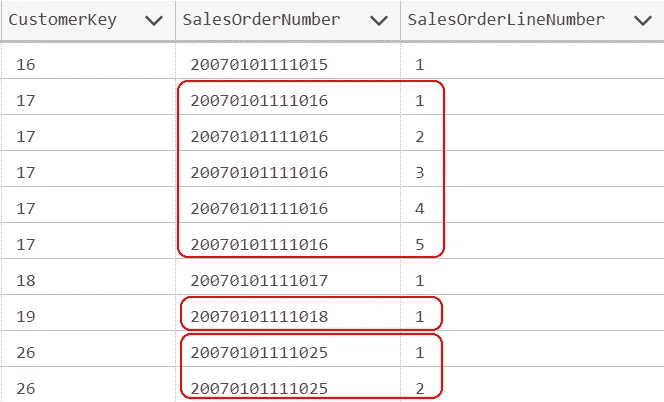
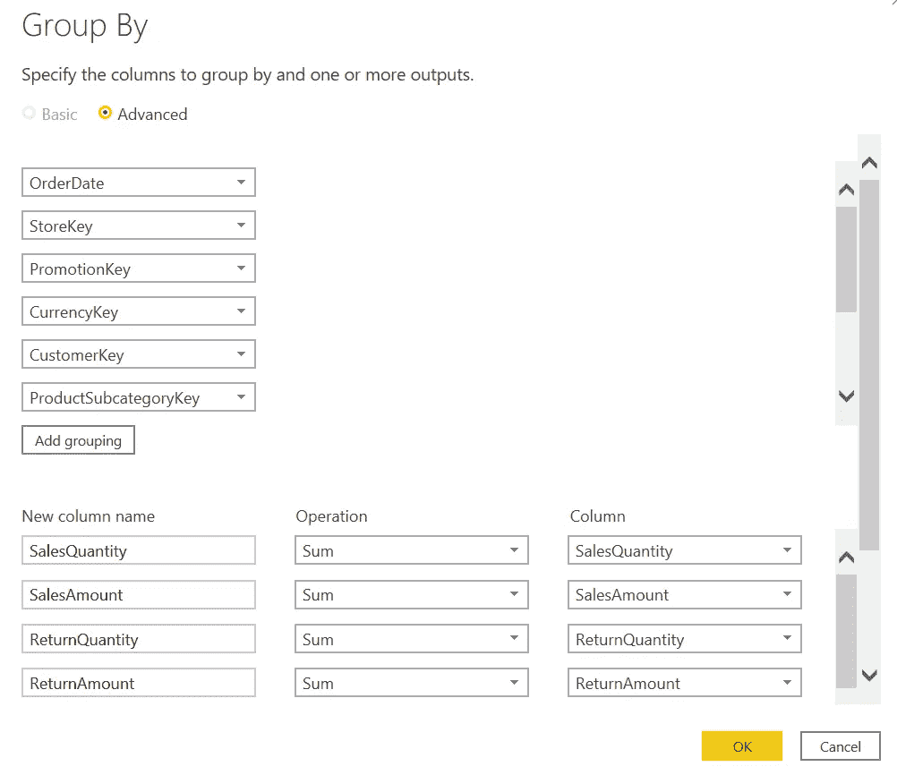
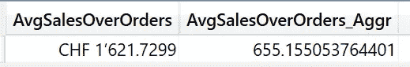
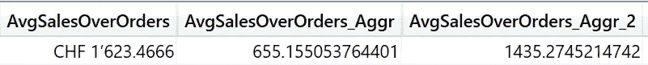
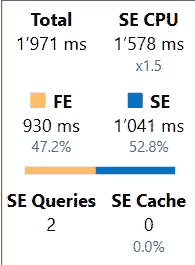
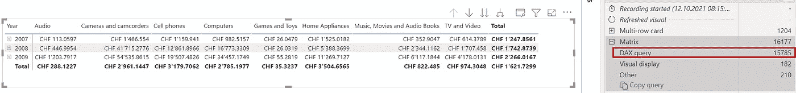
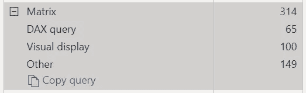
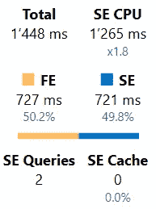

# 改变 Power BI 中的数据粒度

> 原文：<https://towardsdatascience.com/changing-granularity-of-data-in-power-bi-3a2b81356990?source=collection_archive---------12----------------------->

## 有时，您需要以与数据不同的粒度创建报告。让我们看看如何在 Power BI 中解决这一挑战


由[卢克·切瑟](https://unsplash.com/@lukechesser?utm_source=medium&utm_medium=referral)在 [Unsplash](https://unsplash.com?utm_source=medium&utm_medium=referral) 上拍摄的照片

# 问题是

我使用 Contoso 样本数据集，就像我以前的文章一样。你可以从微软[这里](https://www.microsoft.com/en-us/download/details.aspx?id=18279)免费下载 ContosoRetailDW 数据集。

Contoso 数据可以在 MIT 许可下自由使用，如这里的[所述](https://github.com/microsoft/Power-BI-Embedded-Contoso-Sales-Demo)。

现在，让我们看看在线销售事实表(FactOnlineSales)。

当您查看下图时，可以看到每个订单都有一行或多行。每一行都有一个 SalesOrderLineNumber，每一行都有一个 ProductID。



图 1 —样本数据(图片由作者提供)

现在，我有以下问题之一:

*   数据太多—我的数据太多，我想减少数据量以节省空间和内存来提高性能
*   报告需求—我需要根据订单和产品类别创建报告。
*   我不需要最高的粒度，我想从我的数据中删除不必要的细节

因此，我希望将粒度从产品减少到产品子类别，从 OrderLineNumber 减少到 OrderNumber。由于这种减少，我必须连接 Product 表来映射 Product 子类别。

此聚合将数据集从 12'627'608 行减少到 3'432'947 行，同时保留 SalesOrderNumber、CustomerKey 和其他维度引用。

您可以使用三种方法之一来降低数据的粒度:

1.  从源系统检索数据时更改它
2.  在 Power Query 中的导入过程中更改它
3.  在 Power BI 中加载数据后，在 DAX 中更改它

从这三个变体中，我最喜欢第一个。

我的口头禅是:“如果你需要改变你的数据，尽早去做”。

但是，让我们来详细看看这些变体中的每一个:

# 在源系统中

如果您的源系统是一个关系数据库，编写一个 SQL 查询来聚集您的数据。

聚合查询将如下所示:

```
SELECT [FOS].[DateKey], [FOS].[StoreKey], [FOS].[PromotionKey], [FOS].[CurrencyKey]
,[FOS].[CustomerKey], [P].[ProductSubcategoryKey], [FOS].[SalesOrderNumber]
,SUM([FOS].[SalesQuantity]) AS [SalesQuantity]
,SUM([FOS].[SalesAmount]) AS [SalesAmount]
,SUM([FOS].[ReturnQuantity]) AS [ReturnQuantity]
,SUM([FOS].[ReturnAmount]) AS [ReturnAmount]
,SUM([FOS].[DiscountQuantity]) AS [DiscountQuantity]
,SUM([FOS].[DiscountAmount]) AS [DiscountAmount]
,SUM([FOS].[TotalCost]) AS [TotalCost]
,SUM([FOS].[UnitCost]) AS [UnitCost]
,SUM([FOS].[UnitPrice]) AS [UnitPrice]
,[FOS].[UpdateDate], [FOS].[DueDate], [FOS].[ShipDate]
FROM [dbo].[FactOnlineSales] AS [FOS]
    LEFT OUTER JOIN [dbo].[DimProduct] AS [P]
        ON [P].[ProductKey] = [FOS].[ProductKey]
GROUP BY [FOS].[DateKey], [FOS].[StoreKey], [FOS].[PromotionKey], [FOS].[CurrencyKey]
, [FOS].[CustomerKey], [P].[ProductSubcategoryKey], [FOS].[SalesOrderNumber]
,[FOS].[UpdateDate], [FOS].[DueDate], [FOS].[ShipDate];
```

在分析数据后，我将所有的测量值相加。您需要仔细选择正确的聚合函数，因为简单的求和并不总是正确的选择。
有时，你不能简单地汇总你的数据。您可能需要对汇总的数据进行计算，以获得正确的结果。

如果源不是关系数据库，尽量在源系统中提前准备好数据，以减少 Power BI 中的转换工作。

一些应用程序允许您创建数据的聚合或报告视图，您可以在 Power BI 中使用这些视图。

如果这些都不可能，下一步就是 Power Query。

# 电源查询

您可以在 Power Query 中使用 Group By 函数来降低数据的粒度。



图 2 —强大查询中的分组依据(作者提供的图)

该特性计算 Power Query 中的分组和聚合，并将数据加载到 Power BI 中。

但是，这种方法的缺点是 Group By 函数不能将查询返回给 SQL Server。这意味着它必须在超级查询引擎中加载整个数据集。只有在所有数据都被加载后，它才能执行分组和聚合。

从 Power BI 的角度来看，在 Datasource 或 Power Query 中使用查询/视图没有区别。Power BI 仍然只能获得包含聚合数据的精简数据集。

# 当您需要两种粒度时该怎么办？

有时，您需要在更高和更低的粒度级别上进行计算。

在这种情况下，您需要两个表，并且您必须更改您的数据模型以适应所有需求。

在我的例子中，在为产品分类添加了聚合表和新表之后，我的 PBIX 文件需要大约 15%的额外空间。

但是，有时，这不是一个选项，因为您的事实表中可能有更多的数据，并且由于各种原因，您不能简单地向您的模型添加一个更大的表。

当你有大量数据集时，你可以阅读我上一篇关于这个主题的文章:

[](/change-your-approach-with-large-datasets-in-power-bi-ca488a5b1066) [## 改变您在 Power BI 中处理大型数据集的方法

### 在 Power BI Desktop 中，很难加载具有数亿行的大型数据集。让我们采取不同的…

towardsdatascience.com](/change-your-approach-with-large-datasets-in-power-bi-ca488a5b1066) 

另一方面，如果您只有少量的数据，您可能希望只有一个事实表，并且您希望动态地更改度量中的粒度。

让我们来研究一下这种方法。

# 在一定程度上做这件事，让我们看看结果

不幸的是，在改变数据粒度的同时创建一个度量并不容易。有很多变数需要考虑。

我们来看下面这个问题:整体订单的平均销售金额是多少？
我想考虑整个订单，而不是每个订单行的销售额。因此，我必须合计每个订单号的销售总额。然后计算结果的平均值。

这项措施本身并不困难:

```
AvgSalesOverOrders =VAR SalesPerOrder = SUMMARIZE(‘Online Sales’
        ,’Online Sales’[Sales Order Number]
        ,”SalesAmountPerOrder”, SUMX(‘Online Sales’,
                                      [SalesAmount])
)RETURN
AVERAGEX(SalesPerOrder
           ,[SalesAmountPerOrder])
```

我的第一种方法是对表变量 SalesPerOrder 使用 AVERAGE()。
不幸的是，AVERAGE 只能处理物化表，也可以是 DAX 表。

但是，我不想创建一个计算 DAX 表来解决这一挑战。我的目标是创建一个 DAX 度量，而不需要向我的数据模型添加更多的表。

在这种情况下，AVERAGEX()是解决方案。

但是结果正确吗？
嗯，看情况。

你可能在我的上一篇文章中读到过，有多种方法可以计算平均值:

[](/to-weigh-or-not-to-weigh-this-is-the-average-question-ece33fad9180) [## 称重还是不称重——这是一个普通的问题

### 平均值是一个简单的计算。但有时，还有更多需要探索。让我们来看看这个被低估的话题

towardsdatascience.com](/to-weigh-or-not-to-weigh-this-is-the-average-question-ece33fad9180) 

在这种情况下，结果是否正确取决于数据的粒度。

我导入了聚合数据，这些数据是用上面描述的 Power 查询方法准备的，作为我的数据模型中一个名为“Online Sales Aggr”的新表。

请看下面的查询:

```
DEFINE

MEASURE ‘Online Sales’[AvgSalesOverOrders] = 
    VAR SalesPerOrder = SUMMARIZE(‘Online Sales’
                            ,’Online Sales’[Sales Order Number]
                            ,”SalesAmountPerOrder”
                                ,SUMX(‘Online Sales’, [SalesAmount])
                            )

 RETURN
     AVERAGEX(SalesPerOrder
                ,[SalesAmountPerOrder])

MEASURE ‘Online Sales Aggr’[AvgSalesOverOrders_Aggr] =
                          AVERAGE(‘Online Sales Aggr’[SalesAmount])

EVALUATE
    ROW( “AvgSalesOverOrders”, [AvgSalesOverOrders],
          “AvgSalesOverOrders_Aggr”, [AvgSalesOverOrders_Aggr] )
```

这是结果:



图 3 —两个平均值的结果(图片由作者提供)

为什么会不一样？

第一个度量从最高粒度聚合数据，包括所有细节，直到每个订单号。
第二种使用预汇总数据。但是该表包含每个客户、商店、促销等的详细信息。因此，该表包含的详细信息比测量中生成的表多得多。
因此，预聚合数据在销售额列中的数字较小。这就是平均值较低的原因。

当我将第二个度量的粒度更改为相同的级别时，结果更加相似。

以下是完整的查询:

```
DEFINE

MEASURE ‘Online Sales’[AvgSalesOverOrders] = 
    VAR SalesPerOrder = SUMMARIZE(‘Online Sales’
                             ,’Online Sales’[Sales Order Number]
                             ,”SalesAmountPerOrder”
                                ,SUMX(‘Online Sales’, [SalesAmount])
                                 )

RETURN
    AVERAGEX(SalesPerOrder
             ,[SalesAmountPerOrder])

MEASURE ‘Online Sales Aggr’[AvgSalesOverOrders_Aggr] =
                           AVERAGE(‘Online Sales Aggr’[SalesAmount])

MEASURE ‘Online Sales’[AvgSalesOverOrders_Aggr_2] = 
    VAR SalesPerOrder = SUMMARIZE(‘Online Sales Aggr’
                            ,’Online Sales Aggr’[Sales Order Number]
                            ,”SalesAmountPerOrder”
                                 ,SUMX(‘Online Sales Aggr’
                                              [SalesAmount])
                             )

RETURN
    AVERAGEX(SalesPerOrder
              ,[SalesAmountPerOrder])

EVALUATE
    ROW( “AvgSalesOverOrders”, [AvgSalesOverOrders],
          “AvgSalesOverOrders_Aggr”, [AvgSalesOverOrders_Aggr],
          “AvgSalesOverOrders_Aggr_2”, [AvgSalesOverOrders_Aggr_2] )
```

这是结果:



图 4 —相似粒度的结果(图片由作者提供)

无论如何，由于基值不同，结果不可能相等。

每行的值如何影响结果只是众多变量中的一个。您需要验证结果，并相应地改变方法，以从计算中获得正确的结果。

# 结论

我已经向您展示了三种不同的方法:

1.  准备源中的数据
2.  在超级查询中操作数据
3.  创建一个度量并在那里更改粒度

我更喜欢第一种选择，因为在大多数情况下，这是最有效的方法。

如果您的源是一个数据库，您可以向源传递一个查询，并用它来计算聚合。

第二种选择有一些限制。如上所述，Power Query 无法通过[查询折叠](https://docs.microsoft.com/en-us/power-query/power-query-folding)将数据的分组和聚合传递给 SQL Server。

因此，Power Query 将始终读取整个数据集，并在 Power Query 中执行聚合，这需要时间和资源。

当您希望将数据保持在最低粒度时，您必须编写一个度量。
但要谨慎。这种方法可能是性能最低的解决方案。

上面显示的第一个度量用了将近两秒钟来计算结果，在查询中只显示结果的总数:



图 5 —对基础数据进行测量的时间(图片由作者提供)

但是在矩阵中使用它需要 15 秒钟以上:



图 6 —矩阵测量的时间(图片由作者提供)

在 Power BI 中，对聚合数据的简单测量需要 65 ms 才能完成:



图 7——对聚合数据进行简单测量的时间(图片由作者提供)

但是，最后一种方法与第一种方法一样计算平均值，只比第一种方法少花了大约 25%的时间:

这里来自查询:



图 8——聚合数据的测量时间(图片由作者提供)

在 Power BI 中，使用与上述相同的矩阵视觉效果:


图 9 —矩阵中聚合数据的测量时间(图片由作者提供)

正确的解决方案取决于用户的需求。如果这些不清楚，你需要向他们展示不同之处，并要求一个简洁的答案，哪个版本是正确的。

平均值只是计算的一个例子。但是您需要澄清基于聚合数据的所有计算的需求。

这同样适用于首先聚合数据的方法。

您可以加载数据两次。一次是所有细节，一次是汇总形式，以便于一些计算。

但是，要注意如何执行聚合。错误的方法会导致不好的结果。


Sascha Bosshard 在 [Unsplash](https://unsplash.com?utm_source=medium&utm_medium=referral) 上的照片

我希望我能够给你一些如何处理这种情况的启发。