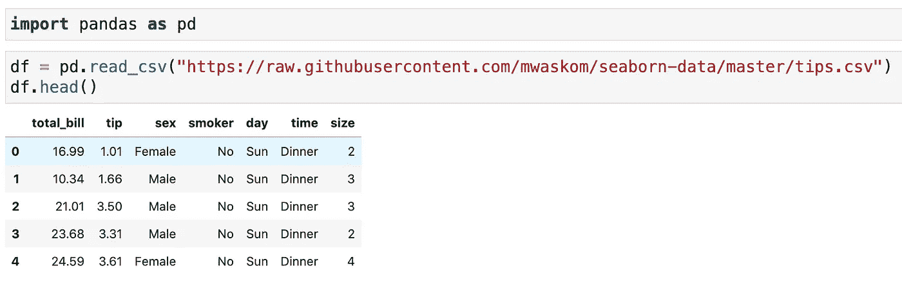
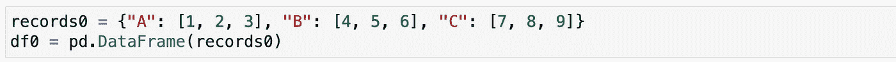
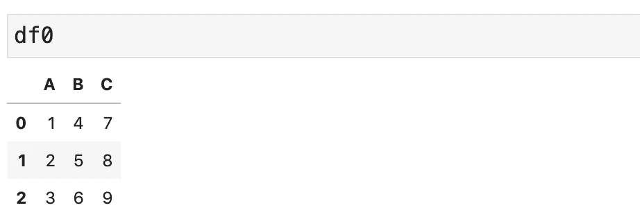
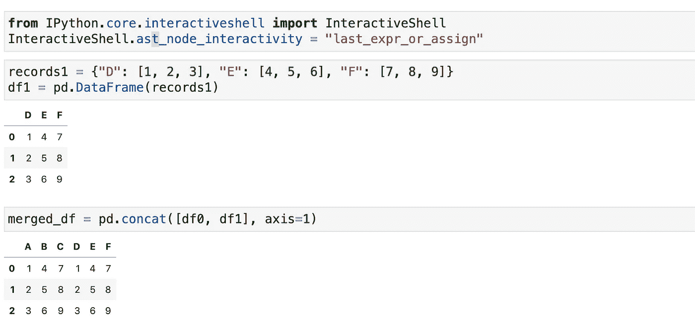
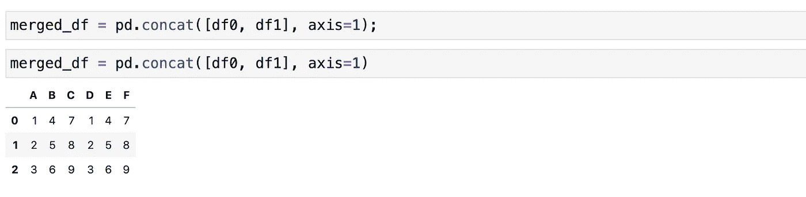

# 更改笔记本电池的默认输出 Jupyter 笔记本生产力快速提示

> 原文：<https://towardsdatascience.com/changing-the-cells-default-output-a-quick-jupyter-notebook-productivity-tip-a788c795884c?source=collection_archive---------15----------------------->

## 我打赌那是你会发现有用的东西


照片由 [XPS](https://unsplash.com/@xps?utm_source=medium&utm_medium=referral) 在 [Unsplash](https://unsplash.com?utm_source=medium&utm_medium=referral) 上拍摄

Jupyter Notebook 是一个友好的 Python 编辑器，适用于所有级别——初学者和有经验的 Python 用户会时不时或几乎每天都想使用它。对我来说，当我为实用程序模块编写脚本时，我喜欢使用 PyCharm。但是，当我处理数据时，我喜欢使用 Jupyter 笔记本。

Jupyter Notebook 对数据科学家的吸引力来自于它的交互性——你总是可以一步一步地检查数据是什么样子的。这是一些初级数据科学家没有意识到的事情——他们可能非常相信自己的编码技能，并认为一切都会很好。然而，如果不密切、持续地关注数据，您可能会得到一个完全错误的数据集。

## 默认输出行为

至此，我希望你已经养成了坚持检查数据的好习惯。您可能会做如下事情:



检查数据头(图片由作者提供)

在您读取数据集之后，您要做的是使用`head`方法检查它的前五行。除了数据导入，有时您可能需要自己创建数据框架:



创建数据框架(图片由作者提供)

但是，正如您可能注意到的那样，DataFrame 在默认情况下没有输出。同样，您必须在数据帧上使用`head`方法，或者简单地在另一个单元格中输入数据帧来检查数据。



检查数据帧(图片由作者提供)

当您一致地操作数据时，比如创建新列、设置数据框架的子集、与其他数据框架对象合并，通过调用单元格中的`df.head`或`df`来检查新的数据框架对象会变得很乏味。显示数据是因为**单元格的默认输出行为是显示最后一个表达式的求值结果。**

当单元格的最后一个操作是一个计算结果为 None 的语句或表达式时，您不会得到任何输出。例如，当我们创建 DataFrame `another_df = pd.DataFrame(data_records)`时，我们没有任何输出，因为它是一个赋值语句，不输出任何东西。

有什么方法可以不用显式调用`df.head`就能显示新创建的 DataFrame？

## 更改默认输出行为

如你所知，Jupyter Notebook 是建立在 [IPython](https://pypi.org/project/ipython/) 库之上的，它提供了笔记本单元的基本功能。因此，通过快速的 Google 搜索，我意识到我可以通过运行下面的代码来改变默认的输出行为:

```
from IPython.core.interactiveshell import InteractiveShell
InteractiveShell.ast_node_interactivity = "last_expr_or_assign"
```

本质上，您改变了交互式 shell 在 IPython 中的工作方式，Jupyter Notebook 依赖于 IPython。代码所做的是显示最后一个表达式的计算结果或赋值语句中使用的值。运行上述代码后，让我们看看细胞现在的行为:



更新的输出行为(图片由作者提供)

如您所见，我们不再需要运行`df.head`，所有创建的 DataFrame 对象都会自动显示，以便我们检查数据。

太方便了！

除了`“last_expr_or_assign”`选项，你还可以尝试其他选项，如下图。对我来说，我觉得这个`“last_expr_or_assign”`正是我想要的。

互动选项

## “永久地”改变行为

当您使用完当前笔记本并创建另一个笔记本时，您可能会注意到您必须再次运行以下代码。否则，新笔记本的行为将和以前一样，只显示最后一个表达式的计算结果。

```
from IPython.core.interactiveshell import InteractiveShell
InteractiveShell.ast_node_interactivity = "last_expr_or_assign"
```

在每一个笔记本里做是不是很繁琐？我不知道你的反应，但我发现它很乏味。

幸运的是，有一个解决方案—我们可以通过将此设置应用到配置文件来更改任何笔记本的默认行为。如果您使用的是 Mac (Windows 有类似的解决方案)，您应该能够找到一个隐藏的目录(要显示隐藏的文件/文件夹，在 Finder 中，按下`Shift + Cmd + .`)来进行 IPython 相关的设置:

```
/Users/your_username/.ipython/profile_default
```

在这个文件夹中，你创建一个名为`ipython_config.py`的文件。在该文件中，添加以下代码。代码所做的是获取配置文件，并为任何新创建的笔记本将节点的交互性设置为`“last_expr_or_assign”`。

```
c = get_config()c.InteractiveShell.ast_node_interactivity = "last_expr_or_assign"
```

创建这个文件后，您会看到它改变了新笔记本的默认单元格输出行为。超级酷吧？

## 抑制输出

就检查数据而言，更改默认显示行为很方便。但是，您的笔记本可能会变得很长，因为所有的 DataFrame 对象都会显示出来。当然，您可以在检查后删除单元的输出。另一个有用的方法是利用分号符号。请观察下面的截图。



抑制输出

如您所见，如果我们用分号结束我们的赋值，就不会显示更多的输出。如果没有分号，单元格将显示赋值中使用的值。

因此，通过使用分号，我们能够操纵单元格的输出行为，同时享受显示最后一个表达式或赋值的交互的笔记本级设置。

## 结论

在这篇文章中，我与你分享了一个简单的技巧，可以提高你的生产力与 Jupyter 笔记本。在许多情况下，我们希望在处理过程中不断检查我们的数据，为此，我们可能必须不断使用`df.head`或`df`，这很繁琐。

通过改变 IPython 中节点的交互模式，我们能够让单元格输出最后一个表达式或赋值，从而避免我们调用这些数据检查方法。此外，我们讨论了如何在不改变每个笔记本设置的情况下，在所有笔记本上一致地实施这种行为。我们还学习了如何在需要时使用分号来隐藏输出。

感谢阅读这篇文章。通过[注册我的简讯](https://medium.com/subscribe/@yong.cui01)保持联系。还不是中等会员？通过[使用我的会员链接](https://medium.com/@yong.cui01/membership)支持我的写作(对你没有额外的费用，但是你的一部分会费作为奖励由 Medium 重新分配给我)。