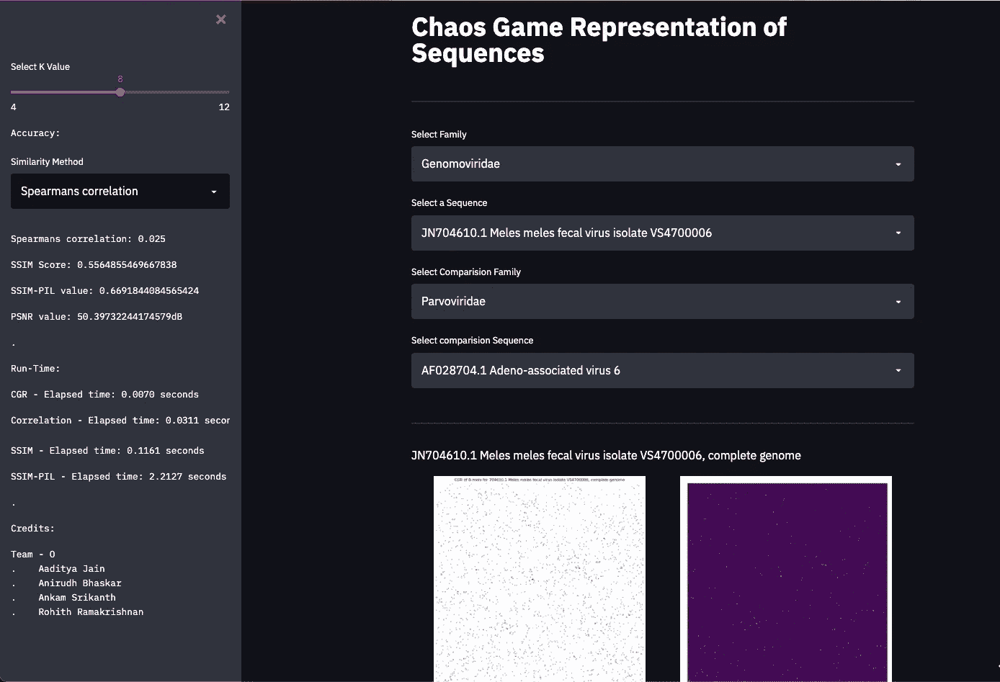
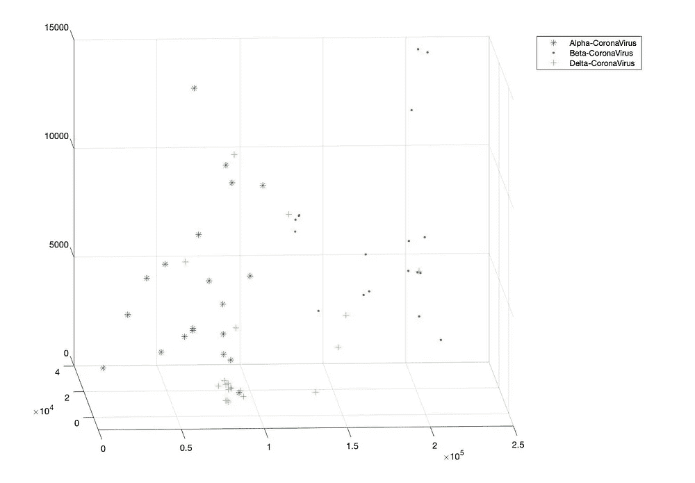

# 基因序列的混沌博弈表示

> 原文：<https://towardsdatascience.com/chaos-game-representation-of-genetic-sequences-e0e6bdcfaf6c?source=collection_archive---------31----------------------->

## 为基因组序列的混沌游戏表示建立 GUI，为度量接近度和聚类算法的应用对 C.G.R 进行矢量化。

[国家癌症研究所](https://unsplash.com/@nci?utm_source=medium&utm_medium=referral)在 [Unsplash](https://unsplash.com?utm_source=medium&utm_medium=referral) 上拍摄的照片

在这篇文章中，我们将详细讨论 C.G.R 在生物信息学中的应用。然后，混沌矩阵将被转换成一个 N 维向量，用于测量接近度和聚类算法的应用。还将构建一个 GUI 来表示一系列序列的 C.G.R 图。

haos 游戏表示法是由 H J Jeffery 于 1990 年提出的一种新方法。这是一种将一维文本序列转换成可视二维矩阵的迭代方法，本质上是非随机输入在迭代函数系统中的应用。最初是为基因组序列引入的，现在它被用于任何包含从代码 32 到 126 的 ASCII 字符的任意符号或字母，这些字符由大写和小写字母以及标点符号组成。

基因组序列通常是通过 **A、T、G、**和 **C 表示的数千兆字节的文本排列。**多年来，已经开发了许多方法来比较序列，这对人眼来说是复杂的。C.G.R 提供了一个可视化的 2D 图，可以立即识别并与其他序列的 C.G.R 图进行比较。C.G.R 显示出基因组的显著模式特征。由于模式对基因组来说是独特的，这可以用来识别基因组片段或检测水平基因转移。此外，C.G.R 模式的定量分析可用于序列比较，用 C.G.R 进行无比对和基于比对的序列比较都是可能的

## 算法实现

在本节中，我们将深入探讨如何在 MATLAB 和 Python 中为任何给定的序列从头开始创建 C.G.R 图。我遇到了两种不同的迭代算法方法，这两种方法都可以用其中一种语言来实现。这两种算法的基础是相同的，

*   从二维坐标系的原点开始，通常为(0，0)
*   每个核苷酸都有其预定的位置:

> A: (-1，1) — T: (1，-1) — G: (1，1) — C: (-1，-1)

*   对于每个核苷酸(以相反的顺序匹配 k-mer 表；即匹配正向马尔可夫链)，移动并标记位于当前位置和核苷酸中间的新位置。例如，如果最后一个字母是 T，则位置从(0，0)移动到(1，-1)和(0，0)之间的中点，即(0.5，-0.5)
*   对所有核苷酸重复此程序

上述实现取决于所生成的 k-mers，并且将随着所选择的 k-mers 的长度而变化。

混沌游戏表征

用 k 值为 9 (k 值描述每个 k-mer 的长度)的*人类β冠状病毒* *fasta* 文件测试的上述代码产生了这些图。

C.贝塔冠状病毒的 G.R 图

在 MATLAB 中完成的第二个实现不依赖于 k-mers，仅依赖于每个核苷酸。

黄泰荣、尹正昌、邱淑诗(2016)。DNA 序列的混沌游戏数字编码及其在相似性比较中的应用。基因组学，第 107 卷，2016 年，爱思唯尔公司理论生物学杂志

用*人类贝塔冠状病毒* ' *fasta'* 文件测试的上述代码产生了这些图。

两个冠状病毒序列的混沌博弈图

## GUI 实现

照片由[西格蒙德](https://unsplash.com/@sigmund?utm_source=medium&utm_medium=referral)在 [Unsplash](https://unsplash.com?utm_source=medium&utm_medium=referral) 上拍摄

实现的 python 文件将是 GUI 的框架。 [**Streamlit**](https://streamlit.io/) 是面向机器学习和数据科学团队的开源 app 框架。在数小时内而不是数周内创建漂亮的数据应用。全是纯 Python。

> 所用数据集的链接可在[这里](https://github.com/Rohith-2/Chaos-Game-Representation_BioSeq/tree/master/data)找到。

给定数据集由' *xlsx'* 格式的多个序列家族组成，每个家族由属于各自家族的多个序列组成。

窥视其中一个数据集。

GUI 允许用户从数据集中选择任意两个家族，并在这些家族中选择一个序列，该序列将被转换为 C.G.R 图。

两种不同的方法被用来寻找两个序列之间的相似性，向量相关和图像相似性方法。对于矢量相关，给定的 2D 混沌矩阵通过行的线性组合转换成 1D 矢量。这些载体通过 Spearman、Kendal 和 Pearson 的方法进行关联。

[SSIM](https://en.wikipedia.org/wiki/Structural_similarity) 和 [PSNR](https://en.wikipedia.org/wiki/Peak_signal-to-noise_ratio#:~:text=Peak%20signal%2Dto%2Dnoise%20ratio%20(PSNR)%20is%20an,the%20fidelity%20of%20its%20representation.) 指数用于计算图像之间的相似性。计算出的 C . g . r . 2D 图将输入到这些方法中。SSIM 值的范围从 0 到 1，图像相似的分数越高。PSNR 值描述了信噪比，因此图像越近，该值越小。这些方法是进行的一系列实验的一部分，但是从观察来看，这些方法没有产生非常有用的结果。

> python 中用于 SSIM 的包有:[**sc kit-ssim**](https://scikit-image.org/docs/dev/auto_examples/transform/plot_ssim.html)**&**[**SSIM-PIL**](https://pypi.org/project/SSIM-PIL/)****
> 
> *****实现的源代码可以在* [*这里找到*](https://github.com/Rohith-2/Chaos-Game-Representation_BioSeq/blob/master/data/stream.py) *。*****

****链接到 GUI:[https://share . streamlit . io/rohith-2/chaos-game-representation _ BIOS eq/stream . py](https://share.streamlit.io/rohith-2/chaos-game-representation_bioseq/stream.py)****

********

****建议的图形用户界面的最终结果****

## ****将 C.G.R 矩阵向量化成 N 维元组****

****在将 C.G.R 的应用扩展到尖端 ML 和深度学习模型的尝试中，可以利用在[*中公开的通过混沌游戏表示的 DNA 序列的数字编码以及在相似性比较中的应用*](https://pubmed.ncbi.nlm.nih.gov/27538895/) 中的方法。目的是对属于同一家族的 N 维元组进行聚类，以找出任意两个序列之间的“距离”,并识别未知基因组序列的家族。****

****矢量器. m****

****通过选取 *3* 个基因组家族和这些家族中每个家族的 20 个序列来尝试所提出的想法。出于可视化的目的，元组维度被选择为 3。****

****************

****3D 图的不同视图****

## ****未来工作:****

****这是 C.G.R 的一个基本实现，它没有针对速度或更高 k 值的更好描述进行优化。可以在更高维度更好的特征中使用矢量描述，这可以改进许多 ML 模型分类和基因组序列的模式匹配。****

****github:[https://github . com/Rohith-2/Chaos-Game-Representation _ bio seq](https://github.com/Rohith-2/Chaos-Game-Representation_BioSeq)****

****本文使用的数据集来自 [NCBI](https://www.ncbi.nlm.nih.gov/) 。****

> ****合著者:[阿尼鲁德·巴斯卡尔](https://medium.com/u/1ee3802d5d20?source=post_page-----e0e6bdcfaf6c--------------------------------)和[斯里坎特·安卡姆](https://medium.com/u/c463efdba322?source=post_page-----e0e6bdcfaf6c--------------------------------)****

## ****参考资料:****

*   ****黄泰荣、尹正昌、邱淑诗(2016)。DNA 序列的混沌游戏数值编码及其在相似性比较中的应用。基因组学，2016 年第 107 卷，爱思唯尔公司理论生物学杂志。****
*   ****H.Joel Jeffrey，“基因结构的混沌游戏表示”，收录于*核酸研究，第 18 卷，第 8 期*，1990 年，第 2163–2170 页。****