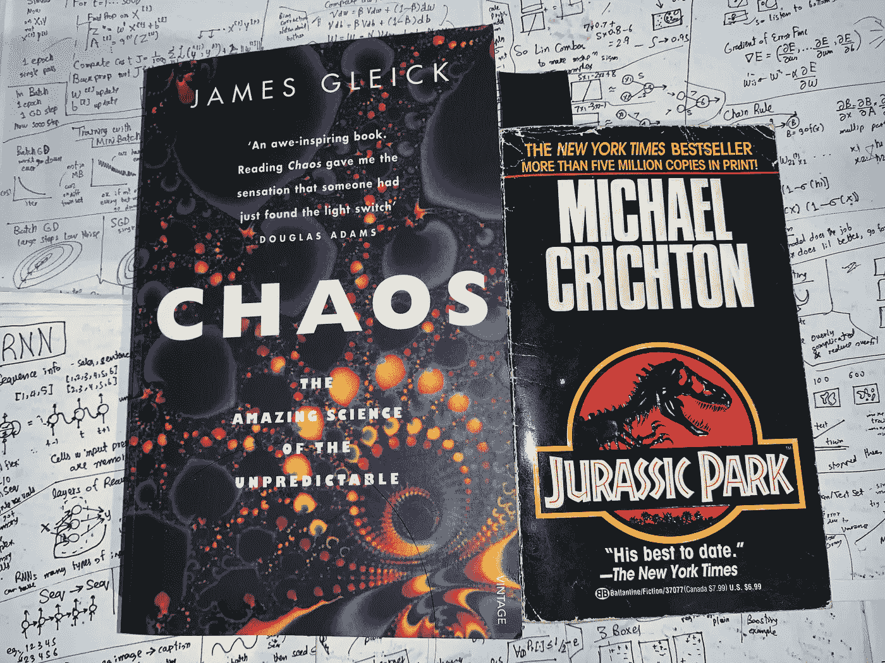

# 混沌理论，侏罗纪公园，为混沌系统做机器学习

> 原文：<https://towardsdatascience.com/chaos-theory-jurassic-park-and-doing-machine-learning-for-chaotic-systems-5ebed9cc72d1?source=collection_archive---------15----------------------->

## 受《侏罗纪公园》启发，分析混沌理论、机器学习和可预测性

作者图片

**来自《侏罗纪公园》的灵感:**

我第一次读 1990 年的《侏罗纪公园》小说时，看到了这一段有趣的内容，伊恩·马尔科姆博士解释了混沌理论，并声称通过计算机预测混沌系统是不可能的，同时谈到了预测天气的愿望，一个混沌系统，如何导致冯·诺依曼创造了现代(存储程序)计算机。混乱是侏罗纪世界系列的一个中心主题，也是对事情如何出错的解释。马尔科姆博士不断警告《侏罗纪公园》的创作者约翰·哈蒙德，由于混乱，这样的系统是无法控制和管理的。小说之前随机买了一本混沌理论的书。我不知道这是一本 1987 年的书，马尔科姆博士的角色实际上是受《混乱》的作者詹姆斯·格雷克的启发。意识到这一点后，我更感兴趣地读了那本书。

作为一名数据科学家和 JP fan，我决定做更多的研究和分析，评估在机器学习和计算领域取得最新进展后，这一说法现在如何成立，并分析混沌理论在过去几十年中如何应用和影响科学，特别是计算机科学和数据科学。混沌理论被认为是 20 世纪科学中发现的最重要的概念之一。这是一个有趣且有用的概念，但它很少在数据科学和人工智能领域被谈论，所以我写了这篇关于它的文章。

**什么是混沌理论:**

混沌理论是对复杂的，通常是非线性系统的研究，这些系统对初始条件和状态的改变高度敏感，并具有复杂的相互作用、混合、非周期性和反馈回路，从而导致快速演化的不规则和经常意外的行为，这是不可预测的。然而，在这种无序之下有潜在的秩序和模式，但据说是不可预测的。当你试图预测更远的未来时，预测会迅速变得更加困难。有时表面上简单的系统也会表现出混乱。

混沌理论创始人 Edward Lorenz 用一种有趣的方式总结:*“当现在决定未来，但近似的现在并不近似地决定未来。”*，意味着系统是确定性的，但初始条件的微小变化会导致非常不同的不可预测行为的演化。确定性行为似乎是随机的。

混沌理论是著名的蝴蝶效应的基础，这种效应在流行文化和电影中经常被提及。根据洛伦兹的说法:*“今天在香港飞舞的蝴蝶可以改变下个月纽约的风暴系统。”*

**混沌理论的用途:**

混沌是世界上普遍存在的现象，混沌理论的概念有着广泛的应用。它们不仅用于促进不同混沌系统的分析，断言考虑和限制，以及检测混沌。它们还被用于设计、生产和改进许多东西，有时是通过利用初始条件和混沌地图来制造混沌。除了物理学、化学和生物学等自然科学的核心领域，一些有趣的应用领域包括密码学、经济学、生态学、农业、天文学、政治学、人类学、生理学、心理学、气象学、地质学、最优化、机器人与控制、计算机科学、电气与电信工程、生殖艺术和纺织品设计。

伪随机数生成用于编程任何随机的东西，这在 AI 和 ML 中很常见。混沌过程及其对初始条件的敏感性被用来产生安全的伪随机数。它们也用于图像加密、制作密码和创建水印。

一些通信系统和电路使用混沌信号来实现安全通信。混沌过程也用于家用电器和消费电子产品。

在机器人学中，混沌动力学以混沌分析或混沌合成的形式使用。混沌合成就是产生混沌来完成任务。混沌分析是对混沌行为的观察和分析。混沌理论被用于群体智能&多智能体系统、双足机器人运动和移动机器人与环境交互的行为分析。它也用于一些运动规划算法。分形也被用于模块化机器人。

分形是复杂的，往往是美丽的视觉图案，源于混沌，在从细胞膜到太阳系的整个宇宙中普遍存在，使事物美丽而独特。它们也用于生成数字艺术和设计纺织品图案等。

混沌理论还用于基于元启发式的优化和进化计算，用于人工智能和机器人，以及许多工程和工业问题，如聚合物制造和电信。混沌被加入到粒子群优化和遗传算法的混沌版本中，以避免局部最优。基于主体的建模和仿真在某些情况下也利用混沌理论。

机器学习中有一些混沌启发的模型训练和优化方法。也有受混沌启发的神经网络架构，在实验中发现混沌神经网络处理信息快速高效。随机梯度下降(SGD)和神经网络训练的收敛性具有混沌行为，最近混沌理论被用来改善当前对神经网络优化的理解并解释为什么 SGD 工作良好。

**混沌系统、预测分析和机器学习:**

有很多混沌系统的例子，包括流行病、道路交通、密码和股票市场、经济、体育、人群、多智能体系统、自动驾驶、消费者行为、销售和社会，其中许多我也曾参与预测分析。

我相信，对于这样的系统，应该考虑并承认混沌的影响以及由此导致的预测中的限制和挑战，以避免在做出预测时不切实际的期望，特别是如果您没有仔细使用领域知识和专门方法的话。

现代计算能力、数据可用性和机器学习的进步，确实给了我们一种希望，可以在某种程度上预测混沌系统中的不可预测性，如果它们以某种方式了解了无序中的潜在秩序和模式。有预测分析做得很好的例子。这取决于数据和方法以及问题的复杂性和性质。

混沌系统对初始条件和测量精度很敏感，它们需要关于完整系统的详细信息。通常我们没有所需的或足够的数据，特征值是嘈杂的和不准确的。我们还没有在混沌系统中创造复杂的相互作用和变化的所有特征和状态表示。另一个挑战是，由于*“维数灾难”*，拥有更多功能会成倍增加所需的数据和计算。对反馈循环和突发行为的解释也使这个问题变得更加困难。

以下是一些方法和想法，它们被证明在减轻混沌的影响和在这样的混沌系统中进行适当的预测方面是很好的:

一个在机器学习中也很重要的简单想法是对模型和系统进行持续的训练、评估和监控。复杂进化系统的预测分析应该是一个迭代过程。混沌理论特别强调混沌系统在长期范围内的不可预测性，即在未来，因此在未来训练一个新系统是有帮助的。

在一些成功的尝试中，系综方法的使用已经被强调，这些成功的尝试是在具有混沌动力学的系统中进行良好的长期预测。在集成方法中，基于*【群体智慧】*，来自多个模型的预测被组合以获得更好的预测。总体而言，集成也是提高机器学习预测的一种有用和常见的方式。在具有混沌动力学的系统中，它们尤其有用，因为多个模型解决了系统对初始条件、状态变化和噪声测量的敏感性。

像卡尔曼滤波器集成这样的数据同化方法将新的观测结果与模型预报结合起来进行改进。当在混沌系统中进行数值模拟时，它们也用于改进预测，并且有时用于 ML 模型的输入。

反馈回路、序列动力学和跟踪状态是混沌理论和混沌动力学的固有部分。因此，递归神经网络(RNNs)似乎是处理这些问题的自然选择。长短期记忆是一种 RNNs。通过处理像消失梯度这样的问题，它们优于 RNNs。类似 LSTMs 的 rnn 在使用 ML 预测混沌的一些研究和实验中被有效地使用[1]。他们可以利用对过去状态的记忆和序列对未来进行连续的时间序列预测。一些解决方案使用简单的深度神经网络，有时将它们与自回归模型相结合。

相空间是在所有可能状态的 n 维空间中表示的系统状态。该系统遵循该空间中的轨迹，该轨迹是描述该系统的微分方程的解。混沌系统通常无法解决，但它们在相空间中运动的定性行为和风味可以估计。在相空间中有一个被称为吸引子的区域，它被所有的轨迹勾勒出来，它们似乎被吸引了。在奇异吸引子中，由于缺乏关于初始条件的完美信息，我们不知道系统在吸引子上的位置。洛伦兹吸引子是一种奇怪的吸引子，是洛伦兹在对流实验中发现的。它看起来像一个不断螺旋上升的蝴蝶形状，轨迹没有交叉，因为没有任何状态是重复的，显示出非周期性和混沌性。它革新了混沌理论，它的情节成为它的标志。

自动编码器以无人监督的方式学习数据的压缩表示。它们也用于混沌系统中的状态表示，有时与 RNNs 结合使用。他们也可以学习有效地表示混沌系统的吸引子。在实验[2]中，使用具有伪最近邻正则化的 LSTM-自动编码器通过无监督学习来编码和估计洛伦兹吸引子，并从该信息重建状态空间。这类似于使用非线性动力学中使用的延迟坐标编码进行状态估计，同时避免了其局限性。

卷积神经网络(CNN)也可以以时间 CNN 的形式用于顺序建模，时间 CNN 使用 1D 卷积。卷积从时间序列中执行复杂的特征提取。对于一些时间序列问题，它们被证明是 RNNs 的一个很好的替代品，有时也与 RNNs 结合使用。时间细胞神经网络也被应用于混沌系统的预测。一位研究人员[3]将自动编码器与 CNN 结合起来，使用 AE-CNN 对混沌的逐时气象数据进行中长期预测，并使用迁移学习对其进行进一步改进

也有机器学习的应用来控制和减少系统中的混沌，特别是使用强化学习。有时像小波这样的信号处理技术也用于此。

用于混沌系统预测的机器学习的一些最令人印象深刻和最新的应用利用了水库计算(RC)。RC 是基于 RNNs 背后的思想。这个框架对系统状态的演变进行数据驱动的预测。储层是随机连接的非线性单元的复杂网络，使用循环回路存储信息。贮存器通过使用那些递归连接来学习和表示系统的动态。输入是低维时间序列数据，使用储层输入(I/R)模块映射到储层中的高维时间相关向量。动态系统的演变输出状态由油藏-输出(R/O)模块[4]映射和预测。通过学习有限的输出参数来训练 RC 系统。在 RC 系统中，机器学习有助于填补状态信息缺失的空白。

在一些研究工作中，RC 已经被有效地应用于混沌系统预测，并且添加了不同的模块和改进以使它们更好地用于混沌系统。RC 系统[5，6]用于预测复杂和混沌的 Kuramoto-Sivashinsky 火焰传播系统。该系统在没有系统先验知识的情况下，对混沌时空系统进行了高度精确和非常长时间的预测。

在科学和工程中，使用基于模型的方法进行系统分析和预测是很常见的。如果一个好的系统模型是已知的，那么在许多情况下它会比使用 ML 做得更好。领域知识的使用非常有助于数据科学的直接利用，也有助于特征工程和 ML 的结合。所以它不应该总是被忽视。混沌系统中预测分析的几种方法是机器学习和系统模型的混合，或者将领域知识与 ML 算法相结合。

现代天气预报仍然使用气象系统模型和方程进行预报。他们通常使用来自不同模型的预测集合，以减轻信息和初始条件不完善的影响。天气的长期预测仍然不太好，研究表明，在 8 天后，这比使用该日期的历史平均值更糟糕[7]。然而，在使用最大似然法进行长期天气预测方面，一些很好的工作正在进行中，从事这项工作的专家声称非常乐观[8]。改进和大规模部署需要时间。有趣的是，尽管计算能力在过去几十年里有了惊人的增长，但制造现代计算机的主要目标仍未完全实现。

回到马尔科姆博士在《侏罗纪公园》中的主张，我想说，应该记住，在混沌系统中进行预测是具有挑战性的，也是不可靠的。然而，通过使用现代计算以及机器学习和深度学习的进步，在对混沌系统进行体面的预测分析方面取得了一些良好的进展。

**参考文献:**

[1] M. Modondo，T. Gibbons，“使用 LSTM 循环神经网络学习和模拟混沌”。2018 年多指标类集调查。

[2] Sigrid Keydana，《深度吸引子:深度学习遇到混沌的地方》，RStudio AI 博客，2020 年。

[3]辛，“基于混沌时间序列的 AE-CNN 与迁移学习的预测”，印度复杂性科学，2020 .

[4] H. Fan，J. Jiang，等，“用机器学习实现混沌系统的长期预测”，APS 物理评论研究，2020。

[5] Natalie Wolchover，“机器学习预测混沌的‘惊人’能力”，《量子》杂志，2018 年。

[6] J. Pathak，B. Hunt 等，“从数据中对大型时空混沌系统进行无模型预测:一种水库计算方法”，APS Physics，2018。

[7]马修·卡普奇，“研究表明'特定'天气预报不能提前 10 天以上做出”，华盛顿邮报，2019 年

[8]弗雷德·施穆德，“机器学习会让我们重新思考混沌理论吗？”，风暴地理，2021。