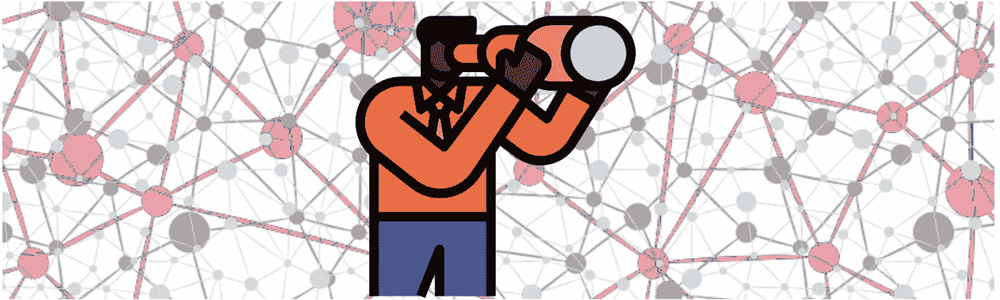
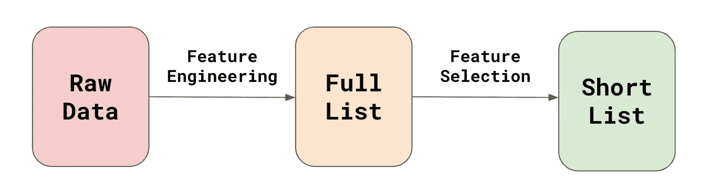
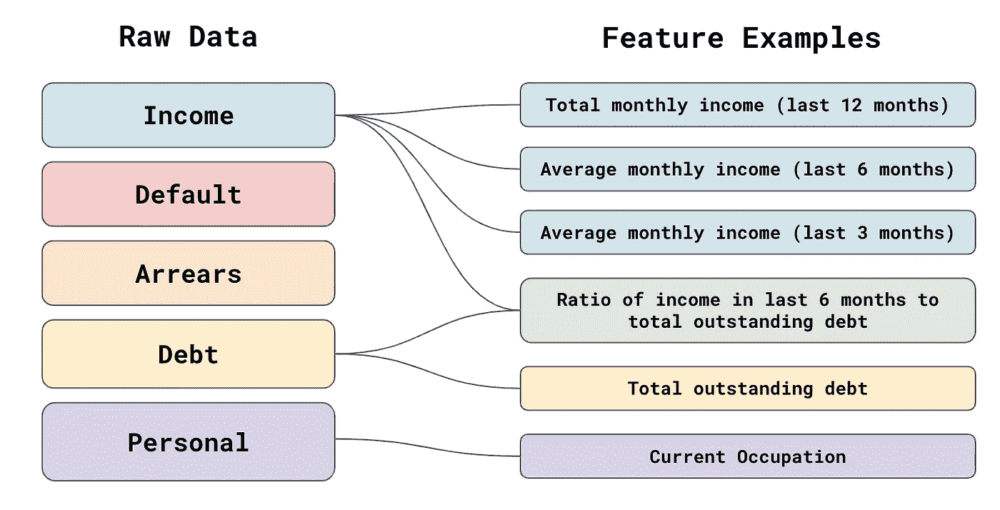
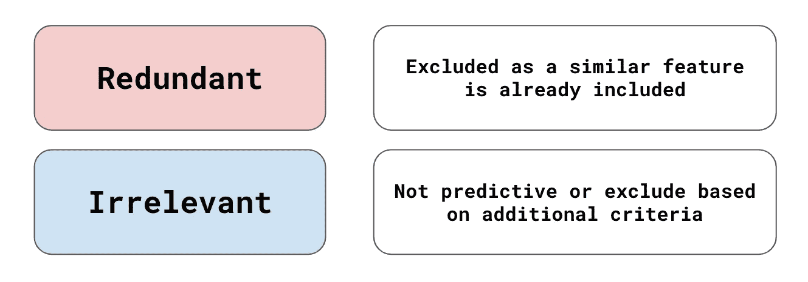
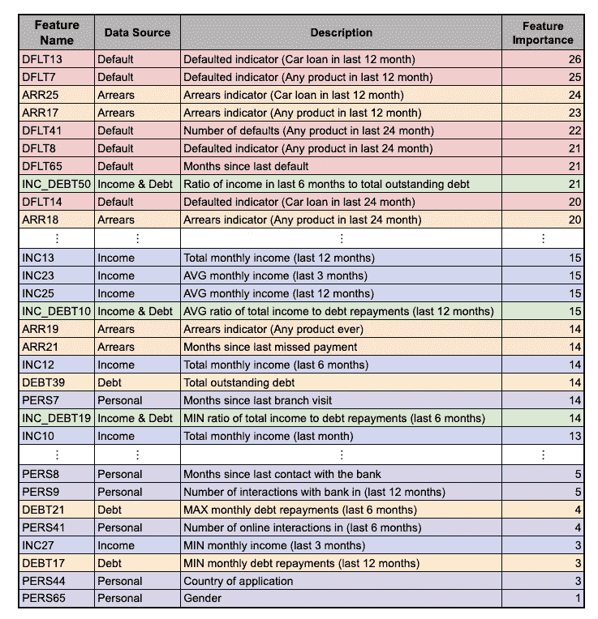
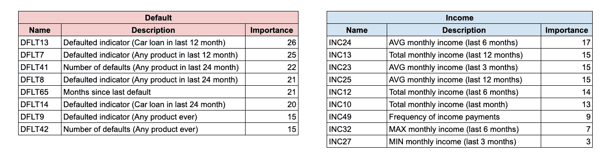
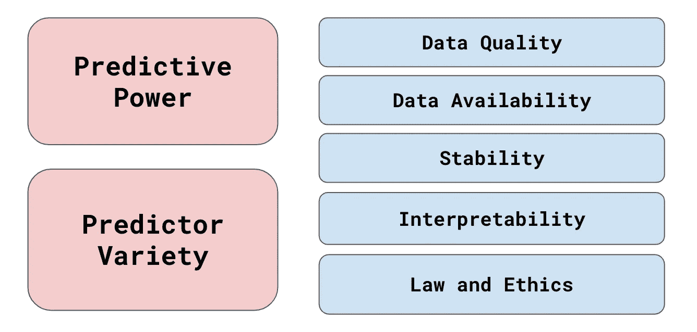
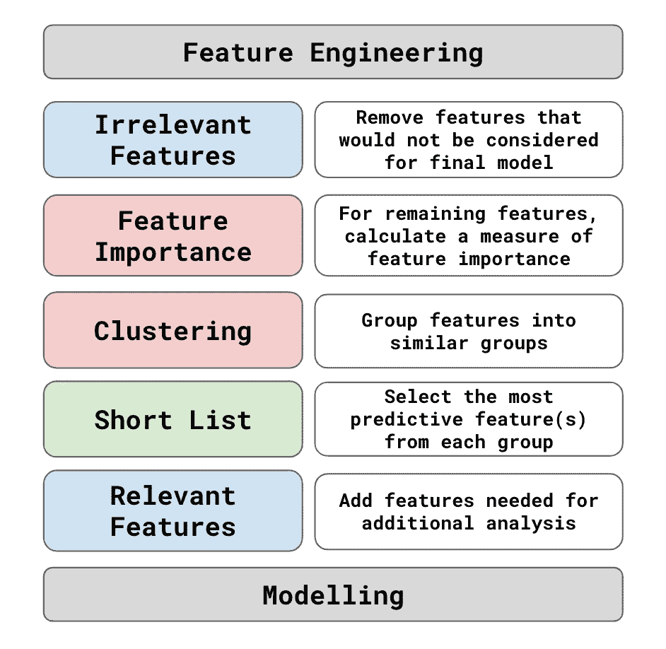

# 良好特性的特征

> 原文：<https://towardsdatascience.com/characteristics-of-a-good-feature-4f1ac7a90a42?source=collection_archive---------9----------------------->

## [提示和技巧](https://towardsdatascience.com/tagged/tips-and-tricks)

## 为什么在选择模型特征时，预测能力不是一切

来源: [flaticon](https://www.flaticon.com/free-icon/forecast_4073243) ， [shutterstock](https://www.shutterstock.com/image-vector/seamless-neural-network-background-144479800)

在保险业，过去的索赔行为对未来的索赔行为有很强的预测性。这可能是用于确定客户是否会提出索赔的唯一最具预测性的信息来源。然而，如果我们只使用索赔历史来构建模型，效果不会很好。通常，模型特征应该来自各种不同的信息源。您的特征选择方法应该旨在从每个不同的信息源中创建一个最具预测性的特征列表。

在本文中，我们将解释如何结合使用可变聚类和特性重要性来创建这样一个候选列表。我们还讨论了可能导致添加或删除功能的其他注意事项。这些包括数据质量和可用性、特征稳定性、可解释性和法律/道德。最后，我们将讨论所有这些因素是如何在一个特性选择框架中结合起来的。让我们从定义我们所说的特征选择的确切含义开始。

# 什么是特征选择？

在模型开发过程中，特征选择发生在特征工程之后和我们开始拟合模型之前。在特征工程中，我们将原始数据转换成模型特征列表。根据您的问题，此列表可能会很大(即超过 1000 个功能)。功能选择包括缩小到一个候选名单(即 20-40 个功能)。根据您的模型，可能会有另一个特征选择阶段，您可以在其中选择模型特征的最终列表(即 8-10 个特征)。在本文中，我们关注第一个阶段——创建候选名单。

图 1:特征工程和选择概述

我们创建入围名单有几个原因。在模型训练阶段，使用特征的完整列表在计算上是昂贵的。甚至在我们开始训练模型之前，我们将想要探索特征以理解它们与目标变量的关系。还有大量的工作要投入到特性的测试中。没有必要为他们都做这项工作。这是因为完整的列表将包含冗余/不相关的特征。

## 冗余功能

为了更好地理解这一点，假设您想要创建一个模型来预测某人是否会拖欠汽车贷款。让我们假设，对于每个客户，我们都可以访问月收入、违约和欠款历史、现有债务和一些个人信息。在要素工程过程中，您将在不同的时间段使用不同的聚合从每个来源创建许多要素。在图 2 中，您可以看到一些这样的例子。

图 2:特征工程示例

对于收入，我们预计上述 3 个特征非常相似。我们还可以预期它们会预测违约。然而，它们都捕捉到了收入和违约之间相同的潜在关系。这意味着，一旦我们的模型中有了收入特征，再增加一个也不会提高模型的准确性。我们说剩下的收入特征是多余的。我们希望从候选列表中排除多余的特征，即使它们是可预测的。

## 无关的特征

我们还希望删除任何不可预测的或由于其他原因不应考虑的特征(例如，在模型中使用该特征是非法的)。这些被称为不相关特征。例如，假设我们使用客户 20 年前的收入创建了一个特性。这些信息已经过时，不能告诉我们任何关于他们当前财务状况的信息。换句话说，这个特性不能帮助我们预测客户是否会拖欠汽车贷款。

图 3:冗余和不相关特性的总结

特征选择的目标是通过移除尽可能多的冗余和不相关的特征来缩小列表。为此，我们需要考虑单个特征的预测能力以及这些特征之间的差异(即预测变量)。这些是主要的考虑因素，我们将在下面深入讨论。

# 预测能力

我们可以粗略地将预测能力定义为一个特征预测目标变量的能力。实际上，我们需要使用一些度量/统计来估计这一点。一个常见的衡量标准是特征和目标变量之间的相关性。较大的正相关或负相关表明存在很强的关系，或者换句话说，该特征是预测性的。其他度量包括信息值、互信息和特征重要性分数。

不同的措施有各自的优缺点。重要的是，它们让我们能够比较特征，并优先考虑最具预测性的特征。然而，如果这是我们唯一考虑的事情，我们可能不会有一个很好的候选名单。继续我们的汽车贷款例子，假设我们已经创建了表 1 中的特性列表。这是我们所有的特性列表，我们已经根据特性的重要性对它们进行了排序。

表 1:潜在模型特征的完整列表

一般来说，我们可以看到基于违约历史的特征是最具预测性的。这是因为客户过去的违约历史会告诉我们很多关于他们未来是否会违约的信息。所以，假设我们只取了 20 个最有预测性的特征作为我们最终的候选名单。我们最终会得到许多默认的特性。换句话说，候选列表中会有许多多余的特征。

# 预测变量

这个问题把我们带到了我们应该考虑的第二个因素——预测变量。为了避免有很多冗余的特性，我们需要考虑这些特性彼此之间有多大的不同。为此，我们应该首先从完整列表中创建特征组。组的构建应使一个组中的要素彼此相似，而与其他组中的要素不同。现在，如果我们从每个组/子列表中选取最具预测性的特征，我们最终会得到更少的冗余特征。

## 可变聚类

问题是我们如何创建这些特征组。我们可以使用领域知识手工完成，或者可能已经有了一个固有的分组。对于我们的汽车贷款示例，我们可以创建 6 个组(5 个主要数据源和 1 个收入和债务组合)。例如，您可以在图 4 中看到默认组和收入组。在这两个组中，这些特征已经按照特征的重要性进行了排序。然后，我们可以从每组中选取 3/4 个最具预测性的特征，从而得到 18 到 24 个特征的候选列表。

图 4:默认和收入特性组

对于许多问题，可能很难手动对特征进行分组。您可能有太多的要素需要手动分组。底层数据源也可能更加复杂。即使以我们的汽车贷款为例，也不清楚这 6 个组是否是最佳分组。例如，个人组中的一个功能是“当前职业”。将这一点包括在收入特征中可能更好。

为了解决这些问题，我们需要一种统计方法来创建相似的组。这些被称为**变量聚类**方法。例如，您可以使用 Python 中的 [VarClusHi](https://github.com/jingtt/varclushi) 包。这种方法旨在对高度相关的变量进行分组。一个组内的变量应该高度相关，同时不与其他组中的变量相关。你也可以修改聚类方法，比如 K-means，这样它们就可以对变量而不是观察值进行聚类。

# 其他特征和考虑

使用可变聚类将帮助我们去除冗余特征。使用特征重要性将帮助我们去除不相关的特征，因为它们不具有预测性。在我们使用这些方法之前，我们可能首先想要移除由于其他原因而不相关的特征。同样，我们也有理由想要包含一些特征，即使它们不是可预测的。这些额外的原因总结在图 5 中，我们将在下面进行更详细的讨论。

图 5:一个好特性的特征

## 数据质量

如果某个特征的数据质量很差，则该特征可能被认为是不相关的。每当我们预期数据集中的记录值与真实值不同时，我们都应该小心。例如，数据可能丢失或输入不正确。通常，较差的数据质量意味着某个特征不具有预测性，并且无论如何都会被排除在外。情况并非总是如此，尤其是当错误是系统性的或者数据不是随机丢失的时候。

在某些情况下，数据可能会被用户或第三方公开处理。以我们的汽车贷款模型为例，用户可能会被要求提供自己的个人信息(例如，原籍国、职业)。用户可能会被诱惑提供给他们获得贷款的更好机会的信息。例如，他们可以谎称自己有一份高薪工作，比如医生或软件开发员。我们需要独立验证这些类型的特征是否正确。

## 数据可用性

模型通常是在开发环境中创建的。为了实际使用该模型，他们需要转移到生产环境中。由于各种技术问题和成本，某些功能可能在生产环境中不可用。换句话说，这些数据可用于训练模型，但不能用于模型的实时预测。为了有一个工作模型，我们需要排除这些特性。

即使这些特性被排除在最终的模型之外，我们仍然希望将它们包含在我们的候选列表中。这将允许我们继续探索这些特性。如果我们能证明它们是可预测的，这将有助于证明生产这些特征所涉及的工作和成本是合理的。它们可以用于未来的模型中。

## 稳定性(过去和未来的表现)

仅仅因为你的特征现在是可预测的，并不意味着它们将来也是可预测的。随着时间的推移，特征和目标变量之间的关系可能会发生变化，模型中捕获的关系可能会过时。这些变化是由各种内部和外部力量推动的。例如，COVID 疫情导致了客户行为的突然变化，影响了试图预测该行为的模型。

为了更好地理解这一点，让我们回到汽车贷款的例子。假设，在疫情之前，我们用过去 12 个月中 **PERS7 -** 的*物理*分行访问量建立一个模型。当时，倾向于更频繁去银行的客户不太可能拖欠汽车贷款。换句话说，较高的 **PERS7** 值与较低的违约概率相关。到了疫情，封锁意味着许多互动转移到了网上。这意味着更少的分支机构访问，我们将看到所有客户的 **PERS7** 值减少。

从我们模型的角度来看，个人债务的下降表明违约风险更高。尽管这些客户的违约风险不会改变，但该模型现在预测了更高的违约概率。组织内外还有许多其他潜在的变化会以这种方式影响你的模型。您需要尽最大努力考虑所有这些因素，并选择对这些变化具有鲁棒性的特性。

## 可解释性

到目前为止，我们已经讨论了使用平均值和最小值等简单聚合来创建要素。还有更复杂的特征工程技术，如[主成分分析(PCA)。](/visualising-the-classification-power-of-data-54f5273f640)例如，从图 4 中，我们可以获得收入组中的所有特征，并计算 PCs。不严格地说，你可以把 PCs 看作是收入特征的总结。我们可以考虑将第一台电脑纳入我们的候选名单。

第一个 PC 可能比任何个人收入特征更具预测性。然而，我们可能仍然只包括收入的简单汇总。这是因为违约和总收入之间的关系比个人电脑更容易理解和解释。最终，我们可以优先考虑一些特性来提高模型的可解释性。如果你想了解为什么可解释性很重要，你可以阅读这篇文章:

 [## 机器学习中的可解释性

### 为什么我们需要理解我们的模型如何做出预测

towardsdatascience.com](/interpretability-in-machine-learning-ab0cf2e66e1) 

## 法律与伦理

使用某些类型的信息构建模型可能是非法的。例如，为了避免借贷中的性别歧视，使用 **PERS65** (客户性别)可能是非法的。即使法律目前没有涵盖这些类型的信息，你可能还是想避免它们。它们可能会导致不道德的后果和公众的反弹。

与直觉相反，你可能仍然想在你的候选名单中包含这些特征。这样就可以进行[算法公平性](/what-is-algorithm-fairness-3182e161cf9f)评估。如果不将性别作为一个特征，您就无法确定您的模型是否偏向某一性别。这些类型的要素称为受保护的要素，不应用于构建模型。

## 具体问题

最后要考虑的是，模型通常会有很多分析。有时这种分析与模型构建没有直接关系，相反，我们想要回答特定的问题。比如，某些地区的客户违约率是否不同？还是倾向于网上互动的客户违约率比去分行的高？在你的候选名单中包含回答这类问题所需的任何特征会很方便。

# 特征选择框架

最终，以上所有的考虑都需要以某种方式形式化。这就是特性选择框架的用武之地。它将概述选择特征方法的技术细节，包括特征重要性的度量和可变聚类方法。它还可以定义您处理其他考虑事项的方法(例如，需要什么分析来确定一个特性是否稳定)。您可以在图 6 中看到这样一个框架的轮廓。

图 6:特性选择框架的概要

这个框架可能会成为一个更大的建模框架的一部分。与特征选择一起，这将定义特征工程的方法和使用的模型类型。建模框架可以再次成为更大的治理框架的一部分。这就是负责任的人工智能框架。我们将在下面的文章中讨论负责任的人工智能及其目标。

 [## 什么是负责任的 AI？

towardsdatascience.com](/what-is-responsible-ai-548743369729) 

## 成为推荐会员

如果你觉得这篇文章很有帮助并且想看更多，你可以成为我的 [**推荐会员**](https://conorosullyds.medium.com/membership) 来支持我

## 图像来源

所有图片都是我自己的或从[www.flaticon.com](http://www.flaticon.com/)获得。在后者的情况下，我拥有他们的[保费计划](https://support.flaticon.com/hc/en-us/articles/202798201-What-are-Flaticon-Premium-licenses-)中定义的“完全许可”。

## 参考

名词（noun 的缩写）Siddiqi，*信用风险记分卡:开发和实施智能信用评分* (2006)

J.Brownlee *，如何选择机器学习的特征选择方法*(2020)[https://machinelingmastery . com/Feature-Selection-with-real-and-category-data/](https://machinelearningmastery.com/feature-selection-with-real-and-categorical-data/)

R Doucmentation，*变量聚类*(2021)[http://math . Furman . edu/~ DCS/courses/math 47/R/library/Hmisc/html/var clus . html](http://math.furman.edu/~dcs/courses/math47/R/library/Hmisc/html/varclus.html)

打开风险手册，*模型衰变*(2021)[https://www.openriskmanual.org/wiki/Model_Decay](https://www.openriskmanual.org/wiki/Model_Decay)