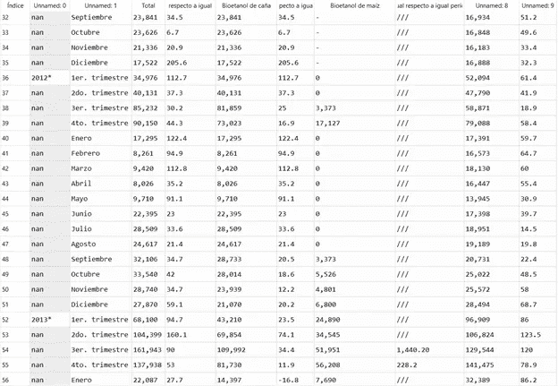
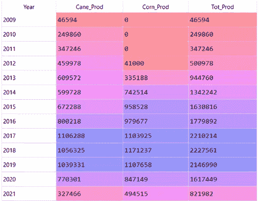
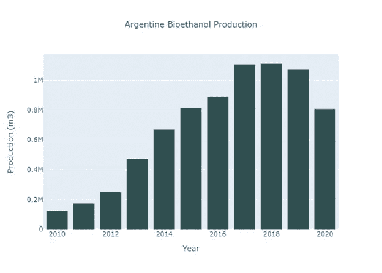
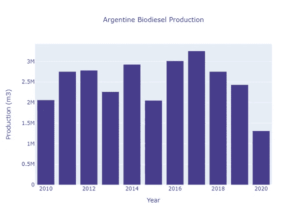
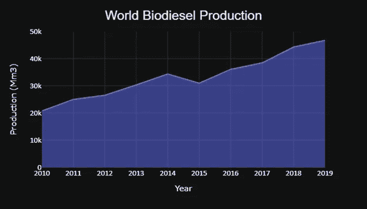
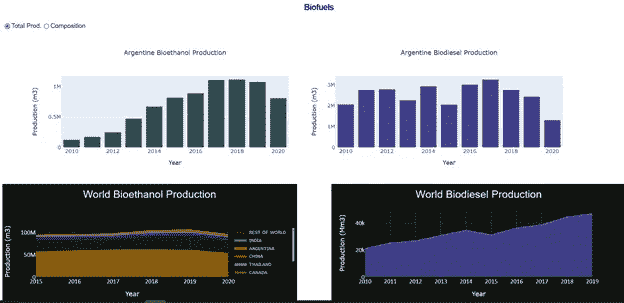
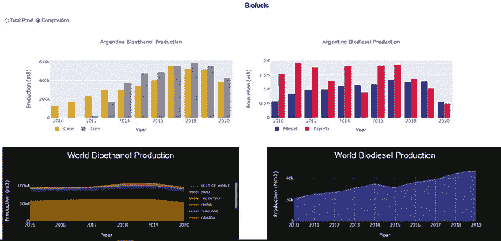

# 用虚线绘制图表

> 原文：<https://towardsdatascience.com/charting-with-plotly-dash-ee9334441c11?source=collection_archive---------20----------------------->

## **2:用于转换的单选项目**


由[马腾·范登赫维尔](https://unsplash.com/@mvdheuvel?utm_source=medium&utm_medium=referral)在 [Unsplash](https://unsplash.com?utm_source=medium&utm_medium=referral) 上拍摄的照片

# **生物燃料**

生物燃料无疑是取代目前用于车辆推进的化石燃料的最有吸引力和最实用的选择。**生物乙醇**和**生物柴油**从富含糖类和淀粉的农作物中提取，具有减少二氧化碳排放和缓解**气候变化不利影响的潜力。**

阿根廷的生物燃料部门在过去十年中发展迅速，成为国民经济中一项非常活跃的活动，也是生产发展的一个有趣案例。

在阿根廷，生物柴油完全是以大豆为原料生产的，大豆油是制造这种生物燃料的主要原料。生物柴油的生产吸引了大量国内外投资，在阿根廷生产链中加入了一个新的环节，将生产分为国内市场和出口市场。

阿根廷的生物乙醇生产以糖蜜为基础，糖蜜是**制糖**的副产品，直接来自**甘蔗**(*Sacharum officinarum L*)和谷物，主要是**玉米** ( *玉蜀黍*)。液体生物燃料的产生对甘蔗转化链是一个有价值的补充。

# **仪表盘应用**

在[之前的一篇文章](/charting-with-plotly-dash-fa96c171409b)中，我们讨论了 Dash 的基本特性:一个开源的免费库，麻省理工学院许可的 python 框架，广泛用于创建基于 web 的、可定制的、交互式的、响应性强的仪表盘和 dataviz 应用程序。

Dash 主要基于 ReactJS，Flask，和 Plotly。Dash 建立在 ReactJS 的顶部作为前端；它使用 Flask 作为后端，Plotly 作为数据可视化工具。

如[上一篇文章](/charting-with-plotly-dash-fa96c171409b)所述，Dash 包括三个主要的库:(1) *dash_html_components* ，它提供了多种 html 标签的 python 版本，可以在标题、段落、图形等应用中使用。；(2) *dash_core_components* ，提供下拉菜单、单选按钮、图表、滑块、按钮等多种元素；(3)*dash _ bootstrap _ components，*用于样式化用户界面。

本质上，Dash 应用程序( **Dash Apps** )由两部分组成:(1)描述应用程序外观的应用程序的“*布局*”和(2)允许应用程序交互的“*回调*”。

我们的仪表板外观(我们的布局)由以下内容组成:在左上角，一个条形图显示了阿根廷的生物乙醇总产量，另一个图表(转换)显示了甘蔗产量和玉米产量之间的比例。在右上角，一个条形图显示了阿根廷的生物柴油总产量，另一个图表(转换)显示了出口和国内市场产量之间的关系。在左下方，我们包括了一个堆积面积图，显示了 2015 年至 2020 年期间主要生物乙醇生产国的发展情况。最后，在我们布局的右下方，我们包括了一个面积图，显示了 2010 年至 2019 年期间世界生物柴油生产的发展。

我们的仪表板的转换是通过使用由 *dash_core_components* 库提供的组件 *RadioItems* 来实现的。功能 *dcc。来自 Dash 库 *dash_core_components* 的 RadioItems()* 允许我们**呈现一组复选框。我们必须编写类似 dcc 的代码。放射性项目(选项=[{}..]，value=) ，其中*选项*是带有*键*的*字典*列表，*值*是当前选择的值。**

Dash App 的交互性是通过使用**回调函数**来实现的。在我们的仪表板中，我们必须创建一个回调函数来指示哪些图表显示在布局的顶部。如前一篇文章所述，回调函数有两个主要部分:(1)装饰器，使用 *@app.callback()* 初始化；(2)用 *def* 关键字初始化的函数。

# **带破折号的图表**

我们与四个**公共领域数据集** : (1)阿根廷，系列 Históricas，Indicadores del Sector energyético，Biocombustibles，Cuadro 3.1: [生物柴油；](https://www.indec.gob.ar/indec/web/Nivel4-Tema-3-36-145) (2)阿根廷，Históricas 系列，能源部门指数，生物燃料，Cuadro 3.2: [生物乙醇](https://www.indec.gob.ar/indec/web/Nivel4-Tema-3-36-145)；(3) [世界燃料乙醇年产量；](https://ethanolrfa.org/markets-and-statistics/annual-ethanol-production) (4) EIA，美国能源信息署，国际，[生物燃料](https://www.eia.gov/international/data/world/biofuels/more-biofuels-data)。

首先，我们将 Pandas 库导入为 pd，将 Plotly Express 导入为 px，将 plotly.graph_objects 导入为 go，并将我们的第一个 csv 文件转换为 dataframe:

```
import pandas as pd
import plotly.express as px
import plotly.graph_objects as go# Step 1: Argentine bioethanol production (units in m3)
df_bioet = pd.read_csv(path + 'produccion_de_bioetanol.csv', 
                       index_col = False,  sep = ';',
                       engine = 'python',
                       header = 1, skiprows = 2, skipfooter = 3)
```

下面这张截图( *df_bioet* )展示了一个**数据科学家最糟糕的噩梦**:一个数据帧，有缺失数据、冗余数据、重复数据、缺失列名、列名不一致、奇怪字符等。



因此，我们必须努力将其转换为适合制图的数据框架:

```
df_bioet = df_bioet.drop(0)df_bioet.columns = ['Year','Period', 'Tot_Prod', 'Perc_Tot', 'Cane_Prod','Perc_SCT', 'Corn_Prod', 'Perc_Corn', 'Market', 'Perc_Mkt']cols_to_drop = ['Perc_Tot', 'Perc_SCT', 'Perc_Corn', 'Perc_Mkt']df_bioet = df_bioet.drop(cols_to_drop, axis = 1)
df_bioet['Year'] = df_bioet['Year'].str.replace('*', ' ')df_bioet['Tot_Prod']   = df_bioet['Tot_Prod'].str.replace(',', '')
df_bioet['Cane_Prod']  = df_bioet['Cane_Prod'].str.replace(',', ''
df_bioet['Corn_Prod']  = df_bioet['Corn_Prod'].str.replace(',', '')
df_bioet['Corn_Prod']  = df_bioet['Corn_Prod'].str.replace('-', '0')
df_bioet['Market']     = df_bioet['Market'].str.replace(',', '')
df_bioet['Market']     = df_bioet['Market'].str.replace('-', '0'
df_bioet.reset_index()f = df_bioet['Year'].notnull()
serie = df_bioet.loc[f, "Year"] = df_bioet['Year'].ffill()
df_bioet['Year'] = seriedf_bioet['Year']      = df_bioet['Year'].astype(int)
df_bioet['Tot_Prod']  = df_bioet['Tot_Prod'].astype(int)
df_bioet['Cane_Prod'] = df_bioet['Cane_Prod'].astype(int)
df_bioet['Corn_Prod'] = df_bioet['Corn_Prod'].astype(int)
df_bioet['Market']    = df_bioet['Market'].astype(int)
df_bioet['Period']    = df_bioet['Period'].apply(str)tipo1 = df_bioet.dtypespvt1 = pd.pivot_table(df_bioet, index = ['Year'],
                values = ['Tot_Prod','Cane_Prod','Corn_Prod' ],
                aggfunc = 'sum')
```

以下截图对应于名为 *pvt1* 的数据帧:



数据框架中仍有一些干预措施:将生产值减半(它们在原始文件中是重复的)并删除 2009 年和 2021 年的记录，因为这两个记录都不完整:

```
pvt2 = pvt1/2
pvt2 = pvt2[1:]
pvt2 = pvt2[:-1]pvt2.reset_index(level = 0, inplace = True)
```

现在我们为图表做好了准备。一个[标准条形图](https://medium.com/nightingale/bar-graphs-why-how-8c031c224c9f)是我们讲故事最符合逻辑的选择。

```
# First Figure: Total Argentine Bioethanol Production fig1 = go.Figure(data=[go.Bar(x=pvt2['Year'], y= pvt2['Tot_Prod'],
                       marker_color = 'DarkSlateGrey')])fig1.update_layout(title= {'text':"Argentine BioethanolProduction",
                           'font': {'size': 15}},
                   title_x = 0.5,
                   xaxis_title= 'Year', 
                   yaxis_title = 'Production (m3)',
                   width =  700, height = 500)
```



图 1:阿根廷生物乙醇的生产。作者用 Plotly 制作的图表。

绘制阿根廷生物柴油生产图表的 ETL 过程与之前的过程完全相似，在初始数据库中存在相同的问题，并且增加了单位转换(从吨到立方米)。

```
# Step 2: Argentine biodiesel production (values in tons)df_biodsl = pd.read_csv(path + 'produccion_de_biodiesel.csv',
                        index_col = False,  sep = ';', 
                        engine = 'python',header = 1, 
                        skiprows = 1, skipfooter = 4)df_biodsl = df_biodsl.drop(0)
df_biodsl.columns = ['Year','Period', 'Tot_Prod',
                     'Perc_Tot', 'Market',
                     'Perc_Mkt', 'Export', 'Perc_Exp']cols_to_drop = ['Perc_Tot', 'Perc_Mkt', 'Perc_Exp']df_biodsl = df_biodsl.drop(cols_to_drop, axis = 1)df_biodsl['Year']    = df_biodsl['Year'].str.replace('*', ' ')
df_biodsl['Tot_Prod']= df_biodsl['Tot_Prod'].str.replace(',', '')
df_biodsl['Export']  = df_biodsl['Export'].str.replace(',', '')
df_biodsl['Export']  = df_biodsl['Export'].str.replace('-', '0')
df_biodsl['Export']  = df_biodsl['Export'].str.replace('s', '0')
df_biodsl['Market']  = df_biodsl['Market'].str.replace(',', '')
df_biodsl['Market']  = df_biodsl['Market'].str.replace('-', '0')
df_biodsl.reset_index()f = df_biodsl['Year'].notnull()
serie = df_biodsl.loc[f, 'Year'] = df_biodsl['Year'].ffill()
df_biodsl['Year'] = seriedf_biodsl['Year']      = df_biodsl['Year'].astype(int)
df_biodsl['Tot_Prod']  = df_biodsl['Tot_Prod'].astype(int)
df_biodsl['Export']    = df_biodsl['Export'].astype(int)
df_biodsl['Market']    = df_biodsl['Market'].astype(int)
df_biodsl['Period']    = df_biodsl['Period'].apply(str)
tipo2 = df_biodsl.dtypespvt3 = pd.pivot_table(df_biodsl, index = ['Year'],
                      values = ['Tot_Prod','Export','Market' ],
                      aggfunc = 'sum')pvt4 = pvt3/2
pvt4 = pvt4[:-1]# From tons to cubic meters
pvt4[['Tot_Prod','Export','Market']]=
               pvt4[['Tot_Prod','Export','Market']]* 1.1325
pvt4.reset_index(level = 0, inplace = True)
```

同样，标准条形图[是我们讲故事的最合理选择:](https://medium.com/nightingale/bar-graphs-why-how-8c031c224c9f)

```
# Third Figure: Total Argentine Biodiesel Productionfig3 = go.Figure(data=[go.Bar(x= pvt4['Year'], y= pvt4['Tot_Prod'],
                              marker_color = 'DarkSlateBlue')])fig3.update_layout(title={'text': "Argentine Biodiesel Production ",
                          'font': {'size': 15}},
                   title_x = 0.5,
                   xaxis_title = 'Year',
                   yaxis_title = 'Production (m3)',
                   width =  700, height = 500)
```



图 2:阿根廷生物柴油的生产。作者用 Plotly 制作的图表。

下图与世界乙醇产量有关。我们决定用[堆积面积图](/area-charts-standard-stacked-overlapping-d9b77df5dec8)来表示两个是主要生产国，占全球产量的 85%以上。

```
## Step 3: World Bioethanol production (values in Mgal)df_wrld_et = pd.read_csv(path + 'world_ethanol.csv',
                         index_col = False,  sep = ';',
                         engine = 'python',
                         header = 0, skipfooter = 3)df_wrld_et_T = df_wrld_et.transpose()
df_wrld_et_T.columns = df_wrld_et_T.iloc[0]
df_wrld_et_T = df_wrld_et_T[1:]
df_wrld_et_T.index.names = ['Year']
df_wrld_et_T.reset_index(level = 0, inplace = True)# Sixth figure: stacked area chart for world bioethanol production
# 3785.4411 is the factor of conversion from Mgal to cubic meterfig6 = go.Figure()
fig6.add_trace(go.Scatter(x = df_wrld_et_T['Year'],
                          y = df_wrld_et_T['USA']*3785.4411,
                          name = 'USA',
                          mode = 'lines', 
                          line=dict(width=0.5, color='orange'),
                          stackgroup = 'one'))fig6.add_trace(go.Scatter(x= df_wrld_et_T['Year'],
                          y= df_wrld_et_T['BRAZIL']*3785.4411,
                          name = 'BRAZIL',
                          mode = 'lines', 
                          line=dict(width=0.5,color='darkgreen'),
                          stackgroup = 'one'))fig6.add_trace(go.Scatter(x=df_wrld_et_T['Year'],
                         y=df_wrld_et_T['EUROPEAN UNION']*3785.4411,
                         name = 'EUROPEAN UNION',
                         mode = 'lines', 
                         line=dict(width=0.5, color='blue'),
                         stackgroup = 'one')fig6.add_trace(go.Scatter(x= df_wrld_et_T['Year'], 
                          y=df_wrld_et_T['CANADA']*3785.4411,
                          name = 'CANADA',
                          mode = 'lines',  
                          line=dict(width=0.5,color='crimson'),
                          stackgroup = 'one'))fig6.add_trace(go.Scatter(x=df_wrld_et_T['Year'],
                          y=df_wrld_et_T['THAILAND']*3785.4411,
                          name = 'THAILAND',
                          mode = 'lines',
                          line=dict(width=0.5,color='lightblue'),
                          stackgroup = 'one'))fig6.add_trace(go.Scatter(x = df_wrld_et_T['Year'],
                          y=df_wrld_et_T['CHINA']*3785.4411,
                          name = 'CHINA',
                          mode = 'lines', 
                          line=dict(width=0.5, color='red'),
                          stackgroup = 'one'))fig6.add_trace(go.Scatter(x=df_wrld_et_T['Year'],        
                          y=df_wrld_et_T['ARGENTINA']*3785.4411,
                          name = 'ARGENTINA',
                          mode = 'lines', 
                          line=dict(width=0.5, color='yellow'),
                          stackgroup = 'one'))fig6.add_trace(go.Scatter(x = df_wrld_et_T['Year'], 
                          y=df_wrld_et_T['INDIA']*3785.4411 ,
                          name = 'INDIA',
                          mode = 'lines', 
                          line=dict(width=0.5, color='darkgrey'),
                          stackgroup = 'one'))fig6.add_trace(go.Scatter(x=df_wrld_et_T['Year'],
                         y=df_wrld_et_T['REST OF WORLD']*3785.4411,
                         name = 'REST OF WORLD',
                         mode = 'lines',
                         line=dict(width=0.5, color='darkred'), 
                        stackgroup = 'one'))fig6.update_layout(template = 'plotly_dark',
              title = dict(text = "World Bioethanol Production ",
              x = 0.5, y = 0.95),
              title_font= dict(family = 'Arial', size = 25),
              font = dict(size = 10, family = 'Verdana'),
              hovermode = False,
              width  = 700, height = 400)fig6.update_xaxes(title_text = 'Year',
        title_font=dict(size =15, family='Verdana', color='white'),
        tickfont=dict(family='Calibri', color='white', size=15))fig6.update_yaxes(title_text = "Production (m3)",
        title_font=dict(size=15, family='Verdana', color='white'),
         tickfont=dict(family='Calibri', color='white', size=15))
```


图 3:世界生物乙醇产量。作者用 Plotly 制作的图表。

最后，我们使用[面积图](/area-charts-with-plotly-express-510a1f12ac11)展示了生物柴油的世界产量。同样，我们有 ETL 任务，包括列转置、列重命名和行删除。我们还必须将每天数百万桶原油转换成立方米。

```
## Step 4: World Biodiesel productiondf_wrld_di = pd.read_csv(path + 'world_biodiesel.csv',
                         index_col = False,  sep = ';', 
                         engine = 'python', header = 1)df_wrld_di = df_wrld_di.iloc[0:2]
df_wrld_di = (df_wrld_di.iloc[1: , : ]).set_index("API")
lista = df_wrld_di.columns.values.tolist()
df_wrld_di_T = df_wrld_di.transpose()
df_wrld_di_T['Year'] = lista
df_wrld_di_T = df_wrld_di_T.iloc[11:22]
df_wrld_di_T.rename(columns={'INTL.81-1-WORL-TBPD.A': 'DieselProd'}, inplace=True)# conversion from Mb/d to cubic meterdf_wrld_di_T['DieselProd']= df_wrld_di_T['DieselProd'].astype(float)df_wrld_di_T[['DieselProd']] = df_wrld_di_T[['DieselProd']]*365 * 0.158990df_wrld_di_T['DieselProd'] = df_wrld_di_T['DieselProd'].round(2)df_wrld_di_T.reset_index(drop = True, inplace = True)# Seventh figure: area chart for world biodiesel productionfig7 = px.area(df_wrld_di_T, x = 'Year', y = 'DieselProd')fig7.update_layout(template = 'plotly_dark',
             title = dict(text = "World Biodiesel Production",
             x = 0.5, y = 0.95),
             title_font= dict(family = 'Arial', size = 25),
             width = 700, height = 400)fig7.update_xaxes(title_text = 'Year',
      title_font=dict(size=15, family='Verdana', color='white'),
      tickfont=dict(family='Calibri', color='white', size=15))fig7.update_yaxes(title_text = "Production (Mm3)", 
                  range = (0, 50000),
      title_font=dict(size=15, family='Verdana', color='white'),
      tickfont=dict(family='Calibri', color='white', size=15))
```



图 4:世界生物柴油产量。作者用 Plotly 制作的图表。

现在，是时候对仪表板进行编码了。

我们假设您安装了 Dash 如果没有，遵循这些[指令](https://dash.plotly.com/installation)。

首先需要导入一些库:dash，主库；*dash _ html _ components(*html)*用于构建布局；dash _ core _ components(*DCC*)来呈现一组复选框和 plotly 图形；*输出，输入*函数来自模块 dash.dependencies 进行回调。*

```
*import dash
from dash import html
from dash import dcc
from dash.dependencies import Output, Input*
```

**dcc.graph* 组件有三个参数:(1) *id* ，每个图的唯一标识符；(2) *图*，每一个 plotly 图的具体名称；(3) *style* ，字典定义了图的某些方面如宽度和高度。*

*以下代码描述了该应用程序的外观。*

```
*external_stylesheets= ['https://codepen.io/chriddyp/pen/bWLwgP.css']app = dash.Dash(__name__, external_stylesheets=external_stylesheets)app.layout = html.Div(children =[
                html.Div([
                   html.H1(children = 'Biofuels',
                           style = {'textAlign':'center',  
                                    'color':'darkblue',
                                    'fontSize'  : '30px',
                                    'fontWeight': 'bold'}
                           ), html.Div([
                dcc.RadioItems(id ='radio1',
                               options =
                   [{'label': 'Total Prod.  ', 'value': 'figT'},
                   {'label': 'Composition',   'value': 'figC'},],
                               value ='figT',
                             labelStyle ={'display': 'inline-flex'}                              ), html.Div([
                 dcc.Graph(id = 'A-ethanol-graph', figure = fig1,
                         style={'width': '80vh', 'height': '40vh',
                                'display': 'inline-block'}),
                          ], className = 'five columns'), html.Div([
                 dcc.Graph(id = 'A-biodiesel-graph', figure = fig3,
                        style={'width': '80vh',
                               'display': 'inline-block'}),
                          ], className = 'six columns'), ],className='row'), html.Div([
                html.Div([
                  dcc.Graph(id = 'W-ethanol-graph', figure = fig6,
                         style={'width': '80vh', 'height': '10vh',
                                'display': 'inline-block'}),
                          ], className = 'six columns'), html.Div([
                  dcc.Graph(id = 'W-biodiesel-graph', figure = fig7,
                            style={'width': '80vh',
                                   'display': 'inline-block'}),
                         ], className = 'six columns'), ]),
               ]),
        ])*
```

*现在，是回调的时候了。我们有一个输入:组件的值 *dcc。放射性同位素*；和两个输出:(1)生物乙醇和生物柴油总产量的标准柱状图(*图 1* & *图 3* )。(2)一个[分组柱状图](/clustered-overlapped-bar-charts-with-plotly-express-c752d2925cf1) ( *图 2* )显示甘蔗和玉米的生物乙醇产量，另一个分组柱状图(*图 4* )显示出口和国内市场的生物柴油产量。*

```
*@app.callback(Output('A-ethanol-graph',  'figure'),
              Output('A-biodiesel-graph','figure'),
          [Input(component_id='radio1', component_property='value')]
              )def build_graph(value):
    if value == 'figT':
       fig1 = go.Figure(data=[
                 go.Bar(x=pvt2['Year'], y= pvt2['Tot_Prod'],
                        marker_color = 'DarkSlateGrey')]) fig1.update_layout(title=
                        {'text': "Argentine Bioethanol Production",                               
                                'font': {'size': 15}},
                   title_x = 0.5,
                   xaxis_title = 'Year', 
                   yaxis_title = ' Production (m3)',
                   width =  700, height = 350) fig3 = go.Figure(data=[
          go.Bar(x= pvt4['Year'], y= pvt4['Tot_Prod'],
                 marker_color = 'DarkSlateBlue')]) fig3.update_layout(title =
                      {'text' : "Argentine Biodiesel Production ",  
                                'font': {'size': 15}},
                    title_x = 0.5,
                    xaxis_title = 'Year', 
                    yaxis_title = 'Production (m3)',
                    width =  700, height = 350) return fig1, fig3,else:
       fig2 = go.Figure(data=[
                go.Bar(name='Cane',
                       x=pvt2['Year'],y = pvt2['Cane_Prod'],
                       marker_color = 'goldenrod'),
                go.Bar(name='Corn',
                       x=pvt2['Year'], y= pvt2['Corn_Prod'],  
                       marker_color = 'lightslategray')]) fig2.update_layout(barmode='group') fig2.update_layout(title = 
                    {'text' : "Argentine Bioethanol Production ",   
                              'font': {'size': 15}},
                          title_x = 0.5,
                          xaxis_title = 'Year',
                          yaxis_title = 'Production (m3)',  
                          legend=dict(orientation="h"),
                          width = 700, height = 350)## Fourth Figure: Biodiesel Production for Export or Internal Market fig4 = go.Figure(data=[
                 go.Bar(name='Market', 
                        x=pvt4['Year'], y= pvt4['Market'],
                        marker_color = 'darkblue'),
                 go.Bar(name='Exports',
                        x=pvt4['Year'], y= pvt4['Export'],
                        marker_color = 'crimson')]) fig4.update_layout(barmode='group') fig4.update_layout(title = 
                     {'text' : "Argentine Biodiesell Production ",   
                              'font': {'size': 15}},
                          title_x = 0.5,
                          xaxis_title = 'Year',
                          yaxis_title = 'Production (m3)',  
                          legend=dict(orientation="h"),
                          width = 700, height = 350) return fig2, fig4,* 
```

*运行服务器需要下面两行代码:*

```
*if __name__ == '__main__':
     app.run_server(debug = False, port = 8080)*
```

*你的屏幕上会出现下面一行: *Dash 正在*[http:*//127 . 0 . 0 . 1:8080/*](http://127.0.0.1:8080/)。将其复制到您的浏览器中，您将看到生物燃料仪表板。*

**

*图 5:生物燃料总产量。作者用 Dash 做的仪表盘。*

*点击单选按钮后，会出现“更改”屏幕:*

**

*图 6:转换屏幕。作者用 Dash 做的仪表盘。*

***总结一下**:仪表板的概念是在一个屏幕上显示与研究目标最相关的信息。*

*在我们的仪表板上，我们在第一个屏幕上显示了阿根廷生物乙醇和生物柴油的总产量，以及这两种生物燃料的全球产量。可以看出，这两种生物燃料的本地产量都有惊人的增长，尤其是在 2016 年至 2019 年期间。我们也可以估计一下阿根廷在世界市场上的产量。*

*在转换屏幕中，我们区分了从甘蔗生产的生物乙醇和从玉米生产的生物乙醇。由于生物柴油是在阿根廷由单一原料(大豆)生产的，因此我们区分了国内市场生产和出口生产。由此可见，2012 年之前以零玉米为主的产量，是如何在短短两年内成为主要原料的。截至 2018 年，生物柴油出口和国内市场之间的趋势也发生了重大变化。*

*platform Dash 允许我们轻松地创建一个交互式 web 应用程序来显示这些重要的信息。*

*如果你对这篇文章感兴趣，请阅读[我以前的](https://medium.com/@dar.wtz)(https://medium.com/@dar.wtz)*