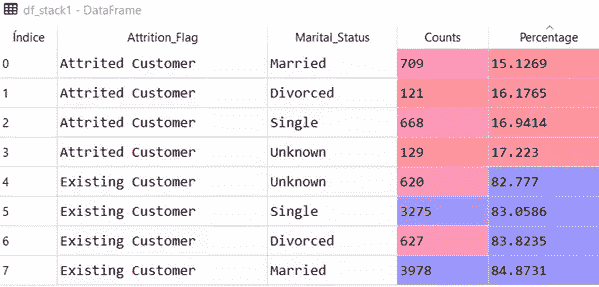
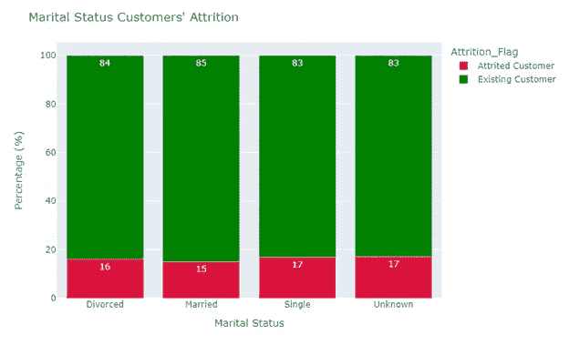
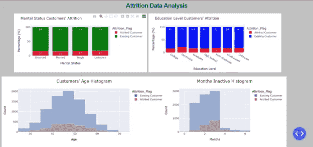
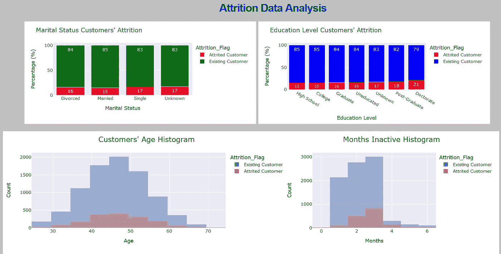

# 用虚线绘制图表

> 原文：<https://towardsdatascience.com/charting-with-plotly-dash-fa96c171409b?source=collection_archive---------19----------------------->

# **1:损耗模式**


[图片来自 Unsplash](http://istockphoto-1298240610-612x612)

# **破折号**

Dash 是位于加拿大蒙特利尔的技术计算公司 **Plotly** 创建的一个 **python 框架**。这是一个开源的、麻省理工学院许可的免费库，通过它你可以创建基于网络的、交互式的、可定制的、可响应的仪表盘和 dataviz 应用程序。

它的一个主要优势在于无需了解 HTML、CSS 或 Java 就可以创建 web 应用程序(尽管需要基础知识)。你不仅可以用 Python 创建 Dash 应用程序，还可以用 R、Julia 或. NET 创建 Dash 应用程序。Dash 非常简单，只需运行代码，dataviz 应用程序就会立即在 web 浏览器上显示出来。

# **带破折号的应用**

首先，我们必须设计未来应用程序的基本结构(**布局**)。这是至关重要的一步，因为它决定了我们演示的视觉效果。

在布局中，我们放置应用程序的组件。为此，我们使用了**两个库**:*dash _ core _ components*和 *dash_html_components。*最后一个提供了 **HTML 组件**:用于为 HTML 元素创建标题、段落、图像或**容器**的 HTML 标签的 python 版本。另一方面， *dash_core_components* 提供了**图形、** **下拉菜单、滑块、按钮、**等仪表盘常用组件。最后，我们必须配置一个样式属性，在这里我们定义一些 CSS 属性，比如字体大小、字体颜色、空白和其他与模板相关的方面。

还有一个名为 d*ash _ bootstrap _ components*的库，用于设计用户界面的样式，其有用性和适用性将在以后的文章中讨论。

如果你的 Dash 应用有**交互功能**，你需要编写一个*回调函数*。回调函数有两个部分:

1.decorator，使用 *@app.callback()* 初始化；

2.-用 *def* 初始化的函数定义。

在装饰器中，我们指出了可以被用户修改的输入组件和显示应用程序对输入变化的反应的输出组件。在用 *def* 关键字初始化的函数中，我们编写了接受输入变化并返回相应输出的逻辑。

# **行动图表:损耗模式**

损耗率(**流失率，客户流失率**)是客户停止与特定商业实体做生意的比率。这是一项业务指标，计算在给定时间内停止购买特定公司产品或服务的客户数量除以剩余客户总数。损耗率是许多公司最重要的 [**关键绩效指标**](https://www.investopedia.com/terms/k/kpi.asp)(KPI)之一，因为它可以用来预测公司的增长或衰退。

跟踪流失率至关重要，但分析数据对于**发现模式** **解决造成流失的动机**也非常重要。这些模式可能与人口统计学有关，也可能出于经济原因。****使这些模式可视化的仪表板**将允许公司通过根据人口统计或群体划分现有客户来组织营销活动。这样，就有可能激活个性化消息或特定促销来降低流失率。**

**为了创建具有这些功能的仪表板，我们从 Kaggle 下载了一个[数据集，该数据集由 10，000 名银行客户组成，显示了一个**流失标志**(现有客户与流失客户)，人口统计数据:客户年龄；性别；教育水平；婚姻状况和财务数据:收入类别；卡片类别；与银行的关系期限、闲置月份等。](https://www.kaggle.com/sakshigoyal7/credit-card-customers)**

**我们决定绘制四个图表来回答以下问题:**

*   **1)婚姻状况和减员情况有关系吗？**
*   **2)受教育程度与减员情况有关系吗？**
*   **3)客户的年龄和减员情况有关系吗？**
*   **4)帐户不活动与流失情况之间有什么关系吗？**

**让我们做一个仪表盘来回答这些问题。**

# ****带破折号的图表****

**Dash 库`*dash_core_components*`中的函数`*dcc.Graph()*`允许我们绘制图形。我们必须编写类似于`*dcc.Graph(figure=fig*)`的代码，其中`*figure*` 是函数的参数， `*fig*` 是用**Plotly Express***(Plotly 图形库)制作的图表。***

***首先，我们将 Pandas 库导入为 *pd，*plot Express 为 *px，*并将我们的 *csv 文件*转换为 dataframe:***

```
*import pandas as pd
import plotly.express as pxpath = 'your path'
df = pd.read_csv(path + 'CreditCardCustomersCols.csv', 
                 index_col = False, header = 0, sep = ';',   
                 engine='python')*
```

***我们的第一个图表是一个 [100%堆积条形图](http://Stacked Bar Graphs, Why & How. Storytelling & Warnings | by Darío Weitz | Towards Data Science)，根据客户的婚姻状况显示流失客户的百分比。我们选择列`'Attrition_Flag'` 和 `'Marital_Status'` 将数据集中的记录从长格式转换为宽格式。然后，我们使用函数`*size(*)` 和函数`lambda`来计算相应的百分比。***

```
*df_stack1 = df.groupby(['Attrition_Flag', 
                        'Marital_Status']).size().reset_index()df_stack1['Percentage'] =     df.groupby(['Attrition_Flag','Marital_Status']).size().groupby(level=1).apply(lambda x:100 * x/float(x.sum())).valuesdf_stack1.columns= ['Attrition_Flag', 'Marital_Status', 
                    'Counts', 'Percentage']*
```

***下面的屏幕截图显示了名为 df_stack1 的数据集的记录:***

******

***我们使用`px.bar()`和`barmode = 'stack'`生成了一个用 [Plotly 表示的 100%堆积条形图](http://Stacked Bar Charts with Plotly Express | by Darío Weitz | Towards Data Science)(图 1):***

```
*fig1 = px.bar(df_stack1, x = 'Marital_Status', y = 'Percentage',
              color = 'Attrition_Flag', 
              color_discrete_sequence=["crimson", "green"],
              barmode = 'stack', text = 'Percentage')fig1.update_layout(title = "Marital Status Customers' Attrition",
                   xaxis_title = 'Marital Status', 
                   yaxis_title = 'Percentage (%)',width = 800)fig1.update_traces(texttemplate='%{text:.2s}',textposition='inside')*
```

******

***图 1:作者用 Plotly Express 制作的 100%百分比堆积条形图。***

***仪表板中的第二个图表(`fig2`)是另一个 100%堆积条形图，根据客户的**教育水平显示流失客户的百分比。**代码是相同的，除了我们用原始数据帧中的 `‘Education Level’`列替换了`‘Marital_Status’` 列。***

***我们决定使用[重叠直方图](/histograms-why-how-431a5cfbfcd5)来回答问题 3 & 4。***

***因此，仪表板的第三个图表(`fig3a`)是一个[图表，显示了现有客户和流失客户的年龄频率分布。](http://Histograms with Plotly Express. Themes & Templates | by Darío Weitz | Towards Data Science)***

***我们使用`px.histogram()`和`barmode = ‘overlay’`生成了 Plotly Express 重叠直方图(图 2):***

```
*df3a = df[df['Attrition_Flag'] == 'Existing Customer']
df3b = df[df['Attrition_Flag'] == 'Attrited Customer']fig3a = px.histogram(df3a, x="Customer_Age", 
                     nbins = 10, barmode = 'overlay',
                     template = 'seaborn', color = 'Attrition_Flag')fig3b = px.histogram(df3b, x="Customer_Age", 
                     nbins = 10, barmode = 'overlay',
                     template = 'ggplot2', color = 'Attrition_Flag')fig3a.add_trace(fig3b.data[0])fig3a.update_layout(title = "Customers' Age Histogram",
                    title_font_size = 20,
                    xaxis_title = "Customers' Age", 
                    yaxis_title = 'Count',
                    width = 800, height = 350)*
```

******

***图 2:作者用 Plotly Express 制作的重叠直方图。***

***仪表板中的最后一个图表(`fig4a`)是另一个重叠的直方图，比较了现有客户和流失客户的账户不活跃的月数。代码与前一个完全相同，只是我们使用了原始 dataframe 中的`*'Months_Inactive_12_mon’*` 列。***

***现在，该是仪表板的时候了。***

***我们假设您安装了 Dash 如果没有，请遵循这些[说明。](https://dash.plotly.com/installation)***

***首先，我们需要导入三个必要的库:`dash`，主库；*dash _ html _ components(`html`)用于构建布局；dash_core_components ( `dcc`)使用 `*graph*`组件渲染 plotly 图形。****

```
**import dashfrom dash import htmlfrom dash import dcc**
```

****接下来，我们必须通过创建一个**实例**来初始化仪表板。由于 Dash 应用程序使用 CSS 在 web 浏览器中呈现，因此我们包含了一个外部样式表(`‘https://codepen.io/chriddyp/pen/bWLwgP.css`’)****

```
**external_stylesheets =['https://codepen.io/chriddyp/pen/bWLwgP.css']app = dash.Dash(__name__, external_stylesheets=external_stylesheets)**
```

****然后我们必须定义我们的应用程序的布局，自然是用带有父组件`html.Div`的`app.layout`。前者是布局管理的**关键字**，后者是封装布局内多个组件的**容器**。****

****我们的计划是在顶部放置一个标题，然后放置 100%堆积条形图，在其下方放置重叠直方图。对应的 Dash 组件在容器 `html.Div` **的** `children` **属性中被表示为 **a 列表。********

****`dcc.graph`功能中的参数有:****

*   *****id:* 每个图形的唯一标识符(字符串)****
*   *****人物:*一个情节性人物的名字****
*   *****style* :定义(在我们的例子中)图形高度和宽度的字典****

```
**app.layout = html.Div(children = 
               [html.Div([
                  html.Div([
                     html.H1(children = 'Attrition Data Analysis',
                             style = {'textAlign' : 'center',          
                                      'fontSize'  : '30px', 
                                      'fontWeight': 'bold',
                  html.Div([
                              dcc.Graph(id = 'marit-graph', 
                                        figure = fig1,
                                        style={'width': '90vh', 
                                               'height': '40vh'}),
                           ], className = 'five columns'), html.Div([
                              dcc.Graph(id = 'educa-graph', 
                                        figure = fig2,
                                        style={'width': '90vh', 
                                                'height': '40vh'}),
                           ], className = 'six columns'), ],
                    className='row'), html.Div([html.Div([
                     html.H1(children = ''),
                     dcc.Graph(id = 'hisage-graph', figure = fig3a,
                               style={'width': '80vh', 
                                      'height': '10vh'}),
                                    ], className = 'six columns'), html.Div([html.Div([
                     html.H1(children = ''),
                     dcc.Graph(id = 'hisina-graph', figure = fig4a,
                               style={'width': '80vh', 
                                      'height': '10vh'}),
                                    ], className = 'six columns'), ]),
                   ]),
              ])**
```

****最后，我们添加以下两行代码来运行服务器:****

```
**if __name__ == '__main__':
     app.run_server(debug = True, port = 8080)**
```

****`debug=True`参数启用应用程序中的**热重装**选项。这是一个强烈推荐的选择，因为如果代码发生变化，应用程序会自动重新加载，而不需要重启服务器。****

****如果一切正常，应用程序运行，屏幕上将显示几行。我们真正感兴趣的行应该如下所示:****

*****Dash 正在 http://127.0.0.1:8080/* 上运行****

****在您的网络浏览器中复制 url，您将看到图表仪表板。****

********

****图 3:作者用 Plotly Dash 制作的仪表盘。****

****可以看出，流失情况和银行客户的婚姻状况之间似乎没有明显的关系。客户年龄或账户闲置时间也没有显示出它们是流失的原因。****

****为了分析教育水平和损耗状况之间是否存在任何关系，我们使用`ascending = True.`对相应的数据帧进行了排序。热重装选项允许我们立即获得以下仪表板:****

********

****图 4:作者用 Plotly Dash 制作的仪表盘。****

****似乎受教育程度较高的顾客比受教育程度较低的同行更不满意。然而，应该进行适当的统计研究来证实这一说法。****

****Dash 使我们能够轻松地生成一个应用程序，让我们能够搜索流失背后的原因。不幸的是，分析的变量似乎都不是我们要寻找的答案。在以后的文章中，我们将分析原始数据框架中包含的任何其他金融变量是否是答案。****

****如果你对这篇文章感兴趣，请阅读我之前的文章:(**https://medium.com/@dar.wtz**):****

****“平行坐标标绘有 Plotly，规范化还是标准化？****

****[](/parallel-coordinates-plots-with-plotly-dffe3f526c6b) [## 平行坐标用 Plotly 绘制

### 常态化还是标准化？

towardsdatascience.com](/parallel-coordinates-plots-with-plotly-dffe3f526c6b) 

饼图和甜甜圈图，带有 Plotly，Why & How

[](/pie-donut-charts-with-plotly-d5524a60295b) [## Plotly 的饼图和圆环图

### 为什么和如何

towardsdatascience.com](/pie-donut-charts-with-plotly-d5524a60295b)****