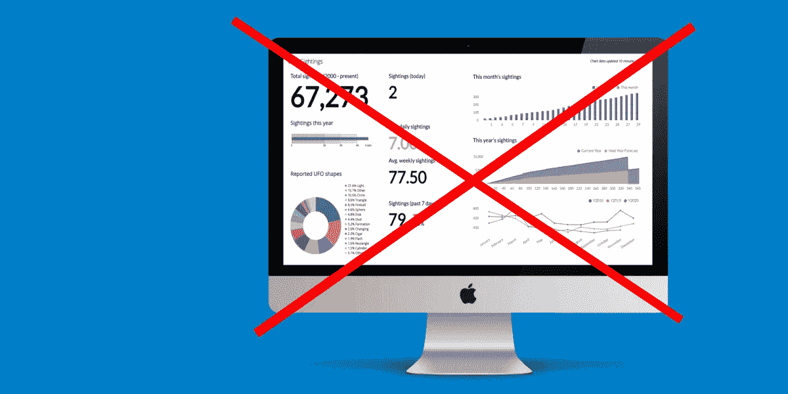
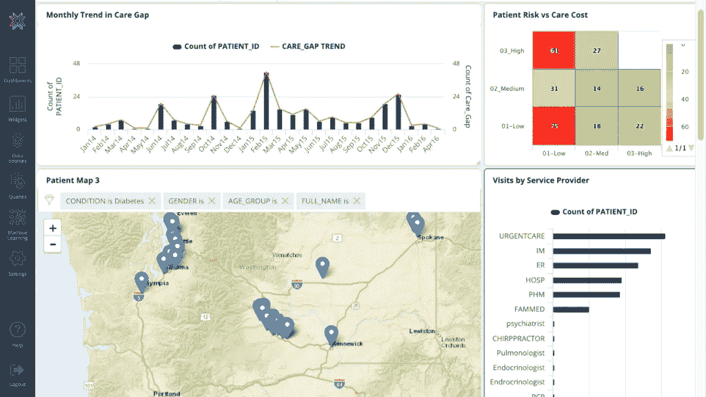
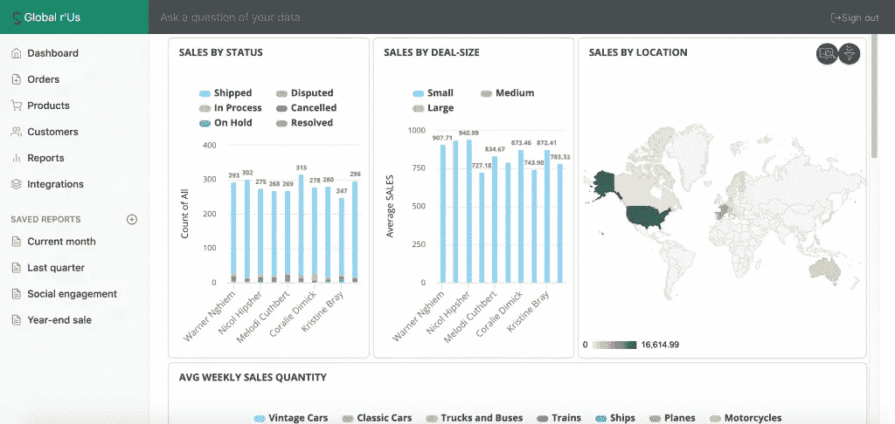
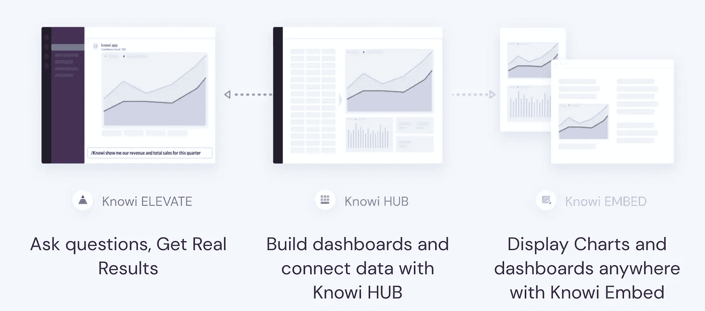
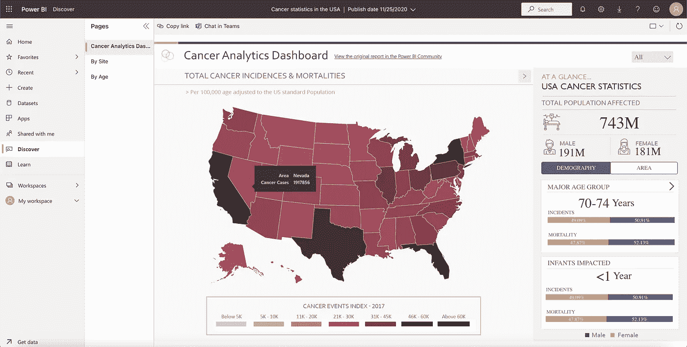
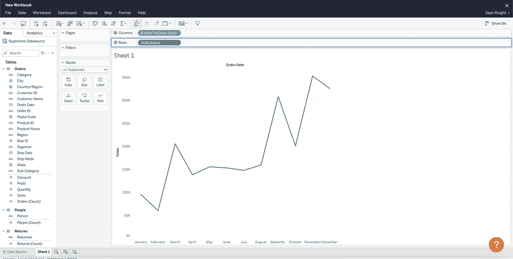
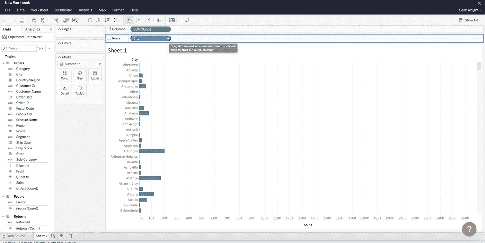

# Chartio 正在关闭:现在怎么办？

> 原文：<https://towardsdatascience.com/chartio-is-shutting-down-what-now-209c8a28d5b4?source=collection_archive---------28----------------------->

## 这里有 3 个可供分析平台转换的选项

Chartio 已加入 Atlassian，并将关闭 Chartio 分析平台(图片由作者提供)

你可能听说了，Chartio 被 Atlassian 收购了。收购完成后，看起来他们将淘汰许多公司已经依赖的分析平台。

当前客户将有一年的时间过渡到新的供应商，以满足他们的分析需求。以下是他们在公告/迁移指南中所说的内容:

> “如果你还没有看到[我们的公告](https://chartio.com/blog/atlassian/)，Chartio 已经加入 Atlassian，该产品将于 2022 年 3 月 1 日关闭。虽然我们对未来的新篇章感到兴奋，但我们理解这可能对您产生的影响，我们希望确保您拥有顺利过渡到 Chartio 所需的一切。”
> 
> —摘自 Chartio 网站上的公告/迁移指南

如果您是 Chartio 的现有客户，并且在想“哦，不！我现在该怎么办？”别担心，这里有三个可靠的分析平台可供选择。

# 1.Knowi

Knowi 中的仪表板(图片由作者提供)

Knowi 在商业情报界是一个不太知名的名字。他们的重点一直是产品开发和吸引技术受众，直到最近他们才开始成为 Tableau 和 Chartio 等公司的真正竞争对手。

Knowi 的分析平台由三部分组成:HUB、EMBED 和他们的最新产品 ELEVATE。

对于 Chartio 用户来说， **Knowi HUB** 与他们所熟悉的最为相似。Knowi HUB 拥有您期望从一个健壮的 BI 工具中获得的所有仪表板和图表构建功能。

**Knowi EMBED** 是一个版本，面向希望在自己的产品中嵌入 Knowi 分析平台的用户。对于希望向客户提供高级分析功能而无需从头构建自己的分析引擎的公司来说，这正成为 BI 工具中更常见的用例。

Knowi EMBED 的一个例子，用于将 Knowi 分析引擎插入基于网络的应用程序(作者截图)

Knowi ELEVATE 是该公司的最新产品，旨在解决试图成为数据驱动的公司普遍存在的用户采用问题。

Knowi ELEVATE 产品发布会

这是一个首席信息官和首席数据官都非常熟悉的故事:他们引入了一个新的分析平台，花了大量的预算和精力来构建仪表板和分析以帮助团队，然后没有人真正看他们构建的仪表板。这一点在销售团队中尤为突出，他们仍然依赖 Salesforce 做任何事情，即使它提供的分析较差。

Knowi ELEVATE 旨在通过将数据洞察放在人们已经在工作的地方来解决这个问题:Slack 和 ms 团队内部。这些洞察力来到用户面前，而不是用户需要去寻找它们。然后，用户可以通过用简单的英语提问来跟进，并获得回答他们问题的数据和图表。

Knowi 数据分析平台的三个部分:ELEVATE、HUB 和 EMBED(作者截图)。

## 定价

Knowi 对其产品使用企业定价，因此使用 Knowi 的成本将与 Tableau 相当，但比 Power BI 贵。虽然值得注意的是，Knowi 确实为早期创业公司提供折扣。

# 2.功率 BI

[Power BI](https://powerbi.microsoft.com/en-us/) 是微软知名的商业智能产品。在过去几年中，微软通过将 Power BI 捆绑为微软 Office 的一部分，并接近以前的铁杆 Excel 用户来帮助他们进行转换，从而获得了很多支持。

Power BI 示例仪表板(图片由作者提供)

以下是 Power BI 众所周知的一些特性:

*   简单的拖放界面。
*   无代码平台允许用户在 GUI 界面中做任何事情。
*   有桌面版和云版。
*   轻松集成到任何以 Microsoft/Windows 为中心的工作流中。
*   捆绑到 Office 365 中，因此您可能已经拥有许可证。

## 定价

如果你是 Chartio 的预算计划之一，这可能是你想看的地方，因为它是三个选项中最便宜的。合同可能有所不同，但据报道，Power BI 的成本约为每个用户每月 20 美元。

# 3.（舞台上由人扮的）静态画面

Tableau 于 2003 年在[推出，自此成为商业智能中 800 磅重的大猩猩——本质上定义了这个类别。](https://en.wikipedia.org/wiki/Tableau_Software)

Tableau 以其精美迷人的数据可视化和易于构建的拖放界面而闻名。Tableau 最初是一个桌面软件，你可以把它下载到你的电脑上，然后从那里运行(相对于基于云的软件)。此后，他们开发了 Tableau 的云版本，尽管他们的大多数用户仍然运行桌面版本。

显示图表的 Tableau 工作簿(图片由作者提供)

2019 年初，Salesforce 以价值超过 150 亿美元的纯股票交易收购了 Tableau。幸运的是，与 Chartio 目前的情况不同，Salesforce 似乎没有兴趣停止 Tableau analytics 产品。

在 Tableau 中按位置显示销售额(图片由作者提供)

# 包扎

这三个中的任何一个都可能是离开 Chartio 的好选择。如果您对价格敏感，Power BI 显然是最佳选择。如果你正在做老掉牙的分析过程，并且不介意潜在地使用桌面应用程序，Tableau 是一个不错的选择。如果您想要在团队中推动更高的参与度和采用率(Knowi ELEVATE)，需要嵌入仪表板(Knowi EMBED)，或者只是想要一个具有灵活本机集成的可靠的完全基于云的仪表板平台(Knowi HUB)，Knowi 是一个不错的选择。

# 关于作者

嗨，我是肖恩。我写数据科学、禁欲主义、创业成长，偶尔也写政治。我拥有物理学和数据科学两个学位，我曾在粒子加速器、美国宇航局 JPL 研究核反应堆工作过，现在我正处于创业阶段。

在推特和 T2【Linkedin】上找到我。