# 聊天机器人:一个完整的 PyCharm 应用程序(第 2 部分，共 3 部分:距离度量)

> 原文：<https://towardsdatascience.com/chatbot-a-complete-pycharm-app-part-2-of-3-distance-metric-46462a9ad4e4?source=collection_archive---------45----------------------->

## Chatterbot、Django、Python 和 PyCharm 都统一在这个随时可用的聊天机器人应用程序中


聊天和距离度量(图片由作者提供)

**动机:**

在[第一章](https://chatbotslife.com/chatbot-complete-pycharm-app-3517b64075f2)中，我们已经在 PyCharm 中成功构建了一个聊天机器人。现在是时候**训练**我们的聊天机器人回答常见问题了(FAQ，不管这些是你公司的什么)。在这个故事中，我们将学习如何做到这一点(在这种情况下，培训实际上意味着什么？)我们将深入了解为什么我们的聊天机器人**知道如何正确回答我们的问题。这样做的原因是，我们确实想尽可能创建最聪明的 FAQ 聊天机器人，所以现在让我们卷起袖子..**

**解决方案:**

在基于检索的聊天机器人模型中，类似 Levenshtein 或余弦相似性的试探法用于从预定义的**输入库中**选择**和**输出**。**这就构成了我们聊天机器人的**识**。这听起来像是显式的“if-else”编码，所以你可能会问，Chatterbot 中的机器学习在哪里？好吧，如果只是显式编码，这将意味着我们的聊天机器人将无法给出正确的答案，每次问的问题都与库的编码略有不同。简单地说，如果我们告诉我们的聊天机器人“彩色鞋子重要吗？”传统的编码是“当然，颜色让世界变得明亮”，那么如果一个英国人问我们“彩色的鞋子重要吗？”我们的聊天机器人将无法给出正确的答案。

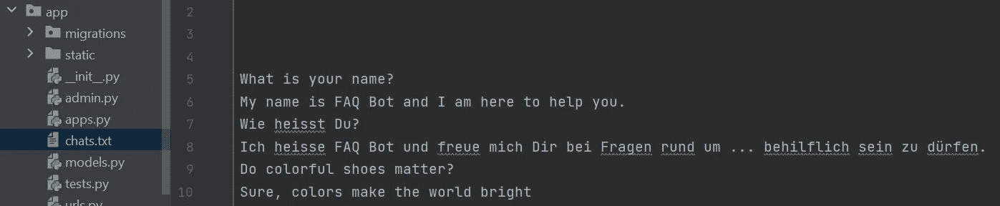

chats.txt 中的多语言问答映射

幸运的是，当我们使用 Chatterbot 时，我们不必硬编码数万亿条规则。但是我们使用 Chatterbot 的 Levenshtein 包来计算字符串之间的相似性(将用户的输入映射到我们的 FAQ 输入-输出 Chats.txt):

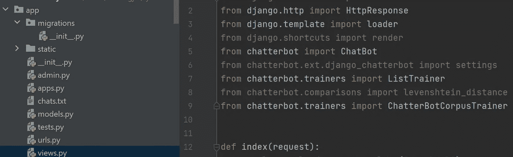

距离度量的 Levenshtein 和一般闲聊对话的语料库的导入。

我们的机器人将在 Chats.txt 文件和 Chatterbot 语料库上接受训练:

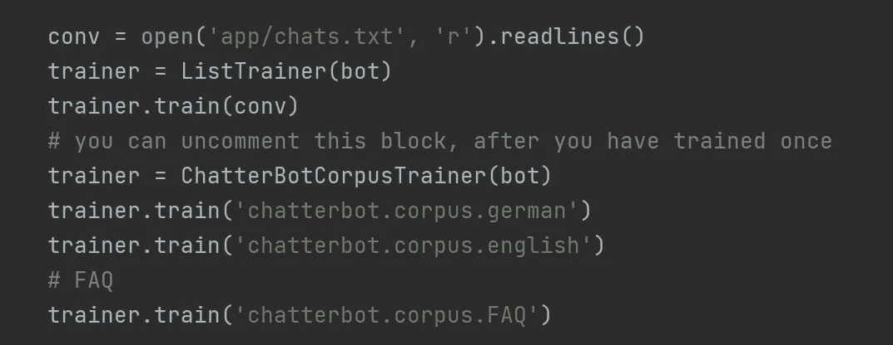

你可以在这里找到可用聊天机器人语料库的完整列表。

通过训练，我们确保机器人知道给出什么答案:

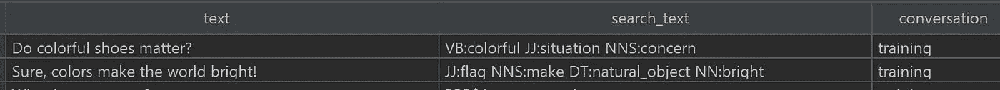

我们可以看到，由于 NLTK，甚至这个词的上下文都试图被理解。

所以当我们启动聊天机器人，问它一个问题:

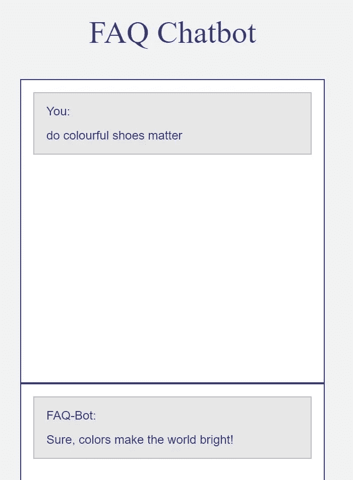

..聊天机器人会努力思考:

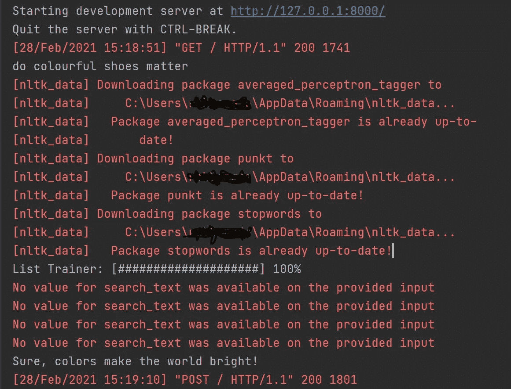

..并给出与该问题最相关的答案，例如使用 Levenshtein。

作为一次短暂的旅行，让我们理解一下 **Levenshtein** 基本上是如何坚持我们简单的“彩色鞋子”Jupyter 笔记本例子的。我们只需要导入:

```
import Levenshtein
```

..能够使用莱弗施泰因的距离函数。两个相同句子的结果显然是距离为 0，正如我们在示例中看到的:

```
Levenshtein.distance(
‘Do colorful shoes matter’,
‘Do colorful shoes matter’)
```

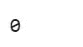

Levenshtein 距离为 0，因为两个句子是一样的。

现在让我们稍微修改一下这句话，这次用英国的“颜色”一词:

```
Levenshtein.distance(
‘Do colorful shoes matter’,
‘Do colourful shoes matter’)
```


Levenshtein 距离现在是 1，因为唯一的变化是字符“u”的颜色。

最后，如果我们在句尾再输入五个单词(包括两个空格)，我们得到的 Levenshtein 距离为 8:

```
Levenshtein.distance(
‘Do colorful shoes matter’,
‘Do colourful shoes matter at all’)
```

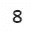

“u”和“根本”之差总共是 8。

Levenshtein(也称为编辑距离)对于比较单词或相似的句子非常有用。

相反，**余弦相似度**在比较差异更大的完整句子时有意义。如果我们在这些情况下坚持使用 **Levenshtein** ，Levenshtein 很可能会计算出一个相对较大的距离，尽管这两个句子传达了非常相似的关键信息:

```
Levenshtein.distance(
‘Do colorful shoes matter’,
‘At all, do colourful shoes really matter’)
```

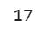

尽管两个句子的上下文非常相似，但还是相对较远。

由于 Chatterbot 的机器学习分类器，我们的聊天机器人可以进一步使用对话的**上下文**从预定义的消息列表中选择希望的最佳响应。所以我们的聊天机器人不仅知道颜色和色彩很可能是相同的，而且机器人应该进一步知道鞋子和衣服密切相关(即使我们以前从未用衣服这个词训练过我们的聊天机器人)。这方面的理论背景超出了本文的范围，但我们可以理解，主要是由于 NLTK(自然语言工具包)和余弦相似性，我们的聊天机器人语料库理解了鞋子和衣服之间的联系。看看这个令人印象深刻的视觉化图像，了解一下高维单词向量空间的概念:

<http://projector.tensorflow.org>  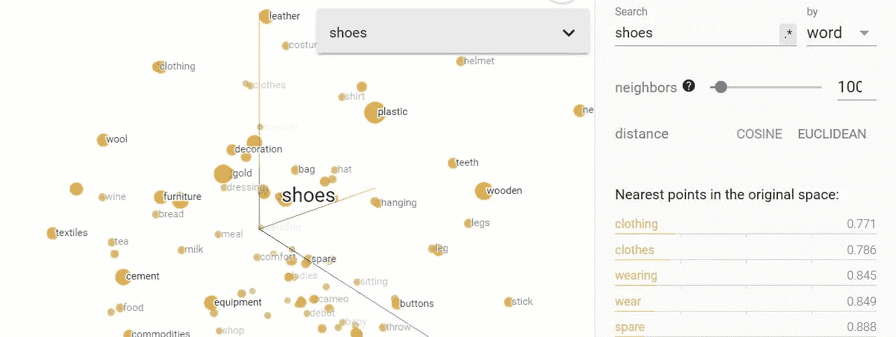

“鞋”被理解为与“衣”、“衣”、“穿”、“穿”非常相似(截图来自[projector.tensorflow.org](http://projector.tensorflow.org))

简而言之，我们的聊天机器人会查看输入，并搜索它已经训练过的、最接近用户问题的输入。然后，机器人返回与该问题相关的答案。

为了调优这些参数，让我们查看 Views.py，看看我们的**逻辑适配器**设置。是适配器决定了 ChatterBot 如何选择对给定输入语句的响应的逻辑，并且有多种方式设置它们。我们在应用程序中使用了 BestMatch。BestMatch 将根据与输入(用户问题)最接近的已知响应返回一个响应。我们已经将两个语句之间的最大相似度设置为 90%，使用最大相似度来计算机器人的置信度:

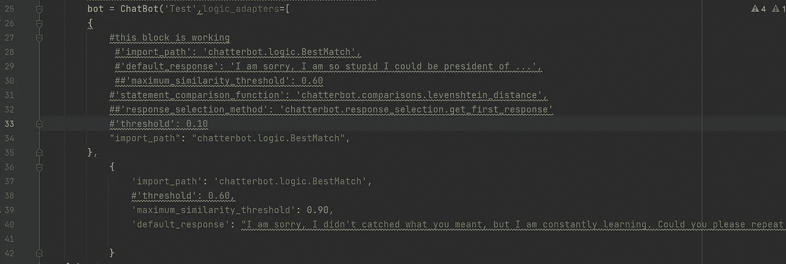

如果聊天机器人估计不知道正确答案，它会问“请你用其他的话重复一下你的问题好吗？”

正如生活中经常出现的情况一样，对于如何设置这些参数的问题，没有绝对 100%的对错。这完全取决于你的 FAQ 背景，你想使用哪种逻辑。你的聊天机器人是不是应该只在绝对有把握给出正确答案的情况下才回应？或者它应该表现得更像一个话匣子，每次都给出答案，即使不一定总是最好的答案？我能给你的唯一诚实的建议是在你的数据上尝试一下(参考伟大的[聊天机器人网站](https://chatterbot.readthedocs.io/en/stable/logic/index.html)了解更多细节)。

恭喜，我们现在有一个完整的聊天机器人在运行，我们知道如何训练它来尽可能最好地回答我们的问题！我们仅仅关注基本的问答映射，但是上下文还可以包括特定对话流中的当前位置，或者之前保存的变量，如主题(例如，“您希望聊天机器人回答主题 a 或 b 中的问题吗？”).进行对话流对话将是另一篇文章的主题。

目前，非常感谢阅读！希望这篇文章对你有帮助。请随时在 [LinkedIn](https://de.linkedin.com/in/jesko-rehberg-40653883) 、 [Twitter](https://twitter.com/DAR_Analytics) 或[工作室](https://jesko-rehberg.medium.com/virtual-reality-vr-for-education-a532aa5b6272)与我联系。

<https://jesko-rehberg.medium.com/membership>  

最初发表在我的网站 [DAR-Analytics](http://dar-analytics.com/) 。