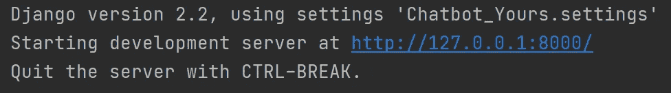

# 聊天机器人:一个完整的 PyCharm 应用

> 原文：<https://towardsdatascience.com/chatbot-complete-pycharm-app-3517b64075f2?source=collection_archive---------18----------------------->

## Chatterbot、Django、Python 和 Pycharm 都统一在这个随时可用的聊天机器人应用程序中


作者图片

**动机:**

你正在寻找一个完全准备好的[聊天机器人](https://chatbotslife.com/ultimate-guide-to-leveraging-nlp-machine-learning-for-you-chatbot-531ff2dd870c)，它可以很容易地适应你的需求吗？如果你愿意结合使用 Python、Pycharm、Django 和 Chatterbot，就不用再看了。最重要的是，这个应用程序中甚至添加了一个 SQLite 数据库，所以你可以分析用户的输入和[聊天机器人的](https://chatbotslife.com/smart-chatbots-and-virtual-assistants-are-coming-591638108933)输出。

这篇文章关注的是如何让一个 FAQ [聊天机器人](https://chatbotslife.com/5-top-tips-for-human-centred-chatbot-design-392bf56cf1af)运行起来，而不涉及 chatterbot 的理论背景，这将是另一篇相关文章的主题。

**解决方案:**

首先，请确保您安装了 PyCharm。如果没有，请现在就做:

去[www.jetbrains.com](https://www.jetbrains.com/de-de/pycharm/download/)安装免费社区版。

之后，在 PyCharm 开始新项目之前，请复制我的 Google Drive 文件夹中的所有文件:[https://Drive . Google . com/Drive/folders/1 ixxjznr 8 pbgfsiypwj 92 fxnqx 35 ezoft？usp =共享](https://drive.google.com/drive/folders/1IXXJzNr8pbGFSIYpWj92fXnQX35eZOFT?usp=sharing)

..并将其复制到您的 PyCharm 项目文件夹中(通常在您的用户文件夹中):


然后打开 PyCharm，点击“新建项目”:


选择 [ChatbotProject](https://chatbotslife.com/a-simple-guide-to-making-your-first-chatbot-game-815adc12c46e) 文件夹(您刚刚从我的 Google Cloud 下载的)作为您新的虚拟环境(virtualenv)项目的位置。还要确保 Python 解释器指向 Python 3.7:


确保文件夹“venv”是空的。如果没有，就删除该文件夹中的所有文件。

确认要从现有来源创建后:


下一步，添加配置:


..点击左上角的加号:


必须输入这些设置的位置:


从现在开始，您只需点击“运行”按钮即可启动 Manage.py:


..然后单击本地主机链接，这将在几秒钟后启动:



如果现在有导入错误弹出，类似于:


..您所要做的就是转到 settings 并在 Python 解释器部分导入必要的包:


请确保 Django 2.2 和 Chatterbot 1.0.2。已安装。这将确保我们的聊天机器人能够很好地与 Python 3.7 一起工作:


如果您现在再次运行“manage.py ”,您可能会在第一次启动 chatbot 时收到以下消息:


在这种情况下，请到您的终端并输入:

```
python manage.py migrate
```


现在再次运行 manage.py，您的聊天机器人应该可以在您的浏览器中工作了:


输入您的信息，然后点击下面的发布按钮。

你输入一个问题，我们的机器人有望给我们正确的答案:


你可以输入一个问题，你的聊天机器人会给你这个问题的答案。聊天机器人可能知道正确答案的原因是因为您的 chats.txt，您可以在这里修改它:


在我们的例子中，我们使用了英语和德语的输入输出映射。

如果您更喜欢 yaml 文件而不是 chats.txt，您也可以改编这些语料库文件:


请注意，除了 FAQ，其他都是 chatterbot 模块。这是我自己为了学习而创作的:

Chatterbot 是一个非常有趣的聊天机器人，它使用机器学习技术。如果你想了解更多关于 Chatterbot 的细节，请看看 chatterbot 网站。

**还有什么要补充的吗？**

现在一切都运转良好。但是，如果添加一个数据库连接，这样我们就可以分析 chatbot 的输出和用户的输入，岂不是很酷？

因此，我们必须再次进入设置，但这一次我们将安装在插件部分。搜索数据库导航器并安装插件:


然后输入新的数据库连接:


选择 SQLite 并添加 db.sqlite3 作为数据库文件:


单击测试连接，检查它是否正常工作。

在安装了 Database Navigator 之后，我们第一次运行 Chatbot 后，查看“statement”表，我们可以看到所有训练过的对话:


如果你想从零开始学习，删除这些文件就行了。

恭喜，我们有一个完整的聊天机器人运行！我们将在[的另一篇文章](/chatbot-a-complete-pycharm-app-part-2-of-3-distance-metric-46462a9ad4e4)中详细讨论聊天机器人的学习。

目前，非常感谢阅读！希望这篇文章对你有帮助。请随时在 [LinkedIn](https://de.linkedin.com/in/jesko-rehberg-40653883) 、 [Twitter](https://twitter.com/DAR_Analytics) 或[工作室](https://jesko-rehberg.medium.com/virtual-reality-vr-for-education-a532aa5b6272)与我联系。

<https://jesko-rehberg.medium.com/membership>  

最初发布于我的网站 [DAR-Analytics](http://dar-analytics.com/) 。