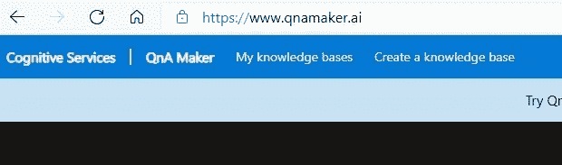
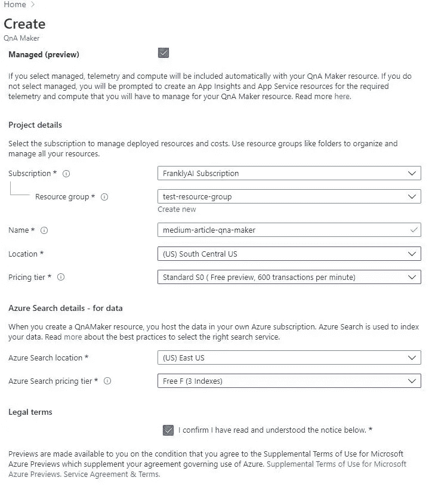
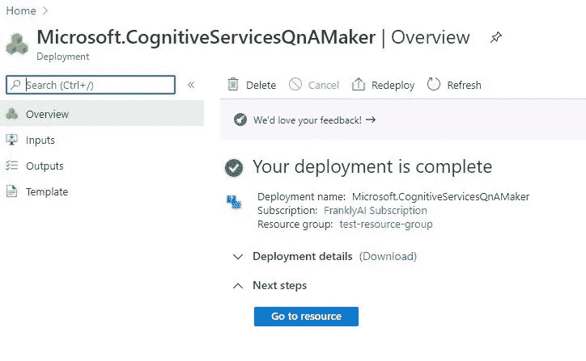
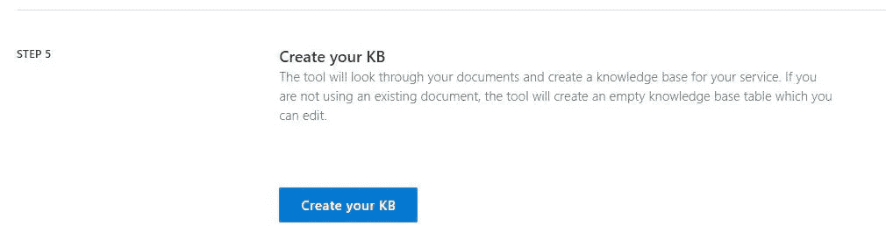
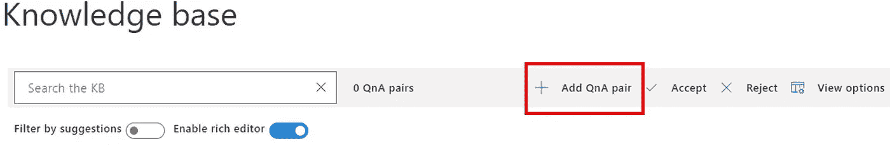
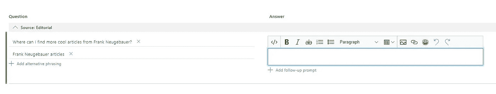
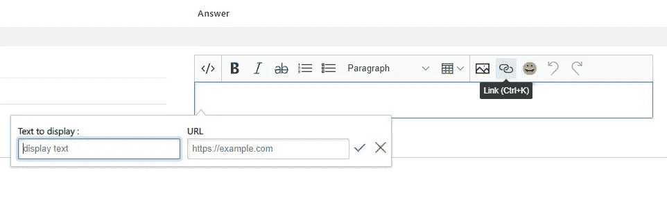
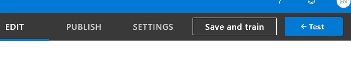
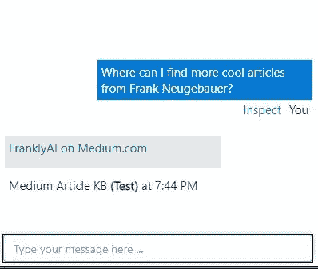
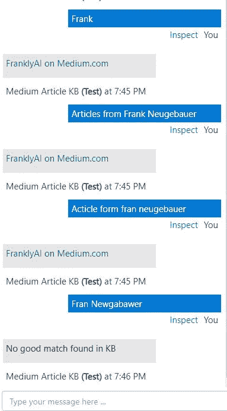

# QnA Maker 聊天机器人策略

> 原文：<https://towardsdatascience.com/chatbot-strategy-with-qna-maker-9554e5bd7782?source=collection_archive---------27----------------------->

图片由[皮克斯拜](https://pixabay.com/?utm_source=link-attribution&amp;utm_medium=referral&amp;utm_campaign=image&amp;utm_content=3589528)的[默罕默德·哈桑](https://pixabay.com/users/mohamed_hassan-5229782/?utm_source=link-attribution&amp;utm_medium=referral&amp;utm_campaign=image&amp;utm_content=3589528)拍摄

## 边学边学，不要丢脸

逐步实现聊天机器人不仅可以为您省去与聊天机器人相关的麻烦，还可以在此过程中为您的组织提供有价值的服务。开始这一旅程的一个极其简单的方法是使用 Microsoft QnA Maker。(本文不是微软赞助的，他们也没有任何编辑影响力。)

众所周知，聊天机器人服务于各行各业，尤其是客户服务。他们与客户“交谈”，这是聊天机器人的一个不错的自助用例，但也是一个“太多太快”的警示故事聊天机器人失败的例子有很多[。](https://research.aimultiple.com/chatbot-fail/)

我提出了一条途径，让你在完成组织内的一个重要目标的同时，更容易地学习别人通过艰难的方式学到的东西，而没有风险；有效分享机构知识。

> 听起来好得难以置信。

很公平，但事实并非如此。QnA Maker 不太像聊天机器人，更像知识库，但是不要搞错，知识库是作为聊天机器人公开的。想想这意味着什么。想象一下，一个 SharePoint 搜索实际上是可行的，想象一下，在过早公开之前，在你自己的公司内部对它进行测试。

## 创建 QnA Maker 实例

我首先需要有一个 Azure 帐户。创建一个免费账户并不困难(而且你得到的不仅仅是 QnA Maker)。您可以导航到 [https://www.qnamaker.ai](https://www.qnamaker.ai) 并在那里创建您的帐户，或者您也可以前往[https://azure.portal.com。](https://azure.portal.com.)

创建新帐户后，我导航回 [QnA Maker 主页](https://www.qnamaker.ai/)，并选择*创建知识库*。

作者图片

注意，我在微软认知服务部门，这是 Azure 的一部分(这种联系很快就会变得更加明显)。*创建知识库*页面类似于向导，第一步是我连接 Azure 的地方。

选择*创建 QnA 服务*。(不要忘记我为什么这样做，这是为了 QnA Maker 实例——很容易忘记并认为你只是在做一些 Azure 的东西！)

瞧啊。我被弹出到 Azure Portal 来创建一个 QnA Maker 实例。以下是我对*创建*屏幕的选择:

*   我查了一下*托管(预览)*
*   我选择了我的订阅
*   我有一个我选择的测试资源组(如果您没有，创建一个)
*   我将我的实例命名为 *medium-article-qna-maker* (需要有命名约定)
*   我选择了*(美国)美国中南部*作为地点(尽可能选择离你近的地点)
*   我只能选择*标准 S0(免费预览，每分钟 600 笔交易)*定价层(我认为这就足够了)
*   对于 *Azure 搜索位置*，我保留了默认设置，( *US) East US* (再次选择地理位置离你近的地方)
*   对于 *Azure 搜索定价层，*我节俭地选择了*免费的 F (3 个索引)*
*   通过勾选“我确认…”复选框，我接受了*法律条款*

作者图片

然后我选择了屏幕底部的*审查+创建*(图中未显示)，然后在下一个屏幕中选择*创建*。过了一段时间，我的 QnA Maker 实例就创建好了。

作者图片

这就是为什么记住我为什么这么做很重要。选择*进入资源很有诱惑力，但是用海军上将贾尔·阿克巴的不朽名言来说，*

> 这是个陷阱！

不，这真的不是陷阱，但这不是我接下来需要做的。接下来，我返回到创建 QnA Maker 向导并继续。*步骤 2* 从选择*刷新*按钮开始(因为有些值是基于刚刚在 Azure 中创建了资源而被填充的)。

我的 *Active Directory ID* 已被选中(它与我的新 Azure 帐户相关联)。我选择了我的订阅，我的新的 *Azure QnA 服务*(它被命名为*medium-article-QnA-maker*)，以及*英语*作为语言。

在*步骤 3* 中，我输入了*中型文章知识库*作为知识库名称。(注意，微软没有给那个*机器人命名为*。我跳过*步骤 4* (但创建或导入现有知识库是一个很酷的功能)，直接进入*步骤 5* 并选择*创建您的知识库*。

作者图片

## 使用 QnA Maker

QnA Maker 是一个全功能的应用程序，并且“数据”(问题和答案对)耦合在自然语言处理中，以实现对话式人工智能。您可以按原样使用 QnA Maker，或者让它成为其他东西的基础(例如，网站的聊天机器人)。

*知识库*用户界面非常简单，它基于一个基本结构:问题和答案。我让*启用丰富编辑器*开关打开，并选择 *+添加 QnA 对*。

作者图片

没有比下一个屏幕更简单的了。我输入一个包含零到多个备选短语的问题以及问题的答案。

但是请注意，当我在输入一个带有备选措辞的问题后，将光标放在*输入答案*部分时会发生什么:

作者图片

这就是富编辑器的用武之地。答案可以被显著地修饰。在我的例子中，我想添加一个超链接。

作者图片

我输入我的*文本以显示*和 *URL* 。就这些了。如果我正在构建一个强大的知识库，我会输入许多 QnA 对，或者从某个来源(例如，网站—如 FAQ—Excel 电子表格、Word 文档)导入它们。一旦 QnA 对完成，我从顶部选择*保存并训练*。

作者图片

现在我将测试知识库，这是您看到的 QnA Maker 聊天界面。出现的是一个聊天窗口，您可以在其中输入任何文本。我逐字输入我的问题(因为如果它不能逐字做，它能做什么！？).

作者图片

好吧，这是可行的，但 SharePoint 或任何其他基于索引的搜索引擎可以做到这一点，对不对？我同意。我要尝试一些变化…

作者图片

我不得不努力让它失败。请注意，拼写错误甚至工作，直到我去所有的语音。SharePoint 不会这样做，它当然也不是对话式的。

> 这里微妙的一点是，你真的不需要明确地有许多不同的备选问题——QnA Maker 做了一件体面的工作，弄清楚被问的是什么。

## 下一步是什么？

随着您的聊天数据的工作，您可以轻松地将 QnA Maker 附加到实际的聊天机器人上，或者您可以(即使我不建议这样做)直接使用 QnA Maker。用户可以在 QnA Maker 中做很多正确的事情，特别是如果他们是知识库的内容创建者(例如，根据需要添加新的 QnA 对)

但是回到最初的观点——我的新知识库可以在我的庞大的 FranklyAI 帝国内使用(恰好一个人),以帮助员工理解政策和程序、fid 有用信息，或者部门和/或系统特定信息。这是一个低风险、高价值、低成本的提议，更重要的是，你可以在你自己的机器人的舒适环境中理解聊天机器人如何工作(和不工作)。

您可能没有想到其他的东西，但是实际内容可以(也应该)100%由最终用户维护。使用 QnA Maker 对任何计算机用户(即使是新手)来说都很简单。

## 但是还有什么呢？

QnA Maker 就像汽车的发动机，但它不一定是内饰。然而，为 QnA Maker 建立一个聊天界面非常容易，甚至更容易将其连接到现有的渠道，如微软团队(想象一个可以告诉你东西在哪里的团队机器人)、电子邮件、微软 Power 虚拟代理、API，等等。更何况每个渠道(网络、文字、邮件等。)共享同一个 KB 实例，因此 QnA Maker 中的更改会被填充到所有通道中。

作者图片

我将为您留下一些 QnA Maker 资源以供进一步研究。如果我的时间表允许的话，我会回来告诉你如何连接不同的频道(这些链接也会带你去那里)。

## 资源

[1]Microsoft.com。[微软快速启动:创建、培训和发布你的 QnA Maker 知识库](https://docs.microsoft.com/en-us/azure/cognitive-services/qnamaker/quickstarts/create-publish-knowledge-base?tabs=v1) (2020)。

[2]Microsoft.com。[教程:添加你的知识库给虚拟代理](https://docs.microsoft.com/en-us/azure/cognitive-services/qnamaker/tutorials/integrate-with-power-virtual-assistant-fallback-topic) (2020)。