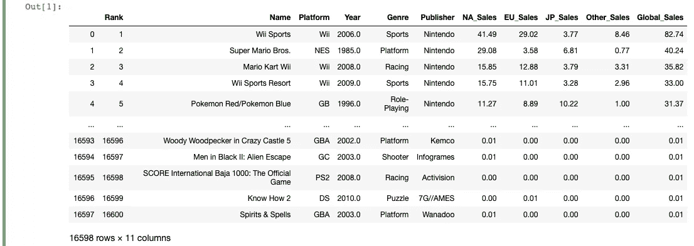
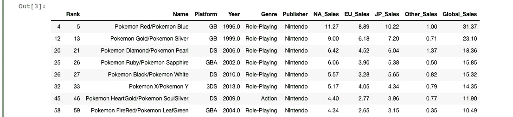
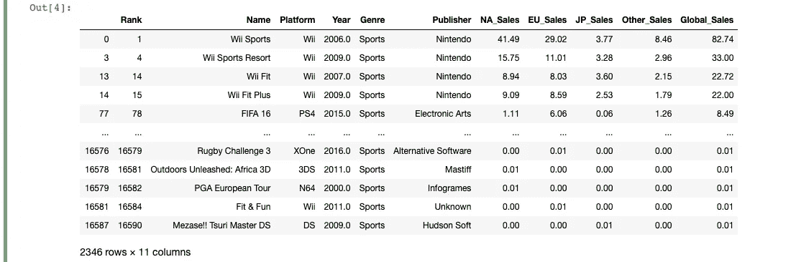
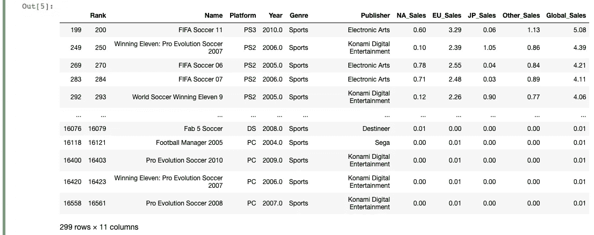
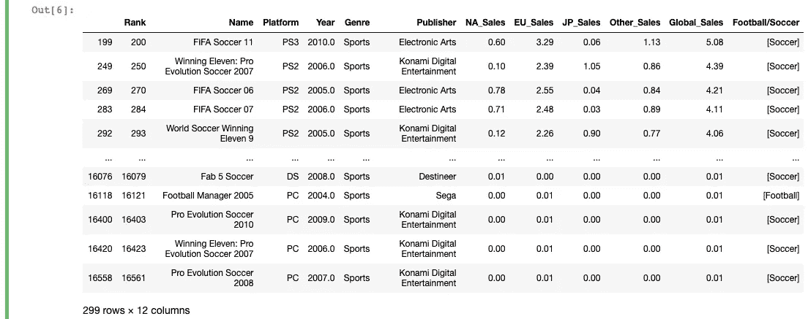
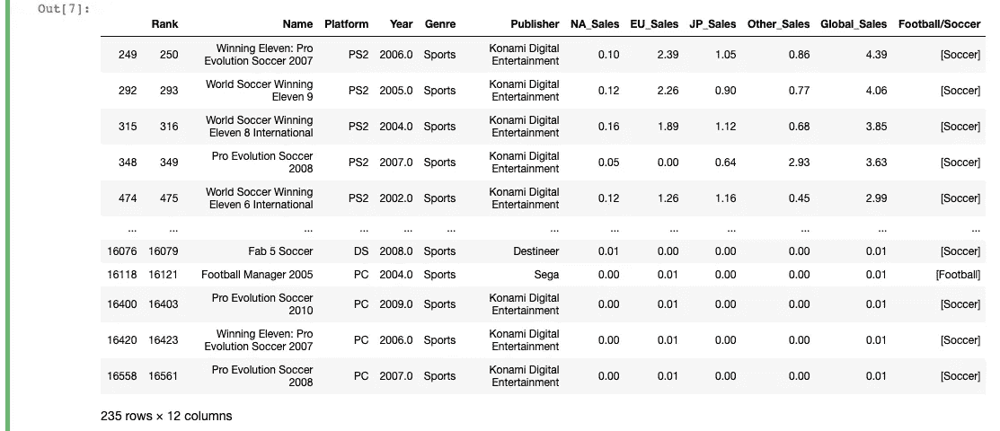

# 检查熊猫数据帧列中的子字符串

> 原文：<https://towardsdatascience.com/check-for-a-substring-in-a-pandas-dataframe-column-4b949f64852?source=collection_archive---------0----------------------->

## 大蟒

## 寻找字符串来减少用于分析和机器学习的数据集


马库斯·温克勒在 [Unsplash](https://unsplash.com?utm_source=medium&utm_medium=referral) 上的照片

熊猫图书馆是一个全面的工具，不仅用于处理数字，也用于处理文本数据。

对于许多数据分析应用和机器学习探索/预处理，您可能希望从文本数据中过滤或提取信息。为此，Pandas 提供了广泛的内置方法，您可以使用这些方法来添加、删除和编辑数据帧中的文本列。

在本文中，让我们具体看一下在 DataFrame 列中搜索子字符串。当您需要基于现有数据创建新类别时(例如在训练机器学习模型之前的特征工程期间)，这可能会很方便。

如果你想继续，在这里下载数据集。

```
import pandas as pddf = pd.read_csv('vgsales.csv')
```



现在让我们开始吧！

*注意:在这篇文章中我们会用到很多* `*loc*` *，所以如果你不熟悉这种方法，可以看看这篇文章底部的第一篇文章。*

# 使用“包含”在熊猫数据帧中查找子串

Pandas 中的 contains 方法允许您在一列中搜索特定的子字符串。contains 方法返回系列的布尔值，如果原始系列值包含子字符串，则为 True，否则为 False。contains 的一个基本应用程序应该看起来像`Series.str.contains("substring")`。但是，我们可以通过增加两项内容立即将此提升到下一个级别:

1.  使用`case`参数指定是否匹配字符串大小写；
2.  使用返回的一系列布尔值作为掩码来获得数据帧的子集。

应用这两个应该是这样的:

```
pokemon_games = df.loc[df['Name'].str.contains("pokemon", case=False)]
```


使用`loc`方法允许我们只获取 DataFrame 中包含字符串“pokemon”的值。我们简单地使用了`contains`方法，根据“名称”列是否包含我们的子字符串来获取真值和假值，然后只返回真值。

# 在 Pandas 中使用 regex 和“contains”方法

除了匹配常规子串，我们还可以使用`contains`匹配常规表达式。我们将使用与之前完全相同的格式，只是这次让我们使用一点 regex 来只查找基于故事的口袋妖怪游戏(即排除口袋妖怪弹球之类的游戏)。

```
pokemon_og_games = df.loc[df['Name'].str.contains("pokemon \w{1,}/", case=False)]
```



上面，我只是使用了一些简单的正则表达式来查找匹配“pokemon”+“一个或多个字符”+“/”模式的字符串。新面具的结果返回行包括“口袋妖怪红/口袋妖怪蓝”，“口袋妖怪金/口袋妖怪银”，等等。

接下来，让我们做另一个简单的例子，使用 regex 查找名称中带有“football”或“soccer”的所有体育游戏。首先，我们将使用一个简单的条件语句来过滤掉所有带有“sports”类别的行:

```
sports_games = df.loc[df['Genre'] == 'Sports']
```



您会注意到，上面并没有真正需要匹配子串或使用正则表达式，因为我们只是根据类别选择行。然而，当匹配行名时，我们需要在不同类型的字符串中搜索子字符串，这正是 regex 派上用场的地方。为此，我们将执行以下操作:

```
football_soccer_games = sports_games.loc[df['Name'].str.contains("soccer|football", case=False)]
```



现在，我们已经得到了一个数据框架，其中只包含名称包含“足球”或“橄榄球”的游戏。我们简单地使用了“|”regex“or”操作符，它允许您匹配包含一个或另一个子字符串的字符串。

因此，我们成功地得到了一个数据帧，它的名字包含“football”或“soccer ”,但我们实际上不知道它包含这两个字符串中的哪一个。如果我们想知道它包含两个中的哪一个，我们可以在 name 列上使用`findall`方法，并将返回值赋给 DataFrame 中的一个新列。

`findall`方法返回正则表达式模式的匹配，该模式是在调用它的序列的每个字符串中指定的。该格式与 contains 方法基本相同，除了您需要导入`re`以不匹配字符串大小写。

```
import re
football_soccer_games['Football/Soccer'] = football_soccer_games['Name'].str.findall('football|soccer', flags=re.IGNORECASE)
```



您将在返回的数据帧的末尾看到一个包含“Soccer”或“Football”的新列，这取决于视频游戏名称包含两者中的哪一个。如果您需要基于现有列并使用这些列中的值来创建新列，这可能会很有帮助。

最后，为了快速排除字符串，只需在基本的`contains`方法上增加一个操作符，让我们尝试得到所有名称中不包含“FIFA”的足球和英式足球游戏。

```
not_fifa = football_soccer_games.loc[~football_soccer_games['Name'].str.contains('FIFA')]
```



如你所见，我们简单地使用了`~`操作符，它允许我们在`loc`方法中获取掩码的所有假值。

仅此而已！

使用字符串可能有点棘手，但内置的 Pandas 方法是通用的，允许您以几乎任何需要的方式分割数据。`contains`和`findall`方法允许您做很多事情，特别是当您能够编写一些正则表达式来真正找到特定的子字符串时。

祝你好运！

```
**More by me:** - C[onditional Selection and Assignment With .loc in Pandas](/conditional-selection-and-assignment-with-loc-in-pandas-2a5d17c7765b?sk=e5672d859a3964c1453a1c09edca22cf)
- [Squeezing a New Trick Into Your Pandas Repertoire](/squeezing-a-new-trick-into-your-pandas-repertoire-d8ae3f338246?sk=a9d67d24b1ef469a88090b647f15ea50)
- [2 Easy Ways to Get Tables From a Website With Pandas](/2-easy-ways-to-get-tables-from-a-website-with-pandas-b92fc835e741?sk=9981ddaf0785a79be893b5a1dd3e03dd)
- [Top 4 Repositories on GitHub to Learn Pandas](/top-4-repositories-on-github-to-learn-pandas-1008cb769f77?source=friends_link&sk=d3acc38062490a86ecb46875342224e6)
- [Learning to Forecast With Tableau in 5 Minutes Or Less](/learning-to-forecast-effectively-with-tableau-in-6-minutes-or-less-3d77a55930a0?source=friends_link&sk=9abdfd7533ee9a31ab8a036413450059)
```