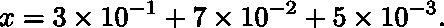
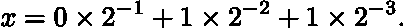
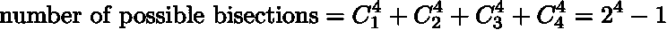
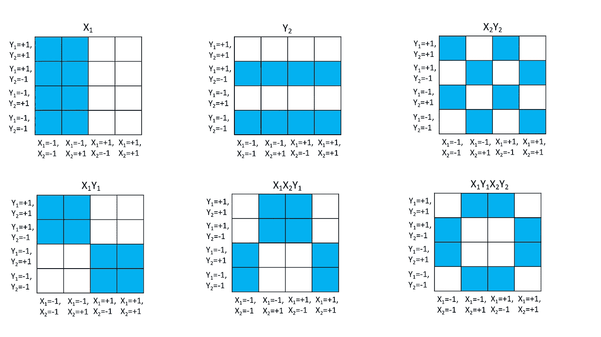
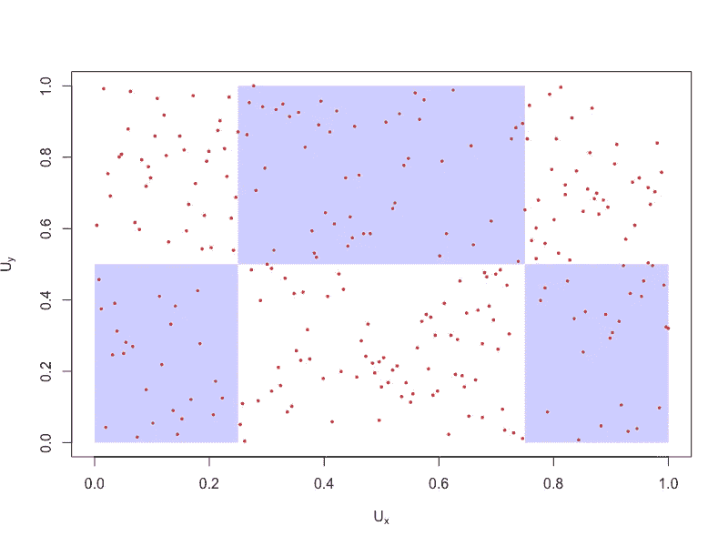

# 使用二进制扩展测试(BET)检查依赖性

> 原文：<https://towardsdatascience.com/checking-for-dependency-using-binary-expansion-testing-bet-5234a818a18?source=collection_archive---------41----------------------->

## 统计独立性的一种新的非参数检验

夜空中的星星是均匀分布的吗？星系在宇宙中是均匀分布的吗？T 细胞是否为了杀死癌细胞而渗透到整个肿瘤？草原上的植被怎么样？在许多情况下，我们希望确定样本是否均匀地从感兴趣的空间中抽取。尽管这个问题听起来很简单，但是没有一个通用的解决方案可以满足所有的目的。最近，来自北卡罗来纳大学教堂山分校的张开为此引入了一个称为二进制扩展测试(BET)的优雅框架。这篇文章旨在为 BET 提供直观的解释。

让我们假设数据点分布在一个单位正方形内。然后每个点由两个随机变量 *X* 和 *Y* 指定。为了确定均匀性，有两个问题需要解决:1 . *X* 和 *Y* 是否遵循均匀分布？2. *X* 和 *Y* 在统计上是否独立？BET 是为问题 2 制定的，因此让我们先关注问题 2，然后再回到问题 1。

看一下实数 *x=* 0.375 *。*当然，按照通常的十进制形式写，

但是在二进制数字系统中，

一般来说，任何实数 *x* 使得 0≤x≤1 都可以表示为一个序列{ *b* ᵢ}与 *b* ᵢ=0 或 1。认识到ᵢ}可以被描绘成一系列二元决策是很重要的。第一项意味着区间[0，1]被划分成大小为 1/2 的 2 个仓，并且被询问 *x* 是位于左仓( *b* ₁=0)还是右仓( *b* ₁=1).)由于答案是“左”，第二项意味着区间[0，1/2]然后被进一步划分成大小为 1/4 的 2 个箱，并且被询问 *x* 是位于左箱( *b* ₂=0)还是右箱( *b* ₂=1).)这一次答案是“正确的”，它进入第三项，其中区间[1/4，1/2]被分成大小为 1/8 的两个箱，并且我们有另一个决策树 *b* ₃.

二进制展开可以被视为使用二进制变量划分单位区间的一种方式，而不是关注如何将实数映射到二进制数序列。一般来说， *d* 二元变量可以将单位区间分成 2 个ᵈ区间，每个长度为 *d* 的二元序列对应一个区间。给定从[0.1]中提取的随机变量 *X* ，我们可以通过 *d* 二进制随机变量来近似 *X* ，其中 *d* 确定面元大小，从而确定分辨率。很快就会清楚，用 *aᵢ* =2 *bᵢ* -1 代替 *bᵢ* 会更方便。换句话说，二进制变量取值为 1。

现在来看两个随机变量 *X* 和 *Y* 的相关性，这两个随机变量取自一个单位区间。我们选取某一深度的 *d* 并通过两个二进制随机变量序列来近似 *X* 和*y*{*xᵢ*}和{ *Xⱼ* }其中 *i* ， *j* 从 1 运行到 *d，*和 *Xᵢ* 和 *Xⱼ* 取值回想一下 *d* 二元变量可以将单位区间划分为 2ᵈ箱，两组这样的变量将单位正方形划分为 2 个ᵈ小正方形，一个数据点 *(X，Y)* 将落在其中一个小正方形上。然而，BET 的关键不仅仅是将单个数据点分配给一个网格。BET 的目标是检查分布在网格上的数据点集合的均匀性。为了实现这一目标，BET 将网格一分为二，并计算每一半中的数据点数量。基于二进制变量的一个巧妙的技巧实现了对分。

为了说明这一点，让我们考虑一下情况 *d=2。*随机变量 *X* 和 *Y* 被映射到 4 个二元变量 *X₁、X₂、Y₁、Y₂* 上，这些变量将单位正方形分成 4×4 的网格。有许多不同的方法可以将网格一分为二，例如，将网格分成左半部分和右半部分，或者分成上半部分和下半部分，或者分成棋盘。使用的关键观察:所有可能的二等分都可以被 *X₁、X₂、Y₁、Y₂* 以及它们的组合捕获。例如，变量 *X₁* 将网格分为左半部分( *X₁=-1，*蓝色)和右半部分( *X₁=+1，*白色)；变量 *Y₂* 将网格切割成水平带( *Y₁=-1，*蓝色； *Y₁=+1，*白色)；并且棋盘可以通过组合 X₂Y₂= 1 来获得(这实际上是我们更喜欢值 1 到 1 或 0 的原因)。通过列举二元变量所有可能的选择，不难看出

这种二分法的例子如下所示。

二元函数对分(蓝色:-1，白色:+1)KKY 图像

列举了所有可能的二等分，一致性的推论是简单的。本质上，给定一个等分线，我们计算落在蓝色和白色区域的数据点的数量， *n=nᵇ+nʷ* 。由于蓝色和白色区域的面积相等，因此在 *X* 和 *Y* 之间缺少相关性将导致 *nᵇ≈nʷ* 。我们可以简单地用二项分布 B *(n，p=* 1/2 *)* 作为空值，给观测值赋一个 P 值。由于二等分的数量呈指数级增长，p 值应针对多重假设检验进行调整，例如，乘以因子 2 ᵈ-1.

让我们看看张开手稿中的一个具体例子。他和他的同事已经在 R 包中实现了 BET。绝对值得一试。在下图中。红点表示天球上恒星的分布，其中 *X* 和 *Y* 是两个坐标参数。使用 *d=2，* BET 对所有等分线进行了测试，发现所示等分线呈现出一种具有最显著 q 值的不对称性。因此，BET 得出结论，恒星并不是均匀分布的，这当然是事实，因为恒星密集地分布在银河系的中心。

天空中星星的分布(数据来源:Ref 2，KKY 使用 Ref 生成的图。2)

到目前为止，我们已经概述了 BET 背后的直觉。一个问题不清楚: *d* 的值是多少？张开提出了一种迭代方法，在这种方法中，人们可以逐渐增加 T2 d T3。当然，根据数据点的数量， *d* 不能太大，否则会有很多面元是空的；还有，大的 *d* 会造成假设数量的爆炸，不对称不会很显著。最后，人们可能会注意到，BET 的目标是显示 *X* 和*Y*之间缺乏相关性。如果将 *X* 和 *Y* 视为空间坐标，则缺乏相关性意味着单位正方形内数据点的一致性。然而，反过来总是正确的吗？这两个概念是否相同很重要，因为 BET 所采用的宁滨和计数程序仅仅显示了一致性。我们将在下一篇文章中研究这些细微的差别以及 BET 解决它们的方法。

参考:

1.  张开，赌独立(2019)。美国统计协会杂志
2.  张莞，赵志根，迈克尔·拜奥奇，张开，BET:二进制扩展测试(2020)，R 包版本 0.2.0