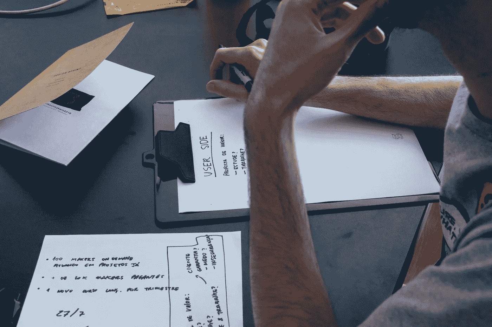
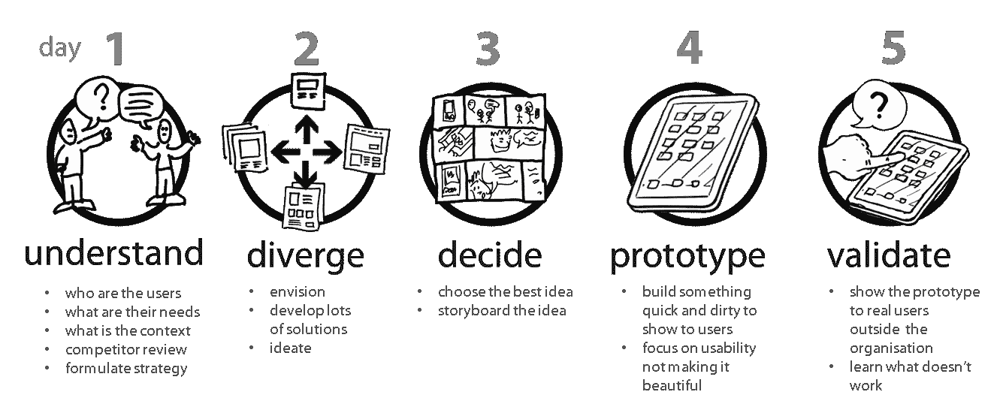
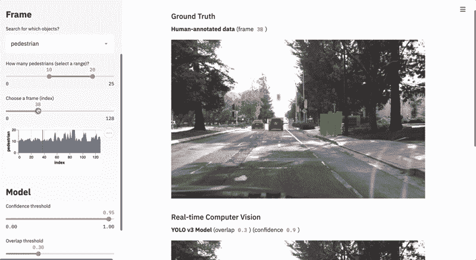
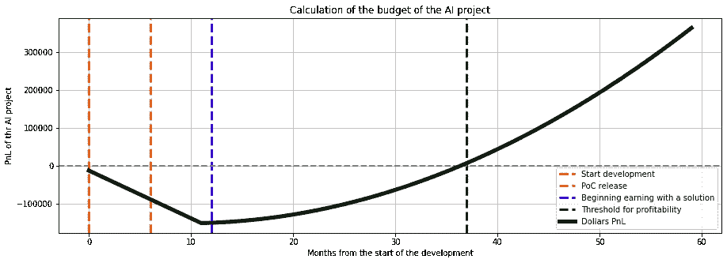
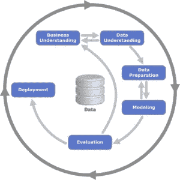
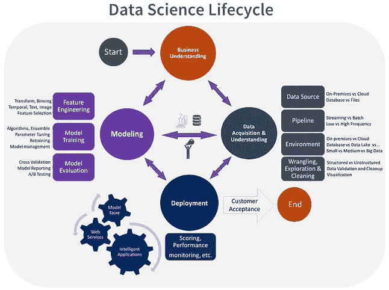
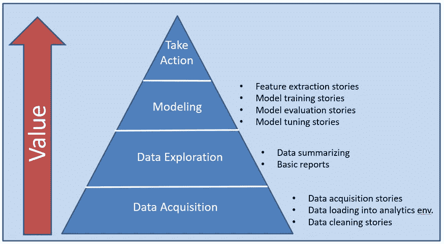
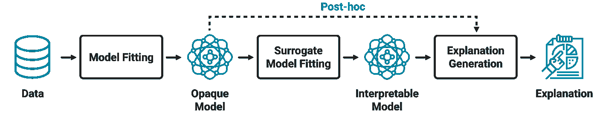

# 人工智能产品经理从设计冲刺中获得最大收益的清单

> 原文：<https://towardsdatascience.com/checklist-for-ai-product-managers-to-get-the-most-from-the-design-sprints-d681456b1be9?source=collection_archive---------46----------------------->

## 不要让顾问愚弄你！

## 如何用一个伟大的产品满足所有利益相关者

插图来自[上卷](https://unsplash.com/)

将“数字化”、“创新”和“大数据”等流行词汇转化为有生命力且有利可图的产品非常困难。通常，失败的不是技术本身，而是所有者、管理者、客户、员工，有时还有社会之间的协调。对于人工智能产品来说，这甚至更难，因为这是一个相对较新的领域，其中有:

*   要么是**通才顾问**，他们可以在没有具体数字和下一步措施的情况下讲述光明的未来和经济影响；
*   或者是**深度专家**，他们知道这项技术的潜力和局限性，但是他们缺乏系统的商业和社会视野。

在这篇文章中，我想分享我们在[神经元实验室](http://neurons-lab.com/)与合作伙伴一起精心设计的方法，该方法融合了**以用户为中心的算法、经济增长和社会影响**，从而**协调了产品生命周期中的所有利益相关者**。它基本上是基于设计冲刺的想法，然而，主要步骤是从零开始重新构建，以符合行业的具体情况。

# 为 AI 设计冲刺？

经典设计冲刺的典型步骤，图片来自[https://medium . com/I-want-to-be-a-product-manager-when-I-grow-up/the-design-sprint-92f 61 b 18 FB 72](https://medium.com/i-want-to-be-a-product-manager-when-i-grow-up/the-design-sprint-92f61b18fb72)

原始设计冲刺的主要思想是快速验证想法:了解市场需求，头脑风暴解决问题的新方法，原型第一数字解决方案，并与客户一起测试。理想情况下，它甚至可以在 5 天内完成。此类活动的典型成果是:

*   来自**头脑风暴**的发现(用户故事、技术应用、优先新颖用例)
*   一个交互式的**原型**，它展示了用例并得到了涉众的验证
*   具有所需资源和风险的发展战略路线图

你可以在这里阅读更多关于这些短跑的历史和最佳实践[。这些结果通常会满足所有重要的利益相关者，如传统数字产品的所有者、管理者和客户。在接下来的部分中，我将描述活动和实践，这些活动和实践将创建上述可交付成果，这些可交付成果将协调参与开发和使用以人工智能技术为核心的产品的每个人。](https://www.gv.com/sprint/)

# 顾客想要什么

使用 Streamlit 可视化计算机视觉模型性能的实例。交互演示用户故事不是比演示 PowerPoint 演示或模板模型更好吗？插图来自[流线型](https://www.streamlit.io/gallery)

引用蠢朋克的话，你的客户想要解决他们的问题:

> 更难、更好、更快、更强

人工智能相关技术确实可以让事情变得更准确、更快速，从我们的生活中删除常规或危险的任务。但是如何正式确定我们到底能为客户做些什么呢？我可以推荐谷歌使用的两个框架:

*   [艾画布](http://www.predictionmachines.ai)出自《预测机器》一书。它将帮助你**将客户的想法转化为使用人工智能的用户故事**
*   人+ AI [指导手册](http://pair.withgoogle.com)。它将有助于定义数据、度量、可解释性的**需求，并支持上述用户情景的**

你也想展示一些演示，并在几个小时内准备好，而不是几个星期，对吗？

*   轻松**部署**工具**工具** ( [BentoML](https://github.com/bentoml/BentoML) 、[烧瓶](https://flask.palletsprojects.com/en/1.1.x/)、 [Streamlit](http://streamlit.io/)
*   **No-code**(as[Lobe](https://github.com/lobe))/**managed**解决方案(AWS、Azure、GCP 等)
*   **开源 ML 模型**zoo 为[papers，代码](https://paperswithcode.com/)， [ModelZoo](https://modelzoo.co/)

因此，在这里，您将有一个按优先顺序排列的用例列表，并有几个小演示向用户展示它将会是什么样子。

# 企业想要什么

我们在[神经元实验室](http://neurons-lab.com/)准备的一个过程自动化项目的 PnL 计算样本，包括发布点、盈利起点和盈利转折点。作者图片

当然，以用户为中心的方法是核心，但从商业模式的角度来看，产品还必须是**盈利的，并且在市场上具有竞争力。这在设计冲刺阶段通常会被忽略，从我的角度来看，这是一个可怕的疏忽。这部分是非常定制的，但是你想把它缩小到单个预测的单位经济学。使用上述“预测机器”中的人工智能画布，您可以计算使用人工智能功能的经济效果:**

*   **由于速度加快/质量提高/风险降低，每次预测你会节省多少钱**？
*   **您可以预期的精确度是多少，有多大把握？**

您需要减去相关成本，包括但不限于:

*   **开发**成本(内部/顾问/外包)
*   **维护**，人力**支持**，以及**云**成本与风险

这个过程很棘手，我建议和那些在你的领域内已经交付了 10 多个项目的专家一起工作。因此，您将有一个业务模型草案，并根据经济情况重新确定用例的优先级——也许您最喜欢的用例从现在起 5 年后开始盈利，而您需要第二个更快上市的用例！

# 经理想要什么

克里斯普-DM，TDSP 和敏捷数据科学哲学插图。结构化方法和敏捷方法——哪个更适合你的项目？图片来自[数据科学中心](https://www.datasciencecentral.com/profiles/blogs/crisp-dm-a-standard-methodology-to-ensure-a-good-outcome)、[微软](https://docs.microsoft.com/en-us/azure/machine-learning/team-data-science-process/overview)和[被烧毁的](http://theburndown.com/2017/10/28/agile-data-science-part-2/)

好了，现在我们调整了用户和业务的需求，但是仍然会有人负责将这个交付给市场。他们应该如何监控发展？他们应该使用哪些**指标**？哪种资源**燃烧速率**可以接受，哪种不可以？如何管理 R & D 相关**不确定性**？如何以一种灵活敏捷的方式交付产品，让客户满意，同时又不增加额外的资本？

经典的 R&D 和数据科学流程，如 [CRISP-DM](https://en.wikipedia.org/wiki/Cross-industry_standard_process_for_data_mining) 或 [TDSP](https://docs.microsoft.com/en-us/azure/machine-learning/team-data-science-process/overview) 考虑孤立的数据、建模和部署工作，而客户必须等待数月

> "*数据科学团队正在处理数据并训练模型，这是一个高度不可预测的过程*"

听起来很像借口，对吧？备选的 [**敏捷数据科学**](https://www.oreilly.com/library/view/agile-data-science/9781491960103/ch01.html) **方法**将每个最小的 R & D 阶段视为子产品(参见上图中的金字塔),可以为客户带来即时价值。我们可以开发什么样的用户故事和相关指标？

*   **数据获取:**如果客户尚未收集任何数据，您需要定义数据收集和组织如何立即简化生活和一些流程(业务指标)
*   **数据探索:**原始的统计洞察应该导致原始的预测决策和基于规则的系统，这些系统已经可以自动化一些工作！检查第一部分中基于客户端的指标
*   **建模:**在制作越来越好的模型的同时，检查业务和基于客户的指标，您应该在这个阶段使用部署的模型达到盈利点
*   **可操作的见解:**嗯，这是大家最后想要的:)

# 同事想要什么

插图来自[突发事件](https://unsplash.com/)

我们，管理者，喜欢透明和可预测的过程，但是必须有人在总体计划后面做实际的工作:)做有意义的工作有不同的动机，但是根据这个结构，它们是**自主、掌握和目的**。

*   自主性可以通过委派更多的责任和决策，从任务跟踪系统转换到结果跟踪系统来实现。分散的组织结构是你想要寻找的东西
*   **精通**来自基础知识和最先进的技能和技术。第二个可以通过使用像 [PapersWithCode](https://paperswithcode.com/) 和 [AI Index](http://vibrancy.aiindex.org/) 这样的门户网站来规划，在那里你可以找到大多数领域的最新发展
*   **目的**是一个有点敏感的问题，但通常，它与给予世界它需要的东西有关。下一部分是关于人工智能背景下的 it，你的商业策略和文化也必须负责任:)

这是一种在设计冲刺阶段考虑同事的非传统方法，然而，对于现代以人为中心的组织来说，这是必须的。

# 世界想要什么

图片来自[https://www.uxai.design/design-strategy](https://www.uxai.design/design-strategy)

人工智能是一种有缺点的技术——与人类智能一样，它可能会**有偏见、模糊，并且容易受到外部攻击**。我们可以做些什么来使人工智能的采用变得正确和有目的？在设计冲刺阶段，我们需要让利益相关者**意识到这些问题，定义产品中的敏感时刻**，并提供**潜在的解决方案**:

*   **公平公正的人工智能:**我推荐使用 PAIR 的[“假设工具”](https://pair-code.github.io/what-if-tool/)和一个更技术性的 [Themis-ML](https://themis-ml.readthedocs.io/en/latest/) 库来进行公平检验
*   **可解释 AI:** 对于解释 ML 预测，已经有多种策略和解决方案，如 [TCAV](https://github.com/tensorflow/tcav) 和 [SHAP](https://github.com/slundberg/shap)
*   **受保护的 AI:** 你肯定需要在基础设施层面上保护你的训练数据，并且，潜在地用[联合学习](https://en.wikipedia.org/wiki/Federated_learning) ( [TF](https://federated.withgoogle.com/) ， [PyTorch](https://blog.openmined.org/upgrade-to-federated-learning-in-10-lines/) )。此外，机器学习模型可能会受到对抗性攻击，迫使模型做出错误的预测。检查[这些](https://github.com/Trusted-AI/adversarial-robustness-toolbox) [库](https://github.com/cleverhans-lab/cleverhans)作为潜在的解决方案。

# 外卖食品

在本文中，我们重新评估了基于人工智能的产品的经典设计 sprint 结构和可交付成果。作为主要思想，我们已经回顾了在开发和利用项目的过程中，每个项目涉众希望对项目满意的方面:

*   **最终客户:**通过互动演示带来切实积极变化的解决方案
*   **业务所有者:**具有单一预测单位经济性、燃烧率和相关风险的业务模型
*   **管理者和员工:**前者有清晰的流程和衡量标准，后者有工作的实现
*   **社会:**一个伟大的人工智能技术应用，它是公平的、透明的，并被保护免受误用

我没有提到在设计冲刺阶段有时会做的市场营销和竞争对手分析，因为我希望事先做广泛的竞争对手和市场分析。设计冲刺对于头脑风暴和测试技术产品的不同想法来说是很棒的，但是定义一个公司的总体愿景和战略是一个有点不同的话题。如果你有任何问题，或者你想分享你做这种设计冲刺的经验，请告诉我。祝你的人工智能产品好运！

**附言**
如果你觉得这个内容有用，有观点，可以[在 Bitclout](https://bitclout.com/u/alexrachnog) 上支持我。关注我还可以在[脸书](https://www.facebook.com/rachnogstyle.blog)上看到太短的人工智能文章，在 [Instagram](http://instagram.com/rachnogstyle) 上看到个人资料，在 [Linkedin](https://www.linkedin.com/in/alexandr-honchar-4423b962/) 上看到！如果你想在设计冲刺或其他 ML 项目上合作，请联系我。