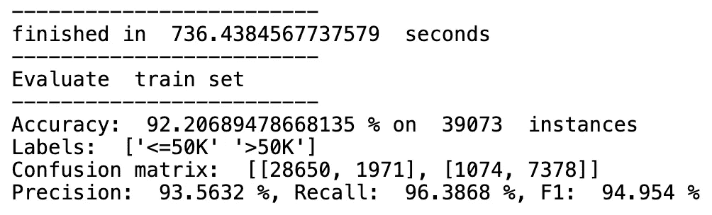
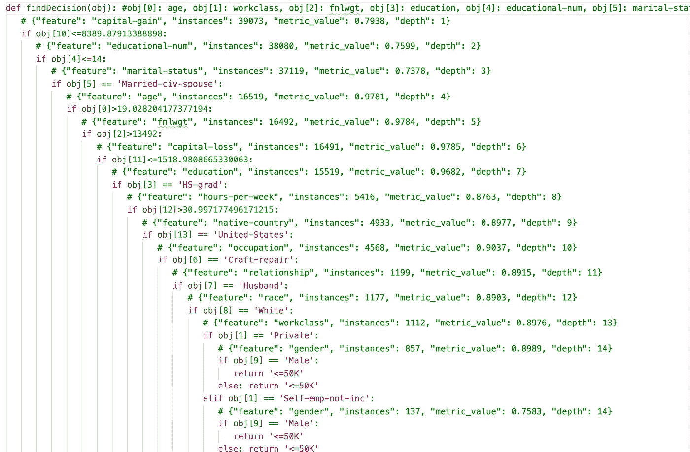
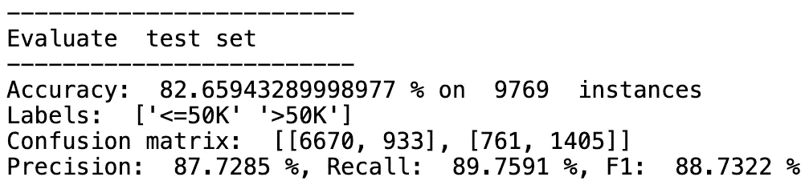
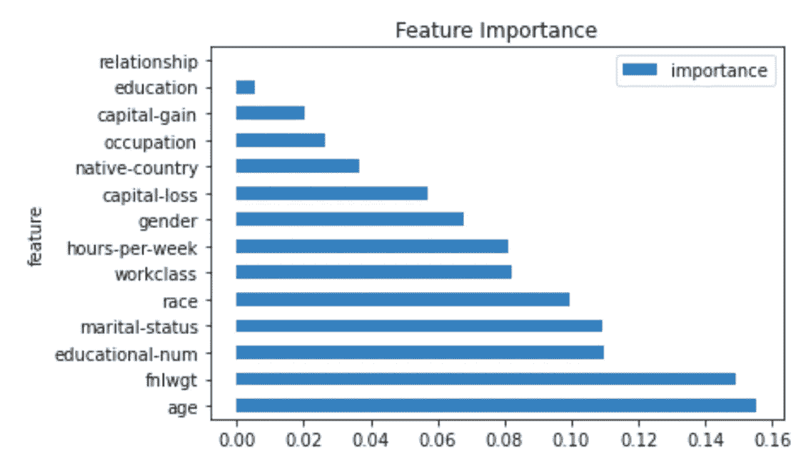

# chef boost——基于树的模型的替代 Python 库

> 原文：<https://towardsdatascience.com/chefboost-an-alternative-python-library-for-tree-based-models-f46af028a348?source=collection_archive---------14----------------------->


照片由[张克帆·马塞多](https://unsplash.com/@johnathanmphoto?utm_source=unsplash&utm_medium=referral&utm_content=creditCopyText)在 [Unsplash](https://unsplash.com/s/photos/chef?utm_source=unsplash&utm_medium=referral&utm_content=creditCopyText) 上拍摄

## 与 scikit-learn 的主要区别概述

我在我的 Twitter feed 中随机遇到了`chefboost`,鉴于我以前从未听说过它，我决定快速浏览一下并测试一下。在本文中，我将简要介绍这个库，提到它与首选库`scikit-learn`的主要区别，并展示一个实践中的`chefboost`的快速示例。

# chefboost 简介

我认为最好的描述是在库的 [GitHub repo](https://github.com/serengil/chefboost) 中提供的:“chefboost 是 Python 的一个轻量级决策树框架，支持分类特性”。

与`scikit-learn`相比，`chefboost`有三个突出的特点:

*   支持分类特征，这意味着我们不需要使用例如一键编码对它们进行预处理。
*   使用`chefboost`训练的决策树被存储为专用 Python 文件中的 *if-else* 语句。通过这种方式，我们可以很容易地看到树做出了什么决定来达到一个给定的预测。
*   我们可以选择多种算法中的一种来训练决策树。

遵循最后一点，`chefboost`为分类树(ID3、C4.5 和 CART)提供了三种算法，为回归树提供了一种算法。老实说，我并不完全确定哪一个是当前在`scikit-learn`中实现的，所以我查看了[文档](https://scikit-learn.org/stable/modules/tree.html#tree-algorithms-id3-c4-5-c5-0-and-cart)(它也提供了算法的简明摘要)。原来`scikit-learn`用的是优化版的 CART 算法，没有分类特征的支持。

在我们已经介绍的基础上，`chefboost`还提供了一些更高级的基于树的方法，比如随机森林、梯度增强和 Adaboost。

# Python 中的一个例子

和往常一样，我们从导入库开始。

对于这个例子，我们将使用*成人*数据集。你可能已经遇到过，但简单来说，目标是预测一个成年人的年收入是高于还是低于 5 万美元。为此，我们从 1994 年人口普查数据库中选择了一些数字和分类特征。你可以在这里找到原始数据集[。](https://archive.ics.uci.edu/ml/datasets/adult)

`chefboost`中的一个怪癖是对目标变量的处理——它必须存储在与特征相同的数据帧中，它必须被称为`Decision`,并且必须是数据帧的最后一列。很奇怪，但这可能是有原因的。

我们还将把数据分成训练集和测试集。然而，数据的非标准结构要求`scikit-learn`的`train_test_split`函数有一点不同的用法。即使数据集不是高度不平衡的，我们也使用了目标列的分层分割。

通常，我们也会将分类特征编码为布尔虚拟对象，但是`chefboost`可以直接处理它们。这就是我们开始训练模型的原因。

为了训练模型，我们使用了`fit`函数，并传递 dataframe(包含正确格式的数据)和`config`字典作为参数。这一次，我们只表明我们想要使用 CART 算法。

假设我们的数据包含分类和数字特征，我们也可以使用 C4.5 算法，但不能使用 ID3，因为它不能处理数字特征。

培训完成后，我们得到了以下总结。



作者图片

很高兴看到这么多现成的指标，但最突出的是培训时间。这一棵树花了 10 多分钟来训练！可以通过在`config`字典中设置`enableParallelism`到`True`来并行化训练。这样，树的分支被平行地训练。然而，这样做并没有带来实际的训练速度的提高，至少在我的机器上没有。

另外，与`scikit-learn`的另一个区别是`chefboost`主要使用函数而不是类。

训练模型导致创建一个新文件-> `rules.py`。如简介中所述，它以嵌套的 *if-elif-else* 语句的形式包含了决策树的整个结构。

下面你可以看到脚本的一部分，整个脚本有 20.5 千行长。一方面，使用这样的嵌套结构，决策的逻辑非常清晰。但是另一方面，如果不限制树的最大深度(我认为这对于`chefboost`中的决策树是不可能的)，遵循决策路径根本不容易。



作者图片

训练好一个模型后，我们可以将它存储在 pickle 文件中，或者使用`restoreTree`函数直接从`rules.py`文件中加载它。

为了获得预测，我们使用了`predict`函数。

您可能已经注意到，我们只向函数传递了一行数据。不幸的是，这是`chefboost`做预测的唯一方法。我们可以自然地循环整个数据帧，但这不如`scikit-learn`的 predict 方法方便。

我们可以做的是使用`evaluate`函数运行评估。

我们得到了一个类似于我们从训练中得到的输出。但是我们不会花太多时间来分析树的性能，因为这不是本文的目的。



作者图片

该库提供的另一个特性是特性重要性分析。我就不赘述它是如何计算的了(你可以在这里找到它们[)。为了获得重要性，我们需要使用`feature_importance`函数并提供`rules.py`文件的路径作为参数。](https://sefiks.com/2020/04/06/feature-importance-in-decision-trees/)



作者图片

结果表明，年龄是预测一个人年收入是否超过 5 万美元的最重要的特征。

作为最后一件事，我想比较一下`chefboost`和`scikit-learn`的速度。自然，后一个库中的决策树需要不同格式的数据，所以我们相应地准备了数据。

我们使用与之前相同的分割设置，以确保公平的比较。然后，我们使用`%time`魔法来看看训练模型需要多长时间。

```
CPU times: user 1e+03 ns, sys: 0 ns, total: 1e+03 ns 
Wall time: 3.1 µs
```

这是一个相当大的差异…我不确定是什么原因，我打赌会创建树的 *if-else* 表示。

# 外卖食品

*   `chefboost`是用于训练基于树的模型的备选库，
*   突出的主要特性是对分类特性的支持和以嵌套 *if-else* 语句形式的模型输出，
*   与`scikit-learn`相比，训练要慢得多，并且要调整的超参数的选择非常有限。

你可以在我的 [GitHub](https://github.com/erykml/medium_articles/blob/master/Machine%20Learning/chefboost.ipynb) 上找到本文使用的代码。此外，欢迎任何建设性的反馈。你可以在推特或评论中联系我。

如果您喜欢这篇文章，您可能还会对以下内容感兴趣:

</explaining-feature-importance-by-example-of-a-random-forest-d9166011959e>  </beautiful-decision-tree-visualizations-with-dtreeviz-af1a66c1c180>  </linkedins-response-to-prophet-silverkite-and-greykite-4fd0131f64cb> 