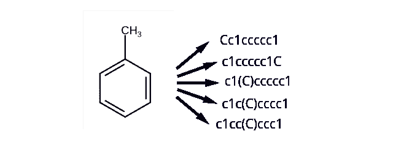
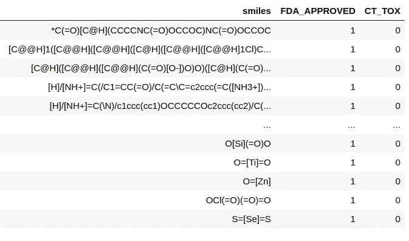
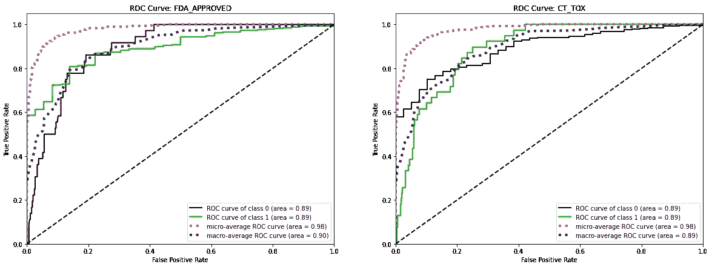
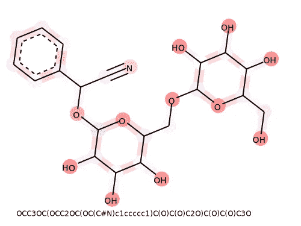

# 三行代码的化学预测

> 原文：<https://towardsdatascience.com/chemical-predictions-with-3-lines-of-code-c4c6a4ce7378?source=collection_archive---------17----------------------->

## 使用 Chemprop & graph 神经网络的最新结果

由宏向量设计—[www.freepik.com](http://www.freepik.com)

在这篇文章中，我们使用机器学习/人工智能来预测小分子的属性(这项任务被称为 *QSAR* )。这是通过使用来自开源库 [Chemprop](https://github.com/chemprop/chemprop) 的最先进的图形神经网络来完成的。

典型的药物以小分子的形式出现，可以调节我们体内的一些生物过程。不幸的是，在这个过程中可能会出现难以想象的问题；这些化合物可能是有毒的，从我们体内清除非常缓慢，与非预期的其他分子相互作用，等等。因此，我们希望在这些小分子被注射到人体之前，非常仔细地对它们进行检测。

在药物发现的早期阶段，通常在实验室规模的实验中测试小分子的许多不同变体的各种性质，例如溶解度、不同形式的毒性、结合亲和力等。这个过程可能非常费力，所以使用 ML 来根据已经完成的实验预测这些特性不是很好吗？这项任务在化学信息学中是众所周知的，近年来由于深度学习的进步而受到越来越多的关注。

有大量的库可以进行这种分析。在本文中，我们将使用名为 [ChemProp](https://github.com/chemprop/chemprop) 的开源库，该库由麻省理工学院的一个研究小组不断更新，它在广泛的基准数据集上取得了出色的结果，同时使用起来极其简单。

# 输入数据是什么？

预测化学性质传统上被称为定量结构-活性关系(QSAR)模型。这些模型的输入是分子的字符串表示，也称为“微笑”字符串。例如，这可能看起来像这样:

不同的微笑字符串可以代表同一个分子，但是每个微笑字符串只对应一个分子。作者图片

从本质上讲，我们的数据集由用微笑字符串表示的分子和我们想要预测的每个分子的一组属性组成。这可以看起来如下:属性是一个分子是否被 FDA 批准和是否通过毒性测试的二元变量。

每个样本都是一个分子，由它的微笑字符串和一个或多个属性表示——图片由作者提供。

# 这个 Chemprop 模型是什么？

Chemprop 模型于 2019 年在[1]发表，但此后一直在不断更新，并在一系列后来的出版物中显示出其价值，最引人注目的是在[2]中，他们用它来发现新的潜在抗生素化合物。

底层的 Chemprop 是在 Pytorch 中实现的消息传递神经网络，这意味着模型的输入是分子的图形表示。然而，除了直接在图表上工作之外，Chemprop 还自动使用更经典的衍生化学特征，这意味着它通常在小型和大型数据集上都表现良好(与其他模型相比)。要了解更多信息，我推荐阅读论文[1]。

Chemprop 可以从 PyPI: `pip install chemprop.`安装

# 让我们开始吧:3 行代码

假设我们有一个如上所示的数据集，带有一些微笑字符串和两个我们希望预测的属性；FDA 是否批准了该化合物，以及它是否通过了临床试验期间的毒理学测试。

大量类似的数据集可以在网上找到，例如，查看[这些基准](https://github.com/chemprop/chemprop/blob/master/data.tar.gz)。在 Chemprop 的典型使用中，我们将经历以下步骤:1)优化模型的超参数，2)训练模型，以及 3)对一组新的分子进行预测。

## 步骤 1:调整超参数。

Chemprop 有一些可调的超参数，可以调整这些参数以在给定数据集上获得最佳结果。安装 chemprop 后，我们可以运行 50 次 [TPE 超参数调整](https://papers.nips.cc/paper/2011/file/86e8f7ab32cfd12577bc2619bc635690-Paper.pdf)迭代:

## 第二步:训练模型

有了在`data/config.json`中识别和保存的理想超参数，我们就可以用这些参数训练模型:

这里有几个值得注意的有趣参数:

*   `num_folds`:我们创建 5 个折叠(不同的训练/测试)分割，并在每个折叠上训练/评估模型。
*   `ensemble_size`:我们用不同的初始化创建了一个 3 个模型的集合，这将提高平均性能。请注意，这 3 个模型每个都有 5 个折叠，所以我们总共训练了 15 次模型！
*   `split_type`在创建我们的内部训练/测试分裂时，我们确保将相似的分子放入相同的折叠中，以获得更真实的泛化度量。

在我的训练运行中，我收到了下面的输出:`Overall test AUC: 0.871 +/- 0.036`——即来自训练交叉验证的非常有希望的结果。

## 步骤 3:根据新数据评估模型。

既然我们已经训练了模型，下一步就是在测试数据集上评估它的性能。从交叉验证中我们已经知道，性能应该是大约 0.84 的 AUC，但是让我们看看:

这将生成一个文件`predictions.csv`，其中包含我们测试数据集中化合物的预测。请注意，这些预测是上一步中训练的总共 15 个模型的平均值。将此与真实值进行对比，我们得到以下结果:

在测试数据集上评估已训练的 chemprop 模型。由作者策划。

非常适合最小的努力！👏

# 更进一步:解释

有时仅仅得到点预测是不够的；我们可能想知道*为什么*模型返回一个给定的预测。例如，如果预测该分子是有毒的，那么知道该分子的哪一部分引起所述毒性将是有价值的。通过从[这里](https://github.com/chemprop/chemprop)获取我的 Chemprop 分支，我们可以使用 [BayesGrad](https://arxiv.org/pdf/1807.01985.pdf) 方法的变体创建这样的解释:

对于由`interpret_local.py`脚本评估的每种化合物，算法将返回一个解释图，例如，在上面训练的溶解度模型的情况下，它将显示亲水原子(氧)如何增加分子的溶解度:

解释溶解度预测的热图。图片由作者提供。

简而言之，这里分子中给定原子或键的“重要性分数”被计算为预测目标相对于来自该原子或键的特征的梯度；即，归因于给定键/原子的梯度的绝对和越大，假定该键/原子对预测越重要。众所周知，以这种方式直接生成的灵敏度图噪声很大。因此，BayesGrad 建议使用 dropout 对网络参数 *W* 的后验分布 *p(W|D)* 进行采样，允许我们计算所有这些采样网络的梯度平均值，从而平滑结果。我们没有依赖 Chemprop 中包含的 dropout，而是通过简单地使用交叉验证折叠和集合模型中的权重 *W* 对 *p(W|D)* 进行采样，即，对于一组 20 个模型，我们计算每个原子和键的梯度的平均和。

# 结束语

能够预测化学性质是极其强大的；想象你有一组 100 个潜在的分子候选者。合成它们中的每一个都是一项艰巨的任务。如果我们可以根据它们满足各种特性的可能性来对它们进行排序，我们就可以首先综合出最有希望的候选者。此外，通过解释模型预测，我们可以了解更多关于分子工作或不工作的原因，因此甚至可以根据这些信息开发出更有前途的候选分子。

使用 3 个命令来训练和预测这些模型可能会给人一种这是一个已解决问题的印象。事实并非如此。我推荐阅读 Andreas Bender 的[这篇文章](http://www.drugdiscovery.net/2020/10/13/how-to-lie-with-computational-predictive-models-in-drug-discovery/)，思考从这些模型中得出结论是多么的危险和困难。

[1] Kevin Yang *等*， *J. Chem .Inf。模型。* 2019，59，8，3370–3388

[2]乔纳森·m·斯托克斯*等*，抗生素发现的深度学习方法(2020)，*细胞，180，4，P688–702。E13*