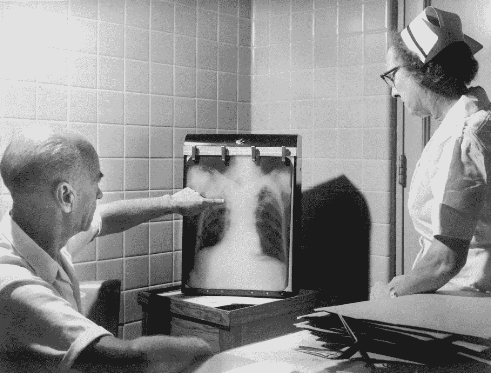
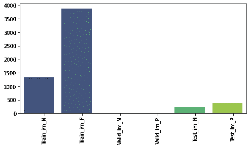
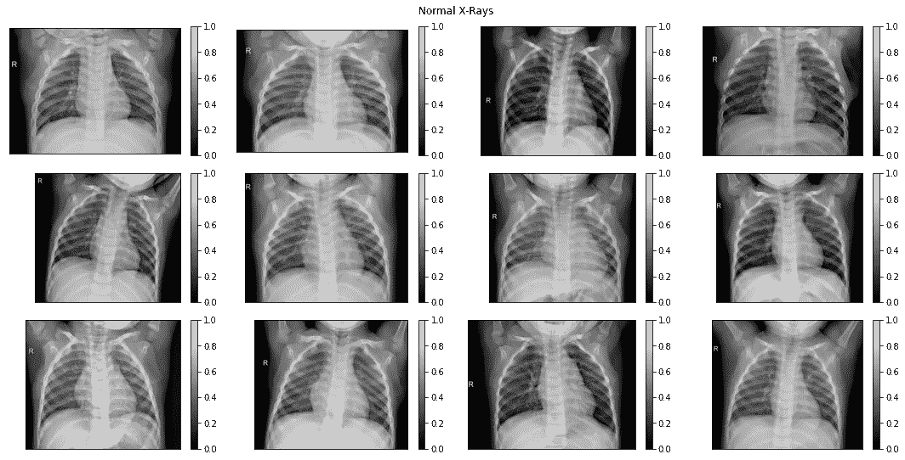
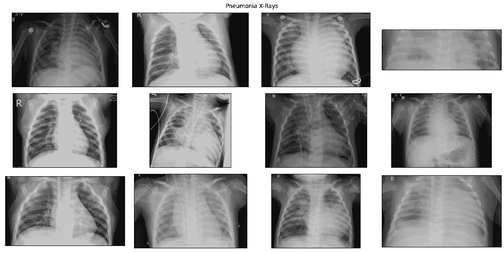
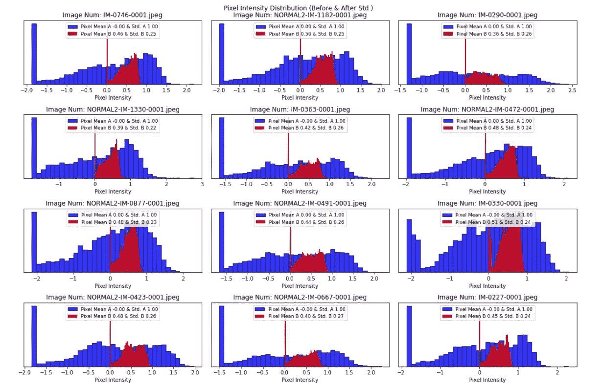
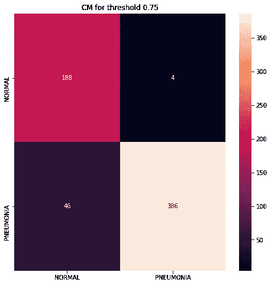
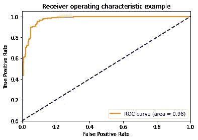

# 胸部 x 光和肺炎:使用 TensorFlow 进行深度学习

> 原文：<https://towardsdatascience.com/chest-x-ray-pneumonia-deep-learning-with-tensorflow-a58a9e6ade70?source=collection_archive---------24----------------------->

## 处理班级失衡并有效使用预先训练的模型



[疾控中心](https://unsplash.com/@cdc?utm_source=unsplash&utm_medium=referral&utm_content=creditCopyText)在 [Unsplash](https://unsplash.com/s/photos/chest-x-ray?utm_source=unsplash&utm_medium=referral&utm_content=creditCopyText) 拍的胸部 x 光照片

在过去的几年里，我们已经看到以各种形式使用深度学习进行医学诊断的快速增长，特别是在医学图像的分析中。这里我们将建立一个管道，对肺炎患者和非肺炎患者的胸部 x 光图像进行分类。在知识共享许可下，完整的数据集可以在 [Kaggle](https://www.kaggle.com/paultimothymooney/chest-xray-pneumonia) 获得。在我们建立管道之前，让我们看看你能从这篇文章中学到什么

*   *使用深度神经网络(DNN)进行二元分类。*
*   *使用 TensorFlow 数据集创建更快的数据分析管道。*
*   *更好的数据预处理技术(例如:标准化)。*
*   *tensor flow 模型中的 lambda 层的扩充、重新缩放等。*
*   *阶层失衡与建筑自定义加权交叉熵损失。*

不要耽搁，让我们开始吧！【这里用到的所有代码都可以在 [Kaggle 笔记本](https://www.kaggle.com/suvoooo/detectpneumonia-inceptionresnetv2-class-imbalance/notebook)中找到】。

## 熟悉数据结构:

因为我们将直接访问 Kaggle 输入目录中的数据，所以让我们来看看标签“正常”和“肺炎”在 Train、Validation 和 Test 文件夹中的分布。下面是我用来检查每个文件夹中文件数量的代码块



图 1: X 标签代表文件夹名称。训练、测试、验证，N 代表正常，P 代表肺炎。来源:[作者笔记](https://github.com/suvoooo/Learn-TensorFlow/blob/master/detectpneumonia-inceptionresnetv2-class-imbalance.ipynb)

首先，我们看到训练图像*是类别不平衡的，标记为“肺炎”的图像比“正常”的图像多得多。*此外，验证文件夹包含的示例非常少(准确地说是 8 个正常图像和 8 个肺炎图像)。

```
tot_normal_train = len(train_im_n) + len(valid_im_n) 
tot_pneumonia_train = len(train_im_p) + len(valid_im_p)
print ('total normal xray images: ', tot_normal_train)
print ('total pneumonia xray images: ', tot_pneumonia_train)>>> total normal xray images:  1349
total pneumonia xray images:  3883
```

我们也可以想象一些正常和肺炎的图像，如下所示



“正常”X 射线图像:原始数据来源:在 [Kaggle](https://www.kaggle.com/paultimothymooney/chest-xray-pneumonia) 中可用。

类似地，我们也可以查看“肺炎”图像—



肺炎的 x 光图像:原始数据来源:可在 [Kaggle](https://www.kaggle.com/paultimothymooney/chest-xray-pneumonia) 获得。

在阅读了一些在线资源后，比如[这个](https://www.wikidoc.org/index.php/Pneumonia_chest_x_ray)，我注意到发现肺炎的通常方法是搜索胸部 x 光片中的阴影。从上面的图片来看，与普通 x 射线相比，这些图像通常看起来不透明。但同样重要的是要记住，胸部 x 光检查可能不会一直告诉我们全部情况，有时视觉结果可能会产生误导。

## 预处理；标准化:

我们将调整图像数据，使数据的新平均值为零，数据的标准偏差为 1。稍后，我们将使用 TensorFlow 数据集，并定义一个函数，在该函数中，图像中的每个像素值都将替换为一个新值，该新值通过减去平均值并除以标准偏差(*x**μ)/σ计算得出。*让我们看看标准化如何帮助我们在一些随机示例中分配像素值——



对于一些随机图像，标准化(A)之前(B)之后(A)的像素强度分布。来源:[作者笔记。](https://github.com/suvoooo/Learn-TensorFlow/blob/master/detectpneumonia-inceptionresnetv2-class-imbalance.ipynb)

为了包括这种类型的标准化，我们创建了一个函数，该函数将在模型构建中用作 lambda 层。因此，GPU 的能力也将用于这个过程—

```
#### define a function that will be added as lambda layer later
def standardize_layer(tensor):
    tensor_mean = tf.math.reduce_mean(tensor)
    tensor_std = tf.math.reduce_std(tensor)
    new_tensor = (tensor-tensor_mean)/tensor_std
    return new_tensor
```

## 使用 TensorFlow 数据集构建输入管道:

在之前的一篇[帖子](/time-to-choose-tensorflow-data-over-imagedatagenerator-215e594f2435)中，我详细描述了如何使用 [TensorFlow 数据集 API](https://www.tensorflow.org/api_docs/python/tf/data/Dataset) 构建包括增强在内的输入管道来加速 DNN 训练。我将遵循类似的步骤。由于图像数据存在于训练、测试和验证文件夹中，我们可以从`[image_dataset_from_directory](https://keras.io/api/preprocessing/image/)`功能开始——

正如我们之前检查的，验证目录中只有 16 个文件，只使用 16 个图像进行验证并不是一个好主意。因此，我们需要添加训练和验证数据集，然后按照合理的百分比对它们进行拆分。首先，让我们检查“训练”和“有效”数据集中的元素数量。

```
num_elements = tf.data.experimental.cardinality(train_dir).numpy()
print (num_elements)
num_elements_val = tf.data.experimental.cardinality(val_dir).numpy()
print (num_elements_val)>>> 82
1
```

我们看到有 82 个训练批次和 1 个验证批次。为了增加验证批次，首先，让我们连接“训练”和“验证”数据集。然后，我们将总数据集的 20%分配给验证，并使用下面的代码块使用`dataset.take`和`dataset.skip`来创建新的数据集—

```
new_train_ds = train_dir.concatenate(val_dir)

print (new_train_ds, train_dir)

train_size = int(0.8 * 83) *# 83 is the elements in dataset (train + valid)*
val_size = int(0.2 * 83)

train_ds = new_train_ds.take(train_size)
val_ds = new_train_ds.skip(train_size).take(val_size)

*#### check the dataset size back again* 
num_elements_train = tf.data.experimental.cardinality(train_ds).numpy()
print (num_elements_train)
num_elements_val_ds = tf.data.experimental.cardinality(val_ds).numpy()
print (num_elements_val_ds)>>> <ConcatenateDataset shapes: ((None, 300, 300, 1), (None, 1)), types: (tf.float32, tf.float32)> <BatchDataset shapes: ((None, 300, 300, 1), (None, 1)), types: (tf.float32, tf.float32)>
66
16
```

我已经描述了 [**【预取】技术**](/time-to-choose-tensorflow-data-over-imagedatagenerator-215e594f2435) 以及它比 ImageDataGenerator 快多少。让我们加上这个—

```
autotune = tf.data.AUTOTUNE ### most important function for speed up training

train_data_batches = train_ds.cache().prefetch(buffer_size=autotune)
valid_data_batches = val_ds.cache().prefetch(buffer_size=autotune)
test_data_batches = test_dir.cache().prefetch(buffer_size=autotune)
```

我还将添加一个重缩放层和一些增强层，这些都将作为 lambda 层包含在模型中。让我们把它们定义如下—

```
from tensorflow.keras import layers

rescale_layer = tf.keras.Sequential([layers.experimental.preprocessing.Rescaling(1./255)])

data_augmentation = tf.keras.Sequential([
  layers.experimental.preprocessing.RandomFlip(),
  layers.experimental.preprocessing.RandomRotation(10), 
  layers.experimental.preprocessing.RandomZoom(0.1) ])
```

## 加权二元交叉熵损失；

使用加权 BCE 损失背后的想法是，由于我们有比“正常”更多的“肺炎”x 射线图像，该模型对它们的错误分类进行了加权。因此，我们改变了这种偏见，并试图迫使模型对正常和肺炎图像进行同等加权。我们根据每个类别的图像数量除以图像总数来计算频率项。这些权重随后用于构建*定制加权 BCE 损失函数*。下面的代码块是用于给定问题的一个例子

## 建立一个 DNN 模型，包括扩展:

在定义了适当的定制损失函数之后，我们剩下的是构建一个包括作为 lambda 层的重新缩放和增强的模型。对于给定的工作，我使用了 InceptionResNetV2 预训练模型，你可以在这里检查 Keras 模块。在 Kaggle 比赛中，我们不允许使用互联网，所以我需要下载预先训练的重量，这解释了 InceptionResNetV2 函数中的`weights`参数。在将图像批次馈送到模型之前，重新缩放、标准化&增强都作为 lambda 层添加。让我们看看下面的代码块—

编译后，包括一些“回调”,我们准备好训练模型。为了评估模型对测试数据的性能，我们可以绘制混淆矩阵和 ROC 曲线。

```
y_pred = model.predict(test_data_batches)
true_categories = tf.concat([y for x, y in test_data_batches], axis=0)
```

让我们设置一个 0.75 的阈值来分配标签“1”和任何低于标签“0”的值。

```
y_pred_th = (y_pred > 0.75).astype(np.float32)from sklearn.metrics import confusion_matrix
cm = confusion_matrix(y_pred_th, true_categories)class_names = train_dir.class_namesplt.figure(figsize=(8,8))
plt.title('CM for threshold 0.75')
sns_hmp = sns.heatmap(cm, annot=True, xticklabels = [class_names[i] for i in range(len(class_names))], 
                      yticklabels = [class_names[i] for i in range(len(class_names))], fmt="d")
fig = sns_hmp.get_figure()
```

上面的代码块导致了下面的混乱矩阵—



二元分类的混淆矩阵。(来源:[作者笔记](https://github.com/suvoooo/Learn-TensorFlow/blob/master/detectpneumonia-inceptionresnetv2-class-imbalance.ipynb))

类似地，我们也可以绘制 ROC 曲线，结果如下所示—



ROC 曲线为‘正常’和‘肺炎’图像分类。(来源:[作者笔记](https://github.com/suvoooo/Learn-TensorFlow/blob/master/detectpneumonia-inceptionresnetv2-class-imbalance.ipynb))

## 最终注释:

上面使用的所有代码都可以在我的 [GitHub](https://github.com/suvoooo/Learn-TensorFlow/blob/master/detectpneumonia-inceptionresnetv2-class-imbalance.ipynb) 上找到，你也可以查看 [Kaggle 笔记本](https://www.kaggle.com/suvoooo/detectpneumonia-inceptionresnetv2-class-imbalance)。所使用的数据集在许可[知识共享](https://creativecommons.org/licenses/by/4.0/)下的 [Kaggle](https://www.kaggle.com/paultimothymooney/chest-xray-pneumonia) 中可用，因此我们可以自由使用和调整。最后，总结一下，我们经历了一个包括类不平衡数据集的数据分析管道，并学会了有效地使用 TensorFlow 数据集。

保持坚强，干杯！