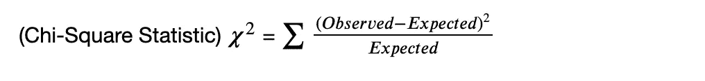
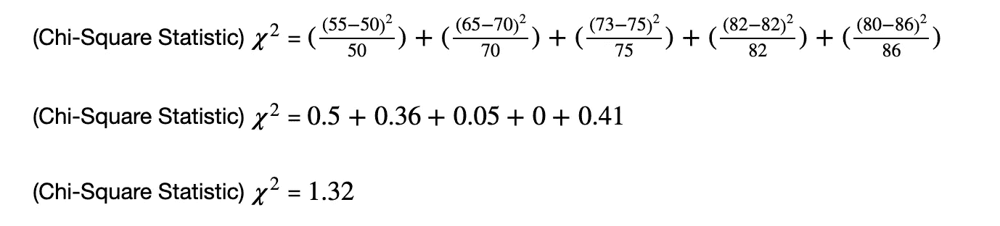
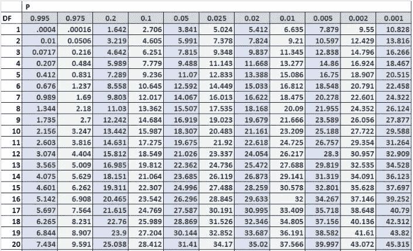

# 卡方统计和卡方分布

> 原文：<https://towardsdatascience.com/chi-square-statistic-chi-squared-distribution-2499084b5da8?source=collection_archive---------28----------------------->

## 在本文中，我将解释卡方统计量及其在假设检验中的作用，在假设检验中，数据集具有理论值，需要用实际数据集进行验证


约翰·莫塞斯·鲍恩在 [Unsplash](https://unsplash.com?utm_source=medium&utm_medium=referral) 上拍摄的照片

卡方统计是一个描述理论假设数据和实际数据之间关系的数字。它通常被认为是用实际数据集验证理论数据集并以数字形式给出结果的数字或统计值。



卡方统计公式

卡方统计的公式如上所示。这里，*观测值*是具有实际值的实际观测数据集，*预期值*是具有理论值的预期数据集。

> 关于卡方统计值得注意的一点是，该值始终为正值，因为当我们拥有数据集并评估统计时，即使数据集中有正值也可能有负值，这些值也是平方的。这将总是产生一个正值。
> 同样，卡方统计具有近似的卡方分布。

卡方分布是由 P 值( *P* )和自由度( *DF* )分布和分隔的一组值。
卡方分布可用于检查极端值或大于该值的结果的概率。

在这种情况下，我们通常会考虑一个显著性水平，例如我们在这里考虑的 *P* =10% (0.1)。因此，当我们获得卡方统计值时，我们通过特定的自由度(DF)检查分布中的值。如果分布中卡方统计值的概率( *P* )为 10%(0.1)及以上，我们无法拒绝零假设，否则我们拒绝它。

下表中的 *P* 是 **p 值**，它基本上是我们得到统计值时在分布表中检查的概率。

*DF* 是**自由度**，它取决于数据集中值的数量。如果在*预期*和*观察*列的数据集中有 N=4 个值，这 4 个值将应用于卡方统计公式。但是，如果我们注意到，当数据集中有 N=4 个值，并且我们对这 N 个值应用特定的公式时，我们基本上只需要前 3 个值来预测第 4 个值。所以这里的 *DF* 会是 3。 *DF* =N-1=3

让我们考虑一个例子，其中我们想知道学生在课堂上的出席情况。假设我们一个班有 5 个学生。因此，N = 5。因此，我们要求班主任告诉我们该班学生的大致出勤率。老师给我们提供了这样的数据:

```
Expected(%) : [50, 70, 75, 82, 86]
```

但是，接下来我们会用存储的学生出勤的实际数据来验证老师给出的数据。我们得到这样的结果:

```
Observed(%) : [55, 65, 73, 82, 80]
```

现在，我们可以看到两个数据集之间存在差异。所以，如果我们要拒绝或者不能拒绝这个假设(预期(%))，我们就要检验这个假设。

为此，我们将考虑两种可能性:

```
1st Probability : The teacher's distribution is correct
2nd Probability : The teacher's distribution is incorrect
```

我们将以 10%(0.1)的显著性进行假设检验。
如果根据*预期*和*观察*计算的卡方统计值在特定自由度( *DF* )内具有 10%或以上的 *P* ，则我们不会拒绝老师的假设，否则我们将拒绝该假设。

现在我们将计算卡方统计量:


卡方统计公式

现在，我们将这个公式应用于两个数据集:



如上所述，我们得到卡方统计值 1.32。
我们有以下数据:


现在，我们将检查自由度 *DF* = 4 内卡方分布表中统计值 1.32 的 P 值( *P* )。



卡方分布([来源](https://www.statology.org/how-to-read-chi-square-distribution-table/))

> 这里，在 DF = 4 的范围内，我们看到统计值 5.989 的概率或 P 值(P)为 0.2，即 20%。所以，任何小于 5.989 的值都有超过 20%的概率。我们的统计值是 1.32。所以这个值也会有超过 20%的概率，相当高于我们的显著性水平(10%)。
> 因此，我们将无法拒绝老师的假设(零假设)。

# **结论**

在本文中，我借助一个例子解释了卡方统计量的概念。我解释了卡方统计和卡方分布如何通过假设检验帮助我们评估理论数据集值及其实际值。我很高兴听到你对这篇文章的评论。请随时联系我，在 Linkedin 或评论中给我发消息。