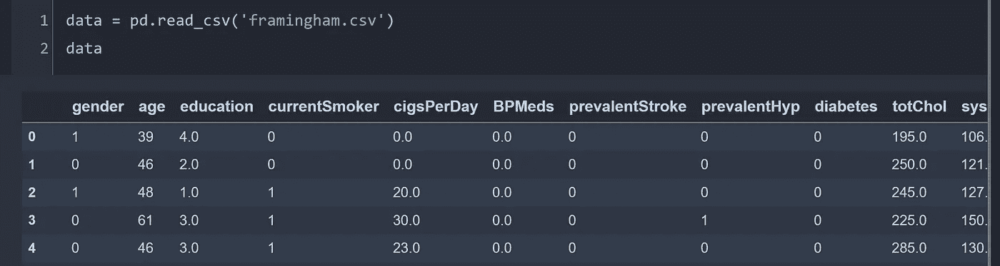
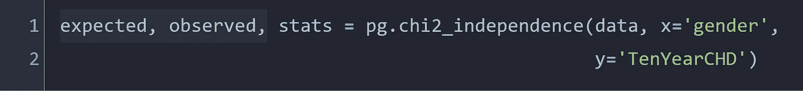
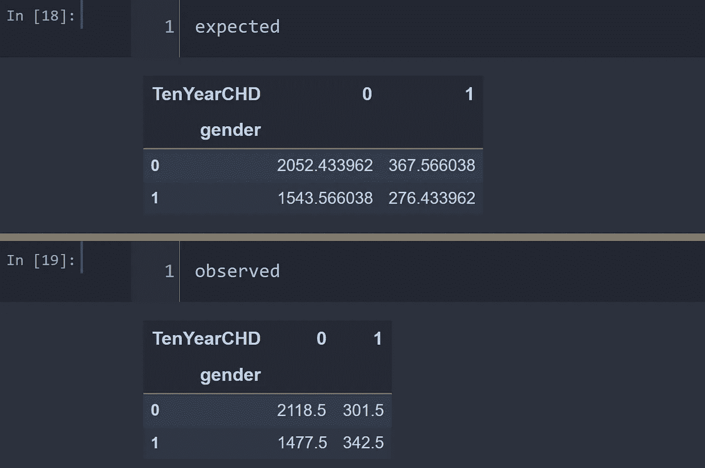
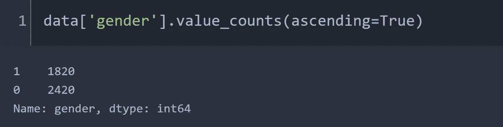
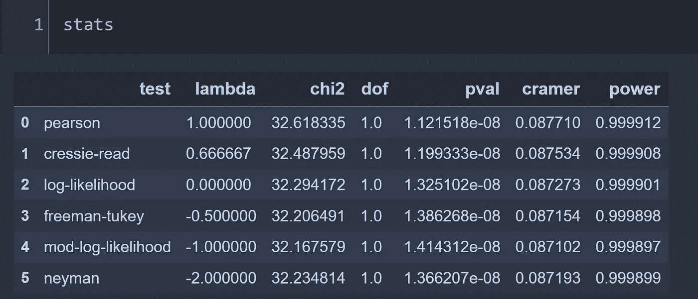

# 独立性卡方检验

> 原文：<https://towardsdatascience.com/chi-square-test-for-independence-cf2f5057cc35?source=collection_archive---------22----------------------->

## 使用 pingouin 库实现卡方分析

图片来自 [unsplash](https://unsplash.com/photos/FBL09HBLuWg)

> **简介**

数据科学家有时需要检查一个分类变量是否与同一人群中的另一个分类变量相关。如果数据是连续的，人们可以简单地计算变量之间的相关性，并根据相关系数确定这些变量是否高度相关。卡方检验是对分类变量进行分析的工具。例如，我们可能想检查性别是否在心脏病中起作用，或者教育是否与婚姻状况有关。在这种情况下，卡方检验是正确的分析工具。

> **背景**

为了进行卡方检验，我想简单回顾一下相关术语的背景。python 中的分析和输出解释需要理解这些术语。

> **P 值、置信区间和显著性水平**

p 值是两个值之间的差异偶然存在的概率。如果 p =值很小，观察到的数据偶然出现的概率很小，因此我们得出结论，观察到的数据和预期的数据之间存在统计上的显著差异。

置信区间是测试结果百分比的范围。如果置信区间设定为 95%，这并不意味着我们对测试结果有 95%的把握。可以认为，如果我们重复测试 100 次，测试结果将在 100 次中有 95 次落入该范围内。通常，CI 在大多数情况下设置为 95%。

另一个名为显著性水平(alpha)的术语是当假设事实上为真时拒绝零假设的概率。大多数情况下通常设定为 5%。

> **卡方检验**

卡方检验有几种类型。一种类型的卡方检验被称为拟合优度检验，它检查一个分类变量是否很好地符合总体数据。另一种类型的检验检查一个分类变量相对于另一个分类变量的独立性，这被称为独立性卡方检验。在本文中，我将通过检验卡方统计量和 p 值来检验一个分类变量是否与另一个分类变量相关。

> **用 python 实现**

让我们导入心脏病的数据。它显示了来自几个人的心脏相关变量的数据，如收缩压和舒张压、糖尿病、身体质量指数、心率葡萄糖水平、吸烟习惯等。

心脏病数据集

Python 有来自`scipy.stats`的`chi2_contingency`模块，我们需要在那里提供列联表。列联表是两个分类变量之间关系的总结。如果我们只提供数据，有一个名为 pingouin 的模块可以提供列联表。

根据我们的数据，假设我们想要检查冠心病(CHD)是否与性别分布有关。使用 pingouin，代码只有一行。

使用 pingouin 获得卡方统计数据

chi2_independence 返回三个表。*期望*表是列联表，显示了初始数据中两个感兴趣的分类变量之间的关系。

为了分析预期数据，我们首先需要获得初始数据中不同性别的比率。我们的数据显示，第 0 组和第 1 组之间的比例为 2420:1820 = 1.329，为了成为冠心病的不良预测因素，冠心病各组之间的性别比例应该相似。

当我们取第 0 组和第 1 组之间的比率时，我们在*期望*表中得到不同性别之间相同的 1.329:1 比率。例如，十年期第 0 组的性别比率为 2052.42/1543.56，相当于 1.329(近似值)，另一组也是如此。

零假设表明我们期望观察到的表中有相同的比率。我们需要通过卡方统计来验证零假设，卡方统计根据自由度和显著性水平与卡方表中的特定卡方值进行比较。上面的*观察值*表显示了数据中实际观察到的性别类别和冠心病之间的关系。如果我们从*观察到的*表中计算性别比例，我们得到 2118.5/1477.5 = 1.433 和 342.5/301.5 = 1.136，这与预期的比例不同。接下来，我们需要从 *stats* 表中找出测试统计量和 p 值。

Ch 平方统计量和 p 值

皮尔逊残差的卡方统计量是最常见的统计量。皮尔逊残差被定义为通过期望值的平方根归一化的观察值和期望值之间的差。

> *皮尔逊残差=(观察值-期望值)/(sqrt(期望值))*

对于这个单一自由度和 5%的显著性水平，卡方统计的临界值是 3.841，测试统计是在 32.618 获得的，这要高得多。该统计是对观察数据偏离预期值的程度的度量。我们还观察到一个非常小的 p 值，它基本上提供了反对零假设的证据。p 值越小，观察到的差异只是偶然出现的可能性就越低。因此，在这种情况下，我们有强有力的证据来拒绝零假设，并声明观察到的差异是真实的。本质上，我们可以得出结论，性别是冠心病的一个很好的预测因素。

> **A/B 测试的扩展**

卡方检验可视为简单 A/B 检验的扩展版本，在两组之间进行，以检查两组之间是否存在任何观察到的差异。一组称为*对照组*，另一组称为*治疗组*。有时我们感兴趣的是一次检查多个治疗，卡方检验提供了各组与对照组偏离程度的信息。比如查看翻新网页多个版本的点击量，我们实质上可以做两个以上的组，提供给不同的用户组。应急表应反映新版本网页以及初始页面的点击次数或最终购买次数。

> **结论**

在本文中，我描述了卡方测试的背景，并展示了它在 python 中的实现。卡方检验是检查分类变量独立性的简单统计检验。当需要多重处理来检查时，我们需要超越简单的 A/B 检验，进行卡方检验。

[Github 页面](https://mdsohelmahmood.github.io/2021/07/14/Chi_square.html)

参考:

1.  [pingouin 文档](https://pingouin-stats.org/generated/pingouin.chi2_independence.html)
2.  [心脏病数据](https://github.com/thadaJ/autoInsight)