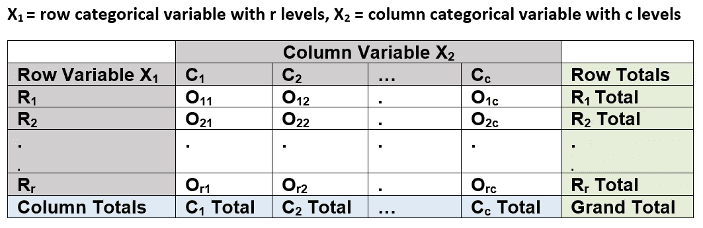
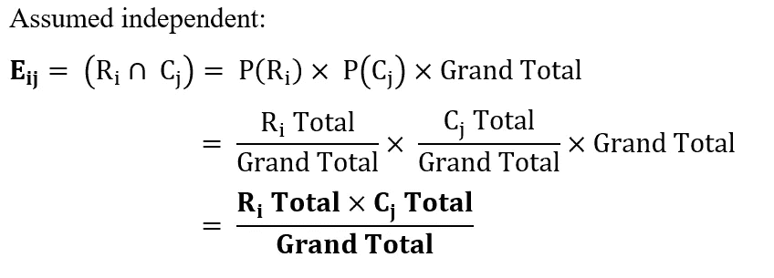
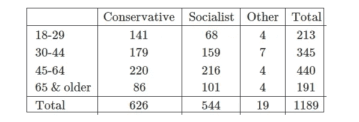
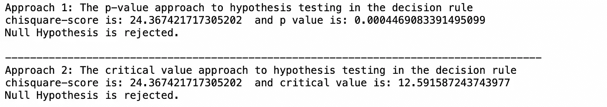
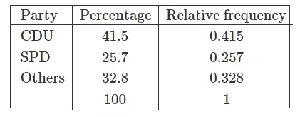
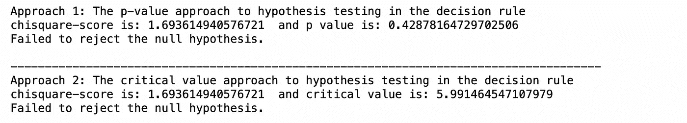

# 卡方检验，用 Python

> 原文：<https://towardsdatascience.com/chi-square-test-with-python-d8ba98117626?source=collection_archive---------3----------------------->

## 执行卡方检验的完全初学者指南(带代码！)

卡伦·艾姆斯利在 [Unsplash](https://unsplash.com/) 上的照片

在本文中，我将介绍卡方检验(χ2)的基本原理，卡方检验是一种统计方法，用于推断一个变量的分布或判断总体中两个变量之间是否存在关系。推论依赖于χ2 分布曲线，取决于自由度的数量。

图 1:不同自由度的卡方分布[1]

χ2 分布曲线是右偏的，随着自由度的增加，χ2 曲线将更接近正态分布。

# 答:独立性的χ2 检验

它用于确定总体中两个变量之间是否存在关系。在分析两个分类变量的调查结果时很有用。

*   H₀:这两个分类变量有**没有关系**
    H₁:这两个分类变量之间有**一种关系**
*   χ2 独立性检验统计量的自由度:
    d.f. = (# rows -1) *(#columns-1)

表 1: **rxc** 两个分类变量的列联表

*   如果 H₀为真，上表中值的每个单元格将包含理论或**预期频率 Eᵢⱼ** ，而不是每个单元格的**观测值** **Oᵢⱼ** 。

图 2:预期频率的推导

*   检验统计:比较 **Oᵢⱼ & Eᵢⱼ** 之间的差异得出χ2 统计，自由度为[(r-1) x (c-1)]，其中

超过 rxc 列联表中的所有单元格

> 下表是一项出口民调，显示了对两个分类变量的联合回应:18-29 岁、30-44 岁、45-64 岁和 65 岁以上人群，以及他们的政治倾向，即“保守”、“社会主义”和“其他”。在 5%的显著性水平上，年龄组和他们的政治倾向之间有关系吗？

表 2:投票后调查[2]

按照假设检验的五步过程:
H₀:的年龄组与他们的政治倾向是否独立，即没有关系
H₁:的年龄组与他们的政治倾向是否有依赖关系，即∃的 a 关系
α = 0.05
遵循χ2 独立性检验统计:

结论:我们有足够的证据表明，在 5%的显著性水平上，年龄组和他们的政治倾向之间存在关联。

# B: χ2 拟合优度检验

它用于推断变量的分布。

*   H₀:变量有指定的分布，正态
    H₁:变量没有指定的分布，不正态
*   χ2 拟合优度检验统计的自由度数量:
    d.f. = (# categories -1)
*   它将样品的**观察频率 O** 与**预期频率 E** 进行比较。
    **E =事件的概率*总样本量**

> 下表显示了 2013 年德国联邦大选超过 4400 万人的投票结果。41.5%的德国人投票给*基督教民主联盟(CDU)*25.7%投给*社会民主党*其余 32.8%投给*其他*。
> 
> 假设研究者采取随机抽样的方法，选取了 123 名傅柏林的学生进行调查。其中 57 人投票给 CDU，26 人投票给社民党，40 人投票给其他人。这些数字对应于**观察到的频率**。

表 3: 2013 年德国联邦大选[3]

按照假设检验的五步流程:
H₀:变量具有规定的分布，即观测频率和期望频率大致相等
H₁:变量不具有规定的分布，不正态
α = 0.05
遵循χ2 拟合优度检验统计量:

结论:我们没有足够的证据证明观察到的和预期的频率在 5%的显著性水平上不相等。

# 推荐阅读

 [## 用 Python 进行 ANOVA 测试

### 执行 ANOVA 测试的完全初学者指南(带代码！)

towardsdatascience.com](/anova-test-with-python-cfbf4013328b)  [## 使用 Python 进行双向 ANOVA 测试

### 执行双向 ANOVA 检验的完全初学者指南(带代码！)

towardsdatascience.com](/two-way-anova-test-with-python-a112e2396d78)  [## McNemar 的测试，使用 Python

### 执行麦克纳玛测试的完整初学者指南(带代码！)

towardsdatascience.com](/mcnemars-test-with-python-e1bab328d15c)  [## 使用 Python 进行单样本假设检验

### 执行单样本假设检验的完全初学者指南(带代码！)

levelup.gitconnected.com](https://levelup.gitconnected.com/how-to-perform-one-sample-hypothesis-tests-with-python-308eae8789fc)  [## 使用 Python 进行双样本假设检验

### 执行双样本假设检验的完全初学者指南(带代码！)

levelup.gitconnected.com](https://levelup.gitconnected.com/two-sample-hypothesis-tests-with-python-43e1b8c52306) 

# 参考

[1]《卡方检验 SOGA 地球科学系》【在线】。可用:[https://www . geo . fu-Berlin . de/en/v/soga/Basics-of-statistics/Hypothesis-Tests/Chi-Square-Tests/index . html](https://www.geo.fu-berlin.de/en/v/soga/Basics-of-statistics/Hypothesis-Tests/Chi-Square-Tests/index.html)

[2]《卡方独立性检验 SOGA 地球科学系》【在线】。可用:[https://www . geo . fu-Berlin . de/en/v/soga/Basics-of-statistics/Hypothesis-Tests/Chi-Square-Tests/Chi-Square-Independence-Test/index . html](https://www.geo.fu-berlin.de/en/v/soga/Basics-of-statistics/Hypothesis-Tests/Chi-Square-Tests/Chi-Square-Independence-Test/index.html)

[3]《卡方拟合优度检验 SOGA 地球科学系》【在线】。可用:[https://www . geo . fu-Berlin . de/en/v/soga/Basics-of-statistics/Hypothesis-Tests/Chi-Square-Tests/Chi-Square-good-of-Fit-Test/index . html](https://www.geo.fu-berlin.de/en/v/soga/Basics-of-statistics/Hypothesis-Tests/Chi-Square-Tests/Chi-Square-Goodness-of-Fit-Test/index.html)