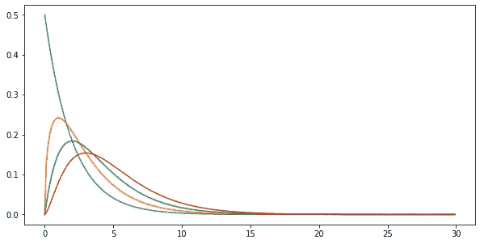
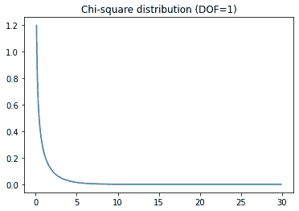

# 卡方检验，用于比较两个机器学习模型，并确定它们是否是随机的

> 原文：<https://towardsdatascience.com/chi-squared-tests-to-compare-two-machine-learning-models-and-determine-whether-they-are-random-2a405fc55181?source=collection_archive---------5----------------------->

## 在评估机器学习模型时，除了预测准确性/测试分数之外，您还应该考虑其他因素

一个具有挑战性的分类问题将你吸引到了你的屏幕上。你已经连续几个小时敲击键盘，分析数据，调试代码，执行算法。你的努力发展成两个机器学习模型。但是在你把显示器摔下来喝一口凉水之前，还有最后一个麻烦。你必须评估模型。通常，评估不仅仅是计算测试准确度。您可能想探究多个模型的性能是否不同。如果有变化，它们在统计上是显著的，还是由于随机性？所以让我们一起寻找这些答案。如果您熟悉概率分布(正态分布、二项式分布和卡方分布)、假设检验、假阳性和假阴性，我们就可以开始了。



卡方分布(图片由作者提供)

## 1.单一模型的卡方检验

## 1.1 我的模型是随机猜测的吗？:(

假设你的分类问题是预测一个人是否患有 covid。你构建的第一个模型，M1，给出了以下结果。


M1 观察表(图片由作者提供)

从概率上讲，一个数据实例有 65%的可能性是正面的，否则有 35%的可能性是负面的。一个重要的问题是，这个模型比随机猜测更有效吗？随机猜测意味着预测类和实际类是相互独立的。从本质上讲，这样的模型不会从数据中学习到任何有价值的东西，而仅仅是做出猜测。根据独立概率定律，可以得出:


(图片由作者提供)

在卡方检验中，我们将观察值与期望值进行对比。M1 将 69 例标为阳性。现在，如果这是一个随机的猜测，我们可以预计 35%的情况是假阳性。为什么？因为有 35%的可能性测试数据实例是负面的。这个结果也可以通过稍微修改一下问题从上面的等式推导出来。您认为 100 个实例中有多少个是误报？在这种情况下，我们找到 P(预测=+实际= —)。p(预测=+)= 69/100 = 0.69。


(图片由作者提供)

如果 M1 是一个随机的猜测者，总数据实例的 25.15%可能被分类为假阳性。因此，假阳性的数量= 100 的 24.15% = 24.15。同样，我们可以找到一个随机猜测者的所有预期预测。


随机猜测者期望表(RM 表)(图片由作者提供)

在上面两张表上运行**卡方独立性测试**将验证 M1 是否是一个随机猜测者。它通过计算卡方统计来实现。好吧，那是什么？


卡方统计方程

在下一节中，我将证明上面的等式是卡方的。测试的其余部分与任何其他假设测试一样。

H0(零假设):M1 是一个随机的猜测者

H1(替代假设):M1 不是一个随机的猜测者

M1 表列出了观察值，而随机猜测表列出了期望值。换句话说，对于我们的零假设，我们期望 M1 产生 RM 表中给出的结果。

为了找到卡方随机变量的值，我们还需要 DOF(自由度)。它是数据表中可以自由变化的值的数量。在计算实际类别和预测类别的概率时，我们固定了四个数字——实际阳性和阴性的数量，以及预测阳性和阴性的数量。


(图片由作者提供)

如果你现在观察上表，你会意识到，如果我给你集合 A，B，C，D 中的任何一个值，你可以找到剩下的变量。因此，数据集中的两个变量/值可以自由变化，因此 DOF=1。

从卡方统计量方程中，我们可以发现检验统计量是:


## 1.2 详述卡方检验

在继续之前，我想解释一下卡方检验的数学原理。如果你不是数学迷，请随意跳过。


(图片由作者提供)

如果你还在这一节，我相信你一定很想知道为什么上面的项是卡方变量。让我们重新表述这个问题。我们在寻找 M1 是否是随机猜测的证据。为了做到这一点，我们假设这是一个随机猜测，并列出期望值。M1 表中的值是我们观察到的，我们使用卡方检验来检验这两组值。


随机猜测表(图片由作者提供)

好的，现在观察随机猜猜表。想想每一面，预测(+)和预测(-)，就像硬币。例如，预测(+)是一个硬币，正面表示正，反面表示负。因此，如果您投掷预测(+)硬币，且正面朝上，则该数据实例被归类为真正。否则，如果它落在尾部，数据实例被分类为假阳性。这让你想起了一个特定的概率分布吗？

将 T 作为随机变量，描述真正的正面实例的数量(硬币类比的头部)。不遵循 p=0.65(正概率)和 n=69(总数据实例)的二项式分布吗？当然了。我假设你知道二项式分布可以近似为正态分布，只要 np 和 n(1-p)都超过 10。相应地，我们得到一个正态变量 z～N(0，1)


(图片由作者提供)

我们可以利用上面的术语得到


(图片由作者提供)

就这样，我们挖掘出了隐藏的卡方项。记住 Z 遵循卡方分布。因此，RHS 是卡方分布的。在第一项中，T 是真阳性的数量，我们观察到它是 58，np=69 乘以 0.65=44.85。同样，在第二项中，n-T 是误报的次数，等于 11，n(1-p)等于 24.15。用这些值替换变量。


(图片由作者提供)

你现在可以把预测的(-)当作另一枚硬币，重复这项繁重的工作。否则，相信我，当我说你的麻烦会产生以下结果:


(图片由作者提供)

给你。两个 Z 项构成卡方统计量。

## 1.3 计算

您可以用 python 运行下面的代码来进行剩余的计算。我会讨论结果。

```
import numpy as np
import pandas as pd
from scipy.stats import chi2_contingency
data=[[58,7],[11,24]] #Model M1 table
#Chi square statistic,pvalue,DOF,expected table
stat, p, dof, expected = chi2_contingency(data) 
print('Chi-square statistic=',stat)
print('Pvalue=',p)
alpha=0.05
if p < alpha:
    print('Not a random guesser')
else:
    print('Model is a random guesser')
```

结果:

```
Chi-square statistic= 32.884319981094166
Pvalue= 9.780899116984747e-09
```



(图片由作者提供)

从结果中，您可以观察到卡方统计量非常高。因此，与 alpha (0.05)相比，我们的零假设成立的概率(p 值)是微不足道的。因此，我们可以得出结论，M1 不是一个随机的猜测者。但是，请注意，最终决定完全取决于 alpha 值。但是由于我们通常将α取为 0.05，我们可以对我们的发现有信心。

## 2.使用卡方检验比较两个模型

好了，我们已经评估完你做的第一个模型了。让我们对第二个模型进行一些测试。


(图片由作者提供)

你也可以为这个模型进行一个单独的测试——“它是一个随机的猜测者吗？”。虽然，从上面的值可以明显看出，M2 比 M1 更准确。因此，M2 不可能是一个随机的猜测者。但它真的胜过 M1 吗，或者这种微小的进步源于随机的机遇吗？为了找到答案，我们必须修改我们的方法。


M1/M2 的正确/不正确矩阵(图片由作者提供)

上表显示了 M1 和 M2 正确和错误预测的分布。(我任意取了这些值。对于真正的问题，您可以通过执行几行代码轻松找到它们。).M1 和 M2 做出相同的预测(正确/不正确)没有什么令人信服的。我们对它们的差异很好奇，所以我们必须留意一个模型正确分类而另一个模型不正确分类的数据字段(B 和 C)。

如果 M1 和 M2 表现相似，B 值和 C 值应该不会相差太多。在这种情况下，两个模型的正确和错误预测比例几乎相等，因此表明同质性。

现在，通过将 B 和 C 想象成一枚硬币的两面，我们可以进行卡方检验来确定这两个值是否不同。我们已经确定上表的自由度是 1。卡方统计为:


(图片由作者提供)

同样，不要急于想为什么上面是一个卡方变量。可以通过重复我们上一节所做的来证明。如果你愿意，你可以试试。这种区分两种模型的特殊方法更广为人知的是麦克内马检验。现在让我们进行测试并建立假设。

H0: M1 和 M2 是一样的

H1: M1 和 M2 不一样

```
import numpy as np
import pandas as pd
from statsmodels.stats.contingency_tables import mcnemar
data=[[77,5],[10,8]]
res = mcnemar(data, exact=False)
alpha=0.05
print('Chi-square statistic:',res.statistic)
print('Pvalue:',res.pvalue)
if res.pvalue < alpha:
    print('Models are different')
else:
    print('Models are same')Chi-square statistic: 1.0666666666666667
Pvalue: 0.30169958247834494
```

在这里，P 值超过α，所以我们不能丢弃 H0。因此，尽管 M2 似乎比 M1 表现更好，但表现的差异很可能是随机的。我们应该从结果中进行推断，以避免仅仅通过分析分类精度得出任何结论。

## 结束语

在本文中，我只讨论了两种类型的评估。有统计程序来评估多个问题的众多模型。ROC 曲线在判断众多机器学习算法时极其俏皮。我给你链接了一些资源，让你对上面的解释有一个更全面的回顾。

<https://en.wikipedia.org/wiki/McNemar%27s_test>  

[https://en . Wikipedia . org/wiki/Chi-squared _ distribution #简介](https://en.wikipedia.org/wiki/Chi-squared_distribution#Introduction)

https://www.youtube.com/watch?v=80ffqpZdKiA