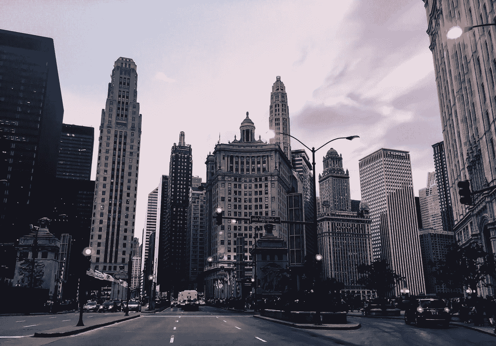
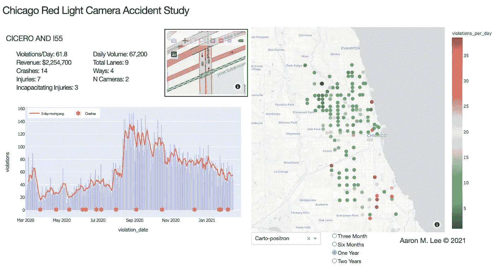
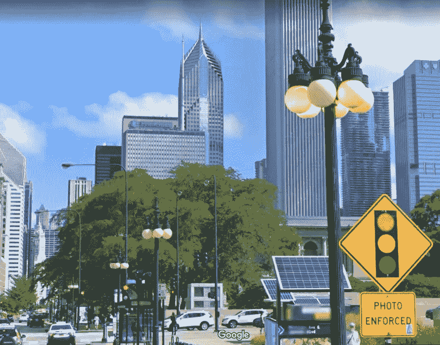
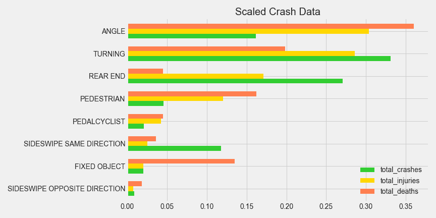
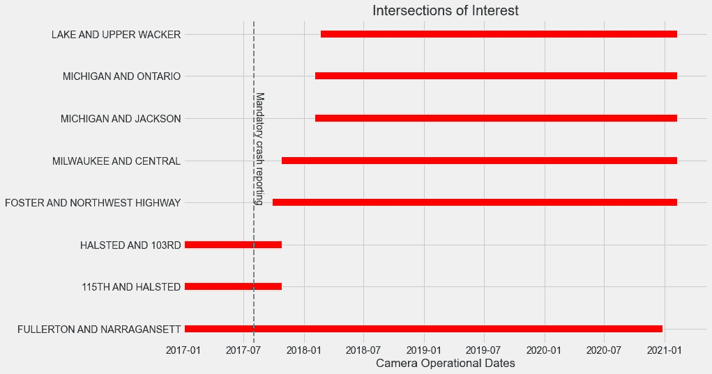

# 芝加哥闯红灯摄像机和交通安全

> 原文：<https://towardsdatascience.com/chicago-red-light-cameras-and-traffic-safety-a6c5f08e5c4?source=collection_archive---------37----------------------->

## 闯红灯摄像头会减少交通事故吗？



照片由[加比](https://unsplash.com/@gabyyu?utm_source=medium&utm_medium=referral)在 [Unsplash](https://unsplash.com?utm_source=medium&utm_medium=referral) 上拍摄

我最近收到了芝加哥市一张 100 美元的红灯罚单。和罚单一起的还有一个链接，是我的车在红灯右转时没有完全停下来的照片和视频。我成了可怕的芝加哥红灯摄影机的受害者。一个朋友告诉我，一项研究显示闯红灯的摄像头让十字路口变得更加危险。作为一名数据科学家，我很感兴趣。这在芝加哥听起来像是一个可以回答的问题，所以我建立了一个[项目](https://github.com/sciencelee/chicago_rlc)试图回答这个问题。

我还创建了一个网络应用程序来配合这个项目。有了它，你可以探索详细的芝加哥红灯摄像头路口和碰撞数据。(点击下图)

[](https://chicago-rlc.herokuapp.com/)

点击图片访问链接[https://chicago-rlc.herokuapp.com/](https://chicago-rlc.herokuapp.com/)

# 芝加哥红灯执法

2003 年，芝加哥开始用两个摄像头强制执行闯红灯。从那时起，该计划已经发展到在芝加哥 150 多个十字路口安装 350 多个摄像头。



摄像头强制交叉路口在所有方向都有清晰的标记

该计划受到丑闻的冲击，包括:贿赂计划，腐败指控，涉嫌针对服务不足的社区，以及软件修补以增加收入。许多芝加哥人认为闯红灯的摄像机不过是创收者，是居民的隐形税收。该计划自启动以来已经产生了惊人的 7.5 亿美元，其中几个著名的路口每年罚款数百万美元。

该计划的起源和目的(如他们的网站上所说)是“通过减少交叉路口最危险的交通事故来提高芝加哥街道的安全性”。虽然所有的碰撞都有潜在的危险，但红灯摄像机的设计是为了减少角度(或“丁字”)碰撞，因为它们对那些涉及的人来说极其危险。随着人们遵守交通信号，严重的车祸和伤害会大大减少。”

# 摄像头会提高安全性吗？

2018 年在凯斯西大学进行了一项关于红灯相机安全的[国家研究](https://thedaily.case.edu/red-light-cameras-dont-reduce-traffic-accidents-improve-public-safety-analysis/)。使用休斯顿及其周围的红灯摄像机，得出的结论是，红灯摄像机减少了危险角度碰撞的数量，但也可能增加追尾和其他类型的事故，因此不会提高整体安全性。这项研究和其他研究指出，摄像头实际上改变了交通模式:司机倾向于更猛烈、更突然地刹车，导致不同类型的事故，但并没有减少总数。

我决定看看芝加哥的数据，看看能否对我的城市得出结论；闯红灯摄像头真的能改善交通安全吗？

# 我的数据

自 2017 年 9 月 1 日起，芝加哥所有警区都在全市范围内强制实施统一的车祸报告。超过 50 万起事故报告可在[芝加哥数据门户](https://www.chicago.gov/city/en/narr/foia/CityData.html)获得，并且每天更新。详细的事故报告包括事故类型、事故是否发生在红灯路口，以及每起事故的纬度/经度。

<https://data.cityofchicago.org/Transportation/Traffic-Crashes-Crashes-Dashboard/8tdq-a5dp>  

数据门户还包含每个摄像机的每日闯红灯摄像机违规，并包括路口的名称和纬度/经度位置。

<https://data.cityofchicago.org/Transportation/Red-Light-Camera-Violations/spqx-js37>  

在过滤我的数据，只包括 2017 年 9 月至 2021 年 1 月之间发生的撞车事故后，我剩下了超过 60，000 起与交叉路口相关的事故，这些事故发生在芝加哥 3000 多个红灯交叉路口中的一个。

通过使用纬度/经度，我指定了发生在红灯摄像头十字路口中心 30 米内的事故。超过 8000 起事故被标记为闯红灯，发生在一个闯红灯摄像头强制控制的十字路口。这是该项目的主要数据集。

## 事故类型

如上所述，芝加哥正在寻求减少角(“丁字”)型事故。下面的图表是只用芝加哥的红灯路口生成的。角型事故占所有事故的 16%,但造成 37%的死亡和 31%的受伤。转弯事故(也可以通过闯红灯摄像机减少)是最多的，也是仅次于角度碰撞的第二大红灯伤亡原因。



没有死亡的碰撞类型未显示。

休斯顿的研究显示，当摄像头被移除时，追尾事故会增加，虽然数量很多，但导致的伤亡却较少。如果更危险的碰撞类型相应减少，追尾事故的增加对一个城市来说是可以接受的。

## 方法学

休斯顿的研究使用了一项自然实验，该实验发生在该市的一次选民公投中，当时红灯摄像机被拆除。移除摄像头前后的碰撞数据可以进行比较，看看摄像头的存在是否对事故有影响。

我试图在芝加哥做同样的事情。自 2017 年以来，少数摄像头被打开/关闭，或被移至其他路口。这些删除和添加创建了一个类似于休斯顿研究的小规模(7 个交叉点)自然实验。此外，伊利诺伊州众议院的一项法案目前正在立法中，以消除芝加哥所有的红灯摄像机，这将创造一个难以置信的机会，以更大的规模评估这个实验。

## 七个兴趣点

不幸的是，我只能查看自 2017 年 9 月以来(车祸数据可用时)一直活跃的红灯摄像头路口。在此期间，七个路口要么被添加到闯红灯摄像头违规数据，要么被删除。安装/卸载前后都有崩溃数据。

在这段时间内，七个十字路口同时处于开启和关闭状态:

```
['FOSTER AND NORTHWEST HIGHWAY' 'FULLERTON AND NARRAGANSETT'
 'HALSTED AND 103RD' 'LAKE AND UPPER WACKER' 'MICHIGAN AND JACKSON'
 'MICHIGAN AND ONTARIO' 'MILWAUKEE AND CENTRAL']
```

我建立了一个数据集，包含我的每个十字路口的每日事故数量，并使用这些十字路口最早和最新的违规日期将人群分为“关闭摄像头”和“打开摄像头”(实验组和对照组)。



第八个交叉路口(富勒顿/纳拉甘西特)可能已被删除，但未包括在以下结果中

```
Dataset from 7 intersections of interestCameras OFF:
Cumulative days: 1733
Total crashes off: 69Cameras ON:
Cumulative days: 6786
Total crashes: 134
```

## 纠正不平衡

数据集是不平衡的，主要集中在 2017 年末和 2018 年初。通常情况下，这不会是一个问题，但是通过我的研究，很明显一些十字路口有更多的撞车，受伤，甚至特殊类型的事故。我不希望一个单独的交叉点(可能有明显的偏差)压倒其他的。为了平衡数据集，我对每台相机的过度代表组进行了随机采样，因此每台相机的开机和关机天数相同。尽管低于预期的检验功效，但有足够的数据进行可靠的 t 检验，将这两个群体与以下结果进行比较。

```
Balanced dataset hypothesis testing: Null hypothesis: red light cameras have no effect on the number of crashes.alpha: 0.05
Power: 0.62n (cam on): 628 days
n (cam off): 628 daysmean (cam on): 0.03185 crash/day
mean (cam off): 0.04777 crash/day

Actual crashes with cams off: 30
Expected crashes with cams off: 20

Standard deviation: 4.40
z score: 2.27

P value: 0.0115REJECT the null hypothesis
```

当真实总体平均值为 0.032 时，有 1.2%的概率观察到样本平均值为 0.048。我们拒绝零假设，并接受另一个假设，即红灯摄像头的存在减少了这七个路口的事故数量。

这些结果与休斯顿的研究相反，休斯顿的研究并没有得出相机减少整体事故的结论。

## 附加测试结果

用同样的技术和平衡的人群，我们可以调查受伤的人数。

```
Balanced dataset hypothesis testing:Null hypothesis: red light cameras have no effect on the number of injuries.alpha: 0.05
Power: 0.99n (cam on): 628 days
n (cam off): 628 daysmean (cam on): 0.00159 injuries/day
mean (cam off): 0.01752 injuries/day

Actual injuries with cams off: 11
Expected crashes with cams off: 1.0

Standard deviation: 1.00
z score: 10.01

P value: 7.030e-24REJECT the null hypothesis
```

当真实总体平均值为 0.00159 时，观察到样本平均值为 0.01752 的概率极小。我们拒绝零假设，并接受另一个假设，即红灯摄像机的存在减少了这七个路口的受伤人数。

当执行相同的平衡方法和事故类型过滤时，结果是混杂的和不确定的。测试功率太小，无法确定倾斜事故是否减少，或追尾事故是否增加。然而，当红灯摄像机出现时，所有七个十字路口的所有类型的事故相同或更少。

# 这项研究的缺点

与 Case Western 的国家研究相比，这项研究在规模和范围上相对有限。他们的研究使用了近 10 倍多的十字路口，还使用了这里没有考虑的关于驾驶员决策、心理方面和全市安全计算的假设。我严格依赖现有的有限数据。当更多的数据可用时，也许是今年，这些数据可能足以对不同的事故类型和整体安全性进行越来越可靠的测试。

由于使用的摄像机数量如此有限，除了红灯的存在之外，还有其他因素可能影响了结果。潜在的偏差可能是:施工日期、交通模式变化、交叉路口改造或少数群体的一年中的采样时间。这同样可以通过额外的数据和交叉点来改善。

# 结论

对于所研究的十字路口，我们接受这样的假设，即闯红灯摄像机的存在减少了这些十字路口的事故和伤害数量。

这支持了芝加哥市安装摄像头以提高安全性的理由。