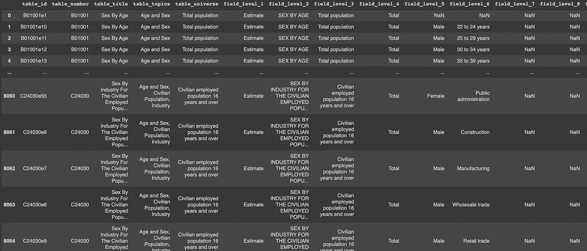
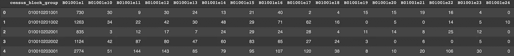
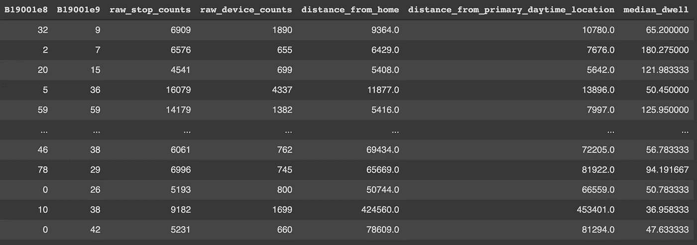
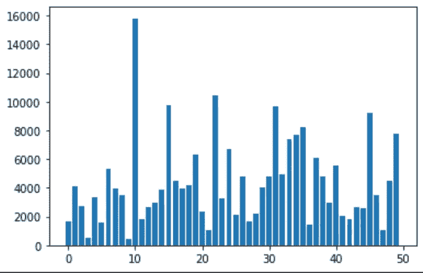

# 用 CBG 聚类法进行墨西哥薄饼店选址——第一部分

> 原文：<https://towardsdatascience.com/chipotle-site-selection-using-cbg-clustering-part-1-7ab8b76b79c5?source=collection_archive---------32----------------------->

## 地理空间数据可以帮助预测 Chipotle 将在哪里开设新的位置吗？


Emile Mbunzama 在 [Unsplash](https://unsplash.com/s/photos/ice-cream?utm_source=unsplash&utm_medium=referral&utm_content=creditCopyText) 上拍摄的照片

*本文中的所有分析都是使用 SafeGraph CBG 数据和模式数据完成的。请引用 SafeGraph 作为本文的参考。*

本文是围绕人口普查区块组数据聚类的两篇系列文章中的第一篇。这个项目的目的是使用 CBG 聚类来预测 Chipotle 未来的选址。选址是像 Chipotle 这样寻求扩张到新地点的大公司特许经营的主要兴趣点。在 2020 年和 2021 年之间，Chipotle 在美国开设了 100 多个新地点，使其成为测试这种选址算法的理想候选人。本文将重点介绍如何使用美国人口普查局和 SafeGraph 的邻域模式数据首先创建聚类，然后将这些聚类与 Chipotle 位置进行匹配。

本文将主要使用 Sklearn 的 K-Means 聚类算法来产生聚类，并将这些聚类归属于美国各地的 Chipotle 位置。可以通过[安全图](http://safegraph.com/)访问 Chipotle 地点数据和美国人口普查区块组数据。SafeGraph 是一家数据提供商，为数百家企业和类别提供 POI 数据。它向学术界免费提供数据。对于这个项目，我选择使用 SafeGraph Places 数据来运行我的分析。地点数据的模式可以在这里找到:[模式信息](https://docs.safegraph.com/docs/core-places)

# CBG 数据选择:选择哪种人口统计学？


照片由[vini cius“amnx”Amano](https://unsplash.com/@viniciusamano?utm_source=unsplash&utm_medium=referral&utm_content=creditCopyText)在 [Unsplash](https://unsplash.com/s/photos/candy?utm_source=unsplash&utm_medium=referral&utm_content=creditCopyText) 上拍摄

以下代码片段允许我们从 SafeGraph 包中访问美国人口普查数据的字段描述:

```
!pip install -q --upgrade git+https://github.com/SafeGraphInc/safegraph_pyfrom safegraph_py_functions import safegraph_py_functions as sgpyfrom safegraph_py_functions import cbg_functions as sgpy_cbg df = sgpy_cbg.get_cbg_field_descriptions()df['field_level_1'].value_counts()df = df[df['field_level_1'] == 'Estimate']df.to_csv('census.csv')
```

字段描述用于提供实际人口普查数据集中的要素。由于该数据集提供了 7500 多个要素，因此使用该表可以更直接、更简单地选择分析所需的要素。需要注意的是，为了便于分析，我们将字段描述表限制为仅包含“估计”记录，而不是同时包含“估计”和“置信度”记录。“估计”记录是提供数值的记录，这些数值可以与给定人口普查区块组中特定人口统计的计数相关联。这是我们希望在分析中使用的信息。字段描述表如下所示:



虽然这个表有点晦涩难懂，但它本质上可以归结为这个表中的每条记录都对应于实际人口普查数据中的一个唯一列。有了这些信息，现在很明显，选择正确的人口统计对于这个项目生成的聚类的准确性是非常重要的。出于这个项目的目的，我们选择考虑与年龄、性别、收入和其他因素(如房屋所有权和工作时间)相关的特征。总的来说，我们研究了聚类算法的大约 70 个特性，其代码如下所示:

```
census_cols = sgpy_cbg.get_census_columns(['B01001e1','B01001e10','B01001e11','B01001e12','B01001e13','B01001e14','B01001e15','B01001e16','B01001e17','B01001e18','B01001e19','B01001e20','B01001e21','B01001e22','B01001e23','B01001e24','B01001e25','B01001e27','B01001e28','B01001e29','B01001e30','B01001e31','B01001e32','B01001e33','B01001e34','B01001e35','B01001e36','B01001e37','B01001e38','B01001e39','B01001e40','B01001e41','B01001e42','B02001e1','B02001e10','B02001e2','B09019e2','B09019e20','B09019e21','B09019e22','B09019e23','B09019e24','B09019e25','B09019e26','B09019e3','B09019e4','B09019e5','B09019e6','B09019e7','B09019e8','B09019e9','B19001e1','B19001e10','B19001e11','B19001e12','B19001e13','B19001e14','B19001e15','B19001e16','B19001e17','B19001e2','B19001e3','B19001e4','B19001e5','B19001e6','B19001e7','B19001e8','B19001e9'], 2019)
```

这些生成的要素的数据框架如下所示:



稍微清理数据(将所有数值转换为浮点数)后，我们可以将该数据追加到 SafeGraph 邻域模式数据中，这将为我们提供与特定人口普查区块组的原始访问者数量、这些访问者到达相关 CBG 的距离以及在相关 CBG 停留的平均时间相关的列。在邻域模式数据中，可能有更多有用的列，但为了简单起见，我们只使用这些列

```
patterns = patterns[['area', 'raw_stop_counts', 'raw_device_counts', 'distance_from_home', 'distance_from_primary_daytime_location', 'median_dwell']]patterns['census_block_group'] = patterns['area']patterns = patterns.drop(['area'], axis = 1)df = df.merge(patterns, on = 'census_block_group')
```

这导致两个数据帧合并在一起:



# CBG 聚类:最后一步


在 [Unsplash](https://unsplash.com/s/photos/candy?utm_source=unsplash&utm_medium=referral&utm_content=creditCopyText) 上[翻滚 926](https://unsplash.com/@billow926?utm_source=unsplash&utm_medium=referral&utm_content=creditCopyText) 拍照

该过程的第一步是对创建的数据集使用 K-means 聚类，并根据提供的特征对记录进行聚类。为了这个实验的目的，我们选择创建 50 个集群。下面的代码片段执行此操作。请注意，将大量记录聚集到少数几个分类中会导致运行时间过长:

```
model = KMeans(init="random",n_clusters=50,n_init=1000,max_iter=400,random_state=42)model.fit(df[1:])pred = model.predict(df)
```

要查看跨集群 id 的记录分布，可以使用下面的代码片段:

```
freq = {}for item in pred: if (item in freq): freq[item] += 1 else: freq[item] = 1
```

为了可视化这个分布，我们可以使用下面的代码片段来绘制它:

```
plt.bar(freq.keys(), freq.values())
```



从这个分布中我们可以看到，记录甚至不是在聚类之间分布的，这表明每个记录的特征变化导致 k-means 算法独立地做出决定来分配聚类 ID。

# **结论:**

从这篇文章中，我们能够看到 SafeGraph 提供的人口普查区块数据、邻里模式数据和每月模式数据的多功能性。使用这三个数据集，我们能够得出一组超过 70 个特征，我们认为这些特征对于 Chipotle 特许经营店未来选址过程至关重要。这些人口统计数据包括年龄、性别、收入和其他因素，如房屋所有权和工作时间。然后，我们使用邻域模式数据将这些特征与其他一些特征相关联，例如特定人口普查区块组的原始访问者数量、这些访问者到达相关 CBG 的距离以及在相关 CBG 逗留的平均时间。使用这些数据，我们将 CBG 信息加入到 2020 年 Chipotle 的月度模式数据中。这个完整的数据然后被用于将数据聚类成 50 个独特的聚类。对于本项目的下一步和下一篇文章，我们将重点关注使用 2021 Chipotle 数据作为地面实况，并查看哪些集群接收新位置。

***提问？***

我邀请你在 [SafeGraph 社区](https://www.safegraph.com/academics)的 **#help** 频道问他们，这是一个面向数据爱好者的免费 Slack 社区。获得支持、共享您的工作或与 GIS 社区中的其他人联系。通过 SafeGraph 社区，学者们可以免费访问美国、英国和加拿大 700 多万家企业的数据。