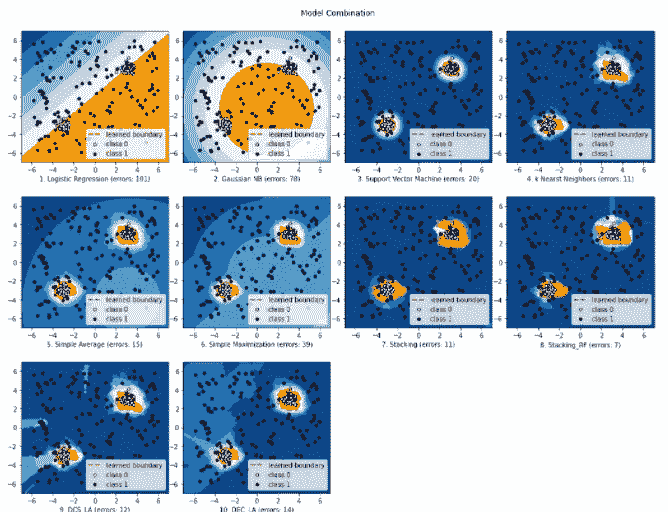
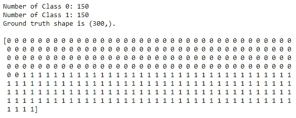

# 基于可视化选择最佳的 ML 模型

> 原文：<https://towardsdatascience.com/choose-best-ml-model-based-on-visualization-ed6398ac3005?source=collection_archive---------14----------------------->

## 使用 Combo 比较机器学习模型



来源:作者

比较不同的机器学习模型是一项艰巨的任务，因为我们需要创建不同的模型，拟合它们，然后评估它们。编写数百行代码，然后使用不同的可视化工具进行评估是一个耗时的过程。

如果我告诉您，您可以节省创建不同模型和评估它们的所有时间和精力，会怎么样？Combo 是一个开源 Python 库，用于创建数据可视化，有助于轻松轻松地评估不同的机器学习。

在本文中，我们将探索 Combo 并使用它创建一些可视化效果。

让我们开始吧…

# 安装所需的库

我们将从使用 pip 安装来安装 Combo 开始。下面给出的命令将使用 pip 安装 Combo。

```
pip install combo
```

# 导入所需的库

在这一步中，我们将导入创建模型和可视化这些模型所需的所有库。

```
import os
import sys
sys.path.append(
    os.path.abspath(os.path.join(os.path.dirname("__file__"), '..')))
import warnings
warnings.filterwarnings("ignore")
import numpy as np
from numpy import percentile
import matplotlib.pyplot as plt
import matplotlib.font_manager# Import all models
from sklearn.tree import DecisionTreeClassifier
from sklearn.linear_model import LogisticRegression
from sklearn.ensemble import AdaBoostClassifier
from sklearn.ensemble import RandomForestClassifier
from sklearn.naive_bayes import GaussianNB
from sklearn.svm import SVC
from sklearn.neighbors import KNeighborsClassifierfrom combo.models.classifier_comb import SimpleClassifierAggregator
from combo.models.classifier_stacking import Stacking
from combo.models.classifier_dcs import DCS_LA
from combo.models.classifier_des import DES_LA
```

# 创建数据集

对于本文，我们将使用 2 个类创建自己的数据集。在下面给出的代码中，您可以看到我们如何创建数据集。

```
# Define the number of class 0 and class 1
n_samples = 300
class1_fraction = 0.5
clusters_separation = [3]# Compare given detectors under given settings
# Initialize the data
xx, yy = np.meshgrid(np.linspace(-7, 7, 100), np.linspace(-7, 7, 100))
n_class0 = int((1\. - class1_fraction) * n_samples)
n_class1 = int(class1_fraction * n_samples)
ground_truth = np.zeros(n_samples, dtype=int)
ground_truth[-n_class1:] = 1# Show the statics of the data
print('Number of Class 0: %i' % n_class0)
print('Number of Class 1: %i' % n_class1)
print('Ground truth shape is {shape}.\n'.format(shape=ground_truth.shape))
print(ground_truth, '\n')
```



数据集(来源:作者)

# 创建用于比较的模型

在这里，我们将创建我们将比较的所有模型，然后，我们使用 Combo 来可视化模型。

```
random_state = np.random.RandomState(42)classifiers = [LogisticRegression(), GaussianNB(), SVC(probability=True),
               KNeighborsClassifier()]# Define some combination methods to be compared
classifiers = {'Logistic Regression': LogisticRegression(),
    'Gaussian NB': GaussianNB(),
    'Support Vector Machine': SVC(probability=True),
    'k Nearst Neighbors': KNeighborsClassifier(),
    'Simple Average': SimpleClassifierAggregator(base_estimators=classifiers,
                                                 method='average'),
    'Simple Maximization': SimpleClassifierAggregator(
        base_estimators=classifiers, method='maximization'),
    'Stacking': Stacking(base_estimators=classifiers, shuffle_data=True),
    'Stacking_RF': Stacking(base_estimators=classifiers, shuffle_data=True,
                            meta_clf=RandomForestClassifier(
                                random_state=random_state)),
    'DCS_LA': DCS_LA(base_estimators=classifiers),
    'DEC_LA': DES_LA(base_estimators=classifiers)
}# Show all classifiers
for i, clf in enumerate(classifiers.keys()):
    print('Model', i + 1, clf)# Fit the models with the generated data and
# compare model performances
for i, offset in enumerate(clusters_separation):
    np.random.seed(42)
    # Data generation
    X1 = 0.3 * np.random.randn(n_class0 // 2, 2) - offset
    X2 = 0.3 * np.random.randn(n_class0 // 2, 2) + offset
    X = np.r_[X1, X2]
    # Add class 1
    X = np.r_[X, np.random.uniform(low=-6, high=6, size=(n_class1, 2))]# Fit the model
    plt.figure(figsize=(15, 12))
    for i, (clf_name, clf) in enumerate(classifiers.items()):
        print(i + 1, 'fitting', clf_name)
        # fit the data and tag class 1clf.fit(X, ground_truth)
        scores_pred = clf.predict_proba(X)[:, 1] * -1y_pred = clf.predict(X)
        threshold = percentile(scores_pred, 100 * class1_fraction)
        n_errors = (y_pred != ground_truth).sum()
        # plot the levels lines and the points
        Z = clf.predict_proba(np.c_[xx.ravel(), yy.ravel()])[:, 1] * -1
        Z = Z.reshape(xx.shape)
        subplot = plt.subplot(3, 4, i + 1)
        subplot.contourf(xx, yy, Z, levels=np.linspace(Z.min(), threshold, 7),
                         cmap=plt.cm.Blues_r)
        a = subplot.contour(xx, yy, Z, levels=[threshold],
                            linewidths=2, colors='red')
        subplot.contourf(xx, yy, Z, levels=[threshold, Z.max()],
                         colors='orange')
        b = subplot.scatter(X[:-n_class1, 0], X[:-n_class1, 1], c='white',
                            s=20, edgecolor='k')
        c = subplot.scatter(X[-n_class1:, 0], X[-n_class1:, 1], c='black',
                            s=20, edgecolor='k')
        subplot.axis('tight')
        subplot.legend(
            [a.collections[0], b, c],
            ['learned boundary', 'class 0', 'class 1'],
            prop=matplotlib.font_manager.FontProperties(size=10),
            loc='lower right')
        subplot.set_xlabel("%d. %s (errors: %d)" % (i + 1, clf_name, n_errors))
        subplot.set_xlim((-7, 7))
        subplot.set_ylim((-7, 7))
    plt.subplots_adjust(0.04, 0.1, 0.96, 0.94, 0.1, 0.26)
    plt.suptitle("Model Combination")
# plt.savefig('compare_selected_classifiers.png', dpi=300)
plt.show()
```


模型比较(来源:作者)

在这里，您可以清楚地看到我们使用 Combo 创建的不同图表和绘图。继续尝试不同的数据集，创建不同的可视化效果，并让我知道您在回复部分的评论。

本文是与 [Piyush Ingale](https://medium.com/u/40808d551f5a?source=post_page-----ed6398ac3005--------------------------------) 合作完成的。

# 在你走之前

***感谢*** *的阅读！如果你想与我取得联系，请随时联系我在 hmix13@gmail.com 或我的* [***LinkedIn 简介***](http://www.linkedin.com/in/himanshusharmads) *。可以查看我的*[***Github***](https://github.com/hmix13)**简介针对不同的数据科学项目和包教程。还有，随意探索* [***我的简介***](https://medium.com/@hmix13) *，阅读我写过的与数据科学相关的不同文章。**