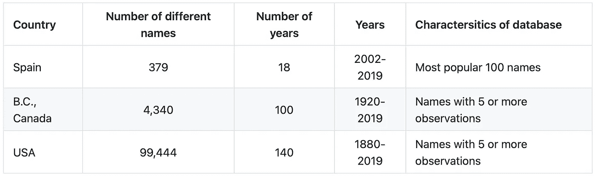
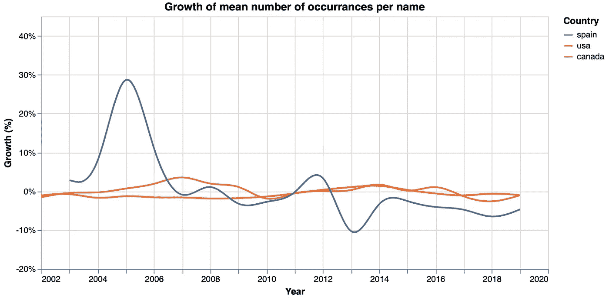
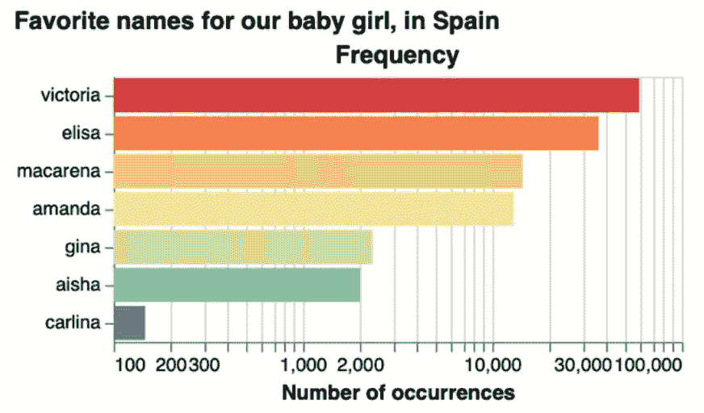
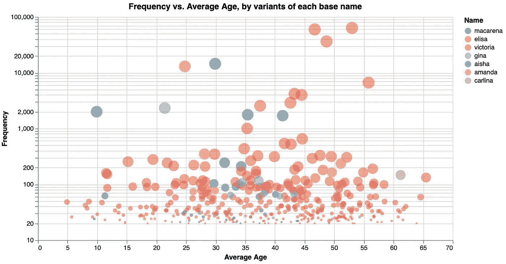
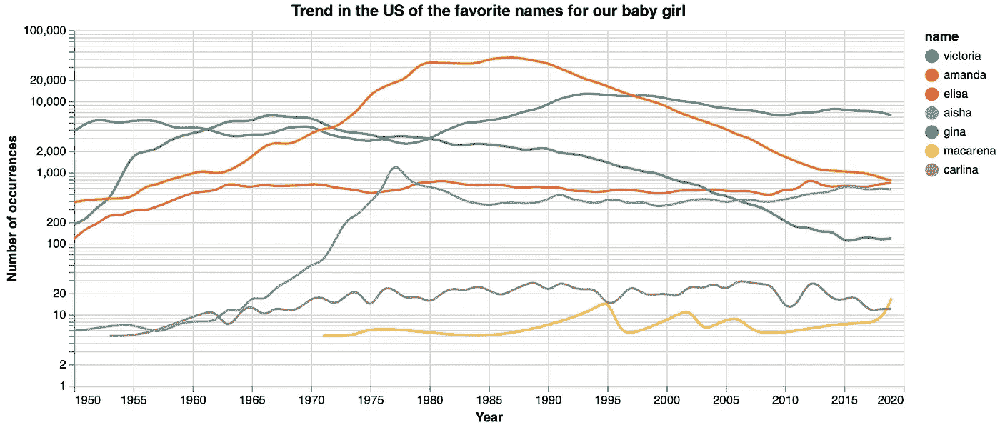
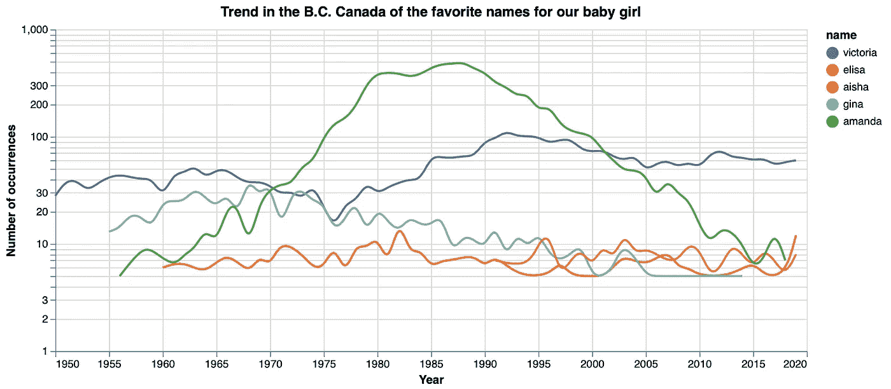
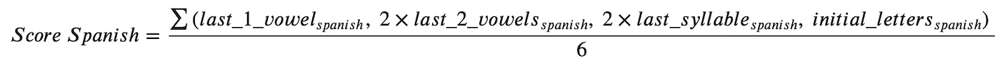
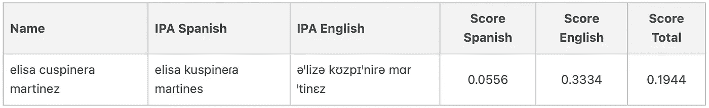
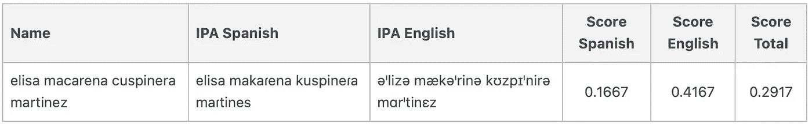

# 使用 Python 选择婴儿名字

> 原文：<https://towardsdatascience.com/choosing-a-baby-name-using-python-5c842f1e1a2f?source=collection_archive---------25----------------------->

## [实践教程](https://towardsdatascience.com/tagged/hands-on-tutorials)

## *使用 Python 中的语音翻译器来比较英语和西班牙语中名和姓的发音。*


键盘上的 Elisa。图片作者。

给孩子起个**名字**并不像人们想象的那么简单，至少对我和我妻子来说不是。我们到处为我们的宝贝女儿寻找名字，我们挑选一些选项。然而，我开始怀疑我们是否找对了地方，是否有一种方法来衡量哪个名字最适合我们的女儿。所以，我找到了三个数据库，里面有来自西班牙语和英语国家的名字，分析了趋势和最常出现的名字，并写下了所有可能名字的列表。最后，我开发了一个工具，它使用国际音标[](https://en.wikipedia.org/wiki/International_Phonetic_Alphabet)**来转换名字，并通过返回一个分数来衡量一个名字与另一个名字和/或姓氏在英语和西班牙语中的发音有多好，以便更容易地为婴儿找到可能的名字。**

****⭐️****

# **介绍**

**在怀孕的最后五个月，当我们期待我们的第一个女婴时，我们在不同的来源上寻找名字的选择，如具有流行婴儿名字的网站和书籍，具有国际名字的网站，要求朋友之间的推荐，甚至写下电影和电视剧角色的名字。经过几个月的名字搜索，2021 年 4 月初，我们列出了我们最喜欢的女婴名字。我妻子的选择是: **Elisa** 和 **Macarena** 。在我这边，我有一个更大的名单:**艾莎****阿曼达****卡琳娜****吉娜**和**维多利亚**。**

**然而，我们没有同意给孩子取个名字。所以，我开始思考如何为我们的宝宝选择最好的名字？我们喜欢的名字有多流行？有没有一种方法可以衡量一个人的名字和他的姓结合起来有多好？**

# **数据库**

**第一步是寻找名字。在我们的例子中，因为我们住在墨西哥，我们对西班牙语的名字感兴趣；然而，我们也对来自英语国家的名字持开放态度。**

**对于西班牙语的名字，我找到了西班牙🇪🇸国家统计研究所的数据，其中有最受欢迎的 100 个名字(2002 年至 2019 年)，以及频率等于 20 人或更多的名字(2019 年)。另一方面，对于英语国家，我找到了几个流行婴儿名字的数据库，一个来自美国🇺🇸，由[社会保障局](https://www.ssa.gov/oact/babynames/)(1880–2019)发布；另一份来自加拿大🇨🇦的不列颠哥伦比亚省，由公元前的[政府分享(1920–2019)。](https://www2.gov.bc.ca/gov/content/life-events/statistics-reports/bc-s-most-popular-baby-names)**

# **电子设计自动化(Electronic Design Automation)**

**当比较西班牙、美国和加拿大的常用地名数据库时，可以观察到不同数据库中不同地名的数量差异很大。这些差异可能可以用数据库的结构来解释，因为年份的范围及其特征:**

****

**不同数据库的描述。图片作者。**

****

**每个数据库中每个名称出现次数的增长。图片作者。**

**虽然美国和加拿大的人均姓名增长率稳定在 0%左右，但西班牙的情况并非如此，这可能是因为西班牙的数据库仅包含 100 个最受欢迎的姓名，而美国和加拿大的数据则包含大量姓名。**

# **我们最喜欢的名字的描述性分析**

## **西班牙🇪🇸**

****

**西班牙数据库中我们最喜欢的名字的出现频率。图片作者。**

**在我们最喜欢的名字中，在西班牙的数据库上，我发现使用最多的名字是**维多利亚**，有 5.96 万人，其次是**伊莉莎**，有 3.63 万人，**玛卡丽娜**1.44 万人，**阿曼达**1.29 万人，**吉娜** 2.3 万人，**艾莎** 2.0 万人，**卡琳娜**只有 1.9 万人**

**在来自西班牙的数据库中，我们还可以找到 2019 年出现频率最高的复合名称。因此，寻找包含我们最喜欢的七个名字之一的复合名字，我们可以找到 243 个复合名字，包括**维多利亚**，82 个带 **elisa** ，31 个带**玛卡丽娜**，28 个带**阿曼达**，10 个带**吉娜**，3 个带**艾莎**，2 个带**卡琳娜**。该数据库还包括所有单名和复名的平均年龄。**

****

**包含我们最喜欢的名字的复合名字的频率和平均年龄。图片作者。**

****

**包含我们最喜欢的名字之一的复合词的单词云。图片作者。**

**最后，单词 cloud plot 以等于 75 次或更多次观察的频率呈现西班牙的复合名称。虽然节点代表每个名称，但箭头显示名称之间的连接顺序，箭头越暗，名称之间的连接越强。**

**例如，**玛丽亚**和**维多利亚**这两个名字以两种方式连接起来，形成了复合名**玛丽亚维多利亚**和**维多利亚玛丽亚**。**

# **美国🇺🇸**

**在美国，我们注意到，虽然维多利亚一直很受欢迎，但吉娜在 60 年代末成为最受欢迎的名字，阿曼达在 80 年代成为最受欢迎的名字。伊莉莎这个名字一直处于我们最喜欢的名字的中间范围，每年大约有 500 次，而艾莎的受欢迎程度从 60 年代的大约 10 次增加到 1000 次最后，卡丽娜**和马卡瑞娜**这两个名字是美国记录中最不受欢迎的******

****

**在美国数据库中，我们最喜欢的名字出现的频率。图片作者。**

# **加拿大🇨🇦不列颠哥伦比亚省**

**这张图展示了加拿大不列颠哥伦比亚省每年新生儿的趋势，这些新生儿都有我们最喜欢的名字。在这种情况下，数据库只有我们选择的七个名字中的五个名字的信息:**维多利亚**、**伊莉莎**、**阿曼达**、**吉娜**和**艾莎**。**

**与美国的情节相似，这里我们发现**维多利亚**一直很受欢迎**阿曼达**在八九十年代成为最受欢迎的名字**吉娜**的受欢迎程度随着时间的推移而下降。最后，**伊莉莎**和**艾莎**这两个名字的记录都很低。**

****

**在不列颠哥伦比亚(加拿大)数据库中，我们最喜欢的名字出现的频率。图片作者。**

# **使用[国际音标给名字打分](https://en.wikipedia.org/wiki/International_Phonetic_Alphabet)**

**这一分析的最后一项工作是构建一个工具，在这种情况下是 Python 中的一个类，它测量名与中间名和/或姓的结合程度。为此，我使用国际音标将这些名字转换成西班牙语和英语的音标。**

**对于英语转换，使用了`[eng_to_ipa](https://pypi.org/project/eng-to-ipa/)`库。在下面的代码块中有一个如何使用它的例子:**

```
# call the eng_to_ip library
import eng_to_ipa as ipa# transform a text from English to IPA
ipa.convert("Maria")
### outcome: 'mərˈiə'
```

**在西班牙语的情况下，`[epitran](https://pypi.org/project/epitran/)`库对于转换名称很有用，可以如下使用:**

```
# call the epitran library
import epitran# select an ISO 639-3 code of the language
epi = epitran.Epitran('spa-Latn')# transform a text from selected language to IPA
epi.transliterate("Maria")
### outcome: 'maɾja'
```

**在将姓名转换为其语音符号后，一个自定义函数查找两个给定字符串(姓名和/或姓氏)之间的辅音和辅音韵脚，并比较每个姓名的最后一个元音、最后两个元音、最后一个音节和首字母，从每个比较中返回一个布尔值。对于每一种语言，该函数通过对最后两个元音和最后一个音节的比较赋予更大的权重并对结果进行标准化来获得分数。作为一个例子，这是一个从两个名字的西班牙语比较中得到分数的公式。**

****

**获得分数的公式。图片作者。**

**为了得到总分，该函数只对英语和西班牙语的最终分数进行平均。**

**最后，对于包含两个以上字符串的全名，另一个自定义函数将每个字符串与全名的其他字符串进行比较，并对每种分数类型的数量进行平均，返回全名的三个最终结果:英语、西班牙语和总分。**

**例如，在姓名*玛丽亚维多利亚史密斯*中，该函数获取(1) *玛丽亚*与*维多利亚*、( 2) *玛丽亚*与*史密斯*以及(3) *维多利亚*与*史密斯*之间的比较分数。**

**[**⭐️点击这里**](https://github.com/vcuspinera/Baby_names/blob/main/src/Names_rhyme.py) 查看定制 Python 类的更多细节，以及它们的函数，开发这些函数是为了通过比较名字的押韵来获得这些分数。**

**😅 ***有趣的事实:*** 当我终于在 2021 年 4 月中旬到达这个分析点时，我的妻子已经为我们的宝贝女儿选择了一个名字: **elisa** 。从这一点上来说，我可以选择是给宝宝取一个复合名字，还是只给她一个名字。**

****

**几十首《伊莉莎·库斯皮涅拉·马丁内斯》。图片作者。**

**在包括 **elisa** 和我们的姓 **cuspinera** 和 **martinez** 的复合女性名字中(这是因为在墨西哥和拉丁美洲我们使用两个姓)，得分较高的第二个可能的名字是:aisa、akira、alisa、ariza、corisa、delisa、elfrida、elissa、elvina、elyria、elysia、erisa、isa、jazeera、lisa、liza、louisa、luisa、 **macarena****

**如你所知，其中一个名字是 **macarena** 。所以，就像在电影*盗梦空间*中一样，我觉得我的妻子向我灌输了这个名字的想法，在与 **elisa** 结合的化合物名称的首选中，这个是我最喜欢的，主要是因为它结合了 **macarena** 和 **cuspinera** 的发音。实际上 **macarena cuspinera** 西班牙语 0.5 分，英语 0.6667 分。**

**最后，我们决定给我们的女儿取名为**伊莉莎·马卡雷纳·库斯皮内拉·马丁内斯**，这个名字比伊莉莎·库斯皮内拉·马丁内斯的分数还要高。**

****

**“elisa macarena cuspinera martinez”的分数。图片作者。**

# **最终意见**

**给孩子取名字可能不像人们想象的那么简单。这个项目的目的是建立一个工具来衡量一个完整的名字听起来有多好，并给它打分，以便更容易地为婴儿找到可能的名字。在这种情况下，定制函数可以是构建更健壮的模型的起点，该模型将其他特征考虑为声音的和谐。**

**另一方面，作为一种工具，这种模型只是拼图的一部分，可以(也应该)用其他定性变量来补充，例如，姓名的含义、地区习俗、家庭传统、趋势、个人偏好和/或未来父母的其他想法。**