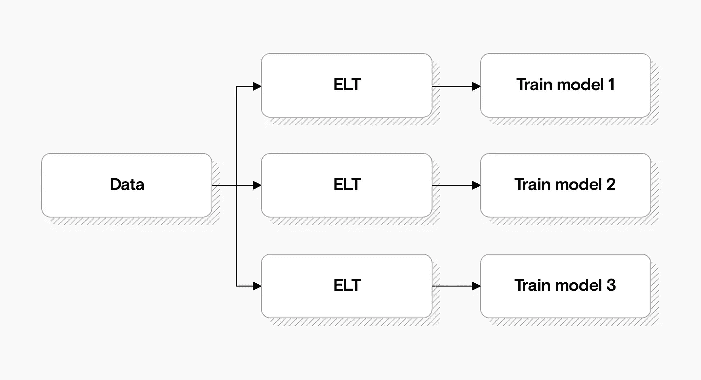
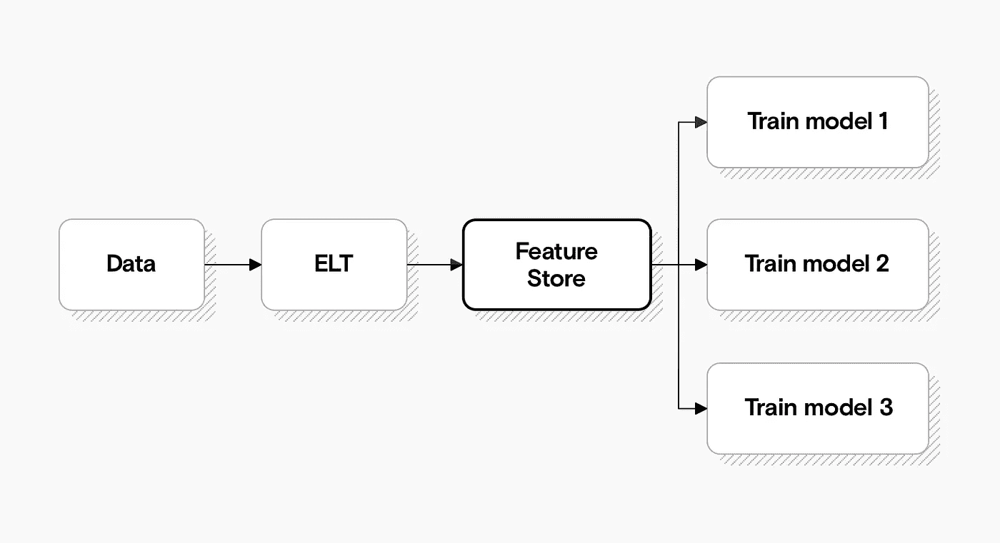
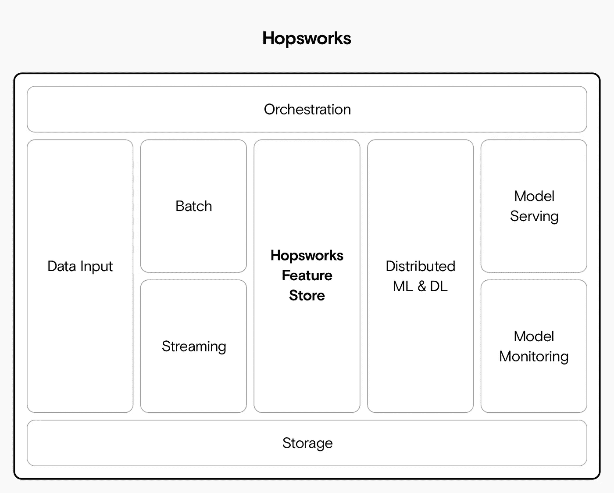
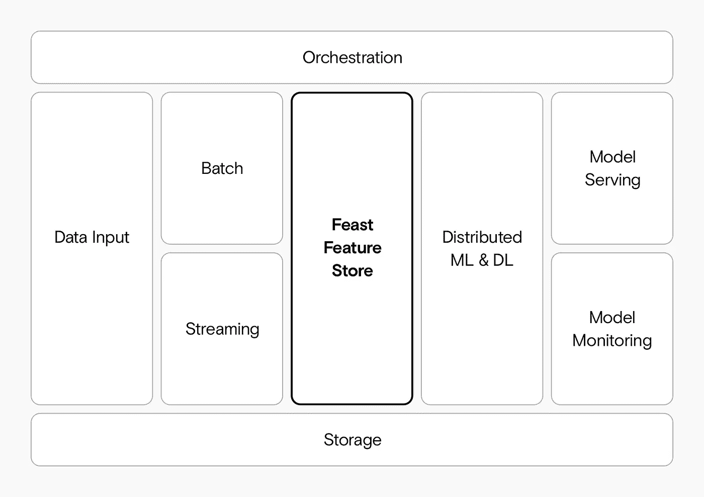
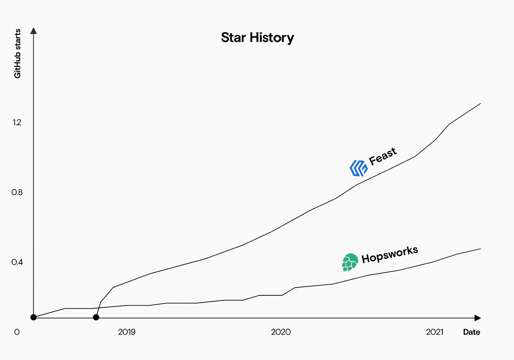
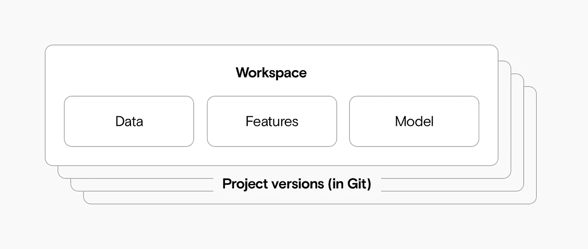

# 选择特色商店:盛宴 vs Hopsworks

> 原文：<https://towardsdatascience.com/choosing-a-feature-store-feast-vs-hopsworks-143bc8bd84c?source=collection_archive---------10----------------------->

## FEAST 是唯一一个独立的开源特性商店，但是你也有其他的选择

来源:作者

通过要素存储，您可以跟踪用于训练模型的要素。他们是一个相对较新的概念，但他们越来越受欢迎。

# 功能商店解决什么问题？

如果您在没有特征存储的情况下训练模型，您的设置可能如下所示:

如果您的模型直接从数据存储中提取数据，通常会有令人讨厌的重复。来源:作者

每个模型都必须访问数据，并进行一些转换，将其转换为模型用于训练的特征。

在这个过程中有很多重复的东西——许多型号使用许多相同的功能。

这种重复是功能存储可以解决的一个问题。每个要素都可以在要素库中进行存储、版本化和组织。这种预先准备的数据可以很容易地用于训练未来的其他模型。因此，您将避免重复计算数据集。您用于训练模型的数据也将可用，并且整个训练管道将更容易重现。

要素存储打破了模型和数据之间的耦合，从而减少了重复。来源:作者

直到最近，特征商店还主要用于内部机器学习平台，如优步的米开朗基罗。如果您想在大公司之外使用功能商店，您必须从头开始构建自己的商店。幸运的是，开源社区已经在改变这种情况。但是选择仍然有限。具体来说，您可以:

*   使用**宴、**或
*   使用 **Hopsworks 功能商店、**或
*   在类似 **DVC** 的东西上面滚动你自己的。

当我们构建我们的参考机器学习架构时，我们评估了所有这些选项，并选择了**盛宴**。这里有一个详细的比较来解释为什么，并帮助您评估自己项目的其他选项。

# 需要特色店吗？

如果你计划让你的机器学习项目达到中等规模，那么我们认为你应该有一个功能商店。也就是说，许多项目没有一个。如果您还没有遇到功能存储所解决的任何问题(例如，无法跟踪哪些功能正在使用，复制您的模型训练代码，或者花费大量时间等待 ETL 作业一次又一次地完成对相同数据的重新处理)，那么您可能还不需要功能存储。

在以下情况下，您可以考虑**而不是**使用功能库:

*   你只训练了很少一部分模型。
*   您仍在构建概念验证；
*   你的团队很小。

随着你扩大机器学习团队和模型的规模，如果你不使用功能商店，你可能会遇到越来越多的问题**。您可能会注意到的第一个问题是重复和相应的工作浪费。当版本控制在项目中首次变得重要时，一个常见的解决方案是保留所有特性的时间索引快照。这可能意味着存储大量的重复数据:例如，我们合作的一个团队保存了他们所有 Apache Parquet 文件的每日快照。这不仅导致大量存储空间的浪费，还意味着如果某个特性发生变化，每个文件中的每一列都必须手动进行回溯更新。**

# 你在寻找一个包罗万象的机器学习解决方案吗？

有许多[竞争工具](https://www.datarevenue.com/en-blog/airflow-vs-luigi-vs-argo-vs-mlflow-vs-kubeflow)和[平台](https://www.datarevenue.com/en-blog/ml-platforms-dataiku-vs-alteryx-vs-sagemaker)将帮助你管理端到端的机器学习生命周期。如果你刚刚起步，还没有确定任何特定的平台或框架，你可以找到一个适合你的需求。例如，Hopsworks 是一个数据科学平台，包括一个功能存储和许多其他功能，如模型服务和笔记本。

相比之下，FEAST 更加专门化:它只提供与存储和管理特性相关的功能。您可以使用他们的 CLI 或 Python SDK 将 FEAST 插入您的基础架构。

# 盛宴 vs. Hopsworks 特色店

**Hopsworks 功能商店**是更大的 Hopsworks 数据科学平台的一个组件，而 **FEAST** 是一个独立的功能商店。

如果您已经在使用更大的 Hopsworks 数据科学平台或对此持开放态度，请使用 **Hopsworks 功能商店**。Hopsworks 统一了其他几个平台，并添加了自己的功能库和文件系统(它被称为 HopsFS，但与 Hopsworks 的功能库是分开的)。

Hopsworks 统一了 Kafka、Airflow 等其他几个机器学习工具。来源:作者

如果你想要更小更专业的东西，可以集成到你现有的平台中，那么使用 FEAST 。乍一看，FEAST 似乎涵盖了与 Hopsworks 相似的一系列功能，但是需要注意的是，像模型训练和服务这样的事情发生在 FEAST 平台之外，但是发生在 Hopsworks 之内。

Feast 比 Hopsworks 更专业，将模型训练和模型服务留给外部组件。来源:作者

# 特色商店受欢迎程度

功能商店是一个相对较新的概念，但像 FEAST 和 Hopsworks 这样的开源解决方案正迅速变得越来越受欢迎。两者相比，就 GitHub 明星而言，FEAST 更受欢迎，增长也更快。

Feast 是最流行的开源特性商店，也是发展最快的。来源:作者

2020 年 11 月，FEAST 的创造者加入了企业和专有机器学习平台 Tecton.ai。虽然当开源项目的创造者“出卖”给企业时，这通常是一个不好的迹象，但在这种情况下，泰克顿已经承诺成为 FEAST 的核心贡献者，并资助和改进开源平台，因此 FEAST 可能会从这一变化中受益。

# 霍普斯沃克斯和盛宴 vs. DVC

DVC 是另一个跟踪大型数据集不同版本的工具——如果你已经在使用 DVC，你还需要一个功能商店吗？

DVC 并不完全等同于功能库，尽管正确的版本控制可以帮助解决一些相同的问题。

总的来说，与 FEAST 或 Hopsworks 相比，DVC 是一个更低级的**解决方案——它有效地存储大数据的版本。这可能包括原始数据、特征，甚至最终模型文件。**

DVC 保留所有不同版本的数据、特征和模型。来源:作者

因为 DVC 不是专门作为一个功能商店建立的，它缺少你在 FEAST 和 Hopsworks 等平台上发现的许多功能，特别是当涉及到**流处理**时。如果你看一下**批处理，**使用类似 git 的模型进行版本控制是很有意义的，但是对于摄取实时数据的机器学习系统(例如，考虑实时流量的路由系统，或者必须在毫秒内决定是否阻止特定交易的欺诈检测系统)，跟踪一切可能会更棘手。

像 FEAST 这样的平台支持 **online** 和 **offline** 功能商店，当时间更重要时使用更快的基于键值的商店，而更慢、更结构化的离线商店用于跟踪多年来的历史数据。虽然你当然可以在 DVC 上实现类似的东西，但与使用专门的特性库相比，这需要大量的定制工程工作。

# 你需要帮助建立你理想的机器学习基础设施吗？

我们喜欢帮助团队决定正确的机器学习基础设施，我们也很乐意帮助您找到最适合您的设置。给我们打电话，告诉我们你的想法。

[ [注册](https://www.datarevenue.com/signup)获取更多关于 MLOps 的深入文章，并了解 FEAST 如何融入我们的内部参考架构。]