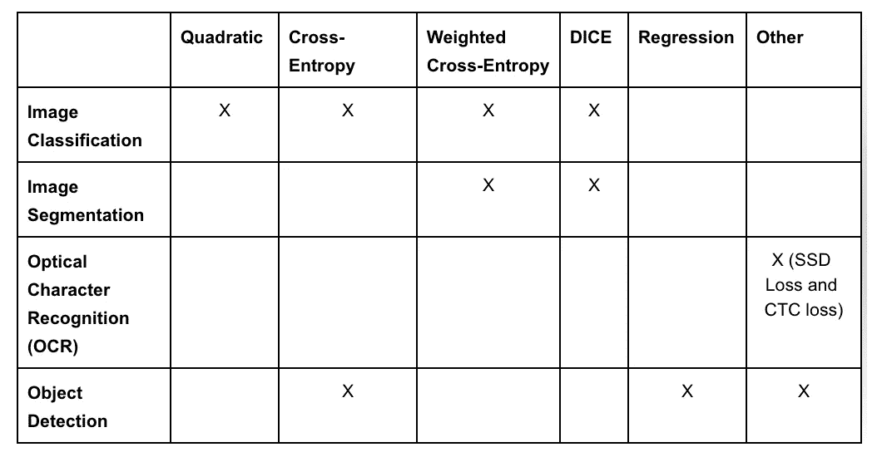
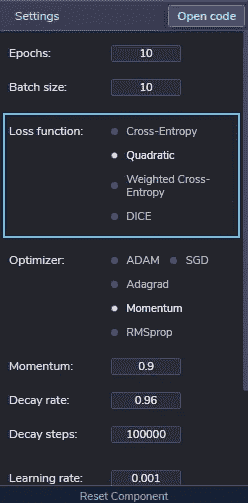
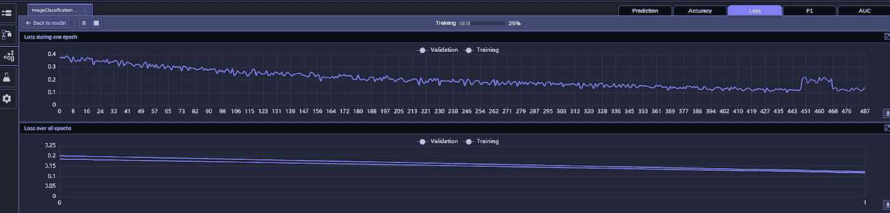

# 为图像处理选择和定制损失函数

> 原文：<https://towardsdatascience.com/choosing-and-customizing-loss-functions-for-image-processing-a0e4bf665b0a?source=collection_archive---------14----------------------->


图片来源: [Unsplash](https://unsplash.com/photos/HwxVLhLyg2s)

**想象一下:**你站在一座能见度很低的高山上，你的目标是找到通往山下的路。你将如何实现这一点？一个可能的方法是四处寻找路径，拒绝那些向上的路径，因为它们会*花费你太多的时间和精力，却发现它们不会帮助你实现你的目标，同时分析和选择那些会让你到达山中较低位置的路径。然后你选择一条向下的路，你认为这条路会用最少的时间和精力让你到达底部。然后你沿着这条路走下去，这条路会把你带到一个新的点，让你做出新的选择，并继续重复这个过程，直到你到达底部。*

这是机器学习(ML)算法在训练期间所做的事情。更具体地说，*优化器*在这个山区类比中粗略地描述了[随机梯度下降](https://en.wikipedia.org/wiki/Stochastic_gradient_descent) (SGD)优化，它不断尝试新的权重和偏差，直到它达到为模型找到最佳值以进行准确预测的目标。但是优化器如何知道它是否在尝试*好的*值，以及当它在训练数据中前进时结果是否朝着正确的方向发展呢？这就是 [*损失函数*](https://en.wikipedia.org/wiki/Loss_function) 的用武之地。

# 输入损失函数

*损失函数*在训练(优化)ML 模型时起着关键作用。它主要计算模型使用一组给定的值(即权重和偏差)进行预测的能力。计算的输出是*损失*或*误差*，这是模型使用一组参数值做出的预测与实际地面实况之间的差异。

例如，如果使用[神经网络](https://en.wikipedia.org/wiki/Neural_network)对血细胞医学图像执行图像分类，则在训练期间使用损失函数来衡量模型能够将输入像素与网络隐藏层中不同级别的特征相关联的程度，并最终为每个分类设置正确的概率。在血细胞图像的例子中，较早的层可以表示基本图案(例如，弧线、曲线、形状等。)，而随后的层可以开始表示医务人员感兴趣的血细胞的更高级特征。在这里，损失函数的作用是帮助优化器正确预测这些不同级别的特征——从基本模式到最终的血细胞。

术语*损失函数*(有时称为*误差函数*)经常与*成本函数*互换使用。然而，一般认为前者计算单个训练样本的损失，而后者计算所有训练数据的平均损失。总体目标是在所有训练样本中找到最小化平均成本的参数值(即，将成本降低到某个可接受的小值)。

成本函数接受模型的所有参数，并将成本作为单个标量输出。该函数由模型的优化器使用，该优化器试图找到一组理想的参数来最小化成本(也称为*最小化函数*)。

正如我们将在这篇博客中看到的，有许多你可以使用的成本函数，你甚至可以自定义自己的成本函数。因此，为您的用例选择正确的损失函数与拥有好的数据标签一样重要，以便将主题专业知识应用到模型中。换句话说，两者对于反映拥有一个*正确的*模型意味着什么以及针对什么进行优化都是至关重要的。然后，模型本身(即 [DNN](https://en.wikipedia.org/wiki/Deep_learning#Deep_neural_networks) 操作)或多或少可以被认为只是一个保存和学习信息的媒介。

# 常见损失函数

损失函数通常来源于不同的数学领域，如统计分析、信息论等。，因此采用各种方程以不同的方式计算损失。因此，每个损失函数都有其优点和缺点也就不足为奇了，选择合适的损失函数取决于许多因素，包括用例、数据类型、优化方法等。

损失函数一般分为两类:*分类*和*回归*损失。分类寻求从有限的一组类别中预测一个值，而回归的目标是基于许多参数预测一个连续的值。

以下是一些常见的损失函数，您可以在 PerceptiLabs 中找到:

**分类损失函数:**

*   **二次方**(又名均方差或 MSE):对预测值和实际值之间的平方差进行平均，重点关注误差的平均大小，而不考虑方向。
*   **交叉熵(也称为对数损失)**:计算预测的类别概率和基于对数标度的真实值之间的差异。适用于对象检测。
*   **加权交叉熵**:通过将权重添加到数据中表示不足的某些方面(例如，某些对象类)(例如，对象出现在较少的数据样本中)，提高交叉熵的准确性。适用于*不平衡数据集*(例如，当图像的背景过度表现某些对象，而前景中感兴趣的对象表现不足时)。
*   **DICE** :计算 [Dice 系数](https://en.wikipedia.org/wiki/S%C3%B8rensen%E2%80%93Dice_coefficient)，该系数测量预测样本和实际样本之间的重叠，结果 1 表示完全重叠。对[图像分割](https://en.wikipedia.org/wiki/Image_segmentation)有用。

**回归损失函数:**

*   **均方误差/二次损失/L2 损失**:对预测值和实际值之间的平方差进行平均，关注误差的平均大小，而不考虑方向。
*   **平均绝对误差，L1 损失**(由感知实验室的[回归](https://docs.perceptilabs.com/perceptilabs/references/components/training#regression)组件使用):对预测值和实际值之间的绝对差值求和，并求平均值。

损失函数用于各种用例中。下表显示了可能应用这些和其他损失函数的常见图像处理用例:



图片来源:[感知器](http://www.perceptilabs.com)

# 损益损失

在感知器中配置损失函数非常容易，只需在模型的[训练](https://docs.perceptilabs.com/perceptilabs/references/components/training)组件中选择所需的损失函数:



图像来源:[感知器](http://www.perceptilabs.com)

然后，感知器将根据需要更新组件的底层 TensorFlow 代码，以集成该损失函数。例如，以下代码片段显示了配置有*二次* (MSE)损失函数和 SGD 优化器的训练组件的代码:

```
# Defining loss function
loss_tensor = tf.reduce_mean(tf.square(output_tensor - target_tensor))...optimizer = tf.compat.v1.train.GradientDescentOptimizer(learning_rate=0.001)layer_weight_tensors = {}
layer_bias_tensors = {}        
layer_gradient_tensors = {}
for node in graph.inner_nodes:
	...compute gradientsupdate_weights = optimizer.minimize(loss_tensor, global_step=global_step)
```

您也可以通过修改培训组件的代码来轻松定制损失函数。只需配置并创建一个不同的损失函数，并将其传递给 optimizer。例如，以下代码创建了一个交叉熵损失函数:

```
# Defining loss function
n_classes = output_tensor.get_shape().as_list()[-1]
flat_pred = tf.reshape(output_tensor, [-1, n_classes])
flat_labels = tf.reshape(target_tensor, [-1, n_classes])
loss_tensor = tf.reduce_mean(tf.nn.softmax_cross_entropy_with_logits(labels=flat_labels, logits=flat_pred))...update_weights = optimizer.minimize(loss_tensor, global_step=global_step)
```

当您在感知器中训练模型时，统计窗口上的*损耗*选项卡会向您显示一个时期内的计算损耗和所有时期的平均损耗，并且随着模型的训练，这些会实时更新。



图像来源:[感知器 Labs](http://www.perceptilabs.com)

因为目标是最小化损失，所以您会希望看到所有时期*的损失*图逐渐减小，这意味着模型的预测在匹配基础事实方面正在逐渐改进。查看该用户界面是使用感知器的好处之一，因为您可以快速查看培训是否朝着正确的方向发展，或者您是否应该停止培训并调整您的超参数、更改您的损失函数或切换优化器。

# 结论

损失函数在训练模型时起着关键作用，并且是优化器的重要组成部分。虽然感知器的用户界面使得选择一个损失函数成为一个小细节，但是对于一个给定的用例和模型架构，知道选择哪个损失函数确实是一件大事。

有关损耗函数的更多信息，请阅读以下文章，这些文章很好地解释了其中一些损耗函数:

*   [交叉熵损失函数](/cross-entropy-loss-function-f38c4ec8643e)
*   [回归——为什么是均方误差？](/https-medium-com-chayankathuria-regression-why-mean-square-error-a8cad2a1c96f)
*   [训练深度学习神经网络时如何选择损失函数](https://www.analyticsvidhya.com/blog/2019/08/detailed-guide-7-loss-functions-machine-learning-python-code/)

对于那些刚刚开始学习 ML 或者需要复习损失函数的人，一定要看看[梯度下降，神经网络如何学习](https://www.youtube.com/watch?v=IHZwWFHWa-w&list=PLZHQObOWTQDNU6R1_67000Dx_ZCJB-3pi&index=3)。这是一个伟大的 YouTube 视频系列的第二部分，解释了神经网络如何工作，这一集涵盖了梯度下降中损失函数的作用。

关于神经网络的介绍或复习，看看这个优秀的 [YouTube 视频系列](https://www.youtube.com/watch?v=aircAruvnKk)。

[https://towards data science . com/common-loss-functions-in-machine-learning-46 af 0 ffc 4d 23](/common-loss-functions-in-machine-learning-46af0ffc4d23)

[https://arxiv.org/ftp/arxiv/papers/2006/2006.01413.pdf](https://arxiv.org/ftp/arxiv/papers/2006/2006.01413.pdf)