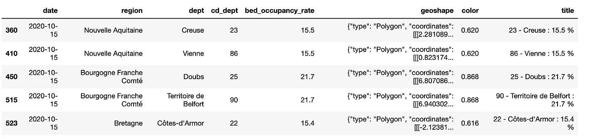
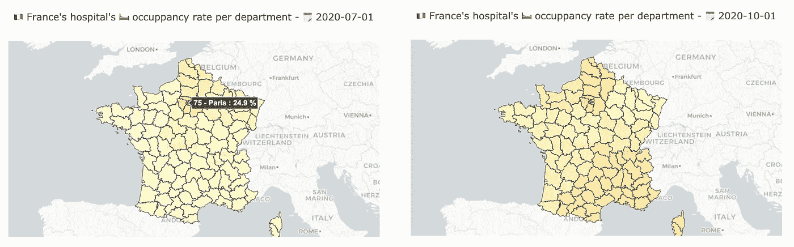
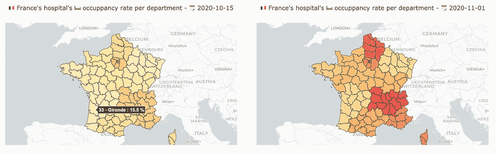
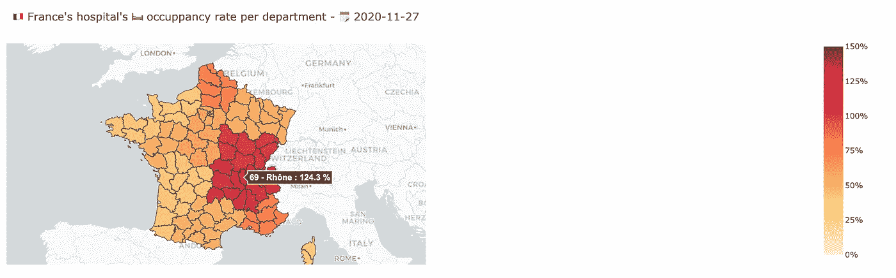

# 用 Plotly 和 Python 实践 Choropleth 地图

> 原文：<https://towardsdatascience.com/choropleth-maps-in-practice-with-plotly-and-python-672a5eef3a19?source=collection_archive---------23----------------------->


图 1—[汉尼斯·沃尔夫](https://unsplash.com/@hannes_wolf?utm_source=unsplash&utm_medium=referral&utm_content=creditCopyText)在 [Unsplash](https://unsplash.com/s/photos/france-map?utm_source=unsplash&utm_medium=referral&utm_content=creditCopyText) 上的照片

## 在一堆关于 choropleth 映射的理论之后，让我们看看如何轻松地为新的用例改编代码。在本教程中，我们将可视化法国医院在 covid 疫情期间的病床占用率。

# 介绍

Choropleth 地图是那些整个地区都被颜色覆盖的地图。来源于古希腊语: *Choros* 意为“*地区”，*和 *Plethos* 意为*“众多”。*这篇文章旨在展示使用 Plotly Python 库从头实现一个是多么容易。我们将用 covid 疫情公开数据来做这件事，放大法国的区域。

在继续讲下去之前，我想让你知道这个故事是对前一个故事的补充。如果你想要更多的信息或者想知道 choropleth 地图和 GeoJSON 的基本原理是什么，我强烈推荐你从这个故事开始，然后回来了解更多的细节🙃

</how-to-create-outstanding-custom-choropleth-maps-with-plotly-and-dash-49ac918a5f05>  

话虽如此，今天的目的是:

*   了解使用新数据和新地理区域实现新的 choropleth 地图是多么容易
*   即使这意味着一些重构，看看当你已经做过一次的时候，做起来有多容易
*   了解 2020 年 11 月法国第二次全国封锁

# 动手🦠 🇫🇷 🛏

以前，我们使用全球数据集，呈现全球范围内的结果。今天，为了展示这个过程的可扩展性，我们将放大一个特定的国家:法国。

那么我们需要什么来绘制这张地图呢？

*   具有要在不同地理区域进行比较的 KPI 的数据集
*   一个 GeoJSON 文件，用于覆盖地图上要着色的地理区域
*   在它们之间建立联系

根据要求，您还需要一个安装了以下两个库的 python 开发:`pandas`、`plotly`。在脚本开始时安装和导入😉

```
import pandas as pd
import plotly.express as px
```

## 1.数据集

数据集来自 [opendatasoft](https://public.opendatasoft.com/explore/dataset/indicateur-suivi-covid19-departement-france/table/?disjunctive.reg_name&disjunctive.dep_name&sort=extract_date) 。今天，我们将观察一个不同的 KPI，而不是通常的统计已确认、已康复或已死亡的人数。**我们将跟踪医院的病床占用率**。事实上，这是一个非常重要的指标，法国政府在宣布地区或全国宵禁和封锁之前就考虑到了这一点。

因此，首先，下载数据集并将其作为数据帧加载。作为处理的第一步，让我们重命名列，以便于处理。

步骤 1:加载数据集

由于数据集随着时间的推移跟踪大量信息，我们必须选择日期。实际上，choropleth 地图是给定情况的快照。在本例中，我们将选择 2020 年 10 月 15 日。

步骤 2:从特定日期选择数据并进行基本预处理—2020 年 10 月 15 日

如果我们浏览一下数据，`df_dt`数据帧如下所示:



图 2-预处理数据集概述

你可能已经注意到一些有趣的事情:

*   一个`color`列的创建。事实上，我们希望色阶的值有限。由于整个数据集中的占用率在 0%和 250%之间变化，我随意决定除以 25。这不是强制性的，但它是我喜欢使用的一种颜色标准化，颜色值在 0 到 10 之间。
*   一个`title`栏目的创立。我们将把它用于悬停数据。它结合了部门代码、部门名称和相关比率。
*   前两条线有不同的`dept`值，但相同的`bed_occupancy_rate`，这似乎有点幸运。它不是。事实上，在法国，有 18 个*大区，*分成 101 个*省。*这里一条线代表一个部门，数据按地区汇总。顺便说一下，你可以看到 *Creuse* 和 *Vienne* 都位于*新阿基坦*。这解释了相同的百分比值！
*   数据集中已指定 GeoJSON 要素！真幸运！我们不必自己去寻找地理界限。但作为参考，它们也可以在单独部门的地理数据集中找到。例如，作为前面所说的参考，如果我们想要在地图上绘制区域而不是部门，我们可以从[该区域的地理数据集](https://public.opendatasoft.com/explore/dataset/contours-geographiques-simplifies-des-nouvelles-regions-metropole/table/)加载 GeoJSON。我们必须使用`code_region`列来建立链接。事实上，这里的代码是管理代码，非常可靠。有点像国家的 ISO-A2 或 ISO-A3 标准化。
*   在脚本的末尾有一个断言测试，这样我们就可以确定部门代码是惟一的，这对进一步的处理很重要。一个部门必须对应我们 GeoJSON 的一个区域，反之亦然。

## 2.GeoJSON 文件

为了绘制地图，我们需要一个 GeoJSON 文件。希望地理数据已经存在于数据集中，并且由于有了 RFC 7946 规范，它们几乎已经可以使用了。

然而，Plotly 在数字信息和地理信息之间建立联系所需的步骤是在每个 GeoJSON 要素的键中有一个`id`值，它与我们数据集的特定列相关。为了确保链接正确，后一列必须包含唯一的值。在我们的例子中，我们将使用部门代码作为唯一值

正如我们所看到的，在`geoshape`一栏中，我们有部分需要的信息。然后我们只需要用`json.loads`函数将它转换成一个字典。事实上，默认情况下，当加载`pd.read_csv`函数时，它被定义为一个字符串。

所以我们开始吧！让我们从数据中构建自定义 GeoJSON 文件。

步骤 3:构建 GeoJSON 文件

这里没有什么特别要提的，代码非常简单！

## 3.绘制地图

所以我们来了！最关键的部分！密谋！

为此，我们将使用`plotly.express.choropleth_mapbox`功能。Mapbox 是一家与 Plotly 合作的公司，因此他们可以提供非常酷的功能，如我们今天探索的 choropleth 地图。对于大多数地图绘制，您需要一个身份验证令牌，但是对于基本的 choropleth 地图来说就不是这样了😃

对于这个情节，我们必须说明几件事:

*   使用哪个数据帧
*   要使用哪个 GeoJSON 文件
*   数据帧的哪一列与 GeoJSON 的`id`值相匹配
*   **【可选】**用于绘图的色标
*   **【可选】【但强烈推荐】**色阶的最大值有哪些？**还记得之前的正常化吗？**这里我会设置`max_color=10`(意思是`bed_occupancy_rate=25*10=250(%)`)。然后，无论所选日期的`df_dt`中包含什么值，颜色都不适合这些精确的数据，而是之前选择的最大值。*深红色*将始终对应于历史最大值，如果在某些情况下，全国一天的最大值为 10%，所有彩色区域将非常亮。它允许保持几天的一致性。
*   **【可选】**使用哪一列作为 hoverbox 的主要信息。这里我们将使用我们构建的包含所有必要信息的`title`列。
*   **【可选】**在悬停框中将哪一列显示为次要信息。在这里，我们将把它们全部隐藏起来。
*   要使用的地图框样式。其中一些是免费的，其他一些则需要认证令牌。这里我们就用`carto-positron`这个很清醒。它可能会将国家数据作为证据。
*   使用哪个地图框缩放。`1`显示整个世界。这里我们将使用`4`，它非常适合这个国家的大小。为了展示美国，我们选择了`3`。
*   地图的中心位置。这是一个反复的过程。如果你有一个精确的地方可以选择，你可以使用谷歌地图😉

步骤 4:绘制地图

> 注意，使用 plotly `layout`，我们可以定制我们的颜色栏和标题属性！

所以现在我们可以看到这个图形了。是不是很奇妙？从无到有，我们只用了 75 行 gists！伴随着很多的描述和评论。实际上，就代码而言，它可以容纳不到 30 行。

让我们现在分析我们的地图🤓

# 结果

我绘制了从 7 月到 11 月底不同日期的图。这是我们根据数字得出的结果。



图 3-7 月至 11 月法国各地区 COVID 床位占用率的变化

*   我们注意到，在 7 月，也就是第一次法国全国封锁结束后的两个月，医院获得了喘息的机会，不再受到 COVID 患者的攻击。
*   然后一直到 10 月初，情况还是挺稳定的。
*   月中旬，我们开始观察到第二波污染，到 11 月初，多个地区的情况变得危急。
*   这种情况一直持续到 11 月 27 日。希望，如果你每天绘制所有的数据，你会看到在这个日期，高峰已经过去，医院的运营越来越好。

现在我们更好地理解了为什么马克龙总统决定第二次封锁的当前地图！

# 结论

今天，我们已经看到了如何在一个特定的用例中使用 Python 高效地绘制 choropleth 地图。多亏了 Plotly 库，我们只用了不到 30 行代码就做到了。很有效率，不是吗？

在结果部分，我们看到了进化的一部分，但不能用最后的图片来说是否已经过了顶峰。一个很好的解决方法是动画我们的地图。为此，我向您推荐下面的故事，在这个故事中，您将学习如何使用 Plotly 跟踪 KPI。

</how-to-create-animated-scatter-maps-with-plotly-and-dash-f10bb82d357a>  

此外，如果我们今天专注于地图创建，Plotly 还提供了一个名为 Dash 的框架，它允许在易于使用的应用程序中集成地块和地图。如果你希望通过 Heroku 发现如何嵌入你的 choropleth 地图并在互联网上免费部署，我建议你阅读这篇文章

</deploying-dash-or-flask-web-application-on-heroku-easy-ci-cd-4111da3170b8>  

最后，要发现更多关于 GeoJSON 的信息，并获得更多关于今天的代码的信息，我只能建议你去了解激发这个故事的主要故事。

<https://medium.com/@thibaud.lamothe2/how-to-create-outstanding-custom-choropleth-maps-with-plotly-and-dash-49ac918a5f05>  

> 希望你喜欢，希望不久能见到你🤠