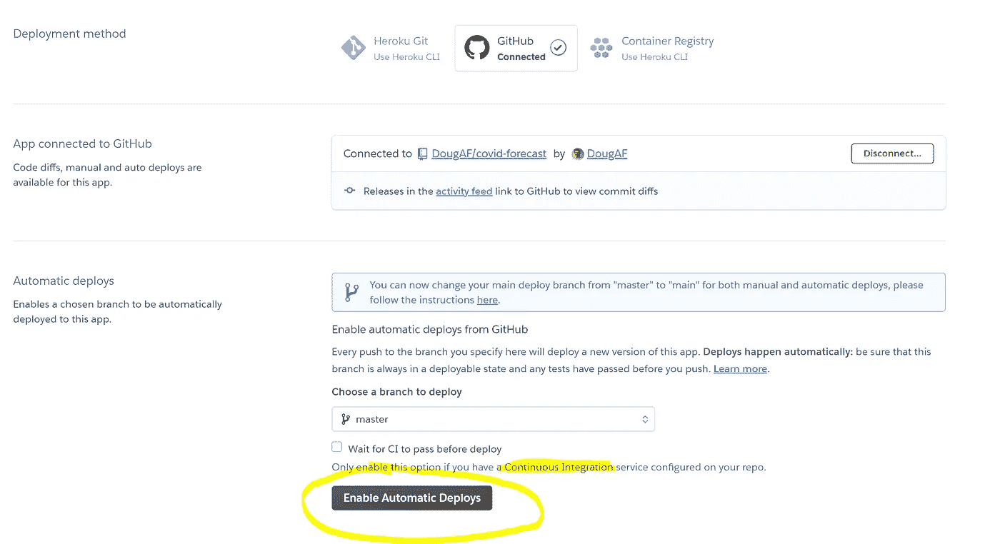
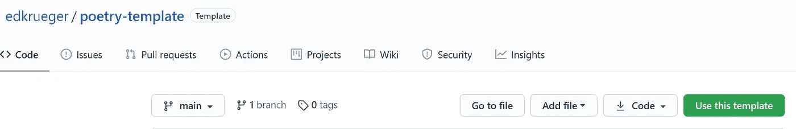

# Python 中的 CI/CD 示例

> 原文：<https://towardsdatascience.com/ci-cd-by-example-in-python-46f1533cb09d?source=collection_archive---------5----------------------->

## [入门](https://towardsdatascience.com/tagged/getting-started)

## 用 Python 简单演示了 CI/CD，带有诗歌和预提交挂钩

由:[爱德华·克鲁格](https://www.linkedin.com/in/edkrueger/)和[道格拉斯·富兰克林](https://www.linkedin.com/in/douglas-franklin-1a3a2aa3/)

昆腾·德格拉夫在 Unsplash 上拍摄的照片

*我们将通过 Python 中的一个例子，将静态分析作为持续集成和持续交付(CI/CD)中的一个步骤。*

CI/CD 管道允许快速和自动化的代码部署。他们尽可能多地自动化开发过程。CI/CD 管道可能包括格式化、强制执行良好的风格，以及提醒开发人员注意错误和运行测试。他们确保代码可以集成到代码库中，并最终将代码交付到产品中。

一些 CI/CD 任务可以通过静态分析来完成。静态分析通常通过预提交挂钩来完成。

## 什么是静态分析？

**静态分析**是一种确保代码质量的方法，它在不执行代码的情况下检查代码。静态分析工具的一些例子是格式化器、linters 和静态漏洞分析器。

格式化器自动对代码进行样式化，以提高可读性和一致性。他们主要是在空白区域进行修改；它们不会修改代码的执行方式。

作者:musicmoon@rogers.com

Linters 类似于书面文档的拼写检查器。他们寻找代码中的缺陷和错误。它们移除“无用的东西”，因此得名，比如未使用的导入和变量。Linters 也可以检测一些错误。例如，如果一个变量被使用但从未被定义，linter 将发出一个警告。Linters 还提供了风格和最佳实践的建议。

如果您使用的软件包版本存在已知的安全漏洞，静态漏洞分析工具会向您发出警告。这可以防止事后想起与安全相关的问题。例如，当 GitHub 警告您您的`requirements.txt` 包含一个已知安全漏洞的依赖项时。静态漏洞分析警告来自 CVE，一个致力于追踪这些漏洞的网站和公司。

Github 静态漏洞分析警报

**静态分析**工具有很多好处；一个是在 bug 发布到产品之前发现它们。静态分析的一个优点是它不需要执行你的代码，使得这个过程很快。

*实现静态分析工具给开发人员带来如此小的开销，没有理由* ***不*** *使用它们。*

静态分析可以很容易地用预提交钩子实现和完成。

# 什么是预提交挂钩？

预提交钩子是 Git 钩子的一种。Git-hooks 在 Git 存储库中出现命令时触发——比如提交或推送。当一个`git commit`被执行时，一个“预提交钩子”运行。

预提交挂钩通常用于运行静态分析，因此代码在提交前会被链接和格式化。预提交挂钩可用于持续集成，为部署准备代码，帮助构建过程、依赖管理和测试。使用预提交钩子进行测试有好处也有坏处。好的一面是你永远不会得到测试失败的代码。不利的一面是，您可能会接受代码未能通过正在进行的工作的一些测试。大多数人不会将测试作为预提交挂钩，这些更高级的挂钩超出了本文的范围。

## 我们的 CI/CD 渠道

照片由 Florian wchter 在 Unsplash 上拍摄

我们在下面的存储库中使用了一个非常简单的“CI/CD 管道”。我们的预提交钩子做一些静态分析。你可以在`.pre-commit-config.yaml`里观察它们。我们的定制预提交钩子`create-requirements`确保我们的`requirements.txt`与我们的诗歌 toml 和`poety.lock`同步，也就是我们的本地虚拟环境。

<https://github.com/edkrueger/poetry-template>  

这自动更新到`requirements.txt`，所以我们需要更新的只是诗歌 toml。如果我们不能更新我们的`requirements.txt`,任何改变或依赖都会导致我们的改变不出现，或者在最坏的情况下，使我们的应用崩溃。

这个定制钩子作为一个连续的交付工具，特别是因为我们已经从我们的 Github 主分支启用了自动部署。它的目的是在我们部署之前自动更新我们的`requirements.txt`，以便 Heroku 可以从这个文件构建。

*关于这个定制钩子或者如何用 Bash 编写自己的钩子的更多信息，请阅读下面的内容:*

</how-to-code-your-own-python-pre-commit-hooks-with-bash-171298c6ee05>  

在某些情况下，应用程序崩溃几分钟可能会对企业、开发人员的声誉或两者都造成灾难性的影响。如果你的应用程序是一个简单的内部仪表盘来衡量 KPI，而你的老板决定在你破坏它时检查它的性能，这不是一个好的外观。对于面向客户的应用程序，崩溃的时间意味着失去客户和收入。

这些情况旨在强调使用简单工具来防止此类事情发生的重要性。有了良好的 CI/CD 管道，大多数错误都可以在投入生产之前被发现。

此外，虽然客户和老板可能不关心代码如何工作，但开发人员关心。这是使用静态分析工具和 CI/CD 管道的另一个原因。如果你的代码写得很差，它将很难测试和扩展。随着时间的推移，这些变化，无论植入得好或不好，都会或多或少地导致**技术债务。**

## 静态分析、CI/CD 和 Heroku 部署

如下图所示，我们选择了“启用自动部署”来开发我们的应用程序。通过在 Heroku 上选择这个选项，当新代码被推送到我们的 Git 存储库时，它会不断地被部署到我们的应用程序中。这意味着对主分支的每次推送都是对生产的推送。

正如按钮上方的警告所示，这就是为什么设置持续集成“服务”很重要。对我们来说，这个服务是我们的林挺和格式化预提交钩子以及我们的定制钩子，确保我们的`requirements.txt`是最新的。

通过 Github 分支的自动部署实现持续交付

我们的库的`pre-commit-config.yaml`、`create-requirements`的 bash 代码以及在 Heroku 上实现自动部署，一起代表了我们简单的 CI/CD 管道。

这三个部分共同确保我们的代码被正确地格式化和标记，并且我们不会因为推送库`requirements.txt`文件不支持的更改而使我们的应用崩溃。

## 结论

开发人员没有理由不使用简单的静态分析工具作为预提交挂钩就将代码推送到 GitHub。这有助于确保您的代码是干净的，有更少的错误，几乎没有开销。从事更重要的产品代码库的有先见之明的开发人员几乎总是使用 CI/CD 管道来自动化他们代码变更的林挺、格式化、测试和集成/交付。

从寻找工作的自学开发人员到在 GitHub 上发表作品的编程学者，一直到职业软件工程师，这些都是确保你不犯容易错误的重要工具。所以`pip intstall pre-commit`和检查他们的[文档](https://pre-commit.com/)和[钩子](https://pre-commit.com/hooks.html)开始吧！

如果配置太多，那就不要！使用 Ed 的[模板回购](https://github.com/edkrueger/poetry-package-template)。点击 GitHub 上的绿色按钮开始(见下图)。

使用此模板