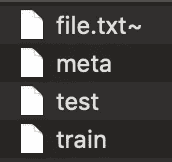
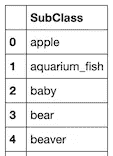
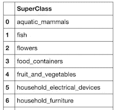
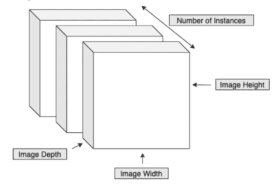
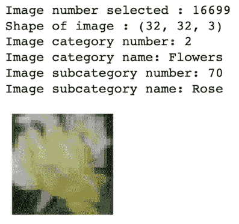
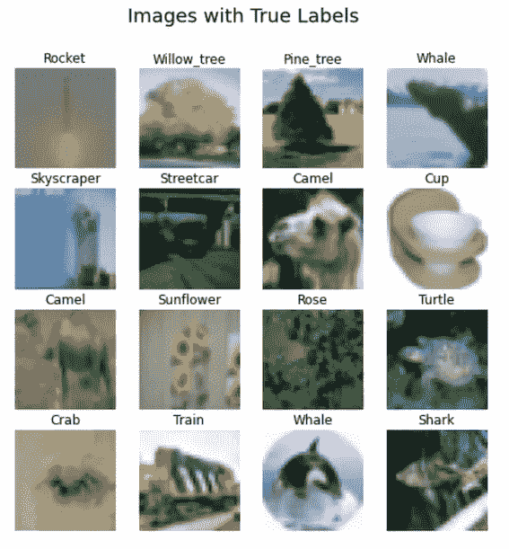

# CIFAR-100:图像识别任务预处理

> 原文：<https://towardsdatascience.com/cifar-100-pre-processing-for-image-recognition-task-68015b43d658?source=collection_archive---------9----------------------->

## 常用图像数据集(CIFAR-100)的预处理或数据准备


在 [Unsplash](https://unsplash.com/photos/WTThc6UmwEI) 上由 [Bacila](https://unsplash.com/@bacila_vlad) 拍摄的照片

**图像识别**对人类来说是一项简单的任务，因为我们很容易区分不同的特征。不知何故，我们的大脑在不知不觉中接受了不同或相似类型图像的训练，这些图像帮助我们在不投入太多精力的情况下区分特征(图像)。例如，在见过几只猫之后，我们几乎可以认出生活中遇到的每一种不同类型的猫。🐱然而，机器需要大量的特征提取训练，由于高计算成本、内存需求和处理能力，这成为一个挑战。

在本文中，我们将讨论这样一个用例的预处理。因此，让我们更深入地了解如何预处理图像数据集来构建卷积神经网络模型。🏊🏼

***注:***

1.  *我会尽量把大部分概念讲清楚，但是，本文假设对卷积神经网络(CNN)有一个基本的了解。*📖
2.  我用 jupyter 笔记本来写我的代码。

**卷积神经网络** **(CNN)** 是一类常用于分析图像的深度神经网络。可以构建卷积神经网络模型，以正确识别对象的彩色图像并将其分类到 CIFAR-100 数据集的 100 个可用类别之一。

那么，我们开始吧。🏃🏻

# CIFAR-100 是什么？🤔

**CIFAR-100** 是 8000 万微小图像数据集的标记子集，其中 [CIFAR](https://cifar.ca/) 代表加拿大高级研究所。这些图片是由亚历克斯·克里热夫斯基、维诺德·奈尔和杰弗里·辛顿收集的。该数据集由 32 × 32 像素的 60000 幅彩色图像(50000 幅训练和 10000 幅测试)组成，分为 100 个类，分为 20 个超类。每个图像都有一个细标签(类)和一个粗标签(超类)。

# 如何获得 CIFAR-100 数据集？🙋

这个数据集的 Python 版本可以从多伦多计算机科学大学的网站上下载。下载的文件是使用 cPickle 生成的 Python 腌制对象。现在不要担心这个。我们将一起完成使用该数据集的每个步骤。

# 如何加载这个数据集？🚛

从网站下载数据集后，我们需要将它加载到我们的 jupyter 笔记本中。从网站上获取的文件都是 Python 腌制的对象。解压缩后的文件夹结构如下所示:



作者图片

我们可以看到，我们有单独的培训和测试文件，以及一个元文件。

Python Pickle 或 cPickle 模块可以用来序列化或反序列化 Python 中的对象。在这里，我用泡菜。Pickle 的 load()方法可以用来读取这些文件并分析它们的结构。阅读[这篇](https://realpython.com/python-pickle-module/)了解更多关于腌制的知识。

Pickle 需要二进制数据，因此我们将以‘Rb’的形式打开文件，并使用 pickle load()方法和‘latin1’编码加载它。

让我们首先导入我们将在预处理中使用的库。

```
**import** pickle
**import** pandas **as** pd
**import** numpy **as** np
**import** matplotlib.pyplot **as** **plt**
**from** pylab **import** rcParams
%matplotlib inline
**import** keras **from** keras.utils **import** to_categorical
```

下面是读取这些文件的代码。

```
*#function to read files present in the Python version of the dataset*
**def** unpickle(file):
    **with** open(file, 'rb') **as** fo:
        myDict = pickle.load(fo, encoding='latin1')
    **return** myDict
```

[阅读这个](https://stackoverflow.com/questions/4792764/why-does-everyone-use-latin1#:~:text=The%20reason%20that%20ISO%208859,set%20for%20internet%20based%20technologies.&text=ISO%208859%2D1%20contains%20256,is%20encoded%20with%20011110112.)就知道为什么我们大多使用‘latin1’作为编码。

现在让我们加载我们的训练集。

```
trainData = unpickle('train')#type of items in each file
**for** item **in** trainData:
    **print**(item, type(trainData[item]))
```

输出如下所示:

```
filenames <class 'list'>
batch_label <class 'str'>
fine_labels <class 'list'>
coarse_labels <class 'list'>
data <class 'numpy.ndarray'>
```

培训文件中有上述项目。coarse_labels 和 fine_labels 是图像的标签(分别为 20、100)，数据文件具有 NumPy 数组形式的图像数据，filenames 是说明文件名的列表，batch_label 是批次的标签。

让我们检查数据集的长度。

```
**print**(**len**(trainData['data']))
**print**(**len**(trainData['data'][0]))
```

输出如下所示:

```
50000
3072
```

因此，训练数据集中有 50，000 个图像，每个图像都是 3 通道 32 × 32 像素图像(32 × 32 × 3 = 3072)。

让我们来看看独特的精美标签。

```
**print**(**np.unique**(trainData['fine_labels']))
```

输出如下所示:

```
[ 0  1  2  3  4  5  6  7  8  9 10 11 12 13 14 15 16 17 18 19 20 21 22 23 24 25 26 27 28 29 30 31 32 33 34 35 36 37 38 39 40 41 42 43 44 45 46 47 48 49 50 51 52 53 54 55 56 57 58 59 60 61 62 63 64 65 66 67 68 69 70 71 72 73 74 75 76 77 78 79 80 81 82 83 84 85 86 87 88 89 90 91 92 93 94 95 96 97 98 99]
```

因此，从 0 到 99 的图像有 100 个不同的精细标签。

现在让我们来看看独特的粗标签。

```
**print**(**np.unique**(trainData['coarse_labels']))
```

输出如下所示:

```
[ 0  1  2  3  4  5  6  7  8  9 10 11 12 13 14 15 16 17 18 19]
```

因此，从 0 到 19 的图像有 20 个不同的粗略标签。

让我们检查一下 batch_label 文件中有什么。

```
**print**(trainData['batch_label'])
```

输出如下所示:

```
training batch 1 of 1
```

这里我们只有一个批处理，所以 batch_label 是一个字符串。

由于我们已经完成了对训练数据集中除数据文件本身以外的不同文件的研究，所以让我们首先解除对测试数据集和元数据文件的检查。

```
testData = **unpickle**('test')metaData = **unpickle**('meta')#metaData
**print**("Fine labels:", metaData['fine_label_names'], "\n")
**print**("Coarse labels:", metaData['coarse_label_names'])
```

元文件有一个精细标签和粗糙标签的字典。为了清楚起见，我将它们分开打印。这里是输出。

```
Fine labels: ['apple', 'aquarium_fish', 'baby', 'bear', 'beaver', 'bed', 'bee', 'beetle', 'bicycle', 'bottle', 'bowl', 'boy', 'bridge', 'bus', 'butterfly', 'camel', 'can', 'castle', 'caterpillar', 'cattle', 'chair', 'chimpanzee', 'clock', 'cloud', 'cockroach', 'couch', 'crab', 'crocodile', 'cup', 'dinosaur', 'dolphin', 'elephant', 'flatfish', 'forest', 'fox', 'girl', 'hamster', 'house', 'kangaroo', 'keyboard', 'lamp', 'lawn_mower', 'leopard', 'lion', 'lizard', 'lobster', 'man', 'maple_tree', 'motorcycle', 'mountain', 'mouse', 'mushroom', 'oak_tree', 'orange', 'orchid', 'otter', 'palm_tree', 'pear', 'pickup_truck', 'pine_tree', 'plain', 'plate', 'poppy', 'porcupine', 'possum', 'rabbit', 'raccoon', 'ray', 'road', 'rocket', 'rose', 'sea', 'seal', 'shark', 'shrew', 'skunk', 'skyscraper', 'snail', 'snake', 'spider', 'squirrel', 'streetcar', 'sunflower', 'sweet_pepper', 'table', 'tank', 'telephone', 'television', 'tiger', 'tractor', 'train', 'trout', 'tulip', 'turtle', 'wardrobe', 'whale', 'willow_tree', 'wolf', 'woman', 'worm'] Coarse labels: ['aquatic_mammals', 'fish', 'flowers', 'food_containers', 'fruit_and_vegetables', 'household_electrical_devices', 'household_furniture', 'insects', 'large_carnivores', 'large_man-made_outdoor_things', 'large_natural_outdoor_scenes', 'large_omnivores_and_herbivores', 'medium_mammals', 'non-insect_invertebrates', 'people', 'reptiles', 'small_mammals', 'trees', 'vehicles_1', 'vehicles_2']
```

我们的任务将是识别图像，并为它们提供良好的标签。

现在让我们使用标签创建数据帧，这将有助于我们的可视化。

```
*#storing coarse labels along with its number code in a dataframe*
category = **pd.DataFrame**(metaData['coarse_label_names'], columns=['SuperClass'])*#storing fine labels along with its number code in a dataframe*
subCategory = **pd.DataFrame**(metaData['fine_label_names'], columns=['SubClass'])**print**(category)
**print**(subCategory)
```

两个数据帧的一瞥:



作者图片



作者图片

现在让我们看看我们的数据。

```
X_train = trainData['data']
X_train
```

输出是一个 NumPy 数组。

```
array([[255, 255, 255, ...,  10,  59,  79],
       [255, 253, 253, ..., 253, 253, 255],
       [250, 248, 247, ..., 194, 207, 228],
       ...,
       [248, 240, 236, ..., 180, 174, 205],
       [156, 151, 151, ..., 114, 107, 126],
       [ 31,  30,  31, ...,  72,  69,  67]], dtype=uint8)
```

为了执行图像识别和分类的任务，必须建立卷积神经网络，该网络需要 4D 阵列作为输入。因此，必须对数据进行转换，以获得该形状。

例如，训练数据集有 50000 个形状为(50000，3072)的图像，因此我们需要使用 NumPy 数组的整形和转置操作来转换这些图像，以获得以下形状:

**(实例数×宽×高×深)**

宽度、高度和深度是图像的尺寸，其中深度只是图像中颜色通道的数量，在我们的例子中是 3，因为图像是 RGB。下图说明了卷积神经网络模型的 4D 输入形式。



作者图片

让我们为这种图像转换编写代码。

```
*#4D array input for building the CNN model using Keras*
X_train = X_train.**reshape**(**len**(X_train),3,32,32).**transpose**(0,2,3,1)
*#X_train*
```

我们现在已经完成了转型。让我们创建可视化来看这些图像。

# 可视化:

```
*#generating a random number to display a random image from the dataset along with the label's number and name*#setting the figure size
**rcParams**['figure.figsize'] = 2,2#generating a random number
imageId = **np.random.randint**(0, **len**(X_train))#showing the image at that id
**plt**.**imshow**(X_train[imageId])#setting display off for the image
**plt.axis**('off')#displaying the image id
**print**("Image number selected : **{}**".**format**(imageId))#displaying the shape of the image **print**("Shape of image : **{}**".**format**(X_train[imageId].**shape**))#displaying the category number **print**("Image category number: **{}**".**format**(trainData['coarse_labels'][imageId]))#displaying the category name
**print**("Image category name: **{}**".format(category.**iloc**[trainData['coarse_labels'][imageId]][0].**capitalize**()))#displaying the subcategory number
**print**("Image subcategory number: **{}**".**format**(trainData['fine_labels'][imageId]))#displaying the subcategory name
**print**("Image subcategory name: **{}**".format(subCategory.**iloc**[trainData['fine_labels'][imageId]][0].**capitalize**()))
```

输出如下所示:



作者图片

让我们展示更多的图像。

```
*#16 random images to display at a time along with their true labels*#setting the figure size
**rcParams**['figure.figsize'] = 8,8#number of columns and rows in which images needs to be displayed
num_row = 4
num_col = 4*#to get 4 * 4 = 16 images together*
imageId = **np.random.randint**(0, **len**(X_train), num_row * num_col)#creating subplots
fig, axes = **plt.subplots**(num_row, num_col)#main title of the plot **plt.suptitle**('Images with True Labels', fontsize=18)#displaying images as subplots
**for** i **in** **range**(0, num_row):
    **for** j **in** **range**(0, num_col):
        k = (i*num_col)+j
        axes[i,j].**imshow**(X_train[imageId[k]])
       axes[i,j].**set_title**(subCategory.**iloc**[trainData['fine_labels'][imageId[k]]][0].**capitalize**())
        axes[i,j].**axis**('off')
```



作者图片

我们可以从可视化中看到，图像的质量很低，并且对象在图像中的位置变化很大。很难训练一个模型来识别和分类这样的图像。🙆🏻

现在让我们来处理测试数据集。

```
*#transforming the testing dataset*
X_test = testData['data']
X_test = X_test.**reshape**(**len**(X_test),3,32,32).**transpose**(0,2,3,1)y_train = trainData['fine_labels']
y_test = testData['fine_labels']
```

为了进行预测，图像的标签已经从现有的 1D NumPy 阵列结构转换成分类矩阵结构。

```
#number of classes in the dataset
n_classes = 100y_train = **to_categorical**(y_train, n_classes)
y_test = **to_categorical**(y_test, n_classes)
```

我们现在已经完成了预处理，我们将在[的另一篇文章](/cifar-100-transfer-learning-using-efficientnet-ed3ed7b89af2)中研究如何为这个数据集构建卷积神经网络模型。

这里是到 [GitHub 仓库](https://github.com/chetnakhanna16/CIFAR100_ImageRecognition/blob/master/EffiicientNetB0_CIFAR100.ipynb)的链接，里面有所有这些代码。请在您的工作中随意使用它来训练一个可以对图像进行分类的经典 CNN 模型。😊

**相关文章:**

[](/cifar-100-transfer-learning-using-efficientnet-ed3ed7b89af2) [## CIFAR 100:使用 EfficientNet 进行迁移学习

### 使用最先进的 EfficientNet-B0 进行迁移学习

towardsdatascience.com](/cifar-100-transfer-learning-using-efficientnet-ed3ed7b89af2) 

谢谢大家阅读这篇文章。请分享您对这篇文章的宝贵反馈或建议！快乐阅读！📗 🖌

[领英](https://www.linkedin.com/in/chetna-khanna/)