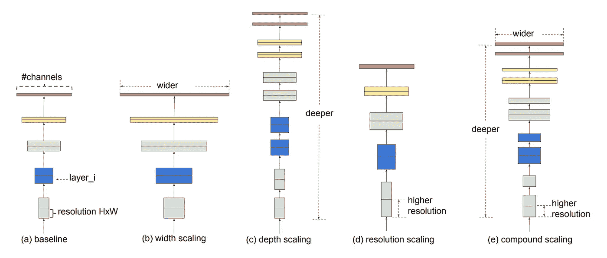
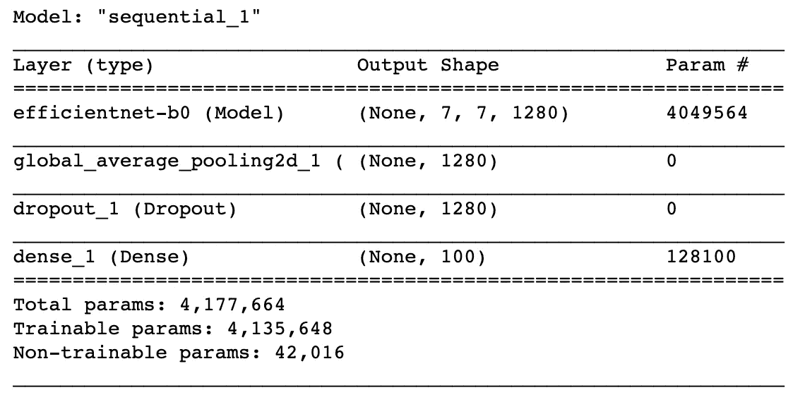
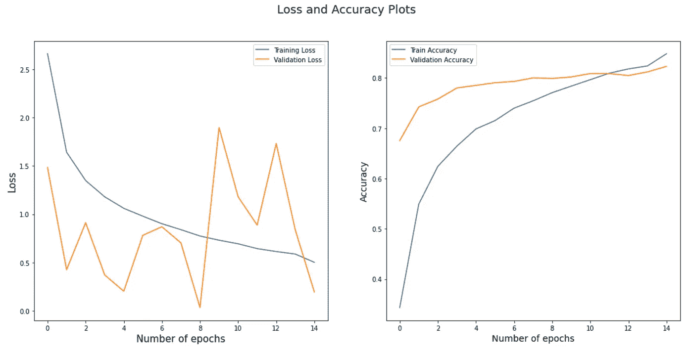
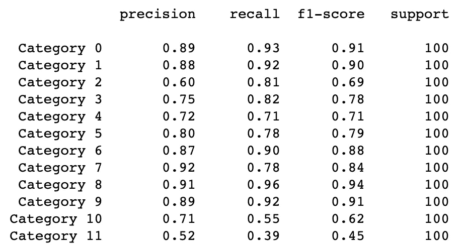

# CIFAR 100:使用 EfficientNet 进行迁移学习

> 原文：<https://towardsdatascience.com/cifar-100-transfer-learning-using-efficientnet-ed3ed7b89af2?source=collection_archive---------3----------------------->

## 使用最先进的 EfficientNet-B0 进行迁移学习


玛丽娜·维塔莱在 [Unsplash](https://unsplash.com/photos/t809JJ6r9KA) 上拍摄的照片

**卷积神经网络** (CNN)是一类常用于分析图像的深度神经网络。在本文中，我们将一起构建一个 CNN 模型，该模型可以正确识别物体的彩色图像并将其分类到 CIFAR-100 数据集的 100 个可用类中的一个。特别是，我们将重用一个最先进的技术作为我们模型的起点。这种技术被称为迁移学习。➡️

我们先来了解一下什么是迁移学习。我不会讲太多细节，但会尝试分享一些知识。📝

# **迁移学习**

*如《机器学习应用研究手册》所述，* ***迁移学习*** *是通过从一个已经学习过的相关任务中迁移知识，在一个新任务中对学习的提高。*

简单来说，迁移学习是一种机器学习技术，在一个任务上训练的模型被重新用于第二个相关的任务。深度学习网络是资源饥渴的，并且具有数百万个参数，计算成本很高。这些网络用大量数据进行训练，以避免过度拟合。因此，当一个最先进的模型被创造出来时，通常需要研究人员花费大量的时间进行培训。由于一个最先进的模型是在花费如此巨大的资源后训练出来的，研究者认为这种投资的收益应该是多次收获的，因此产生了迁移学习的概念。

迁移学习的最大好处是，我们可以重用整个模型或模型的某一部分。嗯，聪明！😎这样我们就不用训练整个模型了。特别是，迁移学习可以节省时间并提供更好的性能。例如，使用可以识别汽车的预训练模型到现在识别卡车。

现在让我们了解一下我们将在这里使用的最先进的模型。

# EfficientNet-B0:最先进的模型

[**EfficientNet**](https://arxiv.org/pdf/1905.11946.pdf) 是谷歌打造的 CNN 的一个家族。与其他最先进的模型相比，✌️these CNN 不仅提供了更好的准确性，而且通过减少参数数量提高了模型的效率。EfficientNet-B0 模型是一个简单的移动大小的基线架构，并在 ImageNet 数据集上进行训练。

在构建神经网络时，我们提高模型性能的基本方法是增加单元数或层数。然而，这种方法或策略并不总是奏效，或者我必须说，在某一点上没有帮助。例如，我为 CIFAR-100 数据集构建了一个 9 层卷积神经网络模型，并设法实现了仅 59%的准确率。不仅仅是随机的机会。😏我增加层数或单元数的尝试并没有进一步提高精度。☹️ ( [链接到代码](https://github.com/chetnakhanna16/CIFAR100_ImageRecognition/blob/master/CIFAR100_ImageClassification_FinalCode_001081074.py))

**EfficientNet 的工作理念是，提供一种有效的复合缩放方法(缩放深度/宽度/分辨率的所有维度)来增加模型大小，可以帮助模型实现最大的精度增益。**下图来自原始论文，给出了一个很好的比例可视化。



【https://arxiv.org/pdf/1905.11946.pdf】来源:

***注:*** *EfficientNet 有很多变种。我用的是 EfficientNet-B0，因为它是个小型号。如果你愿意，你可以试试 EfficientNet 的其他变种。*

所以，让我们用 EfficientNet-B0 建立一个图像识别模型。请注意，我只是在博文中训练模型。如果你想了解预处理部分，请参考[这篇博文](/cifar-100-pre-processing-for-image-recognition-task-68015b43d658)。

***注:*** *我会尽量把大部分概念说清楚但还是，本文假设对卷积神经网络(CNN)有基本的了解。*📖

这项任务的代码可以在我的 [Github](https://github.com/chetnakhanna16/CIFAR100_ImageRecognition/blob/master/EffiicientNetB0_CIFAR100.ipynb) 上找到。请放心使用它来构建更智能的图像识别系统。

# 使用迁移学习的模型训练

为了训练机器学习模型，我们需要一个训练集。一个好的做法是保留一个验证集来选择超参数，并保留一个测试集来根据看不见的数据测试模型。

让我们首先导入库。

```
**from** sklearn.model_selection **import** StratifiedShuffleSplit
**import** cv2
**import** albumentations **as** albu
**from** skimage.transform **import** resize
**import** numpy **as** np
**import** pandas **as** pd **import** matplotlib.pyplot **as** plt
%matplotlib inline
**from** pylab **import** rcParams
**from** sklearn.metrics **import** accuracy_score, confusion_matrix, classification_report
**from** keras.callbacks **import** Callback, EarlyStopping, ReduceLROnPlateau
**import** tensorflow **as** tf
**import** keras
**from** keras.models **import** Sequential, load_model
**from** keras.layers **import** Dropout, Dense, GlobalAveragePooling2D
**from** keras.optimizers **import** Adam
**import** efficientnet.keras **as** efn
```

我使用分层混洗分割将我的训练集分割为训练集和验证集，因为它将保留 100 个类中每个类的样本百分比。下面是执行分割的代码。

```
sss = StratifiedShuffleSplit(n_splits=2, test_size=0.2, random_state=123)

**for** train_index, val_index **in** sss.split(X_train, y_train):
    X_train_data, X_val_data = X_train[train_index], X_train[val_index]
    y_train_data, y_val_data = y_train[train_index], y_train[val_index]

**print**("Number of training samples: ", X_train_data.shape[0])
**print**("Number of validation samples: ", X_val_data.shape[0])
```

输出给出了每组中的样本数。

```
Number of training samples:  40000 
Number of validation samples:  10000
```

根据 EfficientNet，我们不仅需要缩放模型的宽度和深度(这将由预训练的模型负责)，还需要缩放图像的分辨率。EfficientNet-B0 模型架构要求映像的大小为(224，224)。因此，让我们将大小为(32，32)的图像调整到新的大小。

```
height = 224
width = 224
channels = 3input_shape = (height, width, channels)
```

下面的函数 **resize_img** 将图像和形状作为输入，并调整每个图像的大小。我使用了双三次插值法来放大图像。它考虑总共 16 个像素的已知像素的最近的 4x 4 邻域。这种方法产生明显更清晰的图像，被认为是处理时间和输出质量的理想组合。

```
**def** resize_img(img, shape):
    **return** cv2.resize(img, (shape[1], shape[0]), interpolation=cv2.INTER_CUBIC)
```

我们都知道，深度学习模型的性能通常会随着更多数据的添加而提高，所以我计划进行图像增强，但内存始终是深度学习模型的一个大限制，因为它们有很多可训练的参数。所以，我选择了 python 的 [**相册**](https://albumentations.ai/) 库，它有助于实时数据扩充。(如果你不了解这个库，我强烈推荐你去看看它的网站和 [GitHub](https://github.com/albumentations-team/albumentations) 页面。)

我使用 Keras 数据生成器类创建了自己的自定义数据生成器类。参数“水平翻转”、“垂直翻转”、“网格扭曲”和“弹性变换”被调整为扩展数据集(您也可以尝试其他参数)。

由于图像中特征值的分布可能彼此非常不同，因此通过将每个图像除以 255 来归一化图像，因为每个单独颜色的范围是[0，255]。因此，重新缩放的图像具有新范围[0，1]中的所有特征。

我分批完成了所有这些转换。此外，我只对训练数据集应用了增强，并保留了验证和测试数据集。

在编写自定义数据生成器类之前，让我们首先设置我们的常数。

```
n_classes = 100
epochs = 15
batch_size = 8
```

下面是自定义数据生成器类的代码。

```
**class** DataGenerator(keras.utils.Sequence):
    **def** __init__(*self*, images, labels=**None**, mode='fit', batch_size=batch_size, dim=(height, width), channels=channels, n_classes=n_classes, shuffle=**True**, augment=**False**):

        *#initializing the configuration of the generator*
        *self*.images = images
        *self*.labels = labels
        *self*.mode = mode
        *self*.batch_size = batch_size
        *self*.dim = dim
        *self*.channels = channels
        *self*.n_classes = n_classes
        *self*.shuffle = shuffle
        *self*.augment = augment
        *self*.on_epoch_end()

    *#method to be called after every epoch*
    **def** on_epoch_end(*self*):
        self.indexes = np.arange(*self*.images.shape[0])
        **if** *self*.shuffle == **True**:
            np.random.shuffle(*self*.indexes)

    *#return numbers of steps in an epoch using samples & batch size*
    **def** __len__(*self*):
        **return** int(np.floor(**len**(*self*.images) / *self*.batch_size))

    *#this method is called with the batch number as an argument to #obtain a given batch of data*
    **def** __getitem__(*self*, index):
        *#generate one batch of data*
        *#generate indexes of batch*
        batch_indexes = *self*.indexes[index * *self*.batch_size:(index+1) * *self*.batch_size]

        *#generate mini-batch of X*
        X = np.empty((*self*.batch_size, **self*.dim, *self*.channels)) **for** i, ID **in** enumerate(batch_indexes):
            *#generate pre-processed image*
            img = *self*.images[ID]
            *#image rescaling*
            img = img.astype(np.float32)/255.
            *#resizing as per new dimensions*
            img = resize_img(img, *self*.dim)
            X[i] = img

        *#generate mini-batch of y*
        **if** *self*.mode == 'fit':
            y = *self*.labels[batch_indexes]

            *#augmentation on the training dataset*
            **if** *self*.augment == **True**:
                X = *self*.__augment_batch(X)
            **return** X, y

        **elif** *self*.mode == 'predict':
            **return** X

        **else**:
            **raise** **AttributeError**("The mode should be set to either 'fit' or 'predict'.")

    *#augmentation for one image*
    **def** __random_transform(*self*, img):
        composition = albu.Compose([albu.HorizontalFlip(p=0.5),
                                   albu.VerticalFlip(p=0.5),
                                   albu.GridDistortion(p=0.2),
                                   albu.ElasticTransform(p=0.2)])
        **return** composition(image=img)['image']

    *#augmentation for batch of images*
    **def** __augment_batch(*self*, img_batch):
        **for** i **in** range(img_batch.shape[0]):
            img_batch[i] = *self*.__random_transform(img_batch[i])
        **return** img_batch
```

让我们将数据生成器类应用于我们的训练集和验证集。

```
train_data_generator = DataGenerator(X_train_data, y_train_data, augment=**True**) 
valid_data_generator = DataGenerator(X_val_data, y_val_data, augment=**False**)
```

Keras 中提供了 EfficientNet 类来帮助轻松转移学习。我使用了带有 ImageNet 权重的 EfficientNet-B0 类。因为我使用这个模型只是为了提取特征，所以我没有在网络的顶部包括完全连接的层，而是指定了输入形状和池。我还添加了自己的池和密集层。

下面是使用预先训练好的 EfficientNet-B0 模型的代码。

```
efnb0 = efn.EfficientNetB0(weights='imagenet', include_top=**False**, input_shape=input_shape, classes=n_classes)

model = Sequential()
model.add(efnb0)
model.add(GlobalAveragePooling2D())
model.add(Dropout(0.5))
model.add(Dense(n_classes, activation='softmax'))

model.summary()
```

这是输出。



作者图片

该模型有 4，135，648 个可训练参数。😳

```
optimizer = Adam(lr=0.0001)

*#early stopping to monitor the validation loss and avoid overfitting*
early_stop = EarlyStopping(monitor='val_loss', mode='min', verbose=1, patience=10, restore_best_weights=**True**)

*#reducing learning rate on plateau*
rlrop = ReduceLROnPlateau(monitor='val_loss', mode='min', patience= 5, factor= 0.5, min_lr= 1e-6, verbose=1)*#model compiling*
model.compile(optimizer=optimizer, loss='categorical_crossentropy', metrics=['accuracy'])
```

在编译我们的模型之后，让我们将它放在我们的训练数据集上，并在验证数据集上验证它。

```
model_history = model.fit_generator(train_data_generator, validation_data = valid_data_generator, callbacks = [early_stop, rlrop],verbose = 1, epochs = epochs)

*#saving the trained model weights as data file in .h5 format*
model.save_weights("cifar_efficientnetb0_weights.h5")
```

以下是训练的片段。


作者提供的图片

我们可以看到，该模型在第 14 个时期调整了学习率，我们在训练集上获得了 84.82%的最终准确率，这是非常好的。但是等等，我们也需要看看测试的准确性。

视觉化有助于更好地看待事物。让我们画出精度和损耗图。

```
*#plot to visualize the loss and accuracy against number of epochs*
plt.figure(figsize=(18,8))

plt.suptitle('Loss and Accuracy Plots', fontsize=18)

plt.subplot(1,2,1)
plt.plot(model_history.history['loss'], label='Training Loss')
plt.plot(model_history.history['val_loss'], label='Validation Loss')
plt.legend()
plt.xlabel('Number of epochs', fontsize=15)
plt.ylabel('Loss', fontsize=15)

plt.subplot(1,2,2)
plt.plot(model_history.history['accuracy'], label='Train Accuracy')
plt.plot(model_history.history['val_accuracy'], label='Validation Accuracy')
plt.legend()
plt.xlabel('Number of epochs', fontsize=14)
plt.ylabel('Accuracy', fontsize=14)
plt.show()
```



作者图片

现在让我们评估一下我们的模型。

```
valid_loss, valid_accuracy = model.evaluate_generator(generator = valid_data_generator, verbose = 1)

**print**('Validation Accuracy: ', **round**((valid_accuracy * 100), 2), "%")
```

输出:

```
1250/1250 [==============================] - 85s 68ms/step Validation Accuracy:  82.3 %
```

现在，是时候看看测试数据集的准确性了。

```
y_pred = model.predict_generator(DataGenerator(X_test, mode='predict', augment=**False**, shuffle=**False**), verbose=1)
y_pred = np.argmax(y_pred, axis=1)
test_accuracy = accuracy_score(np.argmax(y_test, axis=1), y_pred)

**print**('Test Accuracy: ', **round**((test_accuracy * 100), 2), "%")
```

输出:

```
1250/1250 [==============================] - 78s 63ms/step
Test Accuracy:  81.79 %
```

培训的结果相当不错。我们在测试数据集上获得了 81.79%的准确率。💃

可以使用下面的代码为模型生成混淆矩阵和分类报告。

```
cm = confusion_matrix(np.argmax(y_test, axis=1), y_pred)
**print**(cm)target = ["Category **{}**".format(i) **for** i **in** range(n_classes)]
**print**(classification_report(np.argmax(y_test, axis=1), y_pred, target_names=target))
```

下面是前 11 个类的代码片段。



从分类报告中，我们可以看到一些类别被很好地预测，而一些被错误地预测。

如果您想可视化预测，这里是代码。

```
prediction = pd.DataFrame(y_pred)rcParams['figure.figsize'] = 12,15

num_row = 4
num_col = 4

imageId = np.random.randint(0, len(X_test), num_row * num_col)

fig, axes = plt.subplots(num_row, num_col)

**for** i **in** range(0, num_row):
    **for** j **in** range(0, num_col):
        k = (i*num_col)+j
        axes[i,j].imshow(X_test[imageId[k]])
        axes[i,j].set_title("True: " + **str**(subCategory.iloc[testData['fine_labels'][imageId[k]]][0]).capitalize() + "**\n**Predicted: " + **str**(subCategory.iloc[prediction.iloc[imageId[k]]]).split()[2].capitalize(), fontsize=14)
        axes[i,j].axis('off')
        fig.suptitle("Images with True and Predicted Labels", fontsize=18) 

plt.show()
```

下面是输出的片段。


作者图片

你可以看到我们的模型混淆了摩托车和自行车。🙄但是，我们可以看到大多数预测是正确的。✅

深度学习就是实验。使用 EfficientNet 的其他最新版本，很有可能可以进一步提高该模型的性能。超参数调整也是深度学习的一个重要方面，可以帮助提高准确性。

我希望这个博客能帮助你理解如何进行迁移学习。请随意尝试更多以获得更好的性能。查看我的 [GitHub](https://github.com/chetnakhanna16/CIFAR100_ImageRecognition/blob/master/EffiicientNetB0_CIFAR100.ipynb) 的完整代码和我的[以前的文章](/cifar-100-pre-processing-for-image-recognition-task-68015b43d658)的初始步骤。另外，我强烈推荐你阅读[的原创论文](https://arxiv.org/pdf/1905.11946.pdf)。这是一本有趣的读物！

**相关文章:**

</cifar-100-pre-processing-for-image-recognition-task-68015b43d658>  

**参考:**

1.  原文：<https://arxiv.org/pdf/1905.11946.pdf>
2.  这个笔记本给了我如何进行迁移学习的指导。

谢谢大家阅读这篇文章。请分享您宝贵的反馈或建议。快乐阅读！📗🖌:我也很想知道你使用迁移学习在 CIFAR-100 上有没有更好的表现。

[领英](https://www.linkedin.com/in/chetna-khanna/)