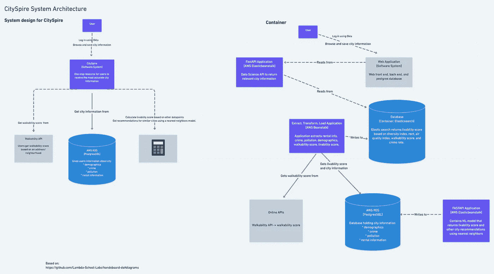
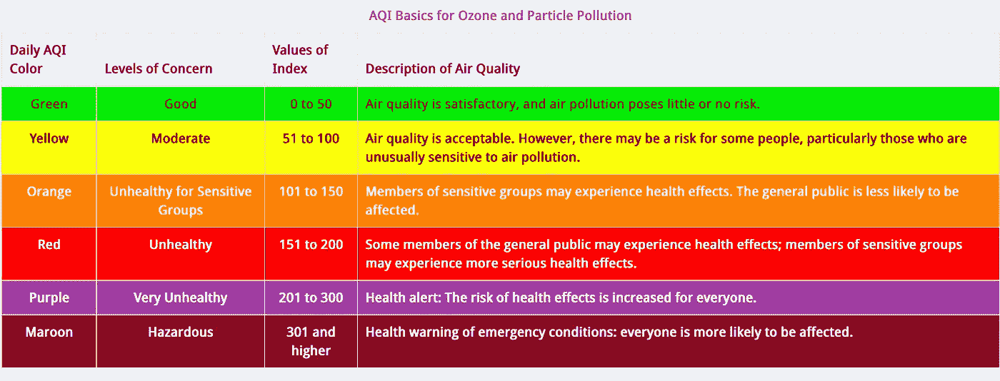
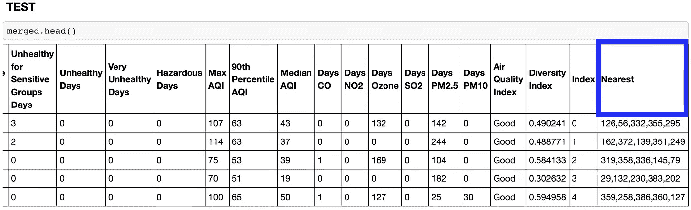
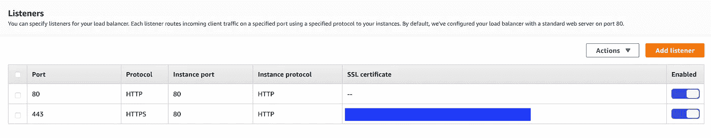
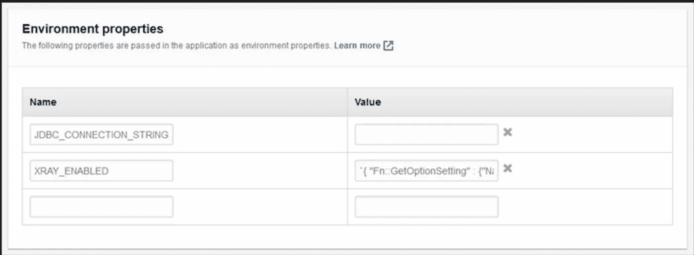
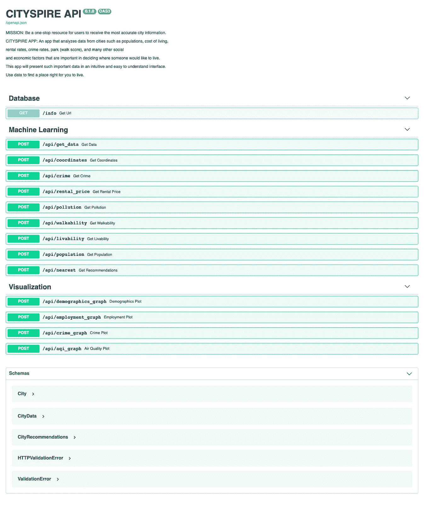
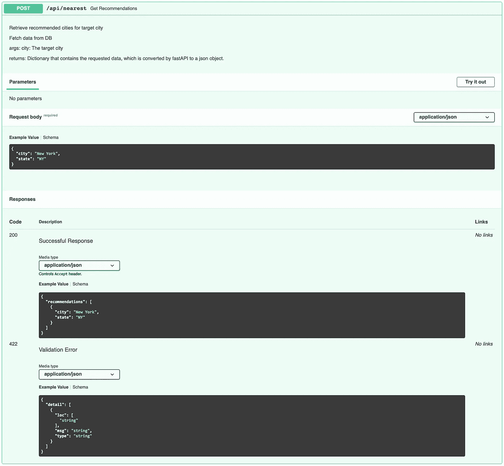

# 城市尖塔

> 原文：<https://towardsdatascience.com/cityspire-562abb2c3b11?source=collection_archive---------33----------------------->

## —一个应用的故事，从想法到部署。

**TLDR:** 在远程跨学科团队做了 8 周(兼职)的数据科学家和机器学习工程师；帮助收集、清理和争论数据，以创建推荐模型；创建了一个 AWS RDS Postgres 数据库来存储数据，并通过使用 FastAPI 测试并使用 AWS Elastic Beanstalk 部署的端点将这些信息发送到前端。

迈克尔·迪森扎在 [Unsplash](https://unsplash.com/s/photos/nyc-skyline-sunset?utm_source=unsplash&utm_medium=referral&utm_content=creditCopyText) 上的照片

# 我 **简介:**

> Eeny，Meeny，Miny，Moe，你就是这样找到你的新家的吗？

**问题:**假设你想搬家，你如何决定哪个新城市适合你？应该问朋友吗？看看雅虎、谷歌或猫途鹰？搬家并不容易，这是一个重大的决定。哪里可以找到租赁价格等信息？这个地方的人口统计数据是什么，犯罪率，污染？你需要一辆车住在那里吗？还是那里适合步行？你将如何找到所有这些信息？你可以花几个小时谷歌不同的网站，或者你可以检查城市塔。

**解决方案:** CitySpire 的目标是成为用户接收最准确城市信息的一站式资源。我们通过以简单的格式为您提供数据驱动的推荐，让您不再为寻找理想的居住城市而烦恼。该应用程序分析来自城市的数据，如人口、生活成本、租赁率、犯罪率、公园(步行得分)以及许多其他社会和经济因素，这些因素对于决定某人想住在哪里很重要。这个应用程序在一个直观和易于理解的界面中呈现这些信息。

**约束:**

这是我迄今为止承担的最雄心勃勃的项目。我和我的团队在一个紧张的期限内工作，有几项新技术我们必须加快速度。

作为数据科学团队，我们的任务是寻找、清理和争论数据。然后，我们必须使用机器学习来创建一个推荐系统。最后，利用这些信息创建一个宜居指数，帮助用户做出明智的决定，决定他们想搬到哪个城市。我们还必须确保我们的前端工程师能够阅读这些信息。

虽然清理和争论数据可能看起来单调乏味或不成熟，但为了保持数据的连续性，我们不得不争论诸如城市名称应该如何出现之类的问题。另一个限制是在工作中学习新技术，因为我们的利益相关者期望部署 AWS，但是团队中的所有数据科学家只有 Heroku 的经验。

# **策划:**

**设计架构**

项目的前几周完全用于规划:通读我们的产品文档，了解可用的数据(无论是作为数据集、API，还是如果我们必须进行网络搜集)，促进数据科学会议以创建大纲和时间表，最重要的是:我们与团队领导和网络开发人员的日常会议，以保持彼此了解我们的规划，并确保我们的最终产品将准确符合我们的利益相关者的愿景。

为了确保我们都在同一页面上，我设计了我们的系统架构，以便我们有一个数据采集、存储、分析、机器学习、API 网关和数据反馈的可视化表示。这有助于我们从最终目标开始，而不是在试图跨越这座桥时试图去建造它。

**从路线图到实施**

由于我们的时间有限，而且项目的广度相当大，我们马上开始工作。使用产品文档，我们使用 Trello 创建了任务卡，这样我们就可以确保满足[发布特性](https://www.notion.so/CitySpire-c5071dd8198441b6999aefbbbc851ca7)。

# **数据:**

***让美好时光滚滚来！***

**收集、评估和清洁**

作为团队中的数据科学家，我们负责查找有关城市的信息，如犯罪、租金、污染等。我们花了很多时间收集数据，这些数据将提供利益相关者希望包含在他的应用程序中的信息。

**清洁**

***哦，该打扫卫生了！***

我们不得不争论信息，以确保命名惯例等事项在所有数据中是相同的，例如“圣路易斯”与“圣路易斯”，或者“布拉格堡”与“英尺。布拉格。我们知道，为了确保我们每个数据源之间的数据完整性和连续性，深入的数据清理是必要的。

**例子**

**抬杠功能:**

Wrangle 功能，用于清理 FBI 犯罪数据，并允许我将 50 个州合并到一个 csv 中。

**使用管道**

另一个注意事项是几个数据集有城市连字符，如奥尔巴尼-斯克内克塔迪-特洛伊，纽约。在这种情况下，我不仅必须对城市和州进行拆分，还必须创建一个用'-'分隔城市的函数，然后复制每个城市的行信息。

需要应用几个函数，所以我使用了一个叫做 [pipe](https://calmcode.io/pandas-pipe/introduction.html) 的方法，将我的特定函数作为方法链中数据帧上的一个方法。这使得我的工程师同事可以很容易地跟踪我的过程。

使用。污染数据管道

**评估:**

**将普查区域信息映射到城市**

除了清理之外，该过程的另一个重要部分是评估数据，然后对数据以及如何使用数据做出一些假设或决策。我们获取信息的一个来源是人口普查局。此应用程序是一个基于城市的应用程序，但人口普查信息按区域或县进行格式化。作为一名数据科学家，我必须将区域信息转化为城市信息，为此我必须做出几个假设。我利用了 HUD[中的一个文件，该文件将区域映射到邮政编码。有一个名为“res_ratio”的列，它映射了居住在特定 zip 范围内的地域人口的百分比。在与我的团队和利益相关者讨论后，我做出了假设，将这一比率用于人口统计、收入和就业数据等方面。](https://www.huduser.gov/portal/datasets/usps_crosswalk.html)

**其他决定**

另一个数据驱动的决策是确定如何总结某些信息以传播给用户。用户通常想要数据的快照或简洁表示，不带偏见地传达这些信息是很重要的。我为犯罪、污染和多样性创建了一个总结专栏。

[**每 1000 名居民犯罪率**](https://www.njsp.org/info/ucr2000/pdf/calc_ucr2000.pdf) **:** 为了总结犯罪数据，我使用了 FBI 每 1000 名居民的犯罪报告标准。这代表了每 1，000 名居民的指数犯罪数量。例如:一个拥有 513 项指数犯罪(谋杀、强奸、抢劫、严重人身攻击、入室盗窃、盗窃和机动车盗窃)的直辖市，其人口为 8，280 人，其犯罪率是多少？513(指数犯罪)÷ 8，280(人口)= .061957 x 1，000 = 62.0(每 1，000 名居民的犯罪率)。然后使用 pd.qcut 将其分为“高”、“中”和“低”。

**空气质量指数:**为了确定每个城市的整体空气质量，我使用了中值，然后创建了一个算法，根据美国空气质量指数将其分开。

多样性:为了总结多样性，我使用了辛普森多样性指数。

*   n =每个种族的人数
*   N =所有种族的总人数
*   D 的值介于 0 和 1 之间

这些犯罪、污染、多样性的汇总数字，以及可步行性得分，被用来计算宜居性得分。

# 型号:

**最近邻居**

我们团队认为对用户有益的一个特性是创建一个推荐系统。在与我们的团队领导协商并获得批准后，我开始实现这个特性。

大多数人在考虑搬迁时，脑海中已经有了一个城市，但我们认为，获得类似城市的推荐将是一种打开用户可以搬到哪里的其他可能性的方式。

为了实现推荐系统，我使用了 sci-kit learn 库中名为 [**最近邻**](https://scikit-learn.org/stable/modules/neighbors.html) 的机器学习模型。在将我们收集的不同数据合并到一个数据框架中后，我对数据进行了缩放，这样诸如租金和人口等列的权重就不会超过百分比或小数。然后，名为“最近”的列被添加到数据帧中。然后使用 [get_recommendations 端点](https://github.com/jiobu1/labspt15-cityspire-g-ds/blob/main/app/ml.py)返回该数据。

这是 get_recommendations 端点中使用的列

# 新技术:

开发这一产品令人兴奋的部分之一是获得新技术的经验。好在 [FastAPI](https://fastapi.tiangolo.com/tutorial/) 和[AWS](https://aws.amazon.com/getting-started/)([RDS Postgres](https://docs.aws.amazon.com/AmazonRDS/latest/UserGuide/CHAP_GettingStarted.CreatingConnecting.PostgreSQL.html)， [Elastic Beanstalk](https://docs.aws.amazon.com/elasticbeanstalk/latest/dg/Welcome.html) )都有很棒的文档。

这才是乐趣真正开始的地方！

# FastAPI:

**入门**

和 Flask 一起工作过，有很多相似之处我可以带过去。这篇文章“[针对 Flask 用户的 FASTAPI](https://amitness.com/2020/06/fastapi-vs-flask/)”非常有帮助。

为了开始，我们需要一个 [main.py](https://github.com/jiobu1/labspt15-cityspire-g-ds/blob/main/app/main.py) 文件，该文件在我们的存储库中提供，所以要测试它，只需运行以下一系列命令即可:

1.安装应用程序所需的所有依赖项

2.进入安装了正确依赖项的虚拟环境

3.这将部署您的 FastAPI 应用程序。

如果您运行服务器并转到端点`http://127.0.0.1:8000/docs`，您将获得一个自动生成的 swagger 文档。FastAPI 易于使用，最好的部分是文档，它从您的文档字符串中获取。这使得显示如何使用端点变得容易，而不必去单独的文档，如 README.md(如果我使用 Flask，这将是我提供文档和链接的地方)。

# AWS 弹性豆茎:

在创建和测试我们的基本端点之后，现在我们已经准备好将应用程序部署到 AWS Elastic Beanstalk。我们的团队领导为我们提供了一个 12 位数的帐户 ID(IAM)和一个 AWS 用户名和密码。在安装了`awscli`和`awsebcli`之后，我们能够运行下面的命令，并且我们开始工作了！

1.  `eb init --platform docker CHOOSE-YOUR-NAME --region us-east-1`
2.  `eb create --region us-east-1 CHOOSE-YOUR-NAME`
3.  `eb open`

然后，在进行更改时，使用 git 提交您的更改，然后运行`eb deploy`和`eb open`来使用更改重新部署应用程序。

我们从惨痛的教训中学到的一件事是，当与前端连接时，我们需要确保配置正确的端口，以便可以从 HTTPS 流量接收信息。我们必须创建一个 443 监听端口，而默认设置只有一个端口 80，它只允许 HTTP 流量。

HTTP 和 HTTPS 流量所需的端口

# AWS RDS Postgres:

用 AWS RDS 创建数据库非常简单。我登录 AWS 控制台并选择了该地区。然后，我执行了标准的创建操作，选择了一个 PostgreSQL，并且能够使用它们的默认设置创建数据库实例

在本地开发时，我使用 [python-dotenv](https://pypi.org/project/python-dotenv/) 加载一个`.env`文件。(`.env`文件在`.gitignore`中列出。)这确保了我的用户名和密码受到保护。部署时，我们使用弹性 Beanstalk 控制台来配置环境变量。

包括数据库名称和 url —连接到 Elastic Beanstalk

# API:

**终点:**

成功地建立了到数据库的连接并将基本 API 部署到 AWS 之后，接下来的步骤是构建 API 本身，包括路由(端点)、函数和使用文档。

数据科学终点

对于 DS 团队，我为[最近邻](https://github.com/jiobu1/labspt15-cityspire-g-ds/blob/main/app/ml.py)模型和[可视化](https://github.com/jiobu1/labspt15-cityspire-g-ds/blob/main/app/viz.py)端点创建了 API 端点。

最近邻 API 端点—从提取文档字符串。py 文件。显示成功响应和错误消息。

**可视化:**

***一图抵千言*** *。*

下面是我创建的交互式 plotly 可视化端点。这些端点使用户能够直观地查看数据点，并更深入地了解每项统计数据。使用图表或图形来可视化大量数据，使其更容易理解。

/API/demographics _ graph-显示每个种族类别的百分比

/API/employment _ graph-细分行业部门和就业类型

/API/aqi _ graph-更深入地了解每个城市的空气质量

# **最终想法:**

参与这个项目既令人兴奋又有收获。我对在工作中学习感到兴奋，并且很高兴到目前为止，我的培训和教育为我成功地与 AWS 和 FastAPI 一起工作奠定了基础。我惊喜地发现 AWS 让部署和管理 web 应用变得如此容易，并对 FastAPI 及其内置功能印象深刻，这些功能使使用它创建 DS 端点变得轻而易举。

我从这个过程中学到的另一个重要的教训是，当与利益相关者和大型团队合作时，持续的沟通是关键。重要的是利用产品范围来确保我们在实现利益相关方对 CitySpire 的愿景方面步调一致，而不是我们的错误假设。此外，沟通对于确保每个团队成员都知道自己的职责非常重要。创建系统架构和 trello 板为我们提供了一个重要的路线图，并让我们负责任。

“城市塔”是我承担的最雄心勃勃的项目。我学到了很多东西，比如确定项目范围、沟通以及在工作中虚心学习。因此，这段经历提供了许多有价值的基础经验，我肯定会在我的整个职业生涯中一直保持这些经验。

**潜在的改进:**

到目前为止，在这个项目中，我们已经能够在 DS API 和前端网站上实现租赁价格估计、步行评分、犯罪、人口、污染和宜居性评分。一些可能的后续步骤是:

*   租金预测模型
*   人口预测模型
*   污染预测模型
*   整合每个城市的主流产业
*   整合其他数据点，如公共汽车和自行车分数
*   实现可视化 API
*   创建一个 NLP 推荐系统，用户可以在其中设置标准并接收基于其查询的结果。

# **团队概述:**

我作为一名数据科学家和机器学习工程师在一个远程跨学科团队工作了 8 周(兼职)，创建了 CitySpire。

城市塔——G 队

我和一个了不起的团队一起工作。这个团队包括我和其他三名数据科学家，三名网站开发人员，一名 UX 设计师，以及我们的项目负责人，他们让我们保持活力，确保我们朝着正确的方向前进。每个人都很勤奋，立即卷起袖子准备工作。(我们的团队做得非常好，在其他 8 个团队中，我们的存储库被选为未来团队的基础。)

**角色:** App 架构师、数据科学家、机器学习工程师、数据可视化

**DS 技术栈:** Python，FastAPI，AWS RDS Postgres，AWS Elastic Beanstalk，Docker

**时间表:** 8 周(兼职)

我们最终的 Github 库可以在[这里](https://github.com/Lambda-School-Labs/labspt15-cityspire-g-ds)找到。

# 演示:

CItySpire API 演示和 DS 架构

# 闪电对话:

在 8 周结束的时候，我做了一个关于使用文档作为交流的重要工具的简短演讲。

作为交流工具的文档

# **链接:**

**数据来源:**

*   **美国人口普查**——[https://www.census.gov/](https://www.census.gov/)
*   **联邦调查局犯罪数据**—[https://UCR . FBI . gov/Crime-in-the-u . s/2019/Crime-in-u . s-2019/tables/table-8/](https://ucr.fbi.gov/crime-in-the-u.s/2019/crime-in-the-u.s.-2019/tables/table-8/table-8-state-cuts/arizona.xls/@@template-layout-view?override-view=data-declaration)
*   **污染数据**—[https://aqs.epa.gov/aqsweb/airdata](https://aqs.epa.gov/aqsweb/airdata/download_files.html#Annual)
*   **租房数据**——[https://www.huduser.gov/](https://www.huduser.gov/portal/datasets/50per.html)
*   **walk score**——[https://www.walkscore.com/](https://www.walkscore.com/%7Bstate%7D/%7Bcity%7D)