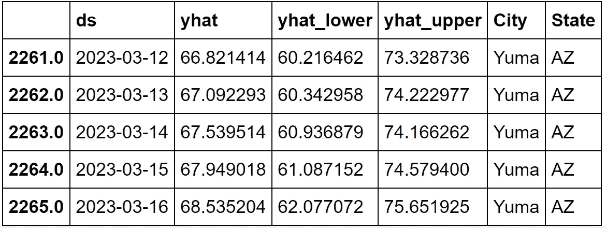
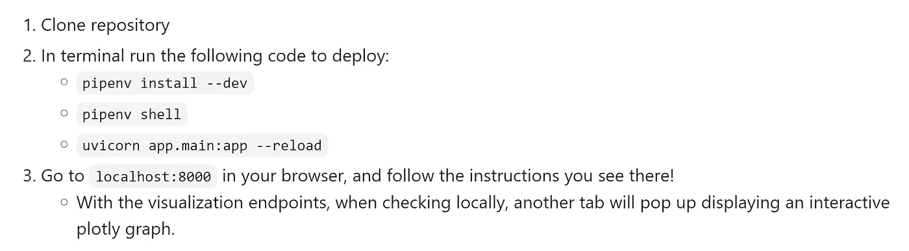

# AWS 弹性豆茎应用程序

> 原文：<https://towardsdatascience.com/cityspire-lambda-school-labs-project-b174ff7d877b?source=collection_archive---------36----------------------->

## Lambda 学校实验室(Bloom Technology now)内的端到端数据科学项目，包括项目流程、团队工作和功能实现。

伊利诺伊州，芝加哥(图片来自 triplepundit.com

## 简单地

在一个由 web 开发人员和数据科学家组成的团队中为 inherited 项目工作了两个月，收集和清理新数据，执行数据分析和功能工程，使用机器学习建模技术为项目创建和添加新功能，通过 FastAPI 端点交付它们，并最终将应用程序部署到带有 AWS 关系数据库服务的 AWS Elastic Beanstalk。

## 需求、想法、规划和架构

CitySpire 是一款分析城市数据的应用程序，这些数据包括人口、生活成本、租金、犯罪率、公园(步行得分)以及许多其他社会和经济因素，这些因素对于决定人们喜欢住在哪里很重要。CitySpire 背后的理念是在一个地方为用户提供最准确的城市信息。该应用程序必须在非常直观和易于理解的界面呈现重要的城市数据。

作为数据科学家，我们的任务是收集和分析城市数据，如住房成本、天气状况、教育数据、工作列表和其他因素，对这些因素进行预测和预报，并重新计算新的宜居性得分。

继承的应用程序有一些 API 端点，如犯罪率、步行得分、污染、人口、租赁价格、空气质量、城市建议和宜居性得分。

第一步是在现有架构的基础上构建应用架构:

CitySpire 建筑图(图片由作者提供)

为了更好地了解整个 app 架构，包括该项目的 web 和 iOS，这里是异想天开网站的链接: [***城市塔架构图***](https://whimsical.com/cityspire-b-TojXfbLybEtcmB93tPkWT) ***。***

## 入门指南

由于我们项目的目标已经确定，下一步也是最重要的一步是找到我们需要在项目中使用的数据。我们必须获得每个城市和州的住房数据、天气数据、工作列表数据和学校数据，并开始清理和特征工程。一旦我们之间分配了任务，以便与我的同行数据科学家更有效地合作，我就负责找到每个城市的天气数据，用于进一步的预测和预报。其他团队成员负责传递房价、工作列表和学校教育数据。

## 探索性数据分析和特征工程

在网上查找任何数据是最耗时的一步，我前两周的大部分时间都在寻找和收集每个城市的天气数据，并将它们结合在一起:<https://github.com/tigju/PT17_cityspire-b-ds/blob/main/notebooks/model/weather/combine_data.ipynb>*。下一步是清理数据，去掉丢失的值和特征工程。一些功能有超过 50%的丢失数据，我决定删除这些功能。其他特征有不到 20%的缺失值，所以我用平均值和中间值填充它们。另一个重要步骤是对分类值进行编码，并在将数据输入模型之前对所有数据进行缩放。对于编码，我使用了 OrdinalEncoder，对于缩放，我选择了 Sklearn 库中的 StandardScaler。探索性数据分析与特征工程流程在这里:[***GitHub***](https://github.com/tigju/PT17_cityspire-b-ds/blob/main/notebooks/model/weather/weather.ipynb)***。****

## *数据建模*

*我决定制作两个功能，一个是天气温度预报，另一个是每年的天气状况(晴天、雨天、阴天、下雪天)。对于我的第一个特性，我执行了时间序列建模，对于第二个特性，我使用了聚合。*

*由于我需要执行多个时间序列建模，我决定使用脸书先知。这是一个提供自动预测的软件，可以手动调整。它最适用于非线性趋势，对缺失值和处理异常值非常稳健，这正是我的项目所需要的。这在实现上非常简单，唯一的要求是将目标列重命名为“y ”,将日期列重命名为“ds”。在下面的代码中，我按城市对数据进行了分组，这样我就可以分别对每个城市进行预测。然后，我对未来两年进行了每日预测，并将其保存到一个 csv 文件中。*

*(作者嵌入要点)*

*这是预测温度数据集的外观，其中“yhat”是预测平均温度，“yhat_lower”是最低预测温度，“yhat_upper”是最高预测温度:*

**

*FB Prophet 预测数据集(图片由作者提供)*

*为了检查我的模型的性能，我使用了 Sklearn 库中的平均绝对误差(MAE)和均方根误差(RMSE)性能指标。*

*加州萨克拉门托的结果相当不错:*

**

*绩效指标(图片由作者提供)*

*下面是可视化性能的图表。看起来，该模型可以预测平均温度，但有时它无法捕捉到极值。我会说，该型号的整体性能非常好。*

**

*加州萨克拉门托的天气预测和预报(图片由作者提供)*

*所有 FB 先知的工作流程都可以在这里找到: [***GitHub***](https://github.com/tigju/PT17_cityspire-b-ds/blob/main/notebooks/model/weather/fbprophet_weather.ipynb)*

## *综合天气条件*

*对于天气状况，我将这些值分为“晴天”、“多云”、“下雨”和“下雪”四个标签，并根据 4 年的历史天气状况汇总记录，然后用这些数据创建一个新的 csv 文件。NaN 值 I 用零填充，因为有些城市不具有仅在某些地区通用的特定条件。完整代码在这里:[***GitHub***](https://github.com/tigju/PT17_cityspire-b-ds/blob/main/notebooks/model/weather/weather_conditions.ipynb)。*

*这个片段显示了我是如何计算每个城市的平均值并将结果串联起来的:*

*(作者嵌入要点)*

*汇总的天气状况数据如下所示:*

**

*天气状况数据集(图片由作者提供)*

## *设置 FastAPI*

*因为我们已经继承了项目，所以建立 FastAPI 并不困难。以前的数据科学团队给我们留下了非常好的说明。我们只需要克隆 git 存储库并设置本地环境。它安装了项目所需的所有依赖项。*

**

*设置 FastAPI 环境(图片由作者提供)*

## *AWS 弹性豆茎*

*为了部署到 Elastic Beanstalk，我必须首先在我的机器上安装 AWS CLI，方法是根据我的操作系统下载一个安装程序。安装 AWS CLI 后，我想用这个命令`aws --version`测试安装是否正确，以确保我没有“command not found”错误，而不是版本号。第二步是安装 AWS Elastic Beanstalk CLI: `pip install awsebcli`并通过检查其版本再次测试:`eb --version`。*

*要使用新创建的端点将本地 FastAPI 部署到 AWS EB，我需要遵循以下步骤:*

**

*AWS EBS 部署(图片由作者提供)*

*然后，我必须运行`aws configure`来配置 AWS CLI，并在出现提示时输入我的访问密钥。一旦完成，后续提交可以用`eb deploy`和`eb open`重新部署，以查看部署的变更。*

## *AWS RDS Postgres*

*在 AWS 中建立数据库并不复杂。您只需登录 AWS 控制台并选择地区。之后，在 EC2 服务中创建一个安全组，并在入站规则中指定类型“PostgreSQL ”,源为“Anywhere ”,其余设置保持默认。然后在 RDS 服务中使用引擎 Postgres 创建标准数据库，在 VPC 安全组中标记“选择现有的”并选择您创建的安全组。*

*为了用新数据填充数据库，我使用 python-dotenv 从我们的`.env`文件中获取数据库地址，并使用 SQLAlchemy 建立数据库连接。*

**

*SQLAlchemy 和 dotenv(图片由作者提供)*

## *FastAPI 端点*

*由于我从事天气预报模型和天气条件聚合的工作，我还必须创建端点来检索这些数据。我添加了两个端点，分别是未来两年天气温度的日预报和月预报:`/api/weather_daily_forecast`、`/api/weather_monthly_forecast`，第三个端点是每年晴天、阴天、雨天、雪天的平均天数`/api/weather_conditions`。其他端点由我的团队成员负责。一旦项目被部署到 Elastic Beanstalk，并且正确地建立了到 RDS 的连接，我们所有的端点(用红色方块标记的)都已经启动并运行了:*

**

*FastAPI 端点(图片由作者提供)*

*我还添加了两个端点来可视化每月天气温度预报`/api/weather_forecast_graph`和每年天气状况`/api/weather_conditions_graph`:*

**

*可视化终点(作者图片)*

## *形象化*

*为了可视化未来两年的天气预报和天气状况，我使用了 Plotly 库。使用 Plotly，我创建了图形对象，并将其转换为 JSON 格式的 API 端点，可以使用`plotly-react.js`库进行渲染，并以交互图形的形式发送到前端应用程序:*

*未来两年的每月天气预报图表(作者嵌入的图表)*

*每年的天气状况图表(作者嵌入图表)*

## *还能做什么？*

*城市塔是思想的产物。可以添加许多功能来扩展它的功能。不幸的是，我们没有更多的时间来完成第二版，我们需要重新审视现有的宜居性评分，并与 DS 合作，看看我们是否可以通过添加新创建的功能来做出改变:房价、天气、工作和学校董事会。我们计划重新使用现有的功能，将我们的功能融入到宜居性评分中。此外，网络团队有一个想法，调整用户部分更重要的因素，根据用户偏好为它们添加权重，并计算得出宜居性得分。此外，我们可以创建标签，这样用户可以更直观地了解这个城市是否是他们的梦想之地。*

*未来还能增加哪些功能？在我的脑海里有几个:*

*   *展示社会经济因素，可以是财富、收入、职业、宗教、教育水平、家庭规模、购买习惯等。；*
*   *展示历史和文化因素，以及娱乐区，它可以是旅游场所，博物馆，纪念碑，公园等。可能是城市/州最好的 10 个地方；*
*   *最重要的因素之一是社会支持，包括儿童保育、医疗保健、社区安全和其他。*

## *结论*

*实验室项目对我来说是一个与专业团队合作实现项目目标的绝佳机会。最重要的经历是与我的团队交流，如果需要的话互相帮助。我不得不经历一些艰苦的学习，特别是在设置和部署 AWS Elastic Beanstalk 和 RDS 方面，我确实从头到尾掌握了数据科学项目生命周期的扎实知识和理解。*

# *数据来源:*

*   **天气:* [*天气数据*](https://www.visualcrossing.com/)*
*   **职位列表:* [*职位列表数据*](https://opensource.indeedeng.io/api-documentation/docs/job-search/)*
*   **房价:* [*房价数据*](https://www.quandl.com/databases/ZILLOW/documentation)*
*   **学校董事会:* [*学校董事会数据*](https://nces.ed.gov/ccd/elsi/)*

# *在 GitHub 上查找我们的项目:*

*[***city spire 2.0***](https://github.com/tigju/PT17_cityspire-b-ds)*

# *注意:*

**这个项目是为* ***Lambda 学校****(Bloom Technology now)做的，作为****Lambda Labs****课程的一部分。**