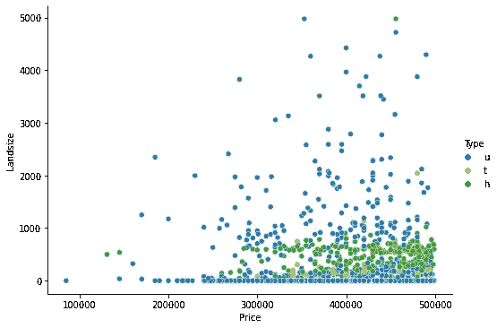
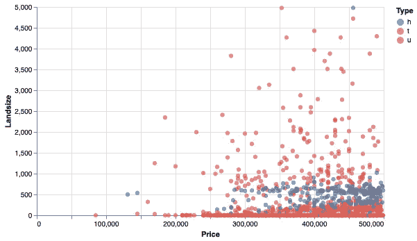
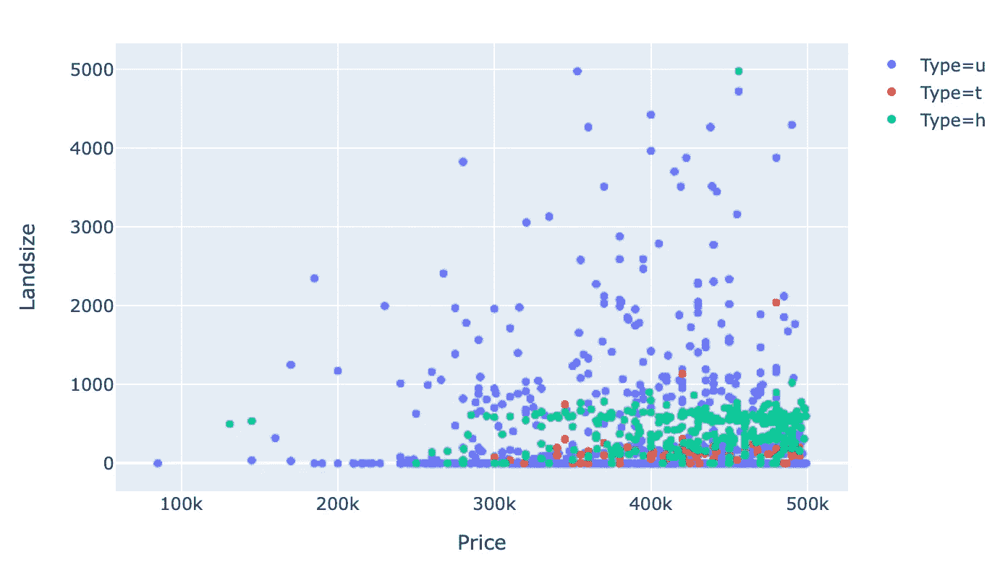
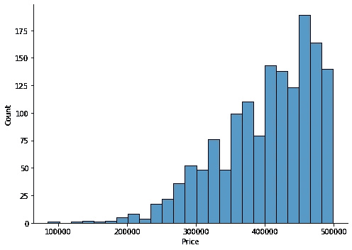
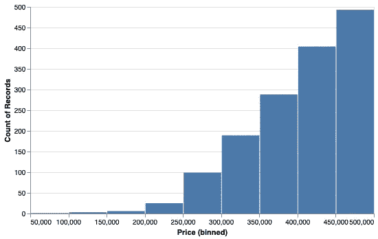
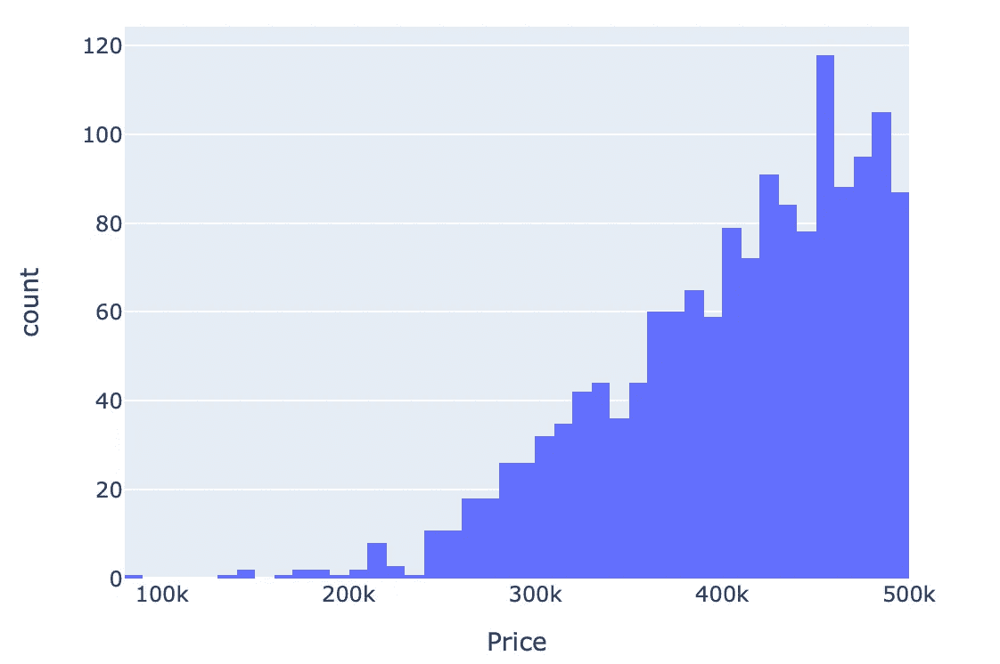
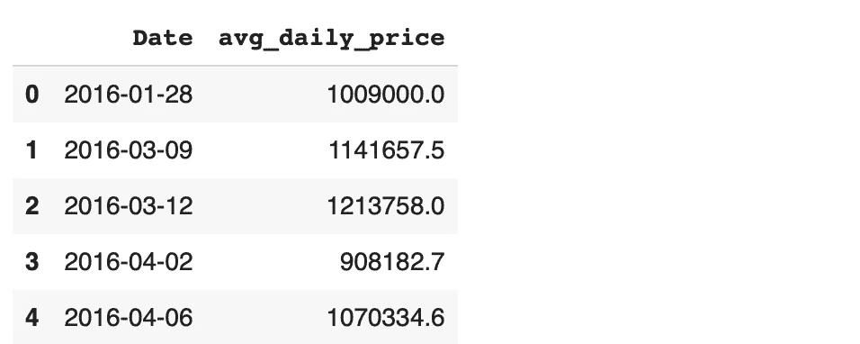
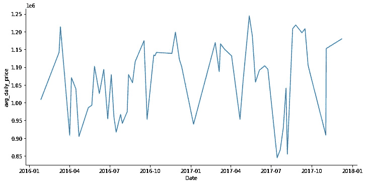
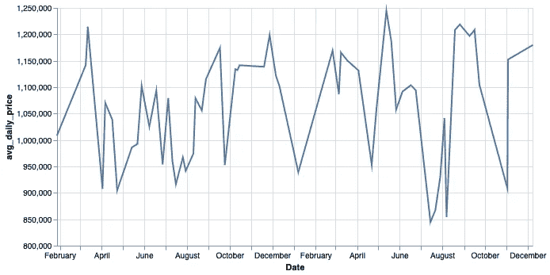
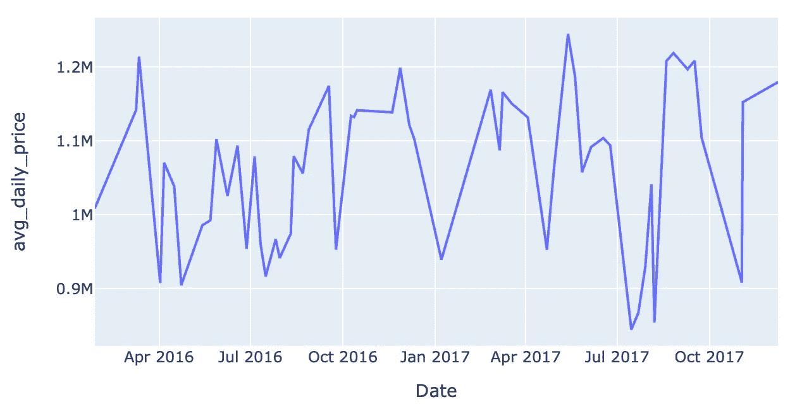

# Python 数据可视化库的冲突

> 原文：<https://towardsdatascience.com/clash-of-python-data-visualization-libraries-c4f668a279f?source=collection_archive---------21----------------------->

## Seaborn，Altair 和 Plotly


圣地亚哥·拉卡尔塔在 [Unsplash](https://unsplash.com/s/photos/clash?utm_source=unsplash&utm_medium=referral&utm_content=creditCopyText) 上拍摄的照片

数据可视化是数据科学的基本组成部分。它通过提供洞察力帮助我们更好地理解数据。我们还使用数据可视化来交付结果或发现。

Python 作为数据科学生态系统中编程语言的主要选择，提供了丰富的数据可视化库选择。在本文中，我们将对 3 种流行的方法进行实际比较。

我们将涉及的库是 Seaborn、Altair 和 Plotly。这些示例将包括 3 种基本的数据可视化类型，即散点图、直方图和线图。

我们将通过用所有 3 个库创建相同的可视化来进行比较。我们将使用 Kaggle 上的墨尔本房产[数据集](https://www.kaggle.com/anthonypino/melbourne-housing-market)作为例子。

让我们从导入库和读取数据集开始。

```
# import the libraries
import numpy as np
import pandas as pd
import seaborn as sns
import altair as alt
import plotly.express as px# read the dataset
df = pd.read_csv("/content/melb_data.csv", parse_dates=['Date'])df.shape
(13580, 21)# remove outliers
df = df[(df.Price < 500000) & (df.Landsize < 5000)]
```

该数据集包含墨尔本 13580 所房屋的 21 个要素。我还删除了离群值，以免扭曲图的外观。

## 散点图

散点图是一种关系图。它通常用于可视化两个数值变量的值。我们可以观察它们之间是否有关联。

让我们生成一个价格和土地面积列的散点图，以研究它们之间的关系。

```
# Seaborn
sns.relplot(data=df, x="Price", y="Landsize", kind="scatter",
            hue="Type", height = 5, aspect = 1.4)
```



(图片由作者提供)

将数据框传递给数据参数后，要绘制的列由 x 和 y 参数确定。色调参数为绘图增加了一条信息。我们可以根据类型列中的不同类别，大致了解价格和土地面积如何变化。最后，高度和纵横比参数调整地块的大小。

```
# Altair
alt.Chart(df).mark_circle(size=40).encode(
   x='Price', y='Landsize', color="Type"
).properties(height=300, width=500)
```



(图片由作者提供)

Altair 语法从接受数据框的顶级图表对象开始。下一步是选择情节的类型。我们在编码函数中指定要绘制的列。

颜色参数与 Seaborn 的色调参数相同。最后，我们使用属性函数调整绘图的大小。

```
# plotly express
fig = px.scatter(df, x='Price', y='Landsize', color='Type',
                 height=450, width=700)fig.show()
```



(图片由作者提供)

我们使用了 plotly express，它是 plotly.py 库的高级 API。该语法与 Seaborn 语法非常相似。使用颜色参数代替色调参数。高度和宽度参数调整大小。

## 2.柱状图

直方图通常用于可视化连续变量的分布。连续变量的值的范围被分成离散的条块，每个条块中的数据点(或值)的数量用条形表示。

我们可以创建 price 列的直方图来检查房屋的价格分布。

```
# Seaborn
sns.displot(data=df, x="Price", kind="hist",
            height=5, aspect=1.4)
```



(图片由作者提供)

我们使用 displot 函数，它允许创建不同的分布图。种类参数选择绘图类型。

```
# Altair
alt.Chart(df).mark_bar().encode(
   alt.X('Price:Q', bin=True), y='count()'
).properties(height=300, width=500)
```



(图片由作者提供)

我们在 encode 函数中写的内容告诉 Altair 将 price 列中的值划分到 bin 中，然后计算每个 bin 中数据点(即行)的数量。

最后一个直方图将由 plotly express 库创建。直方图函数的使用如下。

```
# plotly express
fig = px.histogram(df, x='Price', height=450, width=600)
fig.show()
```



(图片由作者提供)

## 3.线形图

线形图显示了两个变量之间的关系。其中之一通常是时间，所以我们可以看到变量是如何随时间变化的。

我们可以生成一个线图来显示房价的日平均值。让我们首先计算每日平均值，并将其保存在另一个数据框中。

```
avg_daily_price = df.groupby('Date', as_index=False).agg(
   avg_daily_price = ('Price', 'mean')
).round(1)avg_daily_price.head()
```



(图片由作者提供)

我们已经使用 Pandas groupby 函数来计算每天的平均房价。我们现在可以创建一个日平均价格和日期的折线图。

```
# Seaborn
sns.relplot(data=avg_daily_price, x="Date", y="avg_daily_price", kind="line", height=5, aspect=2)
```



(图片由作者提供)

与散点图一样，可以使用 Seaborn 的 relplot 函数创建折线图。

```
# Altair
alt.Chart(avg_daily_price).mark_line().encode(
   alt.X("Date"),
   alt.Y("avg_daily_price", scale=alt.Scale(zero=False))
).properties(height=300, width=600)
```



(图片由作者提供)

与前面的例子不同，我们使用了 Altair 的 X 和 Y 编码。原因是 Altair 默认从零开始轴值。它不会根据列的值范围来调整它们。我们需要明确地告诉 Altair 不要从零开始，如果大部分值都在零以上的话，我们的图就是这种情况。

Plotly express 提供了用于生成线图的直线功能。语法与前面的例子几乎相同。我们只改变函数的名字。

```
# plotly express
fig = px.line(avg_daily_price, x="Date", y="avg_daily_price",
              height=400, width=700)
fig.show()
```



(图片由作者提供)

## 结论

我们已经用 3 个常用的 Python 数据可视化库介绍了 3 种基本的绘图类型。

使用哪一种取决于语法、用户偏好和风格。然而，在很大程度上，我们可以使用它们中的任何一种来生成漂亮的、信息丰富的可视化效果。

这篇文章中的情节可以认为是最基本的。这三个库能够创建更复杂的库。它们还提供了许多自定义地块的功能。

感谢您的阅读。如果您有任何反馈，请告诉我。