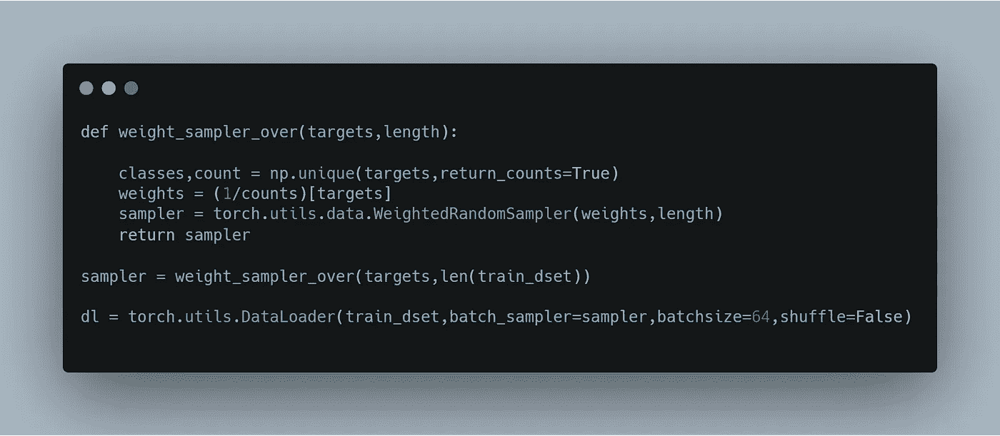
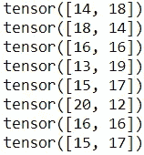
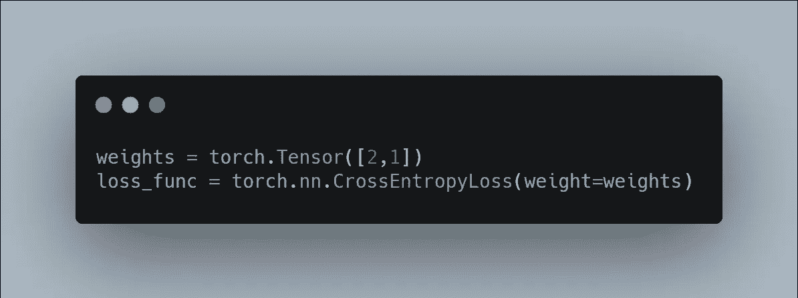

# 阶级不平衡

> 原文：<https://towardsdatascience.com/class-imbalance-d90f985c681e?source=collection_archive---------19----------------------->

## 在这篇文章中，我们讨论了类不平衡的问题以及可能有助于提高模型性能的技术

([来源](https://unsplash.com/photos/v0_MCllHY9M)

# 介绍

当我开始学习机器学习及其各种子领域时，我参加了各种 MOOCs，阅读了各种文章、书籍等。我使用了各种免费的数据集并建立了模型，这些模型表现非常好。我当时的心态是，一切都依赖于我们使用的模型，数据只起次要作用。这种心态主要是因为数据是以干净、平衡的形式提供的，只需要很少的预处理。当我在一个研究所加入我的第一个机器学习角色时，这个信念遭受了重大挫折。该研究所专门从事医学研究，我的工作重点是超声图像。可用的数据不像公开可用的数据集那样清晰和结构化。以前我花大部分时间选择模型，现在我花大部分时间清理、构建和整理数据。此外，在公开可用的数据集中，类的分布几乎相似，如果不相似，每个类都有足够的代表性样本。但在现实世界中，尤其是在医疗领域，存在固有的阶级不平衡，因为患有特定疾病/病症的人与健康人相比要少得多。

当一个分类问题中一个或多个类别的可用示例数量远远少于其他类别时，类别不平衡就是问题所在。
样本数量多的类称为多数类，样本数量少的类称为少数类。在加入这个角色之前，我读到过关于类不平衡的问题，但从来没有机会处理不平衡的数据集，因为大多数在线可用的数据集都非常平衡，所有类都有几乎相同数量的样本。然而，我开始研究的第一批问题中有一个分布非常不均衡。这是一个二元分类问题，我应该检测给定的妇女是足月还是早产。早产是指妇女在怀孕不到 37 周时分娩，而足月是指妇女在怀孕超过 37 周时分娩。早产婴儿患有各种健康并发症，因为他们的器官没有正常发育，需要特殊护理才能存活。

据世卫组织称，每年有 1500 万婴儿早产，约 100 万婴儿死于早产引起的并发症。因此，检测早产是非常必要的，以便可以向婴儿提供足够的护理，并且可以挽救他/她的生命。

现有数据极不平衡，只有 300 名参与者分娩早产，而分娩足月分娩的妇女人数约为 3000 人。

这个问题很有挑战性，我开始研究阶级不平衡的话题和减轻它的技术。我发现网上大多数关于阶级不平衡的材料只提到了两种技术，即过采样和欠采样。在深入挖掘和阅读一些研究论文之后，我发现了一些其他不太为人所知的技术，我想在本文中与已知技术一起讨论这些技术。

**注意**:这篇文章中讨论的技术是从计算机视觉的角度来看的，但是由于核心概念保持不变，因此也可以应用到其他领域。

# 处理类别不平衡问题的技巧

处理类别不平衡的技术可以进一步分为两大类:

1.  数据级方法
2.  分类器级方法

# 数据级方法:

数据级方法是指我们在保持算法及其子部分(如损失函数、优化器)不变的同时，对训练集的分布进行更改。数据级方法旨在以某种方式改变数据集，使标准算法发挥作用。

有两种著名的数据级方法很容易应用于机器学习领域。

## 1.过采样:

过采样或者更准确地说，少数类过采样是一种非常简单且广为人知的技术，用于解决类不平衡的问题。在这种技术中，我们试图通过从所有类中采样相同数量的样本，从而从少数类中采样比多数类中更多的样本，来使小批量中所有类的分布相等。实际上，这是通过增加属于少数类的样本的采样概率，从而降低属于多数类的样本的采样概率来实现的。确定所有类别的抽样概率的最简单方法是取每个类别中样本数的倒数。这将增加样本属于少数类的概率，同时将降低样本属于多数类的概率。有些论文还用样本数平方根的倒数来衡量样本。

过采样的性能取决于原始数据集中代表性样本的数量，因为在过采样中，我们批量增加样本，但唯一样本的数量保持不变。

**py torch 中实现少数类过采样的代码**

**图 1** :使用 Pytorch 加权采样器进行过采样的代码

**图 2:** 使用加权采样器进行过采样后的批量分配

## 2.欠采样:

用于解决类不平衡问题的另一种流行技术是欠采样，它与过采样相反。在这种情况下，我们从多数类中随机移除样本，直到所有类都具有相同数量的样本。这种技术有一个明显的缺点，因为它丢弃了可能导致数据集中代表性样本数量减少的数据。为了解决这个缺点，使用了各种方法，这些方法小心地去除冗余样本，从而保持数据集的可变性。

实现欠采样的一种简单方法是从多数类中随机抽取与少数类中样本数量相等的样本，同时保持少数类的分布不变。
为了在 Pytorch 中实现欠采样，可以使用 Pytorch 的 WeightedRandomSampler，其中多数类的权重应该减小，以便从多数类和少数类中采样几乎相同数量的样本。

例如:假设您有一个二元分类任务，其中多数类中的样本数为 2000，而少数类中的样本数为 1000。为了使用加权采样器进行欠采样，我们可以将属于少数类的所有示例的权重设为 1，即每个示例都有 100%的机会被采样，而对于属于多数类的示例，我们可以将权重设为 0.5(num _ samples _ minority/num _ samples _ majority)，这意味着属于多数类的每个示例都有 50/50 的机会被采样。

**py torch 中实现欠采样的代码:**

**图 3** :使用 Pytorch 加权取样器的欠采样代码

**图 4。**使用加权取样器进行欠采样后的批量分配

# 算法级方法:

算法级方法是处理类不平衡的一类方法，其目的是保持数据集不变，但改变训练或推理算法。

在这篇文章中，我将讨论我在处理不平衡数据集时常用的两种方法。

## 1.对成本敏感的学习:

在代价敏感学习中，基本思想是根据类的分布给类分配不同的代价。有各种实现成本敏感学习的方式，例如对属于多数类的例子使用比属于少数类的例子更高的学习率，或者使用类加权损失函数，该函数通过考虑类分布来计算损失，从而对来自少数类的例子的误分类比来自多数类的例子更加惩罚分类器。有各种类别的加权损失函数，但最广泛使用的两个是加权交叉熵和焦点损失。

**图五。**加权交叉熵损失方程

**图 6。**焦损失方程

WeightedCrossEntropy 使用经典的交叉熵损失，并加入了一个权重项，用于给特定类别(在类别不平衡问题中是少数类别)更多的权重。因此，当分类器错误分类属于少数类的例子时，交叉熵损失惩罚更多。

聚焦损失是由 FAIR 在他们的论文[中首次介绍的，用于密集物体检测的聚焦损失](https://arxiv.org/abs/1708.02002?source=post_page---------------------------)被设计为以这样的方式执行两个任务来解决类别不平衡。
首先，与简单例子相比，它对困难例子的惩罚更多，并有助于算法更好地执行。难的例子是那些模型不自信并且以低概率预测事实真相的例子，而容易的例子是那些模型高度自信并且以高概率预测事实真相的例子。
例如，假设模型以 0.8 的概率错误地预测了某个类别，为简单起见，保持γ = 2，α = 1，log = log10，代入图 6 中给出的焦损方程中的值，我们得到
-(1–0.8)log(0.8)= 0.00387。
现在假设，模型以 0.2 的概率预测某个类别，保持上面我们得到的相同条件，
-(1–0.2)log(0.2)= 0.4473
如您所见，与模型过度自信的示例相比，模型不太自信的示例的焦点损失对模型的惩罚更大。

在类不平衡的情况下，由于少数类很少，模型很少看到它的例子，与拥有大量样本的多数类相比，模型在预测它时不太有信心(硬例子)，而多数类反过来给模型更多的学习机会，因此模型在预测它时更有信心(简单例子)。

因此，焦点损失为少数类的实例提供了更大的权重，而为多数类提供了更小的权重，这反过来使得模型更加关注少数类，并提高了整体分类器的性能。

第二，类似于加权交叉熵，它在损失函数中有一个加权项。适当地设置权重项可以在错误分类少数类而不是多数类时对模型进行更多的惩罚。
焦点损失广泛用于对由于其上述两个属性而遭受类别不平衡问题的任务进行建模。

通过使用 Pytorch 中可用的交叉熵损失函数并指定权重项，可以在 Pytorch 中轻松实现 WeightedCrossEntropy，如下图 7 所示。

**图 7。**py torch 中的加权交叉熵损失码

要实现焦点损失，你可以参考文章从头开始实现，或者许多软件包为你实现，例如 [Catalyst](https://catalyst-team.github.io/catalyst/_modules/catalyst/contrib/nn/criterion/focal.html.) 、 [Kornia](https://kornia.readthedocs.io/en/latest/losses.html) 等。

## 2.一级分类:

顾名思义，一种类别分类是通过仅对少数类别的分布建模并将所有其他类别视为分布外/异常类别来处理类别不平衡的技术。使用这种技术，我们的目标是创建一个分类器，它可以检测属于少数类的例子，而不是区分少数类和多数类。这在实践中通过仅在属于少数类的实例上训练模型来完成，并且在测试时间期间使用属于所有类的实例来测试分类器正确识别属于少数类的实例的能力，同时标记属于其他类的实例。

一种类别分类技术以多种方式实现。计算机视觉应用中广泛使用的一种方法是使用自动编码器，我们在属于少数类的例子上训练自动编码器，并使其重新生成输入。现在，在测试时，我们传递属于所有类别的图像，并使用诸如 RMSE、MSE 等损失函数来测量模型的重建误差。如果图像属于少数类，则重建误差将会很低，因为模型已经熟悉其分布，并且对于属于除少数类之外的类的例子，重建误差将会很高。

现在你可能会想“但是我们怎么知道哪个误差低，哪个误差高呢？我们将使用什么阈值来决定给定图像是属于少数类还是异常？”。
在实践中，我们通过绘制差错率来确定阈值，差错率是通过传递属于所有类别的图像，然后选择能够清楚地区分少数和其他类别的值来获得的。
人们还取通过传递属于少数类的图像而获得的重建误差的均值 std。任何重建误差超过平均标准偏差的例子都被归类为异常。

经常使用使用神经网络和专门的单类分类器的混合方法。该方法包括两个阶段。在第一阶段，图像通过诸如 Resnet 的特征提取器，并且从模型的最后一层中提取特征。一旦要素被提取出来，它们就会被展平并传递给专门的 OCC 算法，例如一类 SVM 或隔离森林。分类器从特征中学习，并使用学习到的知识来分类一个例子是属于训练分布还是异常。

Sklearn 支持一些单类分类器，如 [OneClassSVM](https://scikit-learn.org/stable/modules/generated/sklearn.svm.OneClassSVM.html) 、 [IsolationForest](https://scikit-learn.org/stable/modules/generated/sklearn.ensemble.IsolationForest.html) 等。应该使用交叉验证来调整这些模型的各种超参数，以获得更好的性能。

# 结论:

类别不平衡虽然在机器学习及其子领域中普遍存在，但却没有得到应有的重视，而且众所周知的技术是古老的，可能没有帮助。

因此，在这篇文章中，我试图解释一些我用来处理固有的职业不平衡的技巧。
然而，许多技巧在这篇文章中并未涉及，但对缓解班级失衡可能很重要。

如果你发现任何你认为有用的东西，并认为可能有助于改善这篇文章，我请求你在这里留言或通过我的 [Linkedin](https://www.linkedin.com/in/divyanshu-mishra-ai/) 、 [Twitter](https://twitter.com/Perceptron97) 与我联系。
我希望你喜欢这篇文章，并祝你有美好的一天:)

# 激励人心的名言:

> “相信你能，你已经成功了一半”。