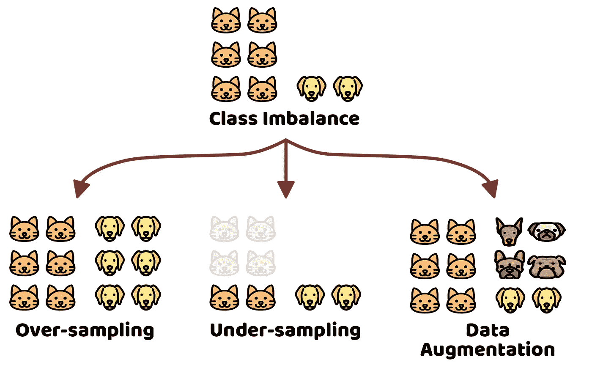
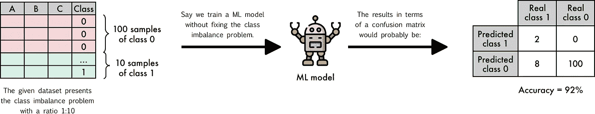
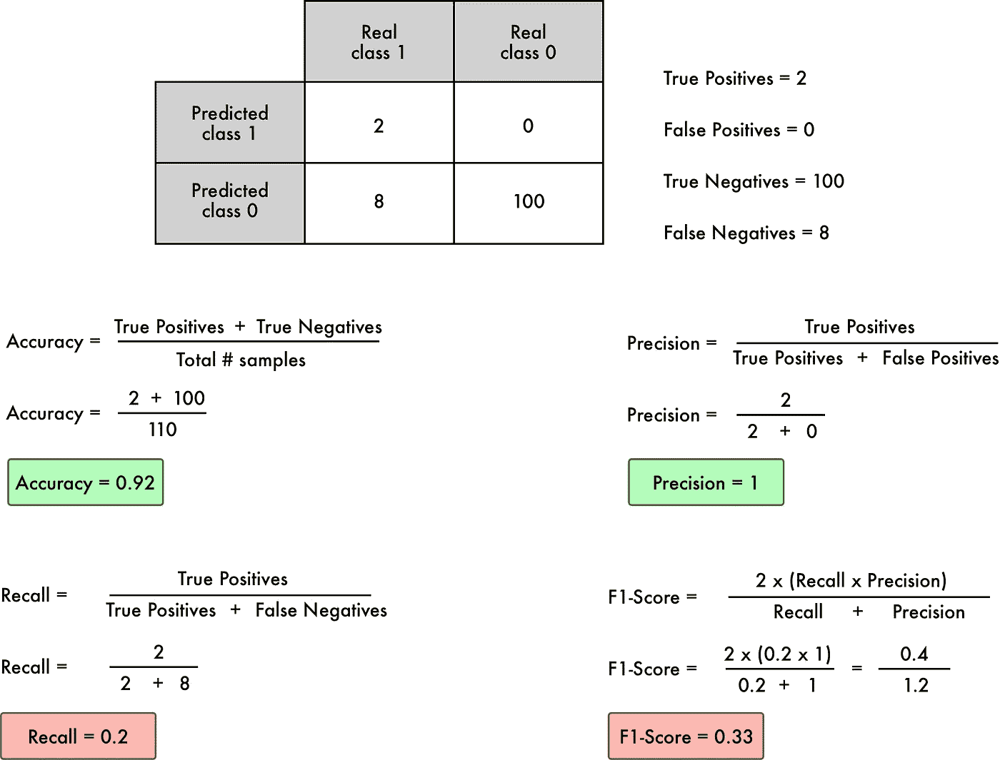
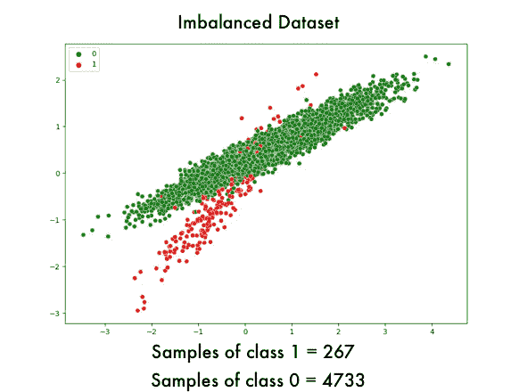
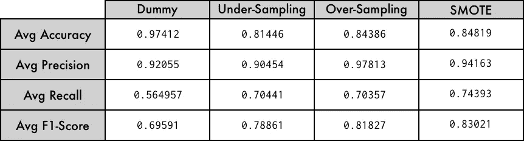

# 类别不平衡:带有不平衡学习的随机抽样和数据扩充

> 原文：<https://towardsdatascience.com/class-imbalance-random-sampling-and-data-augmentation-with-imbalanced-learn-63f3a92ef04a?source=collection_archive---------3----------------------->

## 探讨了类别不平衡问题、准确性悖论以及利用不平衡学习库解决这一问题的一些技术。

图一。阶级失衡视觉描述|作者图片|图标取自[维塔利-戈尔巴乔夫](https://www.flaticon.com/authors/vitaly-gorbachev)

开发用于分类的机器学习模型时出现的挑战之一是**类别不平衡**。大多数用于分类的机器学习算法是在假设类平衡的情况下开发的，然而，在现实生活中，拥有适当平衡的数据并不常见。由于这个原因，已经提出了各种替代方案来解决这个问题以及应用这些解决方案的工具。这就是**不平衡学习** [ [1](https://imbalanced-learn.org/stable/user_guide.html) ]的情况，这是一个 python 库，实现了最相关的算法来解决**类不平衡**的问题。

在这篇博客中，我们将看到什么是**类不平衡**，实现**精度**作为**不平衡类**的度量的问题，什么是**随机欠采样**和**随机过采样**，以及**不平衡-学习**作为一种替代工具，以适当的方式解决**类不平衡**问题。然后，博客将被划分如下:

*   **什么是阶层失衡？**
*   **准确性悖论**
*   **欠采样和过采样**
*   **不平衡——在实践中学习**

# 什么是阶层失衡？

当每个类别的样本*不平衡*时，类别不平衡的问题就出现了，也就是说，在类别的分布之间没有平衡的比率。这种**不平衡**可大可小。根据样本大小，从 1:2 到 1:10 的比率可以理解为*轻微失衡*，大于 1:10 的比率可以理解为*强烈失衡*。在这两种情况下，具有类别**不平衡**问题的数据必须用特殊技术处理，例如*欠采样*、*过采样*、*成本敏感*等等。稍后，我们将介绍*欠采样*和*过采样*以及它们与 **imblearn** [ [1](https://imbalanced-learn.org/stable/user_guide.html) ]的实现。

# 准确性悖论

在处理分类问题中的不平衡数据时，要考虑的一个基本问题是要使用的度量标准。*准确度*通常被用作事实上的度量，但是对于类别**不平衡**问题，这不是一个好的选择，因为*准确度*可能会产生误导，这个问题更好地被称为 ***准确度悖论*** 。为了更好地理解 ***精度悖论*** ，我们来看看图 2。

图二。准确性悖论|作者图片|图标取自 [Freepik](https://www.flaticon.es/autores/freepik)

当使用*准确度*作为衡量标准来评估用具有类别**不平衡**问题的数据集训练的机器学习模型时，结果可能会令人误解。正如我们所看到的,*的准确度*是 92%,这将使我们假设模型足够好。然而，如果我们仔细观察，我们可以看到模型学会了将所有东西分类为类 0，这产生了具有足够好的*准确性*的效果。在这些情况下，除了应用一些方法来修复类**不平衡**问题之外，建议引入其他评估指标，如**精度、召回**和 **F1-Score。**让我们看看图 3，以便更好地理解**精度、回忆**和**F1-得分**指标如何帮助我们更好地了解结果。

图 3。准确度、精确度、召回率和 F1 分数|作者图片

让我们看看刚刚发生了什么。**准确性**是一个衡量*真阳性*和*真阴性*之间平衡的指标，然而，当数据集呈现**类不平衡**问题时，模型将最有可能学习将所有东西都向主导类分类，在这种情况下向类 0 分类。因此，即使模型已经将 100%的数据分类为 0 类，考虑到*真阴性*的数量占主导地位，精确度也将*足够好*。这就是为什么当存在类别不平衡问题时，**准确性**度量经常会产生误导(**准确性悖论**)。

**精度**度量标准测量:“*在所有被模型分类为阳性的元素中，有多少实际上是正确的*”正如我们所观察到的，**精度**是*完美的*，这将使我们认为*“嗯，准确度和精度足够好了*”，然而这并不完全正确，因为在类别 1 的 10 个元素中，只有 2 个被正确分类，也就是说，8 个被错误分类，这可以在**召回**指标中观察到。

**回忆**度量标准:“*被模型分类为正类的那些与被分类为负类但实际上是正的那些之间的平衡*”。正如我们所看到的，**召回**值非常低，这给了我们一个信号，表明有些事情不对劲，也就是说，几个真正呈阳性的样本被归类为阴性。在一个真实的环境中，让我们想象阳性类别指的是"*患有癌症*"，而阴性类别指的是"*没有患有癌症*"，在这种环境中，我们会将许多真正患有癌症的人归类为没有患癌症的人，这将是一个灾难性的错误。

最后，为了概括**精度**和**召回**度量，我们实现了**F1-分数**度量，它被理解为*精度和**召回**之间的调和平均值*，换句话说，它提供了两个度量之间的比率。我们可以看到， **F1-Score** 值很低，这是另一个指标，表明有些事情不对劲(在我们的例子中，*精度很完美*但是*召回很差*)。

到目前为止，我们已经看到了什么是**类不平衡**问题，使用*不平衡类*的一些后果，以及在评估呈现类不平衡问题的模型时要考虑的一些指标。现在，让我们来看看可以用来调整**类不平衡的一些替代方案，**具体来说，让我们来看看应用基于**欠采样**和**过采样**的技术的效果。

# **欠采样和过采样**

正如我们已经看到的，当*等级分布*之间没有平衡时，就会出现**等级不平衡**问题，也就是说，一个或多个等级相对于一个或多个剩余的等级可能是主导的。直观上，这个问题可以通过向少数类添加样本、从多数类移除样本或者两者的结合来解决。因此，从多数类中移除样本的过程称为**欠采样**，向少数类添加样本的过程称为**过采样**。

**随机欠采样**是指多数类的*随机抽样*。这一过程一直进行到少数群体达到平衡。虽然这种技术有助于在多数类和少数类之间建立平衡，但当从多数类中移除样本时，可能会丢失重要信息。

**随机过抽样**是指从少数类中随机复制*样本。执行加法过程，直到相对于多数类达到平衡，然而，这种技术可能导致要训练的模型过度适合少数类。*

**随机欠采样**和**随机过采样**可以理解为解决**类不平衡**问题的基本技术。今天，有更多有前途的技术试图改善基于随机的方法的缺点，如合成数据增强(SMOTE [ [2](https://arxiv.org/abs/1106.1813) ]，ADASYN [3])或基于聚类的欠采样技术(ENN [ [4](https://ieeexplore.ieee.org/document/4309137?TB_iframe=true&width=370.8&height=658.8) ])。

好了，我们已经知道了基于**欠采样**和**过采样**的技术是什么，让我们看看如何在实践中实现它们吧！

# **不平衡——在实践中学习**

**不平衡学习**是由 Guillaume lematre 等人 [6](https://www.jmlr.org/papers/volume18/16-365/16-365.pdf) 开发的开源 Python 库 [5](https://github.com/scikit-learn-contrib/imbalanced-learn) ，它提供了一套处理**类不平衡**问题的算法。这样一套算法被组织成 4 组:*欠采样*、*过采样*、*过采样*和*欠采样*的组合和*集成学习*方法。出于我们的目的，此时我们将只使用*欠采样*和*过采样*扩展。

以下示例将使用一个**不平衡数据集**。将训练一个机器学习模型(**决策树**)，并将评估度量**准确度**、**精度**、**召回**和**f1-分数**。随后，将应用下的*和*过采样*算法，并且将再次评估前述度量，以在没有修复**不平衡**问题的情况下训练模型时获得的结果与应用欠采样和过采样时获得的结果之间进行比较。*

所以我们先生成一个不平衡的玩具数据集:

代码片段 1。合成数据生成

生成的不平衡数据集将如图 4 所示:

图 4。不平衡数据集|作者图片

我们可以看到，生成的数据集呈现出**类不平衡**的问题，比例为 1:10。在应用**欠采样**和**过采样**算法之前，我们将定义一个能够用固定数据集训练*决策树*的函数。

代码片段 2。模型训练功能

正如我们已经观察到的，该函数实现了**分层 K 折叠**交叉验证技术，以保持每个折叠的类之间的平衡。

为了执行*演示比较*，我们将定义一组应用每种采样算法的函数(*随机超过*和*下采样*)、 *SMOTE* 以及 *dummy* 版本(该版本在不考虑类别不平衡问题的情况下训练决策树)。

代码片段 3。基于欠采样和过采样的技术

*哑函数*(第 6 行)，用代码片段 1 中生成的数据训练一个*决策树*，而不考虑类不平衡问题。**随机欠采样**应用于第 10 行，**随机过采样**应用于第 17 行， **SMOTE** 应用于第 25 行。在图 5 中，我们可以看到当应用每种算法时，类平衡是如何转变的。

图 4。作者对随机抽样和 SMOTE | Image 的比较

如我们所见，**欠采样**算法从多数类中移除样本，使其与少数类对齐。另一方面，**过采样**算法复制了 minority 类的元素(您可以看到，该图类似于图 4 中的图)。最后 **SMOTE** (一种数据扩充技术)，增加少数类的样本，直到它与多数类平衡。结果如图 6 所示。

图 6。结果

正如我们所看到的，当应用技术纠正**职业平衡**问题时，模型的有效性得到了提高。对于这个特殊的例子，基于合成数据扩充(SMOTE)的技术显示了更好的结果。归根结底，要实现的技术将完全取决于您正在处理的数据。值得一提的是**不平衡学习**提供了各种各样的算法来解决不平衡类的问题，值得看一看它的文档[ [1](https://imbalanced-learn.org/stable/user_guide.html) ]。

# 结论

在这篇博客中，我们看到了**类不平衡**的问题，以及在处理**不平衡数据集**时必须考虑的指标。我们还看到了一个如何使用基于采样和数据扩充的算法来解决类不平衡问题的例子。我们还利用了**不平衡学习**库来扩展示例中使用的算法。

# 参考

[1][https://imbalanced-learn.org/stable/user_guide.html](https://imbalanced-learn.org/stable/user_guide.html)

[2] [SMOTE:合成少数过采样技术](https://arxiv.org/abs/1106.1813)

[3] [ADASYN:用于不平衡学习的自适应合成采样方法](https://www.ele.uri.edu/faculty/he/PDFfiles/adasyn.pdf)

[4] [使用编辑数据的最近邻规则的随机属性](https://ieeexplore.ieee.org/document/4309137?TB_iframe=true&width=370.8&height=658.8)

【https://github.com/scikit-learn-contrib/imbalanced-learn 

[6] [不平衡学习:一个 Python 工具箱来解决机器学习中不平衡数据集的诅咒](https://www.jmlr.org/papers/volume18/16-365/16-365.pdf)