# 分类损失的类别权重

> 原文：<https://towardsdatascience.com/class-weights-for-categorical-loss-1a4c79818c2d?source=collection_archive---------16----------------------->

## 当数据集不平衡时，类权重通常用于分类问题。我们在引擎盖下看这个。

Suket Dedhia 的绘画作品

在寻找关于类权重的“确切”解释时，我不仅没有找到任何东西，[对 tensorflow 和 PyTorch 中的实现进行逆向工程，我发现它们并不一致](https://stackoverflow.com/questions/67644633/class-weight-implementation-different-for-pytorch-and-tensorflow-which-one-is-c)。因此，在这篇笔记中，我将以二进制分类问题为例来研究数学。之后，我还将很快讨论多类分类问题。

# 二元分类

不平衡数据集是指不同类别的数据点数量相差很大的数据集。有几种方法可以解决这个问题(欠采样、过采样、增加显式偏差和类别权重在[张量流示例](https://www.tensorflow.org/tutorials/structured_data/imbalanced_data)中讨论)，这里我们将讨论类别权重。

让我们来看一个标签为 0 和 1 的二元分类问题。类权重的传统选择是

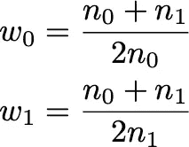

虽然最近[讨论了一个更复杂的方法](https://arxiv.org/abs/1901.05555)。

一个数据点的分类交叉熵损失函数为

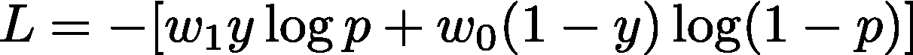

其中，y=1，0 表示阳性和阴性标签，p 是阳性类别的概率，w1 和 w0 是阳性类别和阴性类别的类别权重。

对于 minibatch，PyTorch 和 Tensorflow 的实现有一个归一化的区别。PyTorch 有

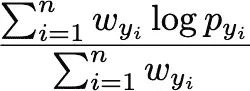

而 Tensorflow 有

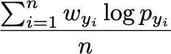

当批量较小时，这两者之间的差异很重要(对于较大的批量，大数法则抑制 PyTorch 实现中的批量相关波动)。

让我们看看最后一层的梯度下降。其余的使用简单的链式法则/反向传播。我们将重点关注一个数据点的损失。批次的结果是这些的平均值，并且取决于如上所述的特定实现。类别 1 的概率是

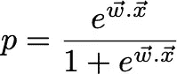

而类 0 的是 1-p。W 是权重向量，x 是前一层的输出。我忽略了对简单性的偏好。

简单的微积分表明，损失相对于重量的梯度为

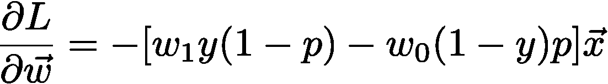

这给出了对重量的修正

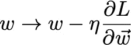

先看看这个没有类权重的例子，看看会发生什么。**如果样本为正类，即 y=1，则梯度指向 x 方向，向量长度与(1-p)成正比。概率离 1 越远，这个向量就越长。相反，如果样本属于负类，即 y=0，则梯度指向 x 的对面，向量的长度与 p 成比例。p 离 0 越远，向量越长。**想想这个，说服自己这是正确的行为。

现在，当我们打开**级重量**时，我们看到它们**调整前述长度**。我们取 p=0.5。在这种没有类权重的情况下，y=1 和 y=0 的梯度向量将分别沿着 x 和逆着 x 具有相等的长度。然而，如果 w1 > > w0，那么 y=1 的梯度向量将比 y=0 的梯度向量长得多。这将使前一种情况下对 w 的修正比后一种情况下大得多。w1 < < w0 时反之适用。

# 多类问题

为了完整性(你将看到额外的简单性),让我们也做多类问题。在这种情况下，交叉熵损失为

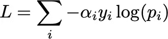

其中 alphas 是类权重(很抱歉切换通知，但是随着额外权重的继续，使用‘w’表示类权重会变得混乱)

softmax 下第 I 类的概率由下式给出

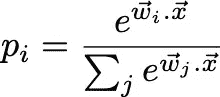

这很容易验证(如果看起来不容易，那么你应该实际计算并说服自己)

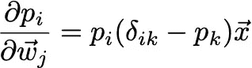

利用我们得到的链式法则

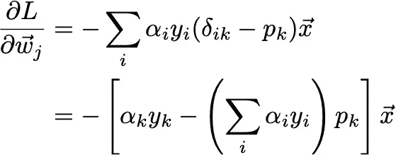

具体地看将是有启发性的，因此，不失一般性地，让我们假设真正的标签是 y0=1，而所有其他的 y 是 0。然后我们得到类的权重更新为正

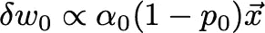

正确类别的权重更新将权重与 x 对齐，并且如果强度与预测的偏离程度和正确类别的类别权重成比例，则强度与 x 对齐

而对负的类的权重更新是

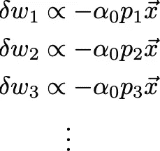

不正确类别的权重更新使权重与 x 不对齐，并且强度再次与预测的偏离程度成比例，但是注意，它们与正确类别的权重成比例，而不是与不正确类别的权重成比例。如果人们盯着损失函数看一段时间，后一个事实就很明显了。

注意，校正的效果是使正确类的权重与 x 更加对齐，而不正确类的权重与 x 更加不对齐。