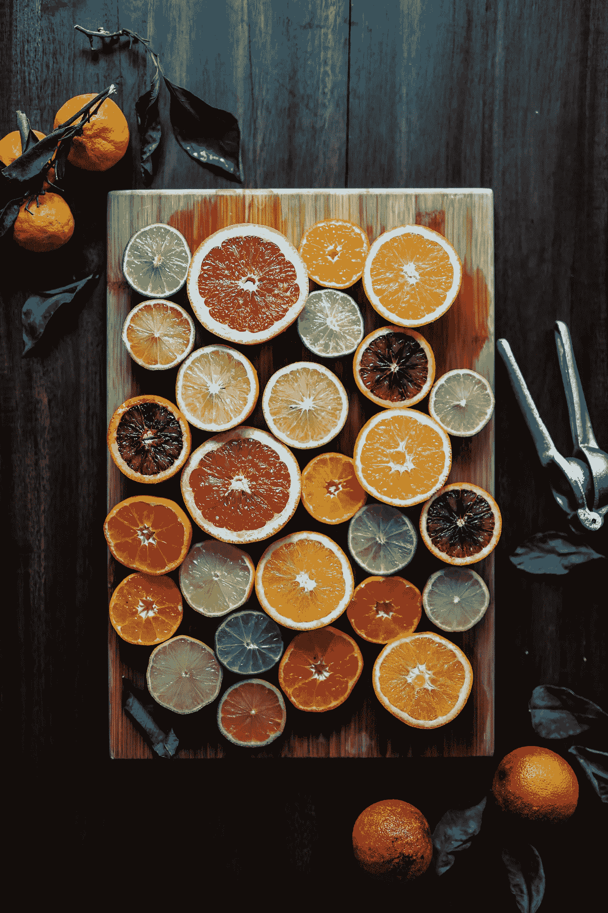
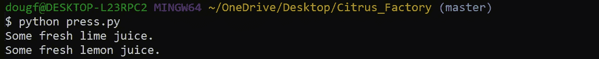
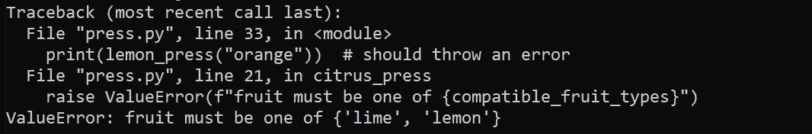
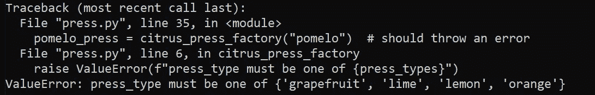

# 函数式编程中的“类”？

> 原文：<https://towardsdatascience.com/classes-in-functional-programming-ee48a50b6235?source=collection_archive---------10----------------------->

## [*小窍门*](https://towardsdatascience.com/tagged/tips-and-tricks)

## 用 currying 模仿 Python 中的类的行为

作者:[爱德华·克鲁格](https://www.linkedin.com/in/edkrueger/)、[斯蒂芬·莱西](https://www.linkedin.com/in/stephenlyssy/)和[道格拉斯·富兰克林](https://www.linkedin.com/in/dougaf/)。

照片由迈克尔·里维拉·🇵🇭在 Unsplash 上拍摄

Python 非常适合面向对象编程(OOP)。面向对象编程关注的是由属性和方法组成的对象。属性是数据，方法是作用于属性和其他数据的函数。类在 Python 中很常见。

一个类可以被认为是一个对象的蓝图。Python 程序员通过使用关键字“class”并添加定义它的属性和方法来创建类。一旦我们有了蓝图，我们就可以轻松地重用它们来创建一个实例。

因为 Python 是一种多范例语言，所以它不仅可以用于面向对象编程，还可以用于函数式编程！您可以编写一个使用其中一种范式甚至两种范式的 Python 程序。

面向对象编程将逻辑和数据结合成对象，而函数式编程将逻辑和数据分开。我们将说明这两种范例都可以用来获得相似的结果。

先说功能性的。程序员往往更熟悉 OOP。

## 什么是 currying，它如何表现得像一个类？

Currying 是将接受多个参数的函数简化为单参数函数的过程。

我们可以把班级想象成一个蓝图。让我们把 currying 想象成一个生产函数的工厂——在下面的例子中，是柑橘榨汁机。

# 咖喱和水果榨汁机

让我们用一个柑橘榨汁机厂的例子，他们生产的柑橘榨汁机和新鲜果汁来解释 currying。

照片由 Edgar Castrejon 在 Unsplash 上拍摄

柑橘榨汁机厂回一个柑橘榨汁机，是取水果，回果汁的功能。那么，我们怎样才能从一家生产榨汁机的工厂变成一杯新鲜的果汁呢？

我们追求功能。看看下面的代码。

注意我们如何与第 31 行及以下的函数交互。首先，我们使用`citrus_press_factory`创建一个名为`lemon_press`的新函数。然后我们通过`“lemon”`和`“lime”` 到我们的`lemon_press`去取一些新鲜的果汁，味道很好但是有点酸。

我们去喝点更甜的吧，橙汁。在第 34 行，我们试图传递一个`“orange”`到我们的 lemon press 中，产生一个错误。看起来柠檬榨汁机只能用柠檬和酸橙！如果我们真的想做橙汁，我们就必须用我们的`citrus_press_factory`来做一个橙子榨汁机！

试着用柠檬榨汁机榨橙汁

根据工厂规范，我们似乎可以做一个柚子压榨机来榨出一些柚子汁。但是当我们试图在第 36 行为此目的制作一个 pomelo press 时会发生什么呢？

试图在我们的柑橘工厂制造一台柚子压榨机

看起来我们又遇到了一个错误。要创建一个`citrus_press`的实例，你必须使用`citrus_press_factory.`中的一个有效值。类似地，要制作一些果汁，你向`citrus_press`传递一个水果，它可以用它作为输入。

既然我们已经理解了 currying，那么让我们用一个 Python 类并把它重写为 currying 模式。

# Python 类—口袋妖怪

在下面的例子中，我们创建了一个名为 Pokemon 的类。当我们在第 5 行使用带有参数`self`和`sound` 的`__init__`方法时，Pokemon 类被实例化。

要了解更多关于 Python 中的类的背景知识，请阅读由 Sadrach Pierre 博士撰写的文章

</classes-in-python-e31c21120c3d>  

接下来，我们在 Pokemon 类中创建一个名为`cry`的方法，该方法返回`sound`。在这种情况下，`sound` 是数据，`cry` 是逻辑。注意类`Pokemon`如何将数据存储为`self.sound`。

既然 Pokemon 类已经创建好了，我们可以用它来创建一个**对象**。在第 23 行，我们创建了一个名为`pikachu` 的类实例，并传递了`sound`“Pika”第 24 行显示`pikachu.cry()`返回“Pika”

我们如何用数据和逻辑分离来创建这种行为？

## “T21”怎么能产生类似的结果呢

如前所述，我们使用 currying 将多参数函数分解成连续的单参数函数。为此，我们首先在第 11 行创建一个名为`make_pokemon`的函数，它接受参数`sound`并返回`cry`。函数`cry`返回传递给`make_pokemon`的`sound`。

让我们调用这些函数来说明它们的行为。回想一下我们的果汁压榨机的例子！

通过将`make_pokemon(“Pika”)`的结果存储为`pickachu_cry`,我们创建了一个新函数，在被调用时返回“Pika”。

我们看到两者:

和

回报同样的叫声，“鼠兔。”

这表明创建一个类和使用固化可以产生相同的结果。在这两个例子中，我们都创建了可重用的代码。此外，这两个选项都允许程序员在程序中的单个位置对代码进行更改。