# 经典 Seq2Seq 模型与 Seq2Seq 模型对比注意

> 原文：<https://towardsdatascience.com/classic-seq2seq-model-vs-seq2seq-model-with-attention-31527c77b28a?source=collection_archive---------20----------------------->

## 现在就来关注一下吧！

阿图尔·图马斯扬在 [Unsplash](https://unsplash.com?utm_source=medium&utm_medium=referral) 上的照片

> “我需要关注。我喜欢这种关注。”***—比尔弗利***

# 介绍

在本文中，我们将分析一个**经典序列对序列(Seq2Seq)模型**的结构，并展示使用**注意力解码器**的优势。
这两个概念将为理解 ***论文中提出的变压器***[注意力是你所需要的全部](https://arxiv.org/pdf/1706.03762.pdf)。

Yoshua Bengio 分享了在人工智能中使用注意力机制来训练意识的价值。

# **目录:**

*   **什么是 Seq2Seq 模型？**
*   经典的 Seq2Seq 模型是如何工作的？
*   **注意**

# 什么是 Seq2Seq 模型？

在 Seq2seq 模型中，神经机器翻译接收单词序列形式的输入，并生成单词序列作为输出。
从例子来看，“Cosa vorresti ordinare？”在意大利语中作为输入，变成“您想点什么？”作为英语输出。
或者，输入可以是一幅图像(图像字幕)或一长串单词(文本摘要)。

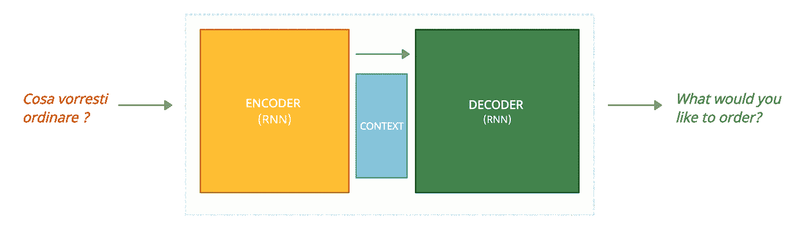

来源:图片由作者提供。

# **经典的 Seq2Seq 模型是如何工作的？**

Seq2Seq 模型通常包括:

*   一个**编码器**
*   一个**解码器**
*   一个**上下文** ( *向量*)

***请注意:*** *在神经机器翻译中，编码器和解码器都是 RNNs*

**编码器**通过将所有输入转换成一个向量来处理它们，这个向量被称为**上下文**(通常长度为 256、512 或 1024)。上下文包含编码器能够从输入中检测到的所有信息(记住，在这种情况下，输入是要翻译的句子)。
最后，向量被发送到**解码器**，解码器形成输出序列。

## 神经机器翻译中的时间步骤

现在我们已经对序列到序列模型有了一个高层次的概述，让我们简要地分析一下输入是如何被处理的。

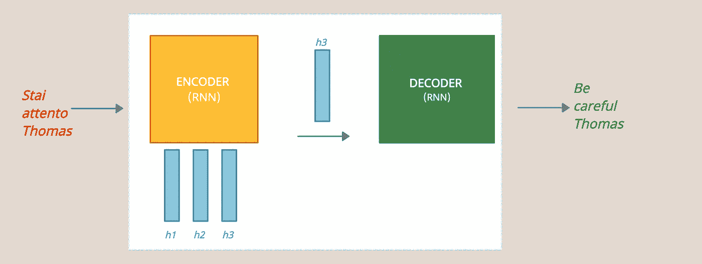

来源:图片由作者提供。

> **时间步骤#1:** 意大利语单词“Stai”被发送到编码器
> 编码器根据其输入和先前输入更新其隐藏状态(h1)。
> **时间步骤#2:** 字“attento”被发送到编码器
> 编码器基于其输入和先前输入更新其隐藏状态(h2)。
> **时间步骤#3:** 单词“Thomas”被发送到编码器
> 编码器基于其输入和先前输入更新其隐藏状态(h3)。
> **时间步骤#4:** 最后一个隐藏状态成为发送给解码器的上下文
> 解码器产生第一输出“Be”
> **时间步骤#5:** 解码器产生第二输出“小心”
> **时间步骤#6:** 解码器产生第三输出“托马斯”

编码器或解码器的每一步都是 RNN 处理其输入并生成该时间步的输出。
你可能注意到了，我们最后的**隐藏状态( *h3* )** 变成了发送给解码器的内容。在这个*中存在经典序列对序列模型的限制*；编码器“被迫”只发送一个向量，而不管我们的输入有多长，也就是说，我们的句子由多少个单词组成。
即使我们决定在编码器中使用大量的隐藏单元，目的是拥有更大的上下文，那么模型会过度拟合短序列，并且随着我们增加参数的数量，我们会受到性能的影响。

***这就是注意力解决的问题！***

# 注意力

至此，我们明白了要解决的问题在于上下文向量。这是因为，如果输入的是一个包含大量单词的句子，那么模型就会有问题。
bah danua 等人和 [Loung 等人](https://arxiv.org/abs/1508.04025)提出了解决方案。这两个出版物介绍并完善了“注意”的概念。这项技术通过关注输入序列的相关部分，使得机器翻译系统有了相当大的改进。

***直觉*** seq 2 seq 模型中的编码器与经典的编码器工作方式相似。这一次接收一个单词，并产生下一步使用的隐藏状态。
随后，与之前不同，不仅最后的隐藏状态(h3)将被传递到解码器，而且所有的隐藏状态都将被传递到解码器。

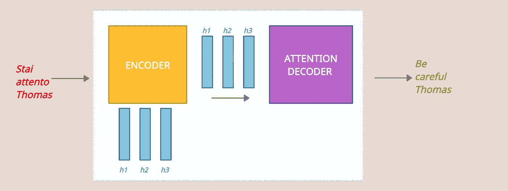

来源:图片由作者提供。

让我们更好地关注发生在**编码器**和**注意力解码器**内部的过程。

## 编码器

在到达编码器之前，我们的句子的每个单词都通过一个 ***嵌入过程*** 转换成一个向量(大小为 200，或 300)。
中的*第一个*字，在我们的例子中是“Stai”，一旦它转换成矢量就被发送到**编码器**。这里 RNN 的第一步产生了第一个**隐藏状态**。对于第二个的*和第三个*的*字，同样的情况发生，总是考虑先前的隐藏状态。
一旦我们的句子的所有单词都被处理完毕，**隐藏状态( *h1，h2，h2* )** 将被传递给**注意力解码器**。*

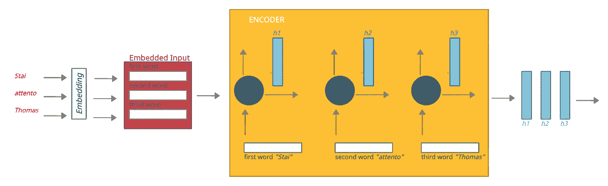

编码器。来源:图片由作者提供。

## 注意力解码器

首先，一个重要的过程发生在注意力解码器中:

*   每个*隐藏状态*被分配一个**分数**。
*   分数经过一个 **softmax 函数**。
*   *隐藏状态*和相关的 *softmax 分数*相互相乘
*   最后，将获得的隐藏状态相加以获得单个向量，即**上下文**向量。

这个过程允许我们放大序列中的重要部分，减少不相关的部分。
至此，我们要明白**分数**是如何分配给每个隐藏状态的。你还记得 *Bahdanau* 和 *Luong* 吗？嗯，为了更好地理解注意力解码器内部发生了什么以及分数是如何分配的，我们需要说一些关于**倍增注意力**的更多事情。

**乘法注意力**是通过开发先前为加法注意力所做的工作而发展起来的。
在论文《基于注意力的神经机器翻译的有效方法》中，Loung 引入了几个评分函数:

*   **点积**
*   **一般产品**
*   **串联产品**

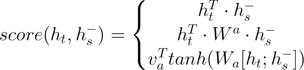

从上到下:1) **点积**，2) **一般积**，3) **串联积**。来源:图片由作者提供。

在本文中，我们将分析 **g *一般产品注意事项(2)*** 。
这是因为，在我们的情况下，一旦确立了每种语言都倾向于有自己的嵌入空间，那么编码器和解码器就没有相同的嵌入空间。

多亏了这个产品，分数将由解码器的**隐藏状态**、**权重矩阵**和编码器的**隐藏状态集合**相乘得到。

现在我们知道了分数是如何计算的，让我们试着理解一下**注意力解码器**在 Seq2Seq 模型中是如何工作的。

在第一时间步，注意力解码器 RNN 接受 **<结束>** 令牌的嵌入，以及初始解码器隐藏状态。RNN 处理其输入，产生一个输出和一个*新的* ***解码器隐藏状态向量(h4)*** 。输出被丢弃。
从这里开始**注意步骤**:

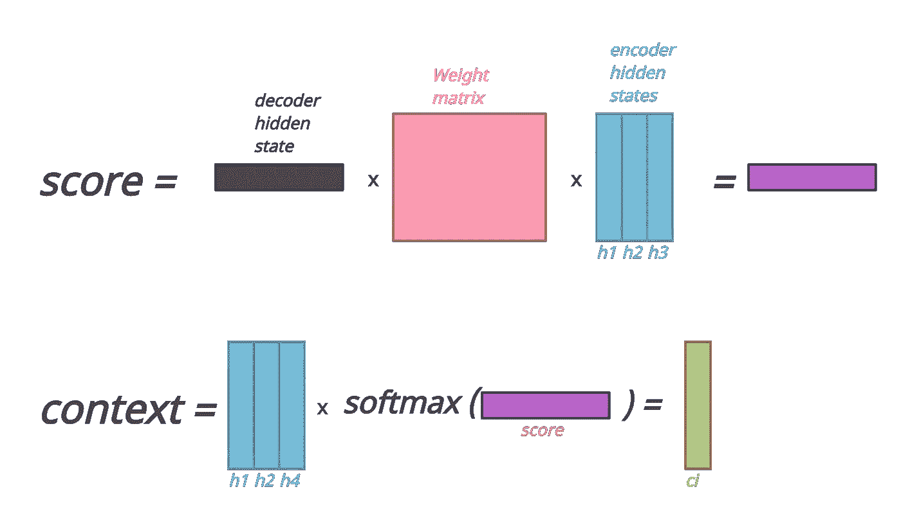

1-每个 ***编码器隐藏状态*** 被分配一个 ***分数*** 从 ***获得一般生产注意*** 。

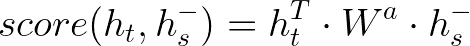

一般产品注意事项。来源:图片由作者提供。

2-分数经过一个 **softmax 函数**。

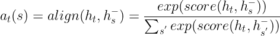

Softmax。来源:图片由作者提供。

3- ***编码器隐藏状态*** 与相关的****of max 分数*** 相乘。将得到的隐藏状态相加，得到***【C4】***。*

*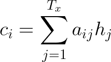*

*语境。来源:图片由作者提供。*

*4-***上下文向量(c4)*** 与 ***解码器隐藏状态(h4)*** *串接。*
源自拼接的向量通过 ***完全连接的神经网络*** ，其基本上乘以*权重矩阵(Wc)* 并应用*双曲正切激活*。
这个全连接层的输出将是我们在输出序列中的第一个输出单词(输入:*“Stai”*->输出:*“Be”*)。*

*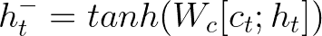*

*来源:图片由作者提供。*

*第二时间步从第一步的 ***输出***【Be】开始，并随着 ***解码器产生隐藏状态(h5)*** 。接下来是上述的*注意步骤*。
重复以下时间步骤所述的过程。*

*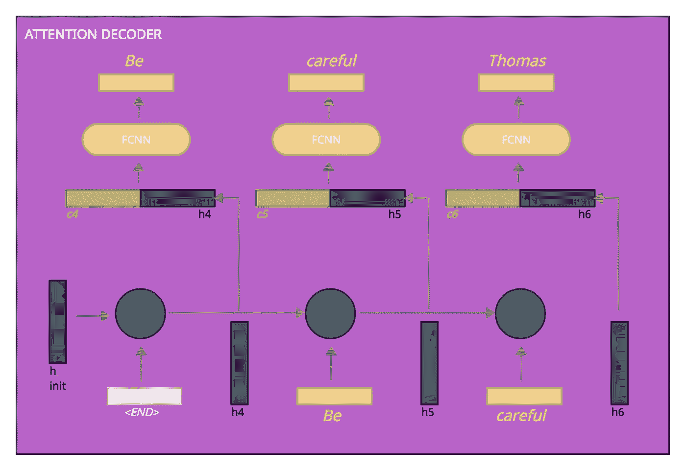*

*注意解码器。图片由作者提供。*

# *结论*

*如果你设法来到这里，恭喜你！非常感谢你花时间阅读这篇文章。
希望这篇文章已经让你对*经典 Seq2Seq 模型*，以及 *Seq2Seq 带注意模型有了很好的初步了解。*
如果你注意到任何思维方式、公式或形象上的错误，请告诉我。最后但同样重要的是，如果你想深化所涉及的主题，我在下面给你留下了一些非常有用的资源:*

*   *[C5W3L07 吴恩达注意力模型直觉](https://www.youtube.com/watch?v=SysgYptB198&t=9s)*
*   *[chaud Hari 等人对注意力模型的仔细调查](https://arxiv.org/pdf/1904.02874.pdf)*
*   *[杰伊·阿拉姆马的可视化神经机器翻译模型](https://jalammar.github.io/visualizing-neural-machine-translation-mechanics-of-seq2seq-models-with-attention/)*
*   *[深度学习 7。DeepMind](https://www.youtube.com/watch?v=Q57rzaHHO0k) 深度学习中的注意力和记忆*

*再次感谢您阅读我的文章。如有任何问题或信息，可在 [LinkedIn](https://www.linkedin.com/in/kouatemuhamed/) 联系我，或在下方留言评论。*

## *参考资料:*

*   *[Bahdanua 等人，“通过联合学习对齐和翻译的神经机器翻译”](https://arxiv.org/abs/1409.0473)*
*   *[Loung 等人，“基于注意力的神经机器翻译的有效方法”](https://arxiv.org/abs/1508.04025)*
*   *[可视化神经机器翻译模型(Seq2seq 模型的机制，注意)Jay Alammar](https://jalammar.github.io/visualizing-neural-machine-translation-mechanics-of-seq2seq-models-with-attention/)*