# 分类决策树，容易解释

> 原文：<https://towardsdatascience.com/classification-decision-trees-easily-explained-f1064dde175e?source=collection_archive---------22----------------------->

## 决策树是更高级的机器学习模型的构建模块之一。说到分类问题，它们到底是如何构建的？

照片由[@ szmigieldesign](https://unsplash.com/@szmigieldesign)@ unsplash.com 拍摄

不不管你在数据科学方面多么有经验，你可能听说过决策树。这种简单易懂的算法受到很多人的喜爱，是许多算法的基础，这些算法赢得了大量机器学习竞赛，并引导项目走向成功。

Random Forest、XGBoost 或 LightGBM 是一些基于 if-else 规则构建算法的简单而有效的算法。

决策树到底是怎么构建的？它如何选择组成规则的变量和阈值？如果你一直想了解这个算法是如何工作的，你来对地方了。

让我们从一个简单的角色扮演挑战开始。

我们有装有两枚鸵鸟蛋的盒子——我们需要将这些盒子海运到其他国家。**我们已经做了一个实验，发送了 38 个盒子来测试两个鸡蛋是否安全到达目的地—** 然后我们用散点图绘制两个鸡蛋的重量，试图了解这些变量与包装结果之间是否有任何关系:

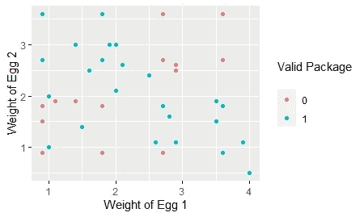

鸡蛋的重量和包装的有效性

蓝点由安全抵达目的地的箱子组成。不幸的是，我们的一个或两个鸡蛋打破了，我们的包装被认为是无效的。

**(还是救几只鸵鸟吧！)**

来源:[https://giphy . com/gifs/natgeowild-NAT-geo-wild-鸵鸟-国家地理-i3R0nglQHQipENYJkG](https://giphy.com/gifs/natgeowild-nat-geo-wild-ostrich-national-geographic-i3R0nglQHQipENYJkG)

在与快递员核实后，您了解到，当您发送两个非常重的鸡蛋时，它们会相互挤压并可能破裂。当你送两个太轻的鸡蛋时，它们有太多的空间在盒子里移动，并折叠到它的边界。为了避免浪费大量的箱子，您希望构建一个算法来告诉您哪些箱子对于海外旅行应该是有效的。

对于一个人来说，执行某种 if-else 规则并在上面的例子中画出一些边界似乎很容易。**类似这样的快速草图:**

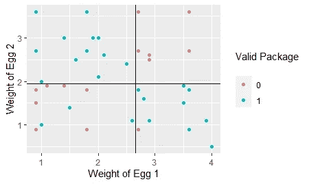

If-Else 规则用于区分有效和无效的包

这些象限产生以下 if-else 规则:

*   如果**蛋 1 >的重量为 2.66** 而**蛋 2 >的重量为 1.95** ，则**包装很有可能会破损。**
*   如果**蛋 1 的重量< 2.66** 和**蛋 2 的重量> 1.95** ，则**包裹很有可能完好无损地到达。**
*   如果**蛋 1 <的重量为 2.66** 而**蛋 2 <的重量为 1.95** ，则**包装很有可能会破损。**
*   如果**蛋 1 > 2.66** 的重量和**蛋 2 < 1.95** 的重量，则**包装很有可能完好无损地到达。**

有了这些规则，我们可以很容易地建立一个系统，让我们决定是否应该把包裹送到海外。

基于这一系统，让我们将我们的分类形象化:

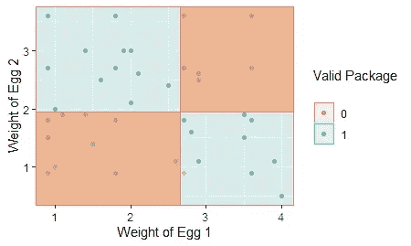

因此..如果人类可以在自己身上做到这一点，为什么要使用算法呢？主要问题是大多数数据集并不像我们上面看到的那样排列整齐(99.9%确定大多数真实生活中的数据集看起来不是这样的，我可以向你保证)——**那么用 3 个以上的变量来绘制这些边界呢？疯狂的不可能！**

这就是为什么我们需要机器来为我们做这些工作。

进入决策树！

决策树实际上非常简单，可以用一句“简单”的话来概括:“*决策树是一种算法，它递归地在空间中搜索可能的最佳边界，直到我们无法这样做为止*”。让我们去掉行话，从数学上把这句话分解一下。

想象一下，我们的第一次分割不是一个最佳分割——蛋 1 的重量超过或小于 1.5:

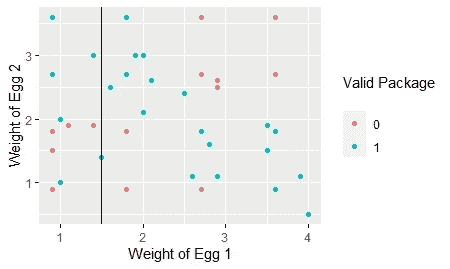

我们的树的次优分割—蛋 1 的重量≥ 1.5

这个决策界限并没有真正划分“盒子”或象限中的类。使用这个规则会给我们一个次优的分类，因为我们不能很好地将**有效的**和**损坏的**包分开。让我们画一棵真正的树，展开我们的论点，只是为了好玩:

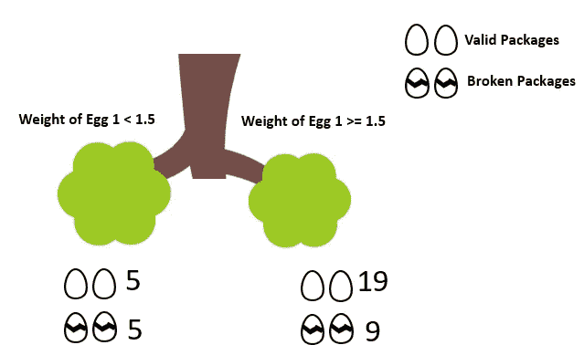

鸡蛋 1 重量≥ 1.5 公斤的拆分生成的树(图标归属:Stockio.com)

**在右边的分支中(我们一会儿会谈到树的解剖)**，我们有 19 个有效的包和 9 个破损的包。当蛋 1 的重量较高时，包装完好无损地到达的概率较高(19/28 或大约 68%)。另一方面，包裹到达时破损的概率是 9/28 **。**

如果你看左边的节点，包有效或破损的概率是完全一样的，5/10 或 50%。**我们很难对低于 1.5 阈值的点进行分类，因为每个类别中的示例数量没有差异。**

看起来这基本上是一个抛硬币的过程——用“树的语言”来说，**这意味着这是一个真正不纯的节点。**

理解这是否是一个好的分裂的关键是**量化由这个分裂产生的两个节点**的杂质。从正确的节点开始:

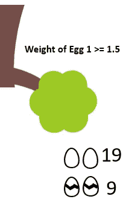

我们的分裂决策树的右节点——蛋 1 的权重≥ 1.5(图标归属:Stockio.com)

**杂质始于概率，我们现在已经如下:**

*   有效包的概率— 19/28 = 67.85%
*   包装破损的概率— 9/28 = 32.15%

我们现在引入一个非常重要的概念，称为**基尼不纯度，这是一个让我们为每个分割赋值的概念，如果你研究过其他算法，这将类似于成本函数**，我们希望选择具有最小 G *ini 不纯度的分割。*

为了对节点做出最终决定，我们需要计算分割中每个节点的*部分杂质*——对于该节点，*部分基尼杂质*为以下公式(其中我们插入有效包和破损包的概率):

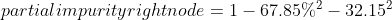

这将产生 0.43622 的值。较低的*部分杂质*意味着更好地分离类别的节点。

**好了，我们有了右节点**的值——让我们计算左节点的*部分杂质*，从概率开始:

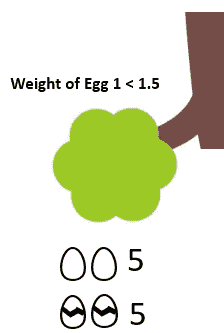

我们的决策树的左节点具有分裂-蛋 1 的权重< 1.5 (icon attribution: Stockio.com)

*   Probability of valid package — 5/10 = 50%
*   Probability of broken package — 5/10 = 50%

Now we can calculate the *左节点的部分杂质*:

右节点的部分杂质是 0.5。注意它是如何变高的，因为当我们想要分开这些类的时候，我们有一个更困难的时间。

**我们如何将两部分杂质结合起来？**这是容易的部分！我们将根据每个节点的样本数量对杂质的平均值进行加权，逐步计算:

*   右节点 28 例；
*   左侧节点上的 10 个示例；
*   *右节点部分杂质*= 0.43622；
*   *左节点的部分杂质*= 0.5；

分裂整体的杂质是(鼓点！):

来源:[https://giphy.com/gifs/GBvkxysAR8Svm](https://giphy.com/gifs/GBvkxysAR8Svm)

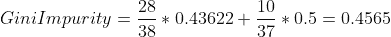

乌夫，终于！**这种分裂的基尼系数是 0.4565**——我们现在有一个单一的值可以附加到这个阈值上，并可以与其他潜在的候选值进行比较。

**通过设计，我们将希望选择将实现最小杂质的分离，因为该分离将转化为更好的分类。**

让我们测试另一个分裂！**例如，鸡蛋 1 的重量> 2.3:**

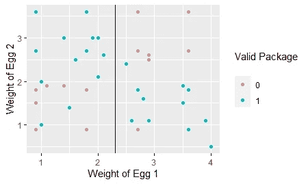

为我们的蛋重 1 ≥ 2.3 的树拆分。

这种分割会生成以下树:

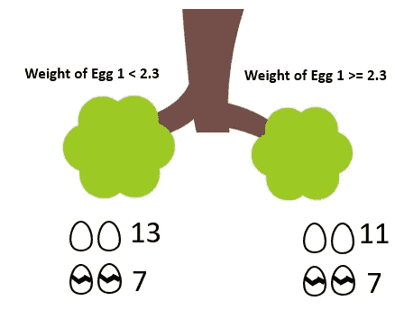

蛋重 1 ≥ 2.3 生成的树。(图标归属:Stockio.com)

看来这根本就不是一个好的分裂！这两个类在两个**叶节点**中似乎是平衡的。*“叶子是什么？”* —你问。

在计算这种分割的基尼系数之前，有必要检查一下决策树的结构:

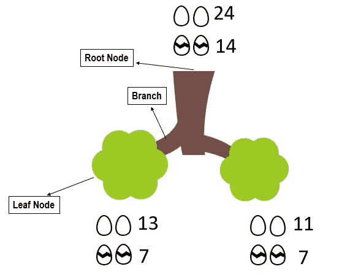

决策树的剖析(图标归属:Stockio.com)

*   **根节点**是我们的树的底部，在分裂之前，我们在那里有我们所有的鸡蛋盒子。
*   **分支**由应用 if-else 规则后盒子将采用的每条路径组成。
*   **叶节点**由盒子将结束的节点组成，取决于上面的分支。
*   **如果树有不止一级的深度**(我们马上就能到达那里！)然后*叶节点*变成*内部节点*。

让我们来分析一下这种分裂的数字，看看我们的基尼系数:

*   右节点的部分杂质是 0.4753
*   左节点的部分杂质是 0.455

鉴于此，我们对这种分裂的基尼不纯是(击鼓！):

来源:[https://giphy.com/gifs/GBvkxysAR8Svm](https://giphy.com/gifs/GBvkxysAR8Svm)

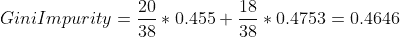

这次分裂的基尼系数比我们测试的第一次分裂更差。这是有意义的，因为大多数类在两个节点中似乎是平衡的。

**那么……我们如何找到最佳分割？**

递归搜索整个空间的可能分裂可能是一个好主意！这实际上是决策算法在内部做的事情。

如果我们计算“鸡蛋 1 的重量”变量中所有可能分裂的*基尼系数杂质*，我们将得到一个如下图:

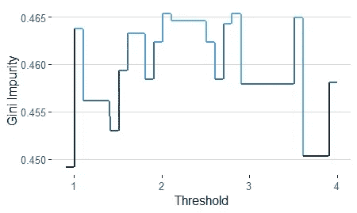

鸡蛋重量的所有可能阈值的基尼系数杂质的“成本函数”图 1

上面的图表明，当我们选择“鸡蛋重量≥ 1”作为阈值时，杂质在某处最小化——让我们检查一下这是否是真的，可视化我们的树与该分裂:

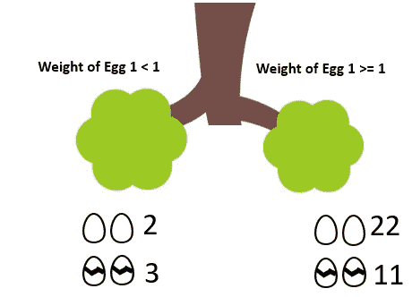

蛋的重量 1 ≥ 1 生成的树。(图标归属:Stockio.com)

*   右节点的部分杂质是 0 . 444；
*   左节点的部分杂质是 0.48；

这种分割的基尼系数可以用以下公式计算:

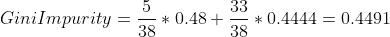

**这与我们在递归搜索中实现的最小分割相匹配，应该是我们的第一次分割(应该吗？)!**

...

记住我们有两个变量！如果蛋 1 的重量不是用来划分我们的类的最佳变量呢？

让我们检查鸡蛋 2 变量重量的每个分割的杂质图:

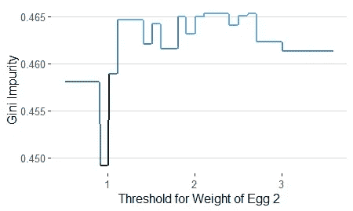

在鸡蛋重量的所有可能阈值上的基尼系数杂质的“成本函数”图 2

对于鸡蛋 2 的重量，我们可能有一个候选值——0.95 和 1 之间的区间可能是一个很好的第一次分割。

为了说明这一点，我们现在测试的是:

为我们的蛋重 2 ≥ 0.95 的树拆分。

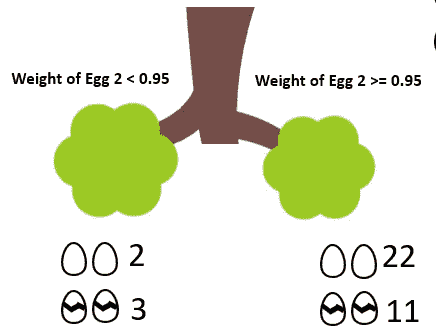

卵重 2 ≥ 0.95 生成的树。(图标归属:Stockio.com)

*   右节点的部分杂质是 0 . 444；
*   左节点的部分杂质是 0.48；

这与我们看到的“鸡蛋 1 的重量”最佳分割模式完全相同！所以，我们最后的计算还是:

我们有了决策树的起点！根据您将用来使树适应数据的系统，可能会选择以下两种之一:

*   鸡蛋的重量 1 < 1 and Weight of Egg 1 ≥ 1
*   Weight of Egg 2 < 0.95 and Weight of Egg 1 ≥ 0.95

**为什么？因为这些是最小化*基尼系数*** 的阈值——我们的例子中有一个平局，这在现实世界的数据集中并不常见。

**但是..我们现在去哪里？**

我们种植我们的树！

让我们关注一下左叶节点:

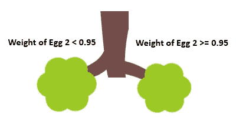

卵重 2 ≥ 0.95 生成的树。(图标归属:Stockio.com)

**左边的节点对应于所有低于阈值的例子。**如果我们只对这些例子进行递归搜索，我们将会发现一个完全纯粹的分割——**注意新的垂直阈值，橙色:**

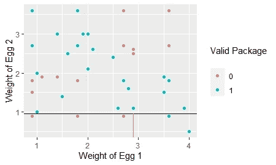

蛋重 1 ≥ 2.9 的新阈值。

这对应于以下树:

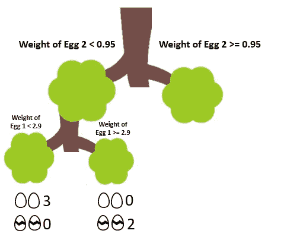

用两级阈值生成的树(图标属性:Stockio.com)

作为分支“鸡蛋重量 2 < 0.95”的结果的*叶节点*现在是*内部节点*。为什么？因为它会让更多的树枝向前延伸！

新的*叶节点*是由分支使用“鸡蛋 1 的重量”生成的，您可以在*内部节点*的正下方看到它。

如果您进行计算，这些新节点将具有:

*   **左节点有部分杂质=0。**
*   **右节点有部分杂质=0。**

这个拆分的*基尼*杂质是什么？**没错，0！**

这意味着这是一个纯节点，因为它完美地划分了我们的类。过了这一点就不能分班了。

另一个分支呢？通过再次迭代我们的分类树，我们将达到一个新的阈值:

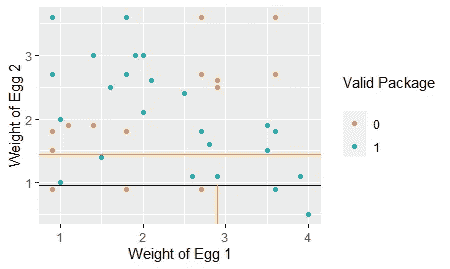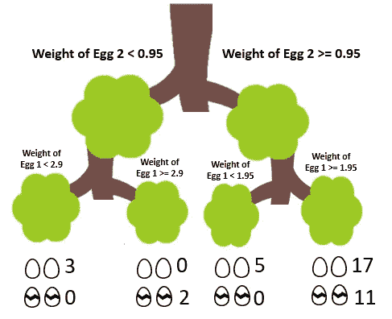

用两级阈值生成的树(图标属性:Stockio.com)

又一个纯节点！这种分裂的基尼系数的详细情况是:

*   ***偏杂*左节点:** 0
*   ***部分杂质*右节点** : 0.4770408
*   ***基尼杂质*** 为拆分:0.4047619

现在，我们可以继续沿着我们的树往下，以产生更多的阈值，直到我们在所有的*叶节点上达到*节点纯度*。*

**生成的最终阈值为:**

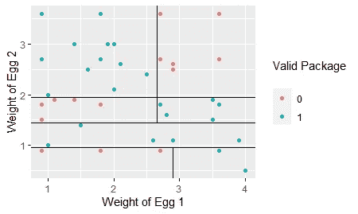

请注意所有点是如何被分组到它们的小“盒子”中的。下面是我们今后如何对我们的观点进行分类:

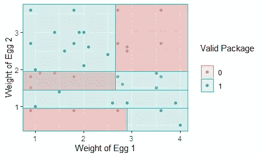

如果我们收到一组新的盒子，我们会将它们放入这些方块中的一个，根据方块的颜色，我们将知道是否应该发送我们的鸡蛋— **我们已经建立了分类树算法！**

**一个挑战:你能自己画出由这些阈值生成的树吗？**

# **最后的想法**

*   **达到*节点纯度*并不是阻止树生长的唯一(可能也不是最好的)标准**。达到节点纯度很可能意味着您的模型只适合训练数据，而不能很好地适用于真实世界(这是每个预测模型的真正目标)。
*   **与上面的论点相关，决策树确实容易过拟合。**您可以根据 if-else 规则隔离样本中的几乎所有示例，但这几乎肯定会导致算法过度拟合。
*   有时，输入的微小变化(从原始数据中选择特定的样本)可能会导致树的结果产生巨大的差异。
*   **关于决策树，下一步要学习的是理解超参数调整和交叉验证的概念。**它们是保证你的决策树在未来使用新样本时足够健壮的关键——我们将在下一篇博文中探讨这些概念。
*   **自从引入随机森林以来，决策树很少在生产中使用，因为随机森林更健壮，一般来说**——我们还将在后续的博客文章中介绍随机森林。
*   **基尼系数并不是决定最佳分割的唯一公式**(例如，熵也可以用作一个标准)。
*   **对于回归树，基本原理是相同的，**但是不使用基尼系数，而是使用回归的误差度量(通常为均方根误差)。

感谢你花时间阅读这篇文章！我希望你喜欢它，它帮助你最终理解了决策树背后的数学和逻辑。

**想了解更多？在 Udemy** 上查看我的 [**R 的数据科学课程，在这里我们将接触更多的算法，并深入研究数据科学概念。**](https://www.udemy.com/course/r-for-data-science-first-step-data-scientist/?referralCode=6D1757B5E619B89FA064)

本课程是你成为数据科学家的第一步，我们将慢慢地理解所有概念，并注意理解算法背后的基础和理论。**本课程是你进入数据科学世界的无风险(30 天退款政策)机会，我非常希望你成为我的学生！**