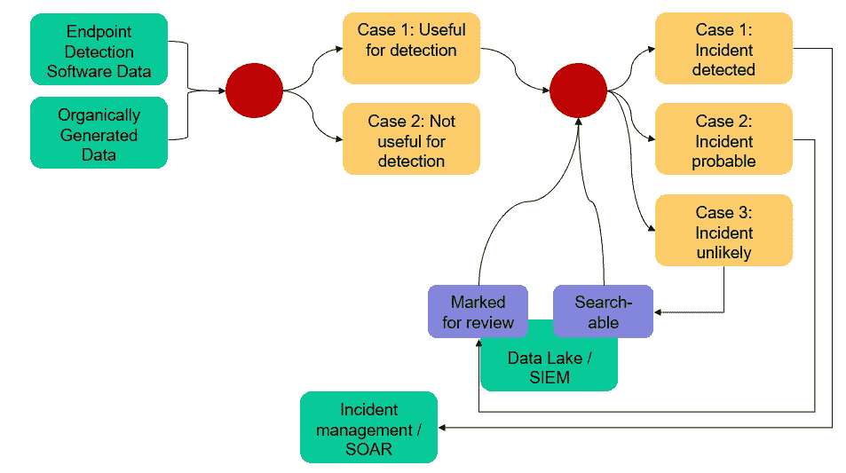
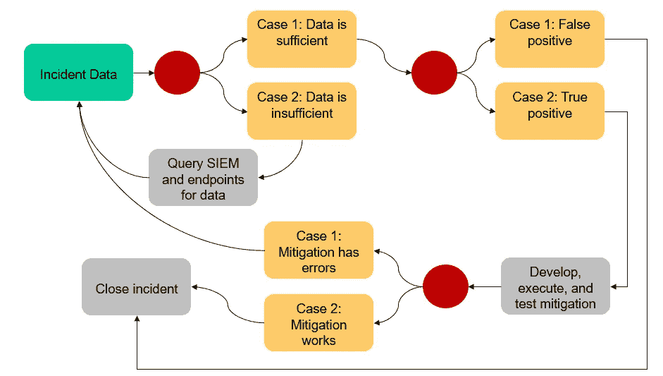

# 安全操作中的分类

> 原文：<https://towardsdatascience.com/classification-in-security-operations-dc6f43adcae8?source=collection_archive---------36----------------------->

奇莫诺在 Pixabay 上的照片

网络安全行业的每个人都在争先恐后地获取必要的人工智能和机器学习，以领先于攻击者。虽然许多网络安全公司肯定只在一次次的流行推销中使用人工智能/人工智能，但大多数网络安全专业人士确实认为人工智能/人工智能在安全领域有其一席之地。

ML 或任何数据分析的基本问题是分类。安全运营中心不断解决一系列分类问题。给定一些输入数据集，安全分析师首先必须确定活动是恶意的还是非恶意的。因此，第一个问题是二元分类。在下图中，我将这个问题进一步分解。红点标记分类发生的位置，黄框标记分类的结果。

事件检测(作者图)

**分类决策 1:这些数据对检测有用吗？**

安全分析师喜欢他们的日志和 IDS 警报，但所有数据都需要持续仔细检查，以确定与事件检测的相关性。安全工程师不仅要考虑删除无用的事件检测源，还要考虑添加新的创新数据源。一般来说，人类不会操作循环的这一部分——SOC 尽可能从网络和日志中获取数据，并希望这些数据足以满足他们的工作需求。因此，AI/ML 自然适合这里。主机计算能力是主要的阻碍因素；因为如果主机必须智能地确定哪些数据可以帮助实时检测，它将使用计算开销来运行这样的算法。无论系统选择发送什么数据，都将传递给下一个分类决策。

**分类决定 2:这是一个事件吗？**

在决定将哪些数据传递给我们的入侵检测系统后，入侵检测系统必须决定这些数据是否属于恶意活动。这是一个二元分类问题，那么为什么上图是三种情况呢？机器学习工程师将开发一种算法，以根据输入的训练数据来确定系统数据是否表征了事故。该算法将返回事件发生的概率。因此，案例代表了这个返回概率的阈值。分析师必须确定适当的阈值以避免警报疲劳，并每天处理适当数量的警报。情况 1 的阈值将非常高。请注意，由于事件发生的频率较低，因此这可能不是一个接近 1 的阈值—情况 1 的阈值实际上可能非常接近于 0，仅比下一个阈值大。情况 2 的阈值仍然很高，但会生成几个警报。这将使分析师能够通读生成警报的数据，并决定如何对事件进行分类。SIEM 反馈决策点的循环代表了这个迭代过程。

**事件调查和响应**

[NIST 网络安全框架](https://www.nist.gov/cyberframework)将网络安全事件定义为“被确定会对组织产生影响，从而需要响应和恢复的网络安全事件”我从来不喜欢这个定义，这里我们需要一些更具体的东西。我更喜欢一个简单的定义:网络安全事件是分析师决定进一步调查的事件。这自然导致了 NIST 网络安全框架在响应分析中的第一项:“来自检测系统的通知被调查。”事件调查和响应也是分类问题。下图显示了三个二元分类问题，分析师必须解决这些问题才能在事件生成后关闭事件。

事件调查和响应(作者提供的数字)

**分类决定 3:上下文数据的充分性**

分类再次回到所提供数据的质量。决策点 2 根据决策点 1 的数据对事件进行分类，但这些数据侧重于检测而非调查。换句话说，我们只需要回答这个问题:这种反常的行为是我们应该调查的吗？现在我们需要回答:到底发生了什么，我们如何解决？为了回答这些问题，分析师可能需要查询额外的数据源。AI/ML 在这里可以提供重要的价值，因为它可以根据上下文数据快速确定哪些数据可能对分析师的调查有用，并自动将这些数据添加到事件案例对象(数据水合)中，供分析师进一步审查。

**分类决定 4:真实事件**

在收集额外的上下文数据的过程中，分析师将经常确定该事件是误报。在这种情况下，她会简单地关闭事件，而不会发现。这个错误总是会发生，因为上下文数据是集中的和大量的。将该判定点移回判定点 2，从而要求所有可能必要的上下文数据命中 IDS，这将使网络过载，并使事件检测成为计算上不可能的任务。两步事件确定使用分类，以减少计算和网络需求。因此，该步骤中的 AI/ML 算法需要适应分析师添加到上下文数据中的输入。算法可以在后台连续运行，或者在事故案例文件改变时运行，以改变在分类决策 2 中生成的事故可能性值。

**分类决定 5:减缓成效**

有一天，我们的人工智能霸主可能会基于上下文数据自动生成缓解措施。然而，现在分析师必须在调查完成后运用他们的最佳判断来制定缓解措施。分析师使用归纳推理和科学方法，而不是演绎推理。换句话说，他们必须利用自己的最佳判断来制定缓解措施，并通过测试来验证这些措施，而不是通过一系列关于事故的“如果-那么”陈述来得出一组正确的缓解措施。实际执行缓解后，如果缓解成功，分析师将关闭事件。分析师将开发自动测试，在开发缓解措施时验证他们实现的缓解措施。由于分析人员已经构建了这些测试，并且它们自然地从缓解开发中出现，AI/ML 在这个决策点上没有表现出显著的价值。

**针对机器学习和分析问题**

那些不熟悉安全操作的人可能认为单个 ML 算法可以帮助并最终取代安全分析师。虽然这样的超级机器可能有一天会存在，但上述五个决策点中的每一个都代表了一个具有不同数据源和所需分类结果的独特问题。事实上，上面的图片和将安全运营缩小到五个决策是对安全运营挑战的过度简化。这种简化的价值在于确定我们可以从哪里开始使用机器学习来提高安全运营的效率。机器学习工程师应该寻求在这五个决策点中的一些点上实现分类，以便帮助、缓解和关注安全操作员。