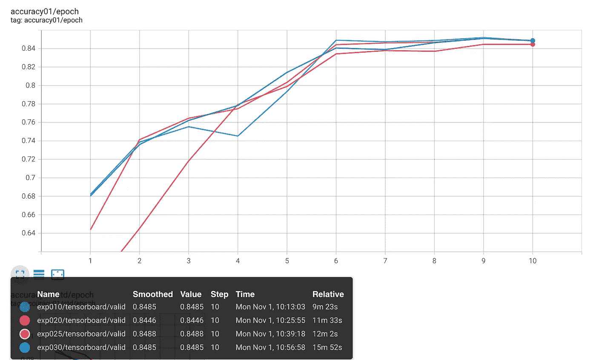
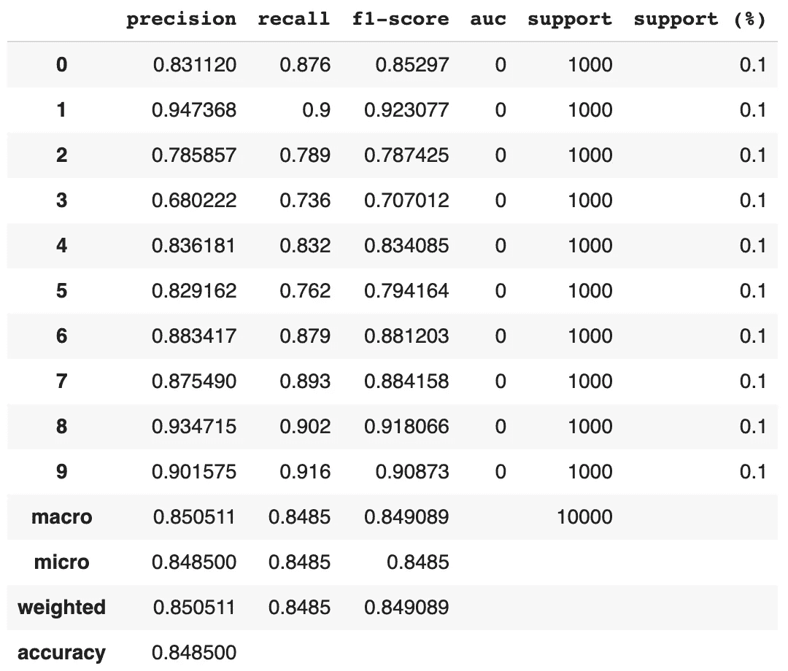

# 野外分类

> 原文：<https://towardsdatascience.com/classification-in-the-wild-4787c4ffca38?source=collection_archive---------26----------------------->

## 让我们深入分类指标并讨论一些技巧，它们可以提高您的分类管道性能。


帕特里克·托马索在 [Unsplash](https://unsplash.com/?utm_source=unsplash&utm_medium=referral&utm_content=creditCopyText) 上拍摄的照片

嗨，我是 Sergey，在过去的 5 年多时间里，我一直致力于基于 ML 的项目。在我的职业生涯中，我参与过不同的项目，创业公司，大公司，赢过几次比赛，写过几篇论文。我还启动了[Catalyst](https://github.com/catalyst-team/catalyst)——一个基于 PyTorch 的高级框架，以提高我作为深度学习实践者的生产力。有了这样一条路径，我最近决定写一系列关于深度学习“一般事情”的帖子。几个想法之后，我决定从 ML 评估技术和度量标准开始:如何理解它们？什么时候使用它们？在这种情况下，今天，我想深入研究深度学习中的分类指标，并讨论一些技巧，这些技巧可以提高你的分类管道性能。

> *你可以在* [*这个 colab 笔记本*](https://colab.research.google.com/drive/1erRdk5_3xKAGjtrBdhq9pIQvqKh9GUiZ?usp=sharing) *下面找到所有的例子。
> 博文原文为* [*此处*](https://scitator.com/post/2110-classification/) *。*

# [实验 01:典型分类](https://colab.research.google.com/drive/1erRdk5_3xKAGjtrBdhq9pIQvqKh9GUiZ#scrollTo=hJgdU966QpgF)

分类任务对于任何深度学习实践者来说看起来都是众所周知的。长话短说，我们有一些以`(some-data, label)`格式标记的数据，并想创建一个模型，它可以为我们将`some-extra-data`转移到`label`。例如，让我们回顾一下简单的 CIFAR10 分类:

典型的分类管道。

总结上面一个例子:

*   我们创建`resnet9`网络
*   在`CIFAR10`上训练它 10 个纪元
*   有`CE`损耗、`Adam`优化器、`MultiStep`调度器
*   和`accuracy`作为验证度量

这个例子看起来像一个非常普通的分类管道。我们能做得更好吗？我们去看看吧！

# [实验 02:焦点丢失](https://colab.research.google.com/drive/1erRdk5_3xKAGjtrBdhq9pIQvqKh9GUiZ#scrollTo=EIo9hcTRQs3w)

从一个简单的改进开始，让我们介绍一下`FocalLoss`而不是`CE`。长时间回顾，请阅读[原始论文](https://arxiv.org/abs/1708.02002)，短时间回顾:由于基于真实概率和预测概率之间的差异对每样本损失进行重新加权，`FocalLoss`更好地处理了类别不平衡，重点关注难以区分的类别。因此，它为具有严重类别不平衡的分类任务提供了更好的性能(真实情况，而不是 CIFAR 情况)。更重要的是，它不会在您的管道中引入任何额外的复杂性。所以让我们来看看:

无焦点分类。

虽然我们还没有明显改善 CIFAR10 的结果，但`FocalLoss`通常有助于更实际的案例。最后一个小技巧，我也想提一下——多准则用法:

多标准分类设置示例。

这种方法为您提供了一种平衡简单分类(使用`CE`损失)和侧重不平衡分类(使用`FocalLoss`)的方法。

# [实验 03:分类指标](https://colab.research.google.com/drive/1erRdk5_3xKAGjtrBdhq9pIQvqKh9GUiZ#scrollTo=g__eu2W877B5)

好的，正如我们已经看到的，由于`FocalLoss`，我们可以“提高”一下`accuracy`的性能。但是有一些额外的分类标准可以更好地理解您的模型:

*   `precision` -显示标签预测中的模型保证。例如，假设`precision`为高，模型预测某个输入`I`的某个标签`L`。在那种情况下，`I`实际上是`L`的概率很大。
*   `recall` -显示模型在数据流中找到所有类实例的能力。当然，高的`recall`并不意味着所有的模型预测都足够准确，但是它给了我们覆盖所有类实例的高概率。
*   `f-score` -是`precision`和`recall`之间的调和平均值。因此，它可以被视为理解模型在数据流中找到所有相关类(`recall`)并正确标记它们(`precision`)的能力的统一分数。此外，`f-score` `beta`参数允许我们在聚合时优先选择`precision`或`recall`。

此外，在模型训练和预测过程中，还有两件事需要检查:

*   `support` -每个类只有简单数量的样本。这似乎是不经意的，但是你拥有的数据点越多，你就能找到自信的洞察力。有时，即使您有一个包含各种类的大型数据集，也可能有只有少数几个示例的类，从而导致训练和评估期间出现不可预测的结果。向您的管道中添加一个`support`指标，为您提供了一种在训练期间“验证”数据集的简单方法。
*   `confusion matrix` -易于跟进你的分类模式简历区分不同类别的能力。虽然它明显地帮助您分析模型的正确性(混淆矩阵对角线)，但它也让您对类的分布和标记有了重要的了解。在我的实践中，有几个案例是`confusion matrix`在数据集更新期间帮助发现不正确的标记——仅仅是在`confusion matrix`上检查类的交互异常。

让我们将它们添加到我们的管道中:

包含所有必备指标的分类示例。

对于这些指标，有一些关键的技巧需要注意。所有这些都可以通过类的*“每类”*或*“聚合”*来计算。*【Per-class】*结果对于理解模型性能至关重要，因为在很多情况下，您的模型在最重要的类上可能表现“良好”，但“比以往任何时候都差”。例如，我们可以查看一些文本分类模型，这些模型对问候意图非常有效，但对有害意图的预测却失败了，从商业角度来看，这可能更有价值。*【聚合】*如果你想快速查看几个数字的模型性能，结果是必不可少的。有三种最常见的聚合策略:

*   微:所有样本对最终平均度量的贡献相等，
*   宏:所有类对最终平均度量的贡献是相等的，
*   加权:在平均过程中，每个类的贡献根据其大小进行加权。

上述指标的另一个重要注意事项是，它们的所有结果都是基于数据集的，这意味着您不能简单地平均基于批处理的微指标来获得基于数据集的微统计数据。

# [张量板](https://colab.research.google.com/drive/1erRdk5_3xKAGjtrBdhq9pIQvqKh9GUiZ#scrollTo=uKWbpeN9I0Ws)

由于我们有大量不同的指标，使用 tensorboard 来观察它们会容易得多:

```
tensorboard --logdir ./logs
```



上述管道的精度指标。(图片由作者提供)

# [推断&报告](https://colab.research.google.com/drive/1erRdk5_3xKAGjtrBdhq9pIQvqKh9GUiZ#scrollTo=kdjmJWUYJxcX)

此外，还有一种以用户友好的方式表示所有上述指标的方法，用于审查最终模型性能:



分类报告结果。(图片由作者提供)

有了这样的分类报告，断定模型的最终性能就容易多了。

# [阈值](https://colab.research.google.com/drive/1erRdk5_3xKAGjtrBdhq9pIQvqKh9GUiZ#scrollTo=BZCeClh3GRqw)

我想在本教程中提到的最后一个关键步骤是阈值。虽然它们不是花哨的深度学习模型，但它们为您提供了一种无需任何额外学习即可针对您的生产案例调整这些模型的方法。因此，举例来说，你可以为一些贫穷的工人阶级设置一个阈值`1.0`，以阻止模型预测它。只要这是生产深度学习中的基本实践，它也包含在催化剂中:

正如您所看到的，我们已经能够稍微改进我们的模型性能，即使是在像 CIFAR 这样简单的设置中(在 CIFAR 上学习模型非常容易)。当然，在基准测试期间会有数据泄漏，因为我们是在同一个`test`集上调优和评估`thresholds`，所以在现实世界的例子中，您必须将数据集分成`train`、`valid`和`test`部分，以防止任何数据泄漏。然而，即使有如此严格的评估设置，`thresholds`的使用通常会给你的兴趣指标带来关键的 2–8%的改善，这是巨大的。

# 结论

总而言之，这篇博文的主题是:

*   分类问题仍然是一个有待改进的领域(特别是在闭集和开集领域，但这是另一篇文章)，
*   在你的下一个实验中尝试`FocalLoss`，如果你的数据中有一个类不平衡(一个很常见的情况)，
*   使用`PrecisionRecallF1Support`和`ConfusionMatrix`分析您的模特在训练中的表现，
*   使用`classification report`了解您的最终模型分类性能，
*   在模型部署期间尝试使用`thresholds`,针对您的特殊情况调整模型，并提高最终性能。

如果您想更深入地了解这个分类示例，您可以:

*   用`CIFAR100`代替默认的`CIFAR10`，
*   查看我们的 [CV 数据集](https://catalyst-team.github.io/catalyst/api/contrib.html#computer-vision)，
*   尝试为 NLP 采用相同的管道( [Albert 在 TPUs](https://colab.research.google.com/drive/1HbZgL33mk8NFJummKdcPLOYVKcQBmHDH?usp=sharing) 上的培训示例)，

或者针对您想要的任何分类问题进行调整；)

这些都是这篇博文分类的重要步骤。如果你想查看更多深度学习最佳实践——订阅`[scitator](https://scitator.com/post/2110-classification/twitter.com/scitator)` & `[catalyst-team](https://twitter.com/CatalystTeam)`。感谢您的阅读，敬请期待更多内容！