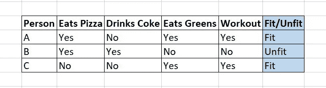
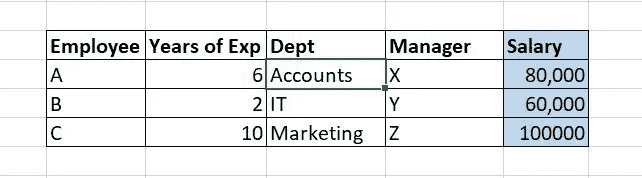
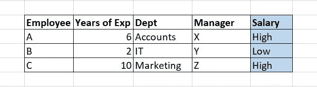

# 分类—让我们了解一下基础知识

> 原文：<https://towardsdatascience.com/classification-lets-understand-the-basics-78baa6fbff48?source=collection_archive---------28----------------------->

## 机器学习(监督学习)

照片由 [Reiseuhu](https://unsplash.com/@reiseuhu?utm_source=medium&utm_medium=referral) 在 [Unsplash](https://unsplash.com?utm_source=medium&utm_medium=referral) 上拍摄

在我之前的博客中——[机器学习的阴影](/different-shades-of-machine-learning-f6ede94c438d)——我们讨论了机器学习算法的两种主要类型。只是为了温习一下，我们有**监督学习**(其中目标已知/数据被标记，模型在此监督下工作)和**无监督学习**(其中目标未知/数据未被标记，因此算法没有任何监督)。

在这篇博客中，我们将只讨论分类。我们将讨论一些与分类相关的基本但重要的问题，例如— *分类到底意味着什么？什么样的数据可以分类，什么不能分类？有哪些分类算法？*

# 分类的真正含义是什么？

在开始分类之前，让我们了解数据集的不同部分及其与算法的一般关系。

作者图片

我在上面的图片中创建了一个“假设”数据集，只是为了解释这个理论(吃披萨或可乐或蔬菜完全是你的选择，请不要让我为健康/不健康负责！:P)

1.  **数据集** —任何以行列形式排列的数据都适用于 ML。列分为两种类型—变量(可以是一列或多列)和目标(总是一列)。这些行是我们的数据点。
2.  **目标/标签** —是我们要预测的列。这是我们的结果列，我们想知道未来的数据。在这个数据集中，它的列“适合/不适合”用蓝色标记。我们的整个监督学习依赖于这一列，因为这是我们想要知道的。
3.  **变量/特征** —目标列以外的列。这些列帮助 ML 模型预测未来数据点的目标。在这个数据集中，变量是- >“吃比萨饼”、“喝可乐”、“吃蔬菜”和“锻炼”。
4.  你可能会想**什么样的栏目是“人物”**。嗯，当我们在 ML 算法中输入数据时，有一些列我们不使用，因为我们不希望我们的模型“过拟合”或了解每个场景，相反，我们希望算法理解一般模式，并创建一个模型来预测同样的情况。我们将在以后的博客中讨论更多的过度拟合问题。

现在你已经熟悉了数据集和算法的关系，让我们回到分类上来。顾名思义，**分类就是根据某些理由对数据进行分类。这是一种监督学习。在分类中，目标列应该是分类列。**如果目标只有两个类别，如上面数据集中的类别(适合/不适合)，则称为**二元分类问题**。当有两个以上的类别时，这是一个**多类分类问题**。“目标”列在分类问题中也称为“类”。

# *什么样的数据可以分类，什么不能分类？*

为了对事物进行分类，我们需要有限的范畴。因此，我们需要一个数据集，其类别标签为— [0，1]，[通过，失败]，[适合，不适合]，[好，更好，最好]等。如果我们在目标列中有这样类型的值，我们可以使用分类方法来解决这个问题。但是如果我们在目标列中有连续的数值，比如[100，23，44，46，44.7，24.8，…等等。]，我们无法在这样的数据集上进行分类。在这种情况下，我们要么将该值转换为类值，例如— {values >50 将被视为 1，而以<50 is 0}, or we use other methods like regression to solve the problem which is out of the scope of this blog.

To understand this better, let’s take an example of the employee salary and other features dataset (below):

Data For Non-Classification Problem(Image By Author)

The above image consists of some data points, with Salary as our target variable. Now since Salary is a continuous number column (since salary is always numeric), we cannot treat this as a classification problem. But if we really want to treat this as a classification problem due to some reason, we can bin the target column into two categories **为例— Salary > 70，000 为高，Salary < 70，000 为低。**完成此操作后，数据集将如下所示:

将回归转换为分类问题(图片由作者提供)

所以现在我们的数据已经可以作为一个分类问题来处理了。当然，基于所使用的不同类型的算法，我们需要做其他的数据处理工作，但是我们现在至少有了一个分类的目标。

# *ML 算法或模型如何对数据进行分类？*

既然我们知道了数据集如何与 ML 模型相关，以及哪些数据集可以用作分类问题，我们也应该知道如何解决它们，对吗？

世界上有很多算法正被用来解决分类问题，甚至每天都有更新的算法被推出。其中一些算法是— **决策树、** **【支持向量机】(SVM)、随机森林、梯度提升树(GBT)、K-最近邻(KNN)、**等。决策树是理解每个人分类的基本算法，也是理解树在机器学习中如何工作的基本算法。但是我喜欢保持我的博客简短，决策树应该有一个完整的博客，所以我会在这里停下来，并尝试尽快提出我的下一个关于决策树的博客！❤

同时，你可以按以下顺序查看我以前的博客，了解数据预处理和 ML 项目流程:

1.  [面向非数据科学家的数据科学](https://medium.com/datadriveninvestor/data-science-for-non-data-scientists-part-1-2689f422bea0)
2.  [弥合业务差距&数据科学](https://medium.com/datadriveninvestor/bridging-the-gap-between-business-data-science-cb3310b27741)
3.  [数据科学—我该从哪里开始？](/data-science-where-do-i-start-76693f6ae597)
4.  [数据里面有什么！](/whats-inside-the-data-aadbb28ba8cd)
5.  [理解数据中的模式](/understand-the-patterns-in-the-data-f454a79ae51c)
6.  [特征工程——保留什么，删除什么？](https://medium.com/swlh/what-to-keep-and-what-to-remove-74ba1b3cb04)
7.  [不同深浅的机器学习](/different-shades-of-machine-learning-f6ede94c438d)

我希望这个博客能帮助一些人理解他们之前没有得到的东西(并让他们继续提问)！:)